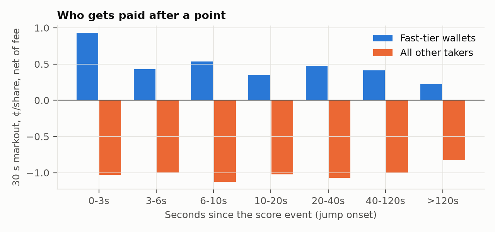
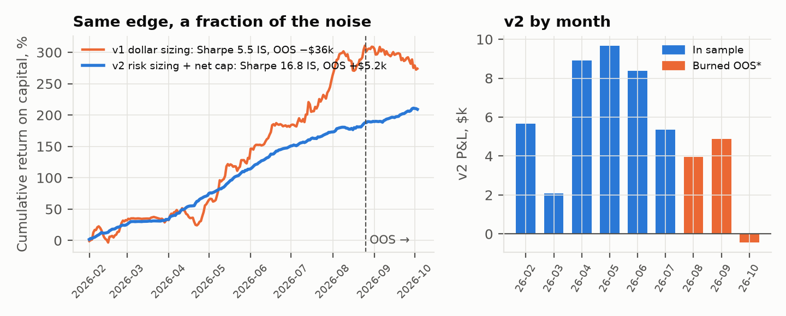

# COURTSIDE: trading the seconds after a tennis point

*Gator Quant Hacks 2026 · Systematic Trading · Repo: [github.com/OjasMishra32/computervisionpredictivetabletennismoneymachineouuushiii](https://github.com/OjasMishra32/computervisionpredictivetabletennismoneymachineouuushiii) · Reproduce: `python run_all.py --oos`, `python scripts/v2_burned_oos.py`*

## 1. Economic foundation

A tennis point ends in tiers. Ball tracking knows where the ball will land while it is still in the
air; the umpire knows at the bounce; licensed data feeds, and the market makers on them, know about a
second later; TV, streams and score widgets know tens of seconds later. Match-win probability is a
known function of the score, and we built the exact point-level Markov chain (`src/markov.py`). So
every point moves fair value by a computable amount, its **leverage**. A simulated ATP best-of-3 has
~161 points with mean |leverage| 5.7%, and fair value travels $4.20 per share over the match.

**Who is on the other side?** Whoever is acting on an older tier. A trader who knows the point before
the book reprices buys from a stale quote; a trader who acts after it pays the spread to someone
faster. The gaps are physical (camera frame rates, data licensing, stream delays), so they persist.
Polymarket's own design admits it: sports markets hold every marketable order for 1 s (3 s before May
2026) so makers can reprice. H1–H4 were committed before any result (`HYPOTHESIS.md`, commit `7232986`). H5–H6 were written after
in-sample results and frozen before OOS. v2 and its blind forward test are in `HYPOTHESIS_V2.md`, and
every change is in `DEVIATIONS.md`.

## 2. Data and method

- **Every resolved ATP/WTA singles moneyline on Polymarket with ≥$5k volume, Oct 2025–Oct 2026:
  13,084 matches, $2.84B traded.** Full taker tapes come from the public data API. Each print is
  classified as lifting the ask or hitting the bid (buying one outcome is selling the other), so
  fills pay the spreads that were actually traded. Every match is charged its own fee
  (`rate·q(1−q)` per share; rate 0, 0.03, then 0.05) and its own order delay. We measured that tape
  timestamps are on-chain block times, a median **1.98 s after the true match time** (5,472 trades
  joined to the live websocket by transaction hash).
- **In sample:** the first 80% of matches. **Out of sample (OOS):** the last 20%, from 2026-08-25,
  locked until v1 was frozen and opened once for v1. v2 was built knowing v1 lost there, so that
window is burned: v2 is shown on it labelled non-blind, and every look is logged (`results/oos_peeks.log`). **Forward:** matches that
  start after 2026-10-03 13:00 UTC, the blind test for v2.
- **Live, on 2026-10-03:** we recorded Polymarket order books (every tennis and table-tennis market)
  alongside four score sources, with millisecond receive times.
- **Tracking:** a physics Monte Carlo of Hawk-Eye-class tracking (340 fps, ±3.6 mm); real 120 fps
  table-tennis video (OpenTTGames); broadcast tennis (TrackNet). Processing ran on HiPerGator.

## 3. What the data says

**Table 1. Tests, net of fees and traded spreads (¢/share; 95% CI clustered by match).**

| Test | In sample | Out of sample (v1 run, opened once) | Verdict |
|---|---|---|---|
| H1 Follow the jump after the delay | −1.61 [−1.65, −1.57]; all 20 variants −1.5 to −1.9 | −2.08 [−2.17, −1.98] | Fails |
| H2 Buy favourites entering 0.85–0.97 | −0.41 [−1.44, 0.59]; live prices calibrated within ~1¢ | +0.80 [−1.36, 2.66] | No edge |
| H5 Maker quoting after jumps (written after IS) | +0.22 [−0.01, 0.43] | +0.16 [−0.49, 0.87] | Inconclusive |
| **H6 Fast tier, 30 s markout, walk-forward (written after IS)** | **+0.6 to +2.4, 8/8 months > 0** | **+0.4 to +0.8, 3/3 months > 0** | **Holds** |
| Everyone else in the same 0–3 s window | −0.5 to −1.7, every month | −1.2 to −1.9 | |
| Copying the fast tier 3 s later | < 0 every month | < 0 every month | Edge is speed |

*Fig. 1. 30 s markout per taker print, net of fee, by seconds since the score event. Fast-tier wallets
are qualified each month using earlier months only. Onset-aligned ex-post event study; tradable
numbers (Table 2) use the causal window.*

Chasing the move loses, and live prices are calibrated, so slow money has no edge. What exists is a
**persistent fast tier**: wallets that trade within 3 s of a score event and beat the market every
month, in sample and out. The other side of their trades is the ~1¢ a share that everyone else loses.
Copying them with a lag loses too, so the edge is speed and cannot be followed.

## 4. The strategy (v2) and its evidence

v1 (the fast tier's trades, ≤$1k each, held to resolution) earned +1.16¢/share in sample but **lost
$36k out of sample**. Big tickets on cheap tokens made its P&L a lottery. Six optimisation lenses then
ran on in-sample data only, each checked by two adversarial verifiers (`research/v2/`). The survivors
are frozen as v2 (`HYPOTHESIS_V2.md`, `src/v2.py`):

1. Trade the walk-forward fast-tier opportunity set (prints inside 0–3 s of a score event).
2. Keep a wallet only if its shrunk past edge beats **today's** fee: 0.05·q(1−q).
3. **Risk-parity size**: shares ∝ 1/√(q(1−q)), capped by the print and at $1k.
4. **Cap net exposure at 100 shares per match**; trades that reduce risk are always allowed.
5. **Hold to resolution.** No exit orders.

Refuted and dropped: **maker exits**. They looked like Sharpe 10 on the tape, but the verifiers found a
wrong tick size. On live books a resting exit after a jump filled only 35% of the time within a
minute. When it did fill, the price kept running another 5.6¢; when it did not, the price fell 5.7¢.
That is adverse selection.

**Table 2. v2 (causal window), net of fees, held to resolution.** The 0–3 s window is measured from the
moment our detector could fire, not from the onset seen in hindsight. A verifier found the onset
labelling put 81% of the first v2 draft's OOS P&L on trades made before detection (D9).

| | In sample, Feb–Aug 2026 | Burned OOS, Aug 25–Oct 3 (non-blind) | Forward, from Oct 3 14:00 UTC (blind) |
|---|---|---|---|
| Trades | 55,662 | 10,412 | `[FWD_N]` |
| **Net per share, at fast-tier fills** | **+1.38¢ [1.17, 1.59]** | **+0.60¢ [0.09, 1.13]†** | `[FWD_RES]` |
| … with +½ tick (0.5¢) worse entry | +0.88¢ [0.67, 1.09] | +0.10¢ [−0.41, 0.63] | |
| … with +1 tick (1¢) worse entry | +0.38¢ [0.17, 0.59] | −0.40¢ [−0.91, 0.13] | |
| P&L / capital (4 h lock per position) | +$40.4k / $28.3k | +$3.7k / $22.8k | `[FWD_PNL]` |
| Sharpe / max DD | **14.5 / −2.0%** | **6.7 / −2.1%** | |
| Months positive | 7/7 (7/7 even at +1 tick) | 2/3 (Oct = 3 days) | |
| Forward primary A: fast tier − others, 30 s net | | | `[FWD_A]` |
| Forward primary B: v2 book, 30 s net per share | | | `[FWD_B]` |

† Match-clustered CI. Clustering by copied wallet instead gives [−0.60, 2.11] (joint run), because out of
sample a handful of the fastest wallets carry the profit.

**Blind test on 11,307 never-examined markets** (mostly ITF; pre-registered, `research/v2/expand/`). Frozen
v2 earned +2.02¢/share [1.14, 2.93] in the in-sample period (pass; +1.44¢ even without the five largest
wallets) and +1.22¢ [−0.19, 2.65] in the OOS period: positive, but a **fail** by our rule. On these unseen
matches the fast tier still beat everyone else by +3.1¢ (IS) and +2.2¢ (OOS) per print. Out of sample
the top five copied wallets carry 98% of the profit. **Out of sample, v2 is positive but not proven, and
it rides on the very fastest traders.**

*Fig. 2. v1 vs v2, return on each book's own capital, and v2 P&L by month (\*Aug includes IS days).*

**Not a factor bet.** Regressing v2's daily returns on Fama–French market, size, value and momentum
(Feb–Aug 2026, 142 days): daily alpha +0.79% (t = 8.5), all factor betas insignificant (largest t = 1.33),
R² = 3%. The P&L comes from tennis points, not market exposure.

Table 2 is a **paper book on the fast tier's own fills**: it prices the opportunity at their speed, not
our execution, which needs in-venue tracking plus a co-located gateway. **Reading Table 2.** In sample the edge survives a full tick of slippage in every month. In today's
regime (1 s delay, 5% fee, 131 qualifying wallets) it is positive only at the fast tier's own fill
prices and is gone at half a tick. The strategy pays whoever is *first* to the stale quote, and the
margin for second place is now under half a tick. That is the case for in-venue ball tracking plus a
co-located gateway (Section 5), and the reason a remote copy cannot work. The Sharpe is high because
v2 places ~270 small, nearly independent bets a day, each held to an exogenous binary outcome, with
net exposure capped per match. All nine net-cap and deployment settings in the sizing study have
per-share CIs above zero (onset labelling), so this is a plateau, not a tuned spike.

## 5. Latency: who can actually be in the fast tier?

| Signal | When it knows the point, vs the official WTA point timestamp |
|---|---|
| Ball tracking, Hawk-Eye class (simulated: 340 fps, ±3.6 mm) | 100–300 ms *before the bounce*: 1 SD landing error ±2.4 cm at 100 ms, ±10.7 cm at 300 ms |
| Ball tracking, real 120 fps video (table tennis) | misses called **50 ms before contact: 11 of 11 calls correct** (11 of 41 misses called, recall 27%); median first-call lead 25 ms |
| Ball tracking, 25 fps broadcast (tennis) | useless: 0.7–1.2 m median landing error |
| **Polymarket book (market makers)** | **−1.2 s (reprices before the official stamp)**, n = 482 points |
| Kalshi | reprices with the market makers; leads Polymarket on 69% of 106k repricings by ~2 s, mostly Polymarket's own order delay; 6.1× its in-play volume |
| ESPN / Polymarket sports feed / WTA API | +27.5 s / +29.1 s / +43.3 s; 0 of 295 changes beat the book by > 1.3 s |

Market makers already sit on the official feed, and Kalshi is where prices are discovered. **Remote
traders on public data are the slow tier.** No public feed beats the book, and a Kalshi→Polymarket
laggard trade nets ≈0 today. The fast tier needs a signal that arrives before the official feed:
in-venue, high-frame-rate ball tracking. Our results show where that lead comes from (frame rate and
camera count) and how large it is (tens to hundreds of ms on top of a ~1 s official-feed lag).
Infrastructure: Polymarket's API sits behind Cloudflare's Miami edge, with a 67 ms median one-way feed
delay from Gainesville and an origin consistent with London. Co-locating there saves ~130 ms per round
trip, and that decides queue order behind the 1 s delay.

## 6. Risk management

- **Venue rules (largest risk).** Moving to a 5% fee cut the fast tier's edge by about two-thirds. A
  longer delay would cut it again. v2 re-prices its wallet filter at the live fee every month. We halve
  size if the trailing-month net edge falls below 0.3¢ and stop at ≤ 0.
- **Crowding.** Qualifying wallets grew 4 → 131. Edge per share fell from ~2.4¢ to ~0.8¢ but stayed
  positive every month.
- **Position limits.** Net |exposure| ≤ 100 shares per match; ≤ $1k per order; capital = 3× peak
  locked. The worst historical match lost $206 (v1: $3,098); the worst day was −1.9% in sample and −2.1% out.
- **Wrong calls and outages.** Trade only calls with P ≥ 0.95. Kill switch on any feed or tracking
  dropout over 2 s, and on measured order latency beyond its 95th percentile.
- **Resolution.** 2.9% of matches settled 50/50 (retirements); this is included in all P&L.
- **Legal and access.** Courtsiding breaks most tournaments' ticket terms, live tracking data is
  licensed, and Polymarket's international venue restricts US persons. A deployment needs licensed
  data, a permitted venue and legal review. This repo only reads public data and never places orders.

## 7. Liquidity and capital deployment

- **Tennis is deep:** median 1¢ spread, $8.1k at the touch and $61k within 2¢ (live sample).
  **Table tennis is not tradable on Polymarket:** 89¢ median spread, $23 at the touch, ~$2 of volume
  per match.
- **What there is to take, per point (live, 482 points).** Depth resting at prices the next reprice
  makes stale: median $222–565 (mean $1.3–3.1k) from 2 s to 0.25 s before the reprice, and gone 0.5 s
  after it. Even an oracle that knew every point and held to resolution would net a mean +$18–21 per
  point at today's fee (median ≈ $0; +$38 on moves ≥ 3¢). Exiting at the touch loses after the second
  fee. With the 1 s order delay, an order must leave **≥ 1.3 s before the reprice, ≈ 2.5 s before the
  official point stamp**: that is the time budget a tier-0 signal has to beat. Prints landing in the
  0.5 s before a reprice were 98% with the move and earned +0.91¢/share net, so some takers already
  have the point 1–1.5 s before the book.
- **v2 is small by design.** ~$1.48M traded over 206 days on $28k capital (turnover ~93× a year; peak locked $9.4k).
  Capacity is bounded by the stale quotes resting at each point (a few $k at the touch) and shared
  with the existing fast tier. Fast-tier volume in the 0–3 s window ran $0.3–3.1M a month. Side markets add
  only ~$2k/month.

## 8. Variants and caveats

Strategy variants backtested: 44 (H1–H6) plus 3,342 across the six v2 lenses (exit 902, sizing 111,
selection 341, cross-market 68, latency 16, Kalshi 1,904). All are reported in `results/` and
`research/v2/`, along with their verifier reports. The expected best Sharpe from luck over this many trials is ~4.8 (Bailey & López de Prado); v2 shows 14.5 in sample and 6.7 on the burned OOS. The v2 forward test is the clean check. **The v2 book trades the fast tier's own
fills.** It measures the opportunity at that speed, not our execution, which would need in-venue
tracking plus a co-located gateway. H1–H6 use onset-aligned windows as an ex-post event study. Every tradable number (v2) uses the
causal window. References: Bailey & López de Prado (2014); Harvey, Liu & Zhu (2016); Klaassen &
Magnus (2001); Voeikov et al. (2020) TTNet/OpenTTGames; Huang et al. (2019) TrackNet; Polymarket and
Kalshi API docs.
