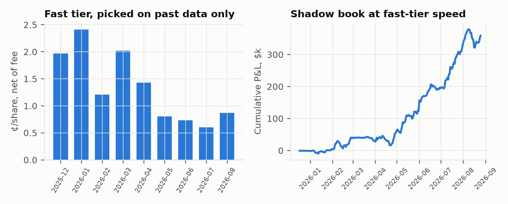

# COURTSIDE: who gets paid in the seconds after a tennis point

*Gator Quant Hacks 2026 · Systematic Trading · Repo: `<GITHUB_URL>` · Reproduce: `python run_all.py --oos`*

## 1. Economic foundation

A tennis point ends in tiers. Ball tracking knows the landing point while the ball is still in the
air. The umpire knows at the bounce. Official data feeds, and the market makers that consume them,
know one to a few seconds later. Streams and score widgets know tens of seconds later. Match-win
probability is a known function of the score; we built the exact point-level Markov chain
(`src/markov.py`). So every point moves fair value by a computable amount, its **leverage**. A
simulated ATP best-of-3 has ~161 points with mean |leverage| of 5.7%, fair value travels $4.20 per
share over the match, and the ten biggest points carry 23% of that.

**Who is on the other side?** Whoever acts on an older tier. A trader who knows the point before the
book reprices buys from a stale resting order. One who acts after it reprices pays the spread to
someone faster. The gap is physical (stream delays, frame rates, data latency), so it persists.
Polymarket shows it knows this: sports markets hold every marketable order for 1–3 s
(`secondsDelay`) to protect makers.

Hypotheses were committed before any result (`HYPOTHESIS.md`, commit `7232986`). Every later change
is in `DEVIATIONS.md`.

## 2. Data and method

- **Every resolved ATP/WTA singles moneyline on Polymarket with ≥$5k volume, 2025-10-08 to
  2026-10-03: 13,084 matches, $2.84B traded**, with full taker trade tapes (13,081). Each print is
  classified as lifting the ask or hitting the bid (buying one outcome = selling the other), so
  fills pay historical spreads. Each match is charged its own fee (`rate·p(1−p)` per share; rate 0,
  0.03, then 0.05) and its own order delay (3 s, then 1 s from May 2026).
- **Out-of-sample** = last 20% of matches (from 2026-08-25, n = 2,617, all 1 s/5%). It stayed locked
  until every rule was frozen (commit `9d61d1b`) and was evaluated once (`results/oos_peeks.log`).
- **Live**, on 2026-10-03: Polymarket order books and its public sports score feed, recorded side by
  side with millisecond receive times, for every tennis and table-tennis market.
- **Tracking**: physics Monte Carlo of Hawk-Eye-class tracking; real 120 fps table-tennis video
  (OpenTTGames) and tennis broadcast data, processed on HiPerGator.

## 3. Results

**Table 1. Pre-registered and post-hoc tests, net of fees and historical spreads (¢/share, 95% CI clustered by match).**

| Test | In sample (10,467 matches) | Out of sample (2,617) | Verdict |
|---|---|---|---|
| H1 follow the jump after the delay | −1.61 [−1.65, −1.57]; all 20 variants −1.50 to −1.86 | −2.08 [−2.17, −1.98] | Fails |
| H2 buy favourites entering 0.85–0.97 | −0.41 [−1.44, 0.59]; all 6 CIs span 0 | +0.80 [−1.36, 2.66] | No edge |
| Live-price calibration | within ±1.0¢ in every band 0.5–0.99 | within ±1.1¢ | Efficient |
| H5 maker quoting after jumps (post-hoc) | +0.22 [−0.01, 0.43] vs always-on +0.13 | +0.16 [−0.49, 0.87] vs −0.52 | Inconclusive |
| **H6 fast tier, 30 s markout (post-hoc)** | **+0.6 to +2.4, 9/9 months > 0** | **+0.83, +0.70, +0.44 (3/3)** | **Holds** |
| Other takers, same window | −0.5 to −1.7, 9/9 months < 0 | −1.2 to −1.9 | |
| Copying the fast tier (+3 s) | < 0 in 9/9 months | < 0 in 3/3 | Speed, not signal |
| H6 shadow book, held to resolution | +1.16 [0.79, 1.54]; Sharpe 5.5; max DD −20% | +0.57 [−0.16, 1.40]; −$36k | Fee-bound |

*Fig. 1. Taker markouts 30 s after each print, net of fee, by seconds since the score event (in
sample; fast tier = wallets qualified on earlier months only).*

**Chasing the move loses (H1).** By the time a delayed order fills, the book has moved, and you pay
the spread to whoever moved it. **Prices are calibrated (H2).** There is no slow-money edge.

**The fast tier is real and persistent (H6).** Each month we qualify wallets using only earlier
months: at least 30 prints within 3 s of a score event, at least 10 matches, and t > 3 on 30 s
markout. Their next-month prints in that window beat the market in all 11 months (Dec 2025–Oct 2026), out of sample
included. Everyone else in the same window loses about 1¢. The fast tier makes the most in the
first 3 s, and copying it with a 3 s lag loses: the edge is speed.

**But it is fee-bound.** Net to resolution, the edge fell from 1.5–1.6¢ (3 s delay) to 1.19¢ (1 s,
3% fee) to 0.54¢ (1 s, 5% fee) as the fee rose and qualifying wallets went 4 → 131. Out of sample
(all 1 s/5%), the per-share edge is +0.57¢ with a CI spanning 0, and the fixed-dollar shadow book
lost $36k: larger fast-tier trades lost while small ones won. The average fee alone, 0.99¢/share,
is about two-thirds of the gross edge. We report this as it came out.

*Fig. 3. Left: fast-tier net markout by month (\*Aug 2026 includes IS days before Aug 25). Right:
shadow book (≤$1k/trade, ≤$3k/match, held to resolution).*

## 4. Innovation: ball tracking as the way into tier 0

- **Physics (tennis, 340 fps, 3.6 mm noise):** landing error is ±0.7 cm at 25 ms before the bounce,
  ±2.4 cm at 100 ms, ±5.8 cm at 200 ms, ±10.7 cm at 300 ms. A ball landing ≥4 cm out is called with
  95% confidence 100 ms early; one ≥18 cm out, 300 ms early (Fig. 4).
- **Table tennis, real 120 fps video:** `[TT_RESULT]`.
- **Tennis broadcast video:** `[TENNIS_VIDEO_RESULT]`.
- **The public score feed is the slowest tier (H4, live):** the book moved first on 93% of score
  changes, a median 55 s ahead of Polymarket's own sports feed (n = 42). The feed sends ~30 s
  snapshots. Anyone trading off it is the orange bar in Fig. 1.

**COURTSIDE, the strategy.** For each point the Markov model gives the fair-value jump at stake.
When tracking calls the point before it lands, take the side it favours if
`leverage × P(correct call) − fee − ½ spread > 0`, sized by leverage and visible depth. The
evidence says this pays only if you are *faster than today's fast tier*, not equal to it. The
tracking lead (100–300 ms on the bounce) stacks on a low-latency official feed. Broadcast video
alone is tier 4.

## 5. Risk management

- **Venue rules (largest risk).** The 5% fee cut the edge by about two-thirds; a longer delay would
  shrink it further. Re-estimate the trailing-month fast-tier net edge weekly. Halve size below 0.3¢,
  stop at ≤ 0. On today's OOS reading (0.57¢, CI spanning 0) we would run at minimum size.
- **Speed race.** Qualifying wallets grew 4 → 131. Log our own order-to-fill latency against the
  book's reprice time, and scale size down as our measured lead shrinks.
- **Wrong calls.** A mis-called point loses its full leverage. Trade only calls with P ≥ 0.95, when
  the landing margin exceeds the 95% callable margin at the current lead.
- **Limits.** ≤$1k per order, ≤$3k per match, capital = 3× peak locked dollars. Daily stop at −5%.
  Kill switch on any feed or tracking dropout > 2 s. Sizing in shares, not dollars, is the first
  change to test (the OOS dollar loss came from large tickets).
- **Resolution.** 2.9% of matches resolved 50/50 (retirements, walkovers); this is already in the
  P&L.
- **Legal and access.** Courtsiding breaks most tournaments' ticket terms, live tracking data is
  licensed, and Polymarket's international venue restricts US persons (these events are flagged
  `restricted`). Deployment requires licensed low-latency data, a permitted venue and jurisdiction,
  and legal review. The repo only reads public data and never places orders.

## 6. Liquidity and capital deployment

- **Tennis is deep.** In the live sample: median spread 1¢, $8.1k at the touch, $61k within 2¢.
  Fast-tier volume in the 0–3 s window was $0.3–3.1M a month.
- **Table tennis is not tradable on Polymarket.** Median spread 89¢, $23 at the touch, 25% empty
  books, about $2 of volume per match. The big table-tennis price swings people see are midpoints of
  near-empty books.
- **Capital.** The capped shadow book locked at most $33.5k (IS) / $16.8k (OOS), with 520–700 trades
  a day and turnover ~100× capital a year. Capacity is bounded by the stale liquidity resting at
  each point (usually a few $k at the touch), and every extra dollar competes with the existing fast
  tier for it.

## 7. Variants, caveats, references

44 strategy variants were backtested (H1 20, H2 6, H5 17, H6 1); all are in `results/summary.json`.
Exploratory calibration, tier and wallet studies are disclosed in `DEVIATIONS.md`. H5 and H6 were
written after seeing in-sample data, so only their OOS results are tests. The shadow book estimates
the *opportunity* at fast-tier speed: it uses those wallets' fills, not ours. Expected best Sharpe
from luck across 44 trials is ~2.7 (Bailey & López de Prado 2014). References: Bailey et al.
(2014); Harvey, Liu & Zhu (2016); Klaassen & Magnus (2001), *Are points in tennis i.i.d.?*;
Polymarket fee and websocket docs; OpenTTGames (Voeikov et al. 2020, TTNet).
