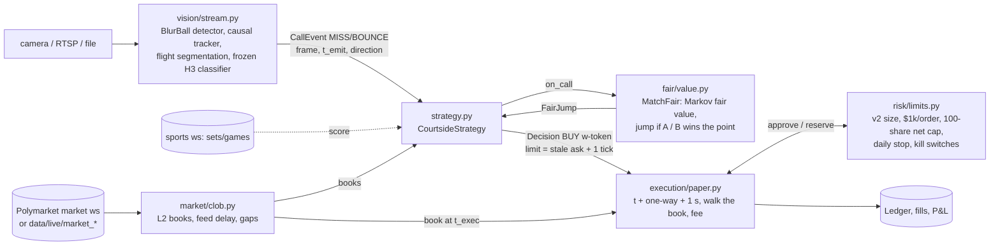

# engine/: the COURTSIDE streaming engine (PAPER ONLY)

A camera frame goes in. If ball tracking says the point is over, a simulated taker order comes out, priced
against a real Polymarket book. Every piece runs live or on recordings through the same code. Nothing in
`engine/` can sign, send or place a real order.

## Paper-only guard

| where | what raises `LiveTradingForbidden` |
|---|---|
| `engine/strategy.py` `assert_paper_only()` | any `PAPER_ONLY` flag modified (strategy, execution, vision); live-trading or credential environment variables (`COURTSIDE_LIVE_TRADING`, `LIVE_TRADING`, `ENABLE_LIVE_TRADING`, `POLYMARKET_PRIVATE_KEY`, `PRIVATE_KEY`, `PK`, `WALLET_PRIVATE_KEY`, `POLY_PRIVATE_KEY`, `CLOB_API_KEY`, `CLOB_SECRET`, `CLOB_PASS_PHRASE`, `CLOB_API_SECRET`, `CLOB_API_PASSPHRASE`, `POLY_API_KEY`, `POLY_SECRET`, `POLY_PASSPHRASE`); an order-signing library loaded (`py_clob_client`, `py_order_utils`, `eth_account`); `live=True` or any credential-like keyword argument |
| `engine/strategy.py` `enable_live_trading()` | always |
| `CourtsideStrategy(...)` | everything above, plus any executor that is not `engine.execution.paper.PaperExecutor` |
| `engine/run.py` | `assert_paper_only()` at import and on every mode; `--enable-live-trading` calls `enable_live_trading()` (always raises) |
| `engine/execution/paper.py` | same environment and library checks; `submit()` re-checks `PAPER_ONLY`, the signing libraries and the environment on every order; the module has no HTTP/websocket client |
| `engine/market/clob.py` | only the public `market` channel URL is accepted (`ReadOnlyViolation` otherwise) |
| `engine/vision/events.py` | environment checks at import and when an engine is built |

`tests/test_engine_strategy.py` checks the guards and that neither `strategy.py` nor `run.py` contains an
order endpoint or signing client. The websockets `run.py` opens are the public market channel
(`wss://ws-subscriptions-clob.polymarket.com/ws/market`) and the public score feed
(`wss://sports-api.polymarket.com/ws`). Both are read-only and unauthenticated.

## Architecture



Text version:

```
 camera ─► vision/stream.py ──CallEvent──►┐
                                          ▼
 Polymarket ws ─► market/clob.py ──books──► strategy.py ──on_call──► fair/value.py (MatchFair)
 (or recording)   L2 books, latency         │  ◄──FairJump (v_now, v_if_a, v_if_b, P(point))
                                            │ Decision(token, BUY, shares, limit, fair)
                                            ▼
                          risk/limits.py ◄─► execution/paper.py ──► fills, Ledger
                          v2 caps, kills     t_dec + one-way + 1000 ms, walk book, fee
```

## Run it

```bash
PY=.venv/bin/python          # from the repo root
# (a) live market data, read-only: books of live tennis matches + what the strategy WOULD do on a call now
$PY -m engine.run --mode live-market --seconds 60 [--every 15] [--max-matches 12]
# (b) end-to-end demo: vision on the held-out clip -> recorded WTA book -> paper orders (ILLUSTRATIVE pairing)
$PY -m engine.run --mode demo        # ~5-8 min on the shared laptop -> results/engine/demo_run.json, demo_timeline.png
$PY -m engine.vision.demo_live       # the same demo plus a per-frame vision log (demo_vision_trace.json); made the committed run
$PY -m engine.vision.demo_live --l4-variant            # market replay with the L4 run's calls and latencies -> demo_run_L4.json
$PY -m engine.vision.render_demo_video                 # engine_live_demo.mp4 (1280x720, 40 s) rendered from those logs
$PY -m engine.run --mode demo --figure-only            # redraw the figure from demo_run.json
$PY -m engine.run --mode demo --stamp-lag 3.142 --location london --anchors 12 --match wta-jovic-dart-2026-10-02
# (c) tier-0 counterfactual backtest (src/tier0.py + scripts/tier0_backtest.py, another workstream; imported, not modified)
$PY -m engine.run --mode backtest                      # prints results/tier0/results.json
$PY -m engine.run --mode backtest --recompute          # re-runs the primary scenario through tier0_backtest.run_one
# tests
$PY -m pytest tests/test_engine_*.py -q
```

Mode (a) writes `results/engine/live_market_run.json`. Mode (b) needs `data/vision/test_2_copyts.mp4`
(it prints the ffmpeg command if the clip is missing), `data/live/market_*`, `data/live/tokens_*` and
`research/v2/latency/out/m1_points.csv`. With `models/vision/frozen_call_model.pkl` (copy it from HPG;
`models/` is gitignored) every call comes from the live classifier, and `engine.vision.demo_live` refuses to
run without it. Without it, see "Demo: where the calls come from" below. Mode (c) prints instructions when
the tier-0 files are absent.

## The decision rule (`strategy.py`)

On a `CallEvent` for match M (player A = outcome-0 token):

| step | value |
|---|---|
| winner w | MISS: the hitter loses the point. The hitter comes from the call's `direction` and `left_player`, which is who stands at the image's left; the strategy tracks it across changes of ends. BOUNCE: no decision, no trade |
| confidence c | 0.95 for vision MISS calls (the pre-registered precision target; `p_miss` is a score, not a probability) |
| swing | `lev = v_if_a - v_if_b` from `MatchFair` (exact Markov model, calibrated to the book mid at the current score) |
| expected move of the w-token | `E[move] = c*v_w + (1-c)*v_l - v_now = (c - p_w) * lev`. `p_w` is the model's P(w wins this point). The book already prices `p_w`, so the edge is `(c - p_w)*lev`, not `c*lev` |
| limit | stale best ask of the w-token + 1 tick, FAK |
| edge | `E[move] - half_spread - (limit - ask) - fee(limit)`, fee = `0.05*q*(1-q)`. Tested at the limit, the worst fill, because the risk manager's v2 fee-aware filter tests there. The ask-side edge from the task's formula is reported as `edge_at_ask` |
| trade iff | `edge > 0`, the call is fresh (frame to decision <= 1 s), and the book has not moved half a point-jump since the pre-point reference (toward w: the call is late; against w: the market already says the point went the other way) |
| size | v2 risk parity `0.10 * $1k / sqrt(q(1-q))`, capped by the stale depth inside the limit, then `RiskManager`: <= $1,000 per order, \|net\| <= 100 shares per match counting in-flight orders (risk-reducing orders may flip to 100 the other way), 0.05-0.95 zone, kills |
| pre-point reference | `MatchFair` is calibrated between points and refreshed on every BOUNCE call: the rally is still on, so the book has not priced this point yet. Calibration takes 0.3-2 s, so it runs off the hot path (`install_fair`); the demo charges each refresh its measured compute time before it takes effect |

Decision time per call (demo run, 17:12 EDT, laptop at load ~15): the rule itself (`compute_us`: fair jump +
rule) takes 85 µs median and 199 µs p90 over all 88 calls, 72 of which are BOUNCE no-ops. A call that sends an
order takes 557 µs median (4.3 ms max) end to end (`total_us`: rule + paper guard + risk check + paper submit,
11 SENDs); in the L4-variant replay, 296 µs (max 733 µs). Either is negligible next to the 1 s venue delay.

Interfaces:

| | |
|---|---|
| `CourtsideStrategy(feed, executor=None, risk=None, cfg=StrategyConfig(), clock=None)` | `add_match(match_id, token_a, token_b, state=, p_server0=, tour=, fmt=, left_player=, names=, calibrate=True)`, `calibrate(match_id, now_ms=None, mid_a=None)`, `install_fair(match_id, mf, mid_a, now_ms)`, `apply_point(match_id, a_won)`, `set_left_player(match_id, left)`, `evaluate(match_id, call, t_ms=None, hitter=None, approve=False) -> StrategyDecision` (no order), `on_call(match_id, call, t_ms=None, hitter=None) -> StrategyDecision` (submits the paper order), `summary()` |
| `StrategyConfig` | `confidence=None` (0.95 for vision MISS), `min_edge=0`, `limit_ticks=1`, `tick=None` (book tick), `k=0.10`, `cap_at_visible=True`, `max_spread=0.10`, `moved_frac=0.5`, `max_call_latency_ms=1000`, `fee_rate=0.05` |
| `StrategyDecision` | `action` SEND / SKIP / REJECTED, `reason`, `winner`, `confidence`, `token`, `state`, `v_now`, `v_if_a`, `v_if_b`, `leverage`, `p_point_winner`, `expected_move`, `bid`, `ask`, `half_spread`, `tick`, `limit`, `fee`, `edge_at_ask`, `edge`, `fair_after`, `moved_toward_winner`, `visible_shares`, `shares`, `order_id`, `order_status`, `compute_us` |
| calls accepted | `engine.vision.events.CallEvent` (MISS/BOUNCE + direction), `engine.fair.value.CallEvent` (winner given), dicts or any object with the same fields |

Skip reasons: `no_point_decision`, `unknown_winner`, `stale_call`, `no_book`, `one_sided_book`, `wide_spread`,
`limit_at_or_above_1`, `book_already_repriced`, `book_moved_against_call`, `edge_below_cost`,
`no_stale_depth`, `match_over`. Risk rejections come back as `REJECTED` with `risk:<reason>`.

## Latency budget (measured unless marked)

| stage | ms | source |
|---|---|---|
| camera to frame available | not measured (0 in the demo) | a courtside camera adds capture + encode + transport |
| vision: frame to CallEvent, processing only (a host that keeps up) | p50 158, p90 219 | demo run (live classifier): BlurBall ONNX on CoreML GPU+ANE, laptop at load ~15 from other workflows. Unloaded, at 40 fps arrivals: p50 42 (`vision_bench.json`) |
| vision as run on this shared laptop (frames queue) | p50 28,900 | demo run: 10.9 fps sustained vs 30 fps arrivals |
| vision at a true 120 fps feed on this laptop | p50 5,281 and growing | `vision_bench.json`: ~50 fps sustained unloaded, so a 120 fps feed backs up without bound |
| vision on one NVIDIA L4, 120 fps feed, frame to decision done | p50 4.6, p90 6.9, p99 12.2, max 30 | `online_vs_offline.json`: all 102,120 test frames paced at 120 fps, 0 dropped, fp16 + channels-last + folded BN + `torch.compile`, batch 1. The first 4 s of the run (a start-up transient, up to 1.27 s) are excluded from these numbers |
| vision on one L4, emitted CallEvents | p50 6.9, p90 8.5, p99 15.8, max 22 | same run, 169 calls after the first 4 s |
| vision on one L4, detector as the offline run used it (fp16 autocast, eager) | p50 11.4, p90 18.1 at 74 fps arrivals | `vision_bench_gpu.json`: 93-100 fps at most, so it cannot keep up with 120 fps. fp32: 62-69 fps at most, p50 14.8 at 50 fps arrivals |
| strategy rule (fair jump + rule; no risk, no submit) | 0.085 (p90 0.20) | demo run, all 88 calls (`compute_us`) |
| strategy `on_call` for a SEND (rule + guard + risk + paper submit) | 0.56 (max 4.3) | demo run, 11 SENDs, laptop at load ~15 (`total_us`); 0.30 (max 0.73) in the L4-variant replay |
| fair-value refresh (calibration, off the hot path) | 665-2,840 | demo run; 100-500 unloaded |
| order one-way, laptop (Gainesville) to venue | 67 | `src/paper.py` FLORIDA_MS |
| order one-way, London co-located | 2 | `src/paper.py` LONDON_MS |
| venue marketable-order delay | 1,000 | measured (1 s regime) |
| market data, venue to laptop | p50 58, p95 102, p99 134 | live measurement (`engine/market`), 2026-10-03. This session's live run: p50 65, p95 84, p99 123 |
| book reprice vs official point stamp | median -1,160 (IQR -1,930 to -680) | research/v2/latency, 482 live WTA points: the book moves before the stamp |
| stamp lag (stamp minus physical point end) | NOT measured: 2,000 assumed, 3,142 inferred | tier-0 primary / inferred from fast-tier prints |
| stale depth | $222-565 median per point before the reprice, ~$0 500 ms after | research/v2/latency |

What the budget means: a call made L ms before the physical point end executes at
`-L + vision + one-way + 1000` ms. The book reprices at about `stamp_lag - 1160` ms, which is +840 ms with
the 2 s stamp lag. A call therefore has to come at least ~230 ms plus the vision latency before the point end to beat a
median reprice; stale depth starts thinning at the first tick, which is earlier. Most of that is the
venue's 1 s delay; co-location (67 to 2 ms) barely matters.

## End-to-end timing proof (`engine/e2e`, 2026-10-03)

Paper; order not sent. The CV call is on our own streamed footage, mapped to a live tennis market for timing
(different sport), and the 1 s feed baseline is simulated (licensed feed not purchased).

`scripts/e2e_proof.sh` runs the whole path on one clock (`time.monotonic()`):

1. Our held-out clip goes over WebRTC (MediaMTX on loopback) into the unchanged vision engine.
2. Each CallEvent drives `strategy.evaluate` on a live Polymarket book.
3. `RiskManager.approve` checks it.
4. An unsigned order payload is built (`order_ready`).
5. The network leg is added: RTT/2 of a keep-alive `GET https://clob.polymarket.com/time`, measured at that moment.
6. The market's `secondsDelay` is added.
7. A `PaperExecutor` fill is priced against the live book at the executable instant.

The run used 12 passes, 132 calls and 24 MISS order traces, on 2 upcoming ATP books (none was in play). The CV
engine was fed at 10 frames/s, every frame (12x slow motion; the laptop cannot run 120 fps in real time), and all
24 orders were timing probes: the rule and the risk check declined every call on the pre-match books. Results:

- **Capture to order ready:** 54 ms p50, 73 ms max (n = 24).
- **Network one-way:** 65 ms.
- **Capture to executable:** 1,119 ms p50.
- **With the simulated 1 s feed:** the order is executable 2,119 ms after the point (max 2,241). All 24 calls are
  under 3 s, but 0.14-1.28 s after the median reprice, depending on the unmeasured stamp lag (median reprice
  +840 / +1,350 / +1,980 ms after the point at a 2.0 s stamp lag / the calibrated stamp reading / the post hoc 3.14 s
  lag).
- **Timing margin is not trading margin:** a feed of up to 1.88 s would still meet 3 s, but the tier-0 breakeven
  feed delay is 1.0-1.1 s at the pre-registered 2.0 s stamp lag (2.1-2.2 s at the post hoc 3.14 s estimate; stored
  cells, assumed data).
- **Rule and fills:** the rule skipped every call (pre-match edge -1.3c) and the risk check declined every one.
  All 24 payloads are labelled timing probes, and all filled 100 shares at the ask on quiet books, so they are not
  capacity evidence (see `research/capacity/CAPACITY.md`). Signing and POST are not timed (we never sign).

Details: `research/e2e/RESULTS.md`; trace and figures in `results/e2e/`.

## What the runs showed (2026-10-03)

**(b) Demo** (`results/engine/demo_run.json`, `demo_timeline.png`, `engine_live_demo.mp4`; rerun at 17:12 EDT
with the live classifier). ILLUSTRATIVE PAIRING: table-tennis calls on a real WTA book. It shows mechanics and
timing, not an edge.

- Vision ran live on the held-out clip (test_2 frames 2000-2999, 1000 frames), and every call came from the
  frozen classifier (`vision.call_source = frozen_model_live`; no decision was replayed). Detection was 97.7%
  within 5 px of the labels (recall 0.997, 307 labelled frames). The engine emitted 11 CallEvents, 9 BOUNCE
  and 2 MISS. Both L4 runs over the same frames emitted the same 11 calls at the same frames and in the same
  directions: the clip-only benchmark (job 44608026) and the whole-test_2 stream at 120 fps (job 44607191).
  - MISS f2766, on flight 2760, came 67 ms before that flight's labelled end. The flight is labelled MISS,
    and the label audit flags it `rally_continues`. The offline first call on it came at 125 ms (the
    replayed run used frame 2759).
  - MISS f2819, on the clip's last flight, came 325 ms before the point end (frame 2858). Offline: 408 ms
    (frame 2809).
  - Both live MISS calls come 7 and 10 frames (58 and 83 ms) after the offline first calls. This is the
    gap from the causal `hb` described under "Vision on one GPU".
  - BOUNCE: 6 on BOUNCE-labelled flights, 1 on flight 2402 (labelled MISS, audited `unannotated_bounce`)
    and 2 on balls outside the labelled flights (f2258, f2618). Flight 2502 got no call.
  - `engine.vision.run_demo` on the same clip (`vision_demo_live.json`) scored 313 decision frames both
    online and offline. The score difference is p50 0, p90 0.13, p99 0.67, max 0.79, the same as on the L4.
    The online flight start equals the offline t0 on 10 of 10 flights.
- Market: unchanged. `wta-su-bucsa-2026-10-02` (Sun vs Bucsa), eight real points chosen by the P&L-blind
  rule, and the clip's point end (frame 2858) placed on each point's physical end.
- Primary scenario (2 s stamp lag, Florida 67 ms, processing-only vision latency, p50 158 ms on the laptop
  at load ~15): 16 MISS decisions, 11 orders, 8 fills, 5 skipped on `edge_below_cost`. The skips are on
  points with a 5-9c swing, where an `E[move]` of 2-4c does not cover half spread + tick + the 1.0-1.2c fee.
  - The wrong call (f2766, decided 594 ms before the end) was sent 6 times and filled 6 times (600
    shares). Its orders execute at +0.47 s, before most reprices.
  - The right call (f2819, decided 133 ms before the end) was sent 5 times and filled 2 times (31
    shares). Its orders execute at +0.93 s, and 3 missed with no liquidity left inside the limit.
  - Marked P&L 10 s after: -$28.23 over 8 points (the replayed-decision run: -$30.56). Fees: $6.71.
- Sensitivities:
  - London instead of Florida: 11 orders, 8 fills, -$24.96.
  - A 1 s stamp lag cuts orders to 4 (3 fills), because more calls arrive after the book moved. With a
    3.14 s lag: 11 orders, 10 fills.
  - With this laptop's real queueing (as run: 10.9 fps sustained against 30 fps arrivals, 28.9 s median
    latency), every call is stale: 0 orders.
- **With the L4's vision** (`demo_run_L4.json`, `python -m engine.vision.demo_live --l4-variant`): the same
  11 calls with the latencies the L4 measured on a real 120 fps feed (6.8-11.2 ms, `online_events_L4.jsonl`),
  and the market side replayed the same way.
  - Primary: 11 orders, 8 fills, -$30.93.
  - The wrong call executes at +0.31 s and fills 6 of 6. The right call executes at +0.75 s and still
    fills only 2 of 5 (41 shares).
  - A 1 s stamp lag gives 7 orders and 5 fills, against 4 and 3 on the laptop.
  - The L4 keeps up, so "as run" equals the primary there (11 orders). The laptop as run sent none.
  - The two replays also paid different calibration times for their fair-value refreshes (378-1,520 ms
    against 665-2,840 ms, laptop load), so not every difference between them comes from vision latency.
  - This variant replays the L4's logged events. No single process ran camera to paper order on the GPU
    host.
- `engine_live_demo.mp4` (1280x720, 40 s) shows the clip at 0.25x with:
  - the engine's ball track and its live P(miss) trace;
  - each call with its lead (from the labels) and its processing latency, which is the latency the
    scenario used. For MISS calls it also shows the laptop's as-run latency (41.7 and 44.3 s, queued);
  - for each BOUNCE, when its fair-value refresh was installed. On this point that is 2.35-2.46 s after
    the call (laptop calibration time), so the last four land after the point end and after both MISS
    decisions;
  - the paper orders, fills and book of the figure's point (point 58), as `demo_run.json` logged them.

  `engine/vision/render_demo_video.py` renders it from `demo_run.json`, `demo_vision_trace.json` and the
  clip. Nothing in it is simulated. The 17:26 render said "fair value refreshed" at each BOUNCE and gave
  only the processing latency, labelled "(laptop)". It was re-rendered at 17:48 with the logged install
  times and with both latencies.
- `demo_run_L4.json` `mapping.players` was copied from `run.py` and named frame 2759, the replayed-decision
  run's wrong MISS. It now names f2766, as `demo_run.json` does (`--l4-variant` applies the same rewrite).
  Only that sentence changed; the numbers did not.
- What it teaches: the 1 s venue delay decides everything. A correct call 325 ms early is still too late on
  most points, and the only calls early enough to fill were the less reliable ones. That is adverse
  selection by timing. Cutting vision latency from ~160 ms to ~7 ms moves each order 165-185 ms earlier and
  changes little. What the GPU changes is that the engine keeps up with the feed at all. The tier-0
  counterfactual assumes 2-3 s of stamp lag, a licensed point feed and region-aware co-location, and even
  then only 35-44% of its calls come before the reprice (corrected headline, burned OOS / IS).

**(a) Live market** (`results/engine/live_market_run.json`): 60 s against the real public websockets at 15:03-15:04 EDT. 27 live tennis moneylines were discovered, 19 had two-sided books, and 7,785 messages arrived with 0 reconnects. Feed delay was p50 65 / p95 84 / p99 123 ms, and 8 of 8 venue snapshots matched the rebuilt books. The what-ifs (a 0.95 MISS call naming either player, at the current book) gave 32 `edge_below_cost`, 2 `wide_spread` and 2 `SEND`. The two SENDs were both sides of `atp-shelbay-krueger` at 0.91/0.10, 100 shares each, net-cap clipped, edge +0.2c. Most live points carry a 1-3c swing when the in-game score is unknown, which is too small to beat half spread + tick + fee. After the socket closed and 2.5 s of silence, both what-ifs the rule would have sent came back `REJECTED risk:kill:feed_stale`; the other 22 were skipped by the rule before reaching the risk check (14 `edge_below_cost`, 8 `wide_spread`). Not measured live: no camera covers these matches, so the vision kill switch was disabled for the what-ifs (`require_vision=False`).

Bug found and fixed during this run: calibrating fair value in an `asyncio` thread held the GIL. That stalled the feed and inflated the measured delay to p50 0.5-1.4 s and p95 3.7 s. Calibration now runs in a worker process (`strategy.calibration_job` / `fair_from_job`), which brought the delay back to p50 65 ms.

**(c) Backtest**: the tier-0 counterfactual. ASSUMED: licensed live feed + courtside camera, not
purchased. Model outputs with assumed timing, not traded results. The tier-0 owner applied verifier
corrections at 15:20 EDT (`results/tier0/results.json` now has a corrected `headline`; the pre-registered
primary is kept only as `prereg_record`, "superseded as an estimate"):

| (20-seed mean ± sd) | IS | burned OOS (not blind) |
|---|---|---|
| corrected headline | Sharpe 11.4 ± 2.5, 1.10c/share, $89/day | Sharpe 7.3 ± 5.9, 0.58c/share, $46/day |
| corrected grid, 864 scenarios (Sharpe min / median / max) | -9.8 / 7.6 / 45.2 | -8.7 / 3.4 / 49.8 |
| stamp lag 1.0 s (stress) | Sharpe 2.2, 0.40c/share | Sharpe 0.3, -0.38c/share |
| pre-registered primary (record only, superseded) | Sharpe 34.0 | Sharpe 31.9 |

The "Sharpe ~34-37" figures quoted earlier today are the superseded pre-registered model. `--mode backtest`
prints whatever `results.json` holds now (it reads both the old and the new schema); `--recompute` re-runs
one seed of the corrected headline and of the pre-registered primary through the current `src/tier0.py`
(review run 15:24 EDT: headline IS Sharpe 8.6, burned OOS 4.2; primary 36.3 / 33.6). The "Sharpe 6.7
out of sample" quoted elsewhere is v2, the book-only strategy without vision: burned OOS (not blind)
+0.60c/share, CI [0.09, 1.13], over 40 days (`results/v2/burned_oos.json`).

## Vision on one GPU (HiPerGator, 2026-10-03)

Hardware: one NVIDIA L4 (24 GB, Ada sm_89, 72 W) on `hpg-turin`, 8 cores of an AMD EPYC 9655P, torch
2.7.1+cu128, cuDNN 9.7 and PyAV 19. The pipeline is the full streaming engine: PyAV decodes the 1080p
H.264 stream and resizes it on the reader thread; the engine thread then normalises and uploads each frame,
runs BlurBall, extracts blobs, tracks the ball, segments flights, computes features, runs the frozen HGB
and applies the call rule. Nothing is retrained. Commands: `hpg/engine_vision.sbatch` (`STAGE=bench`,
`STAGE=eval`).

**Benchmark** (`results/engine/vision_bench_gpu.json`: jobs 44606460 and 44608026, test_2 frames 2000-2999
from the original 120 fps file). "max" means frames are fed as fast as the engine takes them. "Keeps up"
means real-time 120 fps arrivals with nothing dropped and a queue wait p99 of 4 frames or less. Latency is
measured from frame arrival until that frame's decision is done, with no backlog. Configs that cannot keep
up are measured at 80% of their max fps.

| detector config (backend spec) | max fps, batch 1 | best batch (fps) | keeps up at 120 | detect ms p50 (batch 1) | call latency p50 / p90 ms |
|---|---|---|---|---|---|
| fp16 autocast, eager, as `detect.py` ran it (`torch-cuda`) | 92.7 | 2 (95.2) | no | 8.8 | 11.4 / 18.1 at 74 fps |
| same + CUDA graph (`torch-cuda-graph`) | 99.9 | 1 | no | 8.4 | 9.6 / 14.7 at 79 fps |
| fp16 + channels-last + BN folded + CUDA graph (`torch-cuda-cl-fuse-graph`) | 130.6 | 1 | yes, q99 12.6 ms | 5.7 | 10.7 / 18.7 |
| fp16 + channels-last + BN folded + `torch.compile` (`torch-cuda-cl-fuse-compile`) | 131 (174 in job 44606460) | 2 (180.4) | yes, q99 8.9 ms | 3.9 | 5.5 / 7.8 (batch 2: 16.3 / 21.9; dynamic up to 2: 6.8 / 14.6) |
| same + CUDA graph (`torch-cuda-cl-fuse-compile-graph`) | 194.2 | 1 | yes, q99 11.6 ms | 3.4 | 6.2 / 13.2 |
| two compiled copies pipelined on one GPU | 124.5 | n/a | no, q99 114 ms | n/a | 14.2 / 22.9 at 99 fps |
| fp32, strict with TF32 off (`torch-cuda-fp32`) | 63.2 | 1 | no | 14.2 | 14.8 / 16.8 at 50 fps |
| fp32 + CUDA graph, or + BN folded + compile (with or without graph or channels-last) | 62.5-64.5 (68.1-69.3 for the compiled ones in job 44606460, replaced by the re-measure in 44608026) | 1 | no | 13.8-14.6 | 14.1-16.3 / 16.3-21.0 at 49-51 fps |

Other stages, p50 per frame in every config: decode 0.04 ms (PyAV frame threads; mean 0.9), resize to 512x288
0.6 ms, normalise and upload 0.1 ms, blobs about 0.4 ms (included in detect), tracker 0.04 ms. Per scored
decision frame: features 0.5 ms and HGB classifier 1.4 ms. The reader alone decodes and resizes 445 fps.

Batching does not help. Per window, the detector is as slow or slower at batch 2-32 than at batch 1
(eager fp16: 8.3 ms at batch 1, 11.3 ms per window at batch 8), because BlurBall runs at full 288x512
resolution with a stride-1 stem and is bound by memory bandwidth. A fixed batch B also adds the wait for B
frames. The one exception is the compiled detector, where batch 2 gives the most throughput, but batch 1
still has the lower latency. fp32 cannot reach 120 fps on an L4 in any config. The batch-1 max fps over
1000 frames includes the reader's seek and a start-up transient, so the long runs below measure sustained
speed better. One B8 row per fp32 config dips: the stream's last short batch, 6 windows, is autotuned once.
The clip-only real-time rows log 112.8-113.6 fps. Their wall clock includes opening the file and seeking
to frame 2000 (about 0.5 s over 1000 frames), so "keeps up" is judged from dropped frames and queue wait,
not from that fps. The whole-test-set stream below sustained 119.9 fps.

SLURM record (`sacct` and `logs/` on HPG, read back 2026-10-03 17:35 EDT):

| job | what | node, GPU | elapsed | state |
|---|---|---|---|---|
| 44603438 | export_frozen.py | c0709a-s10 (hpg-milan, CPU) | 37 s | COMPLETED |
| 44606460 | bench, all specs | c0605a-s13, L4 | 20:34 | COMPLETED |
| 44608026 | bench, compile specs re-measured | c1105a-s8, L4 | 14:13 | COMPLETED |
| 44607191 | eval, `torch-cuda-cl-fuse-compile` B1 | c0607a-s12, L4 | 14:43 | COMPLETED |
| 44605927 | eval, `torch-cuda-graph` | c0610a-s23, L4 | 15:07 | COMPLETED |

Two earlier bench jobs, 44604940 and 44605707, are not in any committed result. The benchmark fps and
latencies quoted here appear as lines in these jobs' logs, and `vision_bench_gpu.json` keeps the runs it
replaced under `jobs.<id>.replaced_runs`. 44607191 logs 7 videos, 0 dropped, 851.9 s wall and 172 calls,
with overall call-ready p50 4.63 and p99 13.54 ms. The after-start-up percentiles (call-ready p50 4.62,
p90 6.94, p99 12.19, max 30.1 ms; emitted calls p50 6.92, p90 8.54, p99 15.8, max 22.4 ms over 169) are
not in the log. They were recomputed from the job's raw per-frame output on HPG
(`results/engine/online_vs_offline_raw_compile.pkl`) and match.

**Held-out test set through the streaming engine** (`results/engine/online_vs_offline.json`). All of
test_1..test_7 was streamed: every frame from first to last, gaps between rallies included, 102,120 frames
(851 s). The frames were decoded from the original files and paced at 120 fps. Primary run: `torch-cuda-cl-fuse-compile`,
batch 1, job 44607191. It took 851.9 s of wall time for 851 s of video (119.9 fps), dropped 0 frames, and its
queue wait p99 was at most 10 ms in every video. Ball detection was within 5 px on 93.9% of the 6,836
labelled frames; the offline tracked number is 94.0%. Calls are scored with
`src/tracking/early_call.py`'s own code (`curves`, `lead_table`) on the 171 labelled flights, as
`summary.json` does:

| MISS calls, test, original labels (precision / recall, tp) | 0 ms | 25 ms | 50 ms | 100 ms | 150 ms | 200 ms | first-call lead, called flights |
|---|---|---|---|---|---|---|---|
| online rule, `summary.json` (offline) | 1.0 / 0.195 (8) | 1.0 / 0.122 (5) | 1.0 / 0.073 (3) | 1.0 / 0.049 (2) | 1.0 / 0.024 (1) | 1.0 / 0.024 (1) | 8 of 41, median 25 ms |
| online rule, offline with hb from the prefix only (causal) | 1.0 / 0.195 (8) | 1.0 / 0.122 (5) | 1.0 / 0.098 (4) | 1.0 / 0.049 (2) | 1.0 / 0.049 (2) | 1.0 / 0.049 (2) | 8 of 41, median 46 ms |
| **CallEvents the engine emitted** | 1.0 / 0.098 (4) | 1.0 / 0.098 (4) | 1.0 / 0.098 (4) | 1.0 / 0.049 (2) | 1.0 / 0.049 (2) | 1.0 / 0.049 (2) | 4 of 41, median 163 ms (67, 92, 233, 325) |
| snapshot rule, `summary.json` | 1.0 / 0.585 (24) | 1.0 / 0.463 (19) | 1.0 / 0.268 (11) | 1.0 / 0.146 (6) | 0.75 / 0.073 (3) | 1.0 / 0.049 (2) | |
| snapshot rule on the engine's live scores | 1.0 / 0.195 (8) | 1.0 / 0.171 (7) | 1.0 / 0.146 (6) | 1.0 / 0.098 (4) | 1.0 / 0.049 (2) | 1.0 / 0.024 (1) | |

The offline numbers recomputed through this code equal `summary.json` exactly, which checks the scoring.
Precision is 1.0 at every lead: no engine MISS call landed on a BOUNCE-labelled flight. Recall is lower.
The table looks the same for the fp16 autocast detector with CUDA graph (job 44605927) and for the
offline detector's own detections replayed through the engine's tracker and decision code, so the GPU,
the speed options and fp16 rounding change no call. The gap comes from two differences in what the evaluation could see:

1. **Look-ahead in one offline feature.** `early_call.Flight` computes `hb` (the table's half-depth at the
   ball's x, also the level of the `u_far` / `u_near` / `w_end` crossings) as a median over the whole
   labelled flight up to T_ref, so it includes points after the decision frame. The engine can only use
   the prefix. Rescoring the offline samples with a prefix-only `hb` (the "causal" row) reproduces the
   engine's scores bit for bit on 95.7-98.1% of decision frames, depending on the run, and p99 |diff| is at
   most 0.02. The rest comes from the offline tracks being stored to 0.01 px. Without the look-ahead the snapshot rule at 50 ms falls from 11 to 9
   test misses. The online rule still makes 8 calls, but not on the same flights: test_6 1484 drops out,
   test_4 9839 comes in, and three leads change (table below).
2. **The engine stops deciding once the track shows a bounce past the net.** Offline, a flight's decision
   window runs from the hit to the labelled T_ref even when the ball bounced on the far half in between.
   Online, `flights.flight_start` finds that bounce, the flight then starts past the net, and the engine
   makes no further decisions on it. Of the 24 offline snapshot calls at 0 ms, 13 come after such a bounce.
   10 of those 13 are flights the post-hoc label audit relabelled as BOUNCE (`unannotated_bounce`). The
   offline evaluation scored these as correct MISS calls, so the engine's lower recall here is partly a
   label correction. Four of the online-rule calls are lost this way: test_1 2448, test_3 5552, test_6 3070
   (all `unannotated_bounce`) and test_6 4955.

With the audited labels (21 misses), the engine's own calls score 1.0 / 0.19 (4) at 0-50 ms. The snapshot
rule on the engine's scores scores 6 at 50 ms, against 8 offline.

Every labelled flight where the engine's MISS CallEvent and the offline online rule (`test_flights.csv`
`first_call_lead_ms`) differ. The list is the same in all three runs (job 44607191, job 44605927, and the
offline detections replayed). The other 161 flights agree. The "why" column was checked on the engine's own
per-frame trace and track (`online_vs_offline_raw_compile.pkl` on HPG): replaying the engine's gating on that
track stops at exactly the last decision frame the engine logged. "u" is the ball's position along the
table from the hitter's end line, where 0.5 is the net.

| flight (test video, f_net) | label (audit) | offline first call | causal-hb offline | engine MISS CallEvent | why they differ |
|---|---|---|---|---|---|
| test_1 2448 | MISS (`unannotated_bounce`) | 25 ms | 25 ms | none | The track bounces at f2469, past the net (u 0.81). The engine's flight restarts there, and it stops deciding after f2472 (T_ref 2484). Offline, P >= tau only on f2479-2482 |
| test_3 5552 | MISS (`unannotated_bounce`) | 16.7 ms | 16.7 ms | none | Bounce at f5567 (u 0.77). Last engine decision f5570 (T_ref 5581); offline P >= tau on f5577-5581 |
| test_6 3070 | MISS (`unannotated_bounce`) | 16.7 ms | 16.7 ms | none | Bounce at f3095 (u 0.78). Last decision f3098 (T_ref 3126); offline P >= tau on f3122-3126 |
| test_6 4955 | MISS (not flagged) | 16.7 ms | 0 ms | none | Bounce at f4975 (u 0.70); the offline track has the same bounce. Last decision f4978 (T_ref 5010) |
| test_6 1484 | MISS | 25 ms | none | none | Look-ahead `hb`: offline P >= tau on f1497-1502; with the prefix-only `hb` the engine reaches tau only on f1503, after T_ref |
| test_2 2760 | MISS (`rally_continues`) | 125 ms (f2759) | 66.7 ms | 66.7 ms (f2766) | `hb`: the engine's P drops under tau on f2760 and f2763 |
| test_2 2819 | MISS | 408.3 ms (f2809) | 325 ms | 325 ms (f2819) | `hb`: the engine first reaches tau on f2817 |
| test_4 5750 | MISS | 83.3 ms | 91.7 ms | 91.7 ms (f5751) | `hb`: the engine's run starts one frame earlier |
| test_4 9839 | MISS | none | 233.3 ms | 233.3 ms (f9837) | `hb`: the engine is >= tau on f9835-9840, while offline never reaches tau. This is a correct call the offline rule did not make |
| test_5 5528 | MISS | none | none | f5544, 58 ms after T_ref (not scored) | The offline window ends at T_ref 5537 with one frame >= tau (f5531). The engine keeps deciding on the same flight and reaches 3 frames on f5542-5544 |

So the engine lost five offline calls: four to the far-side bounce stop and one to `hb`. It gained one
(test_4 9839), and three leads changed. Precision stays 1.0. Off the labelled population it also made 7
MISS calls (below).

The engine emitted 172 CallEvents over the 14 min: 12 MISS and 160 BOUNCE.
- MISS: 5 on labelled MISS flights (one of them 58 ms after T_ref), 0 on BOUNCE flights, and 7 on balls
  outside the 171 labelled flights. Five of those 7 were between rallies: test_1 4963 and 7728, test_4 10907,
  13393 and 34896. A live system needs a rally-state gate before it trades on a MISS.
- BOUNCE: 68 on BOUNCE flights and 20 on MISS-labelled flights (0.77 against the original labels, most of
  them `unannotated_bounce`), plus 72 off-population.

Latency of the emitted calls: p50 6.9 ms, p90 8.5 ms, p99 15.8 ms, max 22 ms. A start-up transient in the
first 458 frames of test_1 (up to 1.27 s) was excluded; with it included, p99 is 218 ms. The fp16 autocast
run with CUDA graph (job 44605927) ran at only 114 fps on full videos. It built a backlog, so latency over
the run was p50 3.5 s and p99 12.5 s; its calls were identical.

**The demo clip on the L4.** Test_2 frames 2000-2999 gave the same 11 CallEvents (same frames, calls and
directions) in three runs:

- the clip-only benchmark (`torch-cuda-cl-fuse-compile`, batch 1, real-time 120 fps, job 44608026);
- the whole-test_2 stream (job 44607191);
- the laptop's CoreML detector in the demo.

On the L4 the emitted calls took 6.8-11.2 ms in the test-set stream, and p50 7.1 ms in the clip-only run.
`demo_run_L4.json` replays the demo's market side with those latencies (see (b) above).

## Demo: where the calls come from

Since the 17:12 EDT rerun, every demo call comes from the live frozen H3 classifier,
`models/vision/frozen_call_model.pkl`. It was rebuilt on HiPerGator (CPU job 44603438,
`engine/vision/export_frozen.py`, from the game_1..5 training tracks). The export reproduces
`results/tracking/test_flights.csv`: P(miss) at 50 ms for 170 flights with max |diff| 1.1e-16, and all 8
online first-call leads exactly. It loads with the laptop's sklearn 1.9.1, the same version as on HPG.
`models/` is gitignored, so copy the pickle back from HPG. `demo_run.json` records
`vision.call_source = "frozen_model_live"` and a `p_miss` on every event.

Checked again at 17:40 EDT by an adversarial review:

- The pickle is byte-identical on the laptop and on HPG (MD5 `7dfb7b48fa800cca8a132c4290a9639d`). Loaded
  locally, the HGB reproduces the stored test scores to 5.6e-17. Through `early_call`'s gate and online
  rule it gives `test_flights.csv`'s P(miss) at 50 ms on 170 flights (max |diff| 1.1e-16) and all 8
  online first-call leads exactly.
- The demo's vision was re-run on the clip in a fresh process: `VisionCallEngine` with the frozen pickle,
  CoreML, unpaced. It gave the same 11 CallEvents (call, frame, direction) with identical `p_miss`.
  `demo_vision_trace.json` matched on all 428 decision frames to 5e-6 (the trace stores 5 decimals) and on
  all 701 track points to 0.007 px.
- The same run gave the same result with `test_scores`, `test_tracks`, `test_flights`, `check_*` and
  `train_*` deleted from the loaded pickle. So no stored offline decision, track or label reaches a call. The
  engine uses only the fitted model, the taus/gate and the table geometry.

On a host without the pickle, `engine.run --mode demo` still streams every frame through the real engine
but replays the frozen model's offline decisions from `test_flights.csv`: MISS at the online rule's first
call, BOUNCE at the 50 ms snapshot when P(miss) < tau_snapshot (0.8854). Those events are marked
`source = table_tennis:offline_frozen_decision_replay` with `p_miss = null`. The demo committed before
17:12 was made that way (MISS at frames 2759 and 2809; 11 orders, 8 fills, -$30.56).
`engine.vision.demo_live` refuses to run without the pickle.

`run.py` writes a fixed sentence into `mapping.players` that names frame 2759 as the wrong MISS.
`demo_live` rewrites that sentence from the run's own events and says so in `mapping.players_amended_by`.

Mapping (written to `demo_run.json["mapping"]`):

| quantity | definition |
|---|---|
| `t_end` | `T_official - stamp_lag` |
| clip frame f | placed at `t_end - (f_end - f)/120` |
| decision time | `t_frame + measured vision latency (+ camera_ms)` |
| execution | one-way later, plus 1 s, against the recorded book at that venue time |

The clip's anchor shot is hit by the player at the image's left when it travels left to right. That
hitter stands in for the WTA point's loser, so the anchor call is right by construction (it was right on
the table-tennis labels). The other MISS follows from the same fixed mapping and is wrong. The score
before each point comes from the official WTA point-by-point, and the server is a Bayesian mixture.

## Module interfaces

### run.py

`live_market(args)` (async), `demo(args) -> dict`, `backtest(args)`, `run_vision(args) -> dict` (the real
`engine.vision.stream` loop, events with `processing_latency_ms` and `queue_wait_ms`),
`match_points(slug)` (official point-by-point + pre-point state), `pick_anchors(P, k)`,
`market_windows(files, wins, tokens, cond)` (one pass over the recordings: book state at each window
start + window messages, other markets reduced to a 200 ms liveness marker),
`run_scenario(match, anchor, snap, msgs, scenario, calls)` (one paper run: feed + risk + executor +
strategy, scheduled through the feed's clock hook), `timeline_figure(out, path)`.

### vision/ (`stream.py`, `events.py`, `run_demo.py`, `bench_gpu.py`, `eval_online.py`, `export_frozen.py`, `demo_live.py`, `render_demo_video.py`)

`VisionCallEngine(backend, frozen, geometry, fps=120, frame_offset=0, on_event=None, batch=1)`:
`prep(rgb)` turns a decoded 512x288 RGB frame into detector input, normalised on the GPU for torch
backends. `process(i, x, t_frame, run=True)` returns the `CallEvent`s emitted by that frame. With
`run=False` the frame's window is only queued, and `run_pending()` runs everything queued (dynamic
batching). `FrameSource(src, D, realtime, fps, drop_when_full=True)` reads files, URLs, RTSP or webcams. In
real-time mode the clock starts at the first decoded frame. `drop_when_full=False` replays a file at 120 fps
without ever dropping a frame. `run_stream(engine, source, dynamic=False)` returns per-frame timing.
`CallEvent(call, frame, t_frame, t_emit, p_miss, lead_ms, source, rule, media_t, flight_t0, direction, extra)`
has `latency_ms = (t_emit - t_frame) * 1000`.

Backend specs (`make_backend`) take the form `onnx-<provider>` or
`torch-<device>[-fp32|-tf32][-cl][-fuse][-compile][-graph][-cpuprep][-nobench]`. A plain `torch-cuda` is
fp16 autocast, as `detect.py` ran it. The options are channels-last, BatchNorm folded into the convolutions
(torch.fx), `torch.compile`, CUDA-graph replay per batch size, CPU normalisation, and cuDNN's default
algorithms instead of autotuning. A comma-separated list is a pool of model copies with pipelined windows.
The fastest config that keeps up on an L4 is `torch-cuda-cl-fuse-compile`, batch 1.

Benchmarks: `python -m engine.vision.run_demo` (laptop, `results/engine/vision_bench.json`) and
`python -m engine.vision.bench_gpu` (GPU matrix, `results/engine/vision_bench_gpu.json`; `--merge` joins
jobs). `python -m engine.vision.eval_online` streams test_1..7 and scores them like `summary.json`
(`results/engine/online_vs_offline.json`, one entry per config). `--from-raw` rescores a saved run, and
`--replay-detections` feeds the offline detector's npz files through the engine's decision code.

Demo tools:

- `python -m engine.vision.demo_live [engine.run demo options]` runs `engine.run --mode demo` unchanged,
  with a tap on `stream.run_stream`. It writes `results/engine/demo_vision_trace.json`: per frame, the
  tracked ball position and the timing; per decision frame, P(miss), the gate and the latency; and every
  CallEvent.
- `--l4-variant` replays the market side with the L4 run's events and writes `demo_run_L4.json`.
- `python -m engine.vision.render_demo_video [--preview N,...]` renders `engine_live_demo.mp4` from
  `demo_run.json`, `demo_vision_trace.json`, the clip and `vision_bench_gpu.json`. `--preview` saves single
  frames as PNG instead.

### market/: `clob.py`, `book.py`

| | |
|---|---|
| `L2Book(asset_id)` | subclass of `src.paper.Book` (same `bids`/`asks` dicts, same `walk`). `best_bid()`, `best_ask()` (cached, O(1)), `mid()`, `spread()`, `microprice()`, `levels(side, n)`, `depth(side, within=None, n_levels=None) -> (shares, $)`, `available(taker_side, limit)`, `sweep(taker_side, shares, limit, consumed) -> [(px, sz)]`, `has_snapshot`, `ts_server`, `ts_local`, `last_trade`, `tick_size` |
| `LatencyTracker` | local receive minus server stamp per delta. `p50() p95() p99()` over the long window (excluding the most recent samples), `recent()` = median of the last 25 |
| `MarketEvent` | `kind` (`book`, `price_change`, `best_bid_ask`, `trade`, `tick_size`, `resolved`, `gap`), `asset_id`, `market`, `ts_server`, `ts_local`, `price`, `size`, `side`, `best_bid`/`best_ask` after the event, `raw` |
| `BaseFeed` | `books`, `book(a)`, `best_bid(a)`, `best_ask(a)`, `mid(a)`, `depth(a, side, ...)`, `now_ms()`, `stale_ms(now)`, `latency`, `market_of`, `resolved`, `on(fn)` (sync or async listener), `on_clock(fn)` (runs with the venue stamp before each message is applied), `events()` (async iterator), `summary()` |
| `LiveClobFeed(assets, auto_discover=False)` | `await run(seconds=None)`, `await subscribe(assets)`, `stop()`. Subscribes with `custom_feature_enabled`, PINGs every 10 s, reconnects with exponential backoff (0.5 s up to 30 s), re-subscribes everything, marks books invalid until fresh snapshots arrive and emits a `gap` event. `auto_discover` pulls live tennis moneylines from Gamma every 10 min (`src.live_recorder.live_markets`) |
| `ReplayClobFeed(files, assets=None, start_ms=None, end_ms=None, speed=0, one_way_ms=67, clock="model", order="arrival")` | same interface over `data/live/market_*` (plain or .gz, merged, de-duplicated, streamed). `run_sync(limit)` for backtests (about 125-134k msg/s unloaded; 51k msg/s with the laptop at load 12), `await run()` for async use (`speed=1` is original timing). `clock="model"`: `ts_local = ts_server + one_way_ms`; `clock="recorded"`: the recorded receive time, so the strategy also gets that session's real feed-delay tail. A recorder error line (socket closed) or the end of a file becomes a `gap`. `advance(t)` moves the virtual clock (for merging a vision replay) |
| `iter_recorded(...)`, `load_token_meta()` | raw message stream; token -> `{slug, outcome, cond, outcome_index, other}` |

Book reconstruction check: the venue sends a full `book` snapshot after trades. Each one is compared with
the book rebuilt from deltas. On today's `market_20261003_1501.jsonl` (1.08M messages) the result is 0 of 3,882
mismatched. Over all three recordings (6.68M messages) it is 6 of 25,753 (0.02%). Those 6 are three markets,
both tokens each, where a snapshot carries the same millisecond stamp as a delta already applied, and the
order of the two cannot be recovered.
Arrival order is the default because venue stamps are not a perfect sequence: re-sorting by stamp gives
4-18 mismatches. Snapshots stamped before deltas that were already applied are skipped. The per-change
`best_bid`/`best_ask` fields disagree transiently on about 0.15% of changes, even where the full book matches.

Live, measured from this laptop (2026-10-03 about 13:37 ET, 36 tennis tokens): feed delay p50 58 ms, p95 102 ms,
p99 134 ms, 0 snapshot mismatches.

### fair/: `value.py`

| | |
|---|---|
| `calibrate(price_a, state=State(), tour, fmt, p_server0) -> (pa, pb)` | serve-point probabilities around the tour mean such that `P(A wins) at state == price_a`. Same parameterisation as `src.markov.implied_serve_probs`, solved with Brent in about 0.1-0.5 s instead of 1.8 s |
| `MatchFair(pa, pb, fmt, state, p_server0, tour, token_a, token_b)` / `MatchFair.from_price(mid, tour, fmt, state)` | `value()`, `token(outcome)`, `jump() -> FairJump`, `prime()`, `leverage()`, `on_call(call, hitter=None, left_player=None, confidence=None) -> FairJump`, `apply_point(a_won)`, `resync(sa, sb, ga, gb, pa=0, pb=0, server=None)`, `recalibrate(mid)` (run it between points, e.g. `await asyncio.to_thread(mf.recalibrate, mid)`) |
| `FairJump` | `v_now`, `v_if_a`, `v_if_b`, `leverage`, `p_point_a`, `winner`, `confidence`, `v_expected = c*v_if_winner + (1-c)*v_if_loser`, `token(o)`, `expected_token(o)`, `move(o)` |
| `CallEvent(match_id, t_ms, winner, confidence, kind, hitter)` | the trading-side call contract. `call_winner()` also accepts the vision engine's `engine.vision.events.CallEvent`: `MISS` means the hitter loses the point; the hitter comes from `direction` plus `left_player` (who is at the image's left end, tracked by the strategy across changes of ends); `BOUNCE` means no point decision. Confidence defaults to 0.95 for vision MISS calls, the pre-registered precision target, because `p_miss` is a score, not a probability |
| `edge_after_fee(fair, price, side, fee_rate)` | `fair - price - rate*q*(1-q)` (BUY) |
| `parse_score("6-7(4-7), 6-4, 2-1")`, `home_is_outcome0(outcome0, home, away)` | sports-feed score to `(sa, sb, ga, gb)`, and home/away to token mapping |

The sports feed never gives the server or the points, so `MatchFair` mixes both server hypotheses
(`p_server0`) and updates them by Bayes after each point. Fair value is then an exact martingale: a test
checks `v_now == p*v_if_a + (1-p)*v_if_b` over a whole simulated match. After a cache warm-up, `jump()` and
`on_call()` take about 2 µs.

### execution/: `paper.py`

| | |
|---|---|
| `Decision(token, side, shares, limit, t_decision=None, match_id=None, fair=None, tag={})` | side is BUY/SELL of that outcome token. To short A, buy B |
| `PaperExecutor(feed, one_way_ms=67, venue_delay_ms=1000, fee_rate=0.05, tif="FAK", risk=None, ledger=None, consume_ttl_ms=10000)` | `submit(Decision) -> PaperOrder`, `flush(upto=None)` (call at the end of a replay), `await run_timer()` (live: fills on a quiet feed once local time passes `t_exec` plus the feed's p95 delay), `register_market(cond, tokens)`, `summary()`, `fills`, `misses`, `rejects`, `ledger` |
| timing | `t_arrive = t_decision + one_way_ms`, `t_exec = t_arrive + venue_delay_ms`. The fill happens against the book as of venue time `t_exec`: the feed's clock hook fires before the first message stamped `>= t_exec` is applied. Presets: `FLORIDA_MS = 67`, `LONDON_MS = 2` (from `src.paper`) |
| fills | walks every level inside the limit, best first, minus the liquidity our own paper fills took in the last 10 s (the same stale offer cannot be taken twice). FAK kills the remainder and FOK is all or nothing. Fee is `rate*q*(1-q)` per share, per level. `src.paper` charges it at the VWAP;
the difference is `-rate*Var(level price)` per share, under 0.01¢ for any walk narrower than about 15¢. Orders due inside a feed gap miss with `no_book` |
| `PaperFill` | `levels`, `price` (VWAP), `fee`, `t_decision/t_arrive/t_exec`, `book_ts`, `cash_flow`, `slippage` vs the touch at decision |
| `Ledger(cash)` | `on_fill`, `settle(winner, tokens)` (automatic on `market_resolved`), `equity(mark)`, `pnl(mark)` |

`python -m engine.execution.paper --files <recording>` is a timing demo: it fires a 100-share FAK at the
old touch after every 2¢ mid jump, for Florida, London and an instant taker. It confirms, as in H1, that
chasing after the move almost never fills at the stale price.

### risk/: `limits.py`

`RiskManager(RiskConfig(), feed, equity_fn=lambda: ledger.equity(executor.mark))` with
`register_market(match_id, token0, token1)`, `approve(token, side, shares, limit, now_ms, fair, match_id) -> Approval(ok, shares, reason, reducing, kills)`,
`on_submit(order)` / `on_result(order, filled)` (the executor calls both), `vision_heartbeat(t_ms)`, `kills(now)`,
`kill(reason)` / `clear(reason)`, `snapshot()`.

| rule | default | source |
|---|---|---|
| per-order cap | `shares <= $1,000 / limit` | v2 |
| per-match net cap | `|net outcome-0 shares| <= 100`, counting in-flight orders. Risk-reducing orders are always allowed (`allowed = cap - d*net`, so an order can flip up to the cap on the other side) | v2 (`apply_caps`) |
| price zone | `0.05 <= limit <= 0.95` for risk-increasing orders | v2 |
| fee-aware filter | with `fair`: `edge - rate*q*(1-q) > min_edge` (0). `require_fair=True` rejects orders that carry no fair value | v2 (fee-aware) |
| risk-parity size | `risk_parity_shares(q, k=0.10)` = `k*$1k/sqrt(q(1-q))`. k was fitted walk-forward to 0.092-0.101 (Jun-Aug 2026). The 100-share net cap usually binds | v2 |
| no naked shorts | SELL only up to held shares, net of in-flight sells | venue |
| min size | 5 shares | venue |
| daily stop | marked P&L since 00:00 UTC below -$1,000 latches until the next UTC day (about 2x the worst in-sample v2 day) | added |
| kill: feed stale | no market data for > 2 s | added |
| kill: vision stale | no `vision_heartbeat` for > 1 s, or none yet (`require_vision=True`; set False for book-only replays) | added |
| kill: latency | recent feed delay (median of the last 25 samples) above the p95 baseline (floor 150 ms), or above 2 s absolute | added |
| kill: manual | `kill("manual")` halts everything, including risk-reducing orders | added |

While any automatic kill is active, only risk-reducing orders pass, and they are clipped to flat
(`kill_flatten_only`): the v2 "reduce and flip up to the cap" rule applies only when no kill is active.
`tests/test_engine_risk.py` loads
`research/v2/sizing/engine.py` under a private name and checks the constants and the risk-parity
formula against it.


### Per-module commands and wiring

```bash
PY=.venv/bin/python
# live market data, read-only (public websocket, no keys); prints books + latency every 10 s
$PY -m engine.market.clob live --auto --seconds 60
$PY -m engine.market.clob live --assets <token_id> <token_id> --seconds 30
# replay a recording as fast as possible, or at original speed
$PY -m engine.market.clob replay --files data/live/market_20261003_1501.jsonl
$PY -m engine.market.clob replay --files 'data/live/market_*' --start-ms 1791040000000 --minutes 10 --speed 1
# paper-execution timing demo; tests
$PY -m engine.execution.paper --files data/live/market_20261003_1501.jsonl
$PY -m pytest tests/test_engine_book.py tests/test_engine_execution.py tests/test_engine_risk.py tests/test_engine_fair.py -q
```

Wiring for a backtest (this runs as written from the repo root):

```python
from engine.market.clob import ReplayClobFeed, load_token_meta
from engine.fair.value import MatchFair, CallEvent
from engine.risk.limits import RiskManager, RiskConfig
from engine.execution.paper import PaperExecutor, Decision, Ledger, FLORIDA_MS

meta = load_token_meta()
feed = ReplayClobFeed("data/live/market_20261003_1501.jsonl", one_way_ms=FLORIDA_MS)
ledger = Ledger(cash=28_000)
risk = RiskManager(RiskConfig(require_vision=False), feed=feed)
ex = PaperExecutor(feed, one_way_ms=FLORIDA_MS, risk=risk, ledger=ledger)
risk.equity_fn = lambda: ledger.equity(ex.mark)
for tok, m in meta.items():
    if m.get("outcome_index") == 0 and m.get("other"):
        risk.register_market(m["cond"], tok, m["other"])
        ex.register_market(m["cond"], [tok, m["other"]])

from engine.strategy import CourtsideStrategy
st = CourtsideStrategy(feed, ex, risk)      # add_match(...) per match, then st.on_call(match_id, call_event)
# deliver CallEvents at their decision times through feed.on_clock (see engine/run.py run_scenario)
feed.run_sync()
ex.flush()
print(ex.summary())
```

Live is the same with `LiveClobFeed`, `await feed.run()`, and `asyncio.create_task(ex.run_timer())`.

## Integration notes

- **Name clash with `src/v2.py`, still open.** `src/v2.py` and `research/v2/sizing/*.py` do
  `sys.path.insert(0, "research/v2/sizing"); import engine as E`. In the same process as this package,
  importing `src.v2` after `engine.*` raises `AttributeError: module 'engine' has no attribute 'Policy'`, and
  importing `engine.*` after `src.v2` raises `'engine' is not a package`. Neither `engine/strategy.py` nor
  `engine/run.py` imports `src.v2`; the v2 constants live in `engine/risk/limits.py` and are checked against the
  v2 source by `tests/test_engine_risk.py`. The clean fix is for `src/v2.py` to load the sizing module by path
  under a private name, as that test does. That file is outside the engine's paths, so it was not changed.
- There is no `engine/__init__.py`, so `engine` is a namespace package. The subpackages export lazily.
- `engine/vision/events.py` and `engine/execution/paper.py` define separate `PAPER_ONLY` flags and
  `LiveTradingForbidden` classes. `engine.strategy.assert_paper_only()` checks both and re-raises as one type.
- `src.markov.Format` has no match-tiebreak-instead-of-third-set format (ITF, doubles), so those matches are
  priced as a full third set. Doubles are priced as singles. ITF slugs carry no gender, so ATP serve rates are
  assumed for them. Calibration varies only the serve split around the tour mean.
- The public sports feed has sets and games, never points or the server: `MatchFair` mixes both server
  hypotheses, and live mode assumes 0-0 in the game. With a licensed point feed, call `apply_point` after each
  point and `set_left_player` at changes of ends.

## Known gaps

- **The live engine calls fewer test misses than the offline H3 evaluation**: 4 of 41 against 8 under the
  online rule, still with precision 1.0. The cause is not the GPU. The offline `hb` feature looks ahead
  (it is a median over the whole labelled flight), and the offline window keeps deciding after the track
  shows a far-side bounce; most of those flights the label audit calls `unannotated_bounce`. See "Vision on
  one GPU". The frozen model was trained with the look-ahead `hb`. A causal `hb` needs a retrain, which is
  a new pre-registration and was not done.
- **The engine also calls MISS between rallies**: 5 such calls in 14 min of test video, plus 2
  off-population calls inside rallies. A rally-state gate now exists in the strategy
  (`StrategyConfig.rally_gate_s`: a MISS/OUT call trades only within that many seconds after a BOUNCE/IN call on the
  same match; 2.0 s for any live use). It is off by default so the committed demo and e2e runs reproduce, and it has
  not been evaluated on the full engine event log (on HiPerGator). Tennis would need a serve detector instead.
- **120 fps needs a GPU and the speed options.** On one L4, fp16 + channels-last + folded BN +
  `torch.compile` streamed the whole test set in real time. The fp16 autocast detector as `detect.py` ran it
  manages 93-114 fps (eager or CUDA graph), and fp32 manages 62-69 fps. The laptop does ~50 fps unloaded and 11-23 fps while shared. The
  numbers come from an L4 only; no A100 or H100 was measured.
- **The laptop cannot run the demo's vision in real time.** At load ~15 it sustained 10.9 fps against 30 fps
  arrivals, so as run every call was 15-44 s late and stale. The primary scenario uses its processing-only
  latency (p50 158 ms). On one L4 the same calls arrive in ~7 ms (`demo_run_L4.json`), but that variant
  replays the L4's logged events. No single process has run camera to paper order on the GPU host.
- **Stamp lag is not measured**, and it moves the demo between "fills before the reprice" and "too late".
  Measuring the physical point end against the WTA stamp needs footage of live tennis.
- **The demo pairs a different sport and a different point.** Its fills and P&L show mechanics only. A
  real test needs a tennis camera on a live match, which this repo does not have.
- **The edge is anchored to the current mid, not to the model.** `fair_after = mid_now + E[move]`, while
  `E[move]` is measured from the model's `v_now`, which equals the mid at the last calibration. If the
  book has already drifted toward the predicted winner (by less than the half-jump guard), that drift is
  counted twice. In the demo (17:12 rerun) this flips 3 of 16 MISS decisions: anchor 2's f2819 (+0.7c
  becomes -0.3c, one of the right call's two fills), anchor 5's f2766 (-0.4c becomes +0.6c) and anchor 5's
  f2819 (+0.3c becomes -0.7c, an order that missed). The alternative
  `fair_after = c*v_w + (1-c)*v_l` (`FairJump.expected_token`) is not adopted yet because it changes the
  reported demo; decide and re-run.
