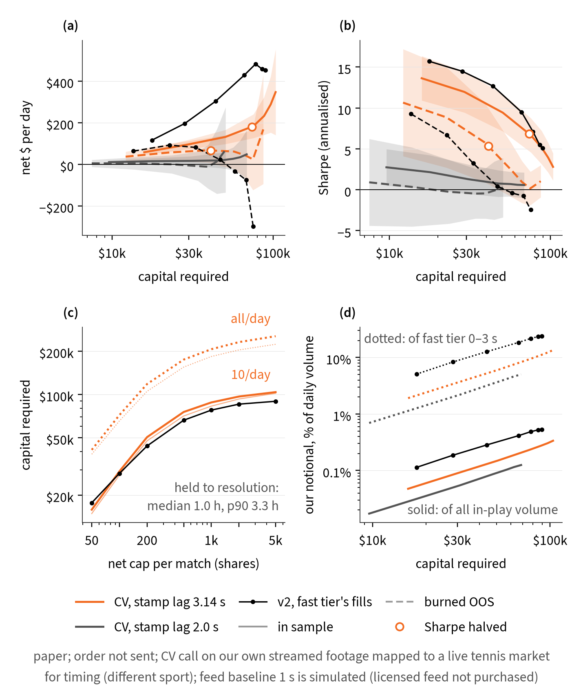

# Capital capacity: how much money the CV strategy and v2 can run

**Label.** paper; order not sent; CV call on our own streamed footage mapped to a live tennis market for timing (different sport); feed baseline 1 s is simulated (licensed feed not purchased). CV-strategy numbers: assumed data: licensed feed/video not purchased; parameters measured. v2 numbers are at the fast tier's own fills (frozen rule; no impact model beyond the copied print). We did not buy a licensed feed or licensed video, we have no camera at any court, and no live ATP/WTA data was used. The tier-0 trader is simulated; its timing and fill inputs are our measurements. Paper only: no order was built, signed or sent; every number is a simulation on public Polymarket tapes.

Generated by `scripts/capacity_study.py` (grid on HiPerGator: 47,040 CV simulations + 84 v2 runs, SLURM job 44620396, 32 CPUs, 17 min; report locally). Raw numbers: `results/capacity/capacity.json`; per-cell table `results/capacity/cv_cells.csv` (seed mean, SD, 2.5/97.5 %); per-seed rows `results/capacity/cv_seeds.parquet`; v2 grid `results/capacity/v2_grid.csv`; market volumes `results/capacity/market_daily.csv`, `market.json`; figure `results/capacity/fig_capacity.png` (vector `.pdf`). The burned OOS was logged in `results/oos_peeks.log` before it was evaluated; no parameter was chosen on it. The base cell (net 100 sh, $1k/order, phi 0.5, 10 matches/day) reproduces the latency sweep's V = 1.0 s cells to the cent, and v2's (100 sh, $1k) and (500 sh, $5k) cells reproduce scripts/financials.py's 1x and 5x rows (Checks).

## The answer (one paragraph for the paper)

Simulated at a 1 s licensed-feed baseline (assumed data: licensed feed/video not purchased; parameters measured; paper only, no order sent), the CV strategy runs up to about $41,000–$74,000 of capital at Sharpe ≥ 5. With 10 covered matches a day, half the stale depth and the calibrated 3.14 s stamp lag, its Sharpe halves at $41,000 in the burned OOS (about $66/day) and $74,000 in sample (about $181/day); capital is 3 × peak dollars locked, and a median position resolves in 1.0 h. Beyond that, impact and match risk take over: fills walk the measured book (correct-call edge 2.4¢ a share at the smallest size, 1.7¢ at 5,000-share positions with $1k orders), wrong calls cost more (3.0¢ to 14.5¢ a share), and larger net positions per match add outcome variance faster than edge. Large orders lose money in the burned OOS (−$246/day at 5,000 shares with $1k orders); $250 orders keep adding dollars in sample, up to $347/day on $104,000, but at Sharpe 2.8 with a seed band of $20 to $793. Covering every match with a book raises the half-Sharpe capacity to $96,000 (burned OOS) and $164,000 (in sample). At the pre-registered 2.0 s stamp lag the Sharpe is 2.7 in sample and 0.9 in the burned OOS even at the smallest size, so there is no capacity to speak of. Just below the half-Sharpe size our notional is 0.15% of Polymarket's in-play tennis volume but 6% of the fast tier's 0–3 s volume: the binding constraint is the seconds after each point, not the market. A central $167/day data licence is covered from about $67,000 in sample but in the burned OOS only at the noisy largest size ($86,000, Sharpe 1.0); covering every match, the camera-free deployment (licence plus cloud GPUs, $242–$256 a day) breaks even from about $52,000 in sample and $99,000 in the burned OOS. If in-play volume keeps its last-six-month trend (+5.3% a month), the book doubles in about 13 months, which in the model lifts the half-Sharpe capital to $59,000–$97,000. For comparison, v2 at the fast tier's own fills peaks in the burned OOS at $92/day on $23,000.

**How to read 'capacity'.** Three numbers per configuration, over the 28 size cells (net cap × $/order cap): (i) *Sharpe halves*: walking up the size path (net cap 50 → 5,000 shares with $250 orders for the CV strategy, whose cells form the efficient frontier; the frozen $1k ticket for v2), the capital where the seed-mean Sharpe has fallen to half the smallest size's, interpolated in log capital: the risk-adjusted capacity; (ii) *P&L-max*: the cell with the highest seed-mean $/day, which is where the marginal $/day of extra capital hits zero within the grid (the T-bill cost of capital, 4 % a year, is ≤ $0.11/day per $1k and moves nothing); (iii) *robust P&L-max*: the best cell whose 2.5 % seed band is still above zero. Capital = 3 × peak dollars locked with the repo's 4 h ex-ante lock.

## 1. P&L, Sharpe, per-share and drawdown vs size

CV strategy at the simulated 1 s feed baseline, 10 covered matches a day, phi 0.5 (the revised primary's settings), along the efficient path: $250 orders, net cap 50 → 5,000 shares. 20 seeds: mean [2.5–97.5 % of seeds]. 'Edge' = gross edge per share of correct-call fills vs the post-reprice mid (falls as fills walk the measured book); 'wrong loss' = loss per share of wrong-call fills.

**calibrated stamp lag 3.14 s (inference)**

| net cap (sh) | period | $/day [seed band] | Sharpe | net ¢/sh | edge ¢/sh | wrong loss ¢/sh | max DD | capital | ROC ann. | notional $/day | fills bound by net cap / order cap / depth |
|---|---|---|---|---|---|---|---|---|---|---|---|
| 50 | IS | $57.9 [$33, $75] | 13.6 | +1.25 | +2.42 | +2.97 | −$229 | $15,846 | 137% | $2,237 | 87% / 0% / 13% |
| 50 | burned OOS | $36.6 [$4, $78] | 10.6 | +0.81 | +2.42 | +2.62 | −$177 | $12,140 | 100% | $1,984 | 89% / 0% / 11% |
| 100 | IS | $94.3 [$51, $125] | 12.0 | +1.11 | +2.31 | +3.12 | −$464 | $29,230 | 121% | $4,105 | 81% / 0% / 19% |
| 100 | burned OOS | $56.6 [$1, $130] | 8.8 | +0.65 | +2.30 | +2.77 | −$373 | $22,576 | 81% | $3,664 | 82% / 0% / 18% |
| 200 | IS | $131.4 [$63, $179] | 9.4 | +0.90 | +2.15 | +3.27 | −$930 | $50,558 | 97% | $7,037 | 66% / 6% / 28% |
| 200 | burned OOS | $67.4 [−$19, $180] | 5.8 | +0.43 | +2.13 | +2.94 | −$850 | $38,992 | 53% | $6,303 | 67% / 6% / 27% |
| 500 | IS | $183.5 [$67, $255] | 6.7 | +0.80 | +2.04 | +3.76 | −$2,338 | $75,546 | 91% | $10,784 | 40% / 20% / 39% |
| 500 | burned OOS | $61.3 [−$56, $241] | 2.4 | +0.22 | +2.02 | +2.91 | −$2,229 | $57,141 | 31% | $9,651 | 40% / 22% / 38% |
| 1,000 | IS | $232.4 [$64, $365] | 5.2 | +0.82 | +2.00 | +3.78 | −$3,977 | $88,026 | 100% | $12,806 | 26% / 29% / 45% |
| 1,000 | burned OOS | $44.3 [−$115, $241] | 0.9 | +0.11 | +1.98 | +2.80 | −$4,535 | $66,633 | 18% | $11,417 | 26% / 30% / 44% |
| 2,000 | IS | $287.9 [$91, $539] | 3.9 | +0.88 | +1.97 | +4.84 | −$7,309 | $96,757 | 116% | $14,338 | 16% / 35% / 50% |
| 2,000 | burned OOS | $23.7 [−$177, $332] | 0.2 | −0.00 | +1.94 | +2.83 | −$8,473 | $75,058 | 3% | $12,714 | 16% / 36% / 48% |
| 5,000 | IS | $347.1 [$20, $793] | 2.8 | +0.92 | +1.95 | +6.07 | −$14,755 | $103,790 | 134% | $15,842 | 5% / 41% / 54% |
| 5,000 | burned OOS | $167.7 [−$283, $702] | 1.0 | +0.37 | +1.91 | +2.83 | −$13,579 | $86,981 | 58% | $14,044 | 5% / 42% / 53% |

**pre-registered stamp lag 2.0 s**

| net cap (sh) | period | $/day [seed band] | Sharpe | net ¢/sh | edge ¢/sh | wrong loss ¢/sh | max DD | capital | ROC ann. | notional $/day | fills bound by net cap / order cap / depth |
|---|---|---|---|---|---|---|---|---|---|---|---|
| 50 | IS | $10.0 [−$4, $27] | 2.7 | +0.51 | +2.38 | +1.29 | −$573 | $9,565 | 36% | $813 | 86% / 0% / 14% |
| 50 | burned OOS | $4.3 [−$18, $39] | 0.9 | −0.26 | +2.33 | +1.25 | −$371 | $7,475 | −24% | $778 | 85% / 0% / 15% |
| 100 | IS | $14.8 [−$9, $43] | 2.2 | +0.40 | +2.28 | +1.34 | −$1,172 | $17,796 | 28% | $1,492 | 79% / 0% / 21% |
| 100 | burned OOS | $4.3 [−$36, $62] | 0.3 | −0.38 | +2.20 | +1.29 | −$740 | $13,800 | −35% | $1,427 | 77% / 0% / 23% |
| 200 | IS | $16.3 [−$18, $58] | 1.3 | +0.24 | +2.12 | +1.38 | −$2,385 | $31,012 | 16% | $2,572 | 65% / 5% / 30% |
| 200 | burned OOS | −$0.3 [−$74, $75] | −0.3 | −0.46 | +2.05 | +1.33 | −$1,477 | $23,481 | −41% | $2,454 | 63% / 6% / 32% |
| 500 | IS | $18.7 [−$41, $86] | 0.8 | +0.18 | +2.02 | +1.41 | −$5,120 | $47,487 | 12% | $4,044 | 39% / 20% / 41% |
| 500 | burned OOS | −$8.9 [−$154, $95] | −0.5 | −0.45 | +1.95 | +1.29 | −$3,161 | $34,146 | −46% | $3,818 | 37% / 19% / 43% |
| 1,000 | IS | $26.4 [−$65, $133] | 0.7 | +0.23 | +1.98 | +1.34 | −$7,949 | $56,536 | 17% | $4,844 | 25% / 27% / 47% |
| 1,000 | burned OOS | −$12.1 [−$252, $113] | −0.4 | −0.41 | +1.92 | +1.26 | −$4,762 | $39,525 | −56% | $4,567 | 23% / 27% / 49% |
| 2,000 | IS | $33.8 [−$87, $184] | 0.6 | +0.28 | +1.95 | +1.33 | −$10,694 | $62,453 | 23% | $5,412 | 15% / 33% / 52% |
| 2,000 | burned OOS | $12.9 [−$376, $172] | −0.1 | −0.16 | +1.91 | +1.25 | −$6,381 | $44,719 | −31% | $5,083 | 13% / 33% / 54% |
| 5,000 | IS | $47.8 [−$169, $222] | 0.6 | +0.35 | +1.92 | +1.99 | −$14,743 | $68,603 | 33% | $5,888 | 5% / 39% / 57% |
| 5,000 | burned OOS | $69.4 [−$443, $347] | 0.3 | +0.21 | +1.87 | +1.24 | −$8,548 | $50,712 | 9% | $5,551 | 3% / 38% / 59% |

**Order size is the impact dial.** Seed-mean $/day and Sharpe by net cap × $/order cap (calibrated reading, phi 0.5, 10 matches/day). Up to 100 shares the order cap never binds (100 shares at ~50¢ is under $250). Above it, big orders walk the stale book into worse prices and make wrong calls costlier: from 500 shares up, $1k+ orders need 1.4–3.5× the capital of $250 orders for less $/day and a lower Sharpe in sample, and in the burned OOS they lose money from 1,000-share positions, while $250 orders stay positive (at a falling Sharpe).

IS: $/day (Sharpe)

| net cap \ $/order | $250 | $1,000 | $5,000 | $25,000 |
|---|---|---|---|---|
| 50 | $58 (13.6) | $58 (13.6) | $58 (13.6) | $58 (13.6) |
| 100 | $94 (12.0) | $94 (12.0) | $94 (12.0) | $94 (12.0) |
| 200 | $131 (9.4) | $133 (9.5) | $133 (9.5) | $133 (9.5) |
| 500 | $183 (6.7) | $179 (5.9) | $179 (5.9) | $179 (5.9) |
| 1,000 | $232 (5.2) | $211 (3.9) | $206 (3.8) | $206 (3.8) |
| 2,000 | $288 (3.9) | $264 (2.9) | $234 (2.3) | $234 (2.3) |
| 5,000 | $347 (2.8) | $345 (1.8) | $274 (1.2) | $289 (1.2) |

burned OOS: $/day (Sharpe)

| net cap \ $/order | $250 | $1,000 | $5,000 | $25,000 |
|---|---|---|---|---|
| 50 | $37 (10.6) | $37 (10.6) | $37 (10.6) | $37 (10.6) |
| 100 | $57 (8.8) | $57 (8.8) | $57 (8.8) | $57 (8.8) |
| 200 | $67 (5.8) | $67 (5.7) | $67 (5.7) | $67 (5.7) |
| 500 | $61 (2.4) | $43 (1.5) | $43 (1.5) | $43 (1.5) |
| 1,000 | $44 (0.9) | −$29 (−0.7) | −$45 (−1.0) | −$45 (−1.0) |
| 2,000 | $24 (0.2) | −$113 (−1.3) | −$176 (−1.9) | −$176 (−1.9) |
| 5,000 | $168 (1.0) | −$246 (−1.5) | −$485 (−2.2) | −$488 (−2.2) |

**Our share of the stale depth (phi)**, calibrated reading, 10 matches/day:

| phi | period | Sharpe at smallest size | Sharpe halves at capital ($/day there) | P&L-max: $/day [seed band], Sharpe, capital, cell |
|---|---|---|---|---|
| 0.25 | IS | 13.1 | $55,992 ($142) | $276 [−$45, $663], 2.4, $86,185, 5,000 sh / $250 |
| 0.25 | burned OOS | 10.1 | $31,280 ($55) | $165 [−$276, $662], 1.1, $73,256, 5,000 sh / $250 |
| 0.5 | IS | 13.6 | $73,892 ($181) | $347 [$20, $793], 2.8, $103,790, 5,000 sh / $250 |
| 0.5 | burned OOS | 10.6 | $41,105 ($66) | $168 [−$283, $702], 1.0, $86,981, 5,000 sh / $250 |
| 1 | IS | 13.9 | $88,441 ($216) | $466 [−$48, $1,137], 2.4, $297,236, 5,000 sh / $1,000 |
| 1 | burned OOS | 10.9 | $48,757 ($75) | $170 [−$265, $744], 1.0, $97,478, 5,000 sh / $250 |

**v2** (frozen copy rule at the fast tier's own fills; phi_v2 = 1; the order cap scales the ticket target; deterministic, band = day bootstrap). $/day (Sharpe) by net cap × $/order cap:

IS

| net cap \ $/order | $250 | $1,000 | $5,000 | $25,000 |
|---|---|---|---|---|
| 50 | $84 (14.2) | $116 (15.7) | $116 (15.7) | $116 (15.7) |
| 100 | $107 (12.0) | $196 (14.5) | $196 (14.5) | $196 (14.5) |
| 200 | $111 (8.6) | $303 (12.7) | $316 (12.8) | $316 (12.8) |
| 500 | $109 (6.7) | $428 (9.5) | $529 (10.4) | $529 (10.4) |
| 1,000 | $109 (6.6) | $482 (7.1) | $721 (8.4) | $721 (8.4) |
| 2,000 | $109 (6.7) | $458 (5.5) | $860 (6.1) | $860 (6.1) |
| 5,000 | $109 (6.7) | $453 (5.1) | $923 (3.4) | $925 (3.4) |

burned OOS

| net cap \ $/order | $250 | $1,000 | $5,000 | $25,000 |
|---|---|---|---|---|
| 50 | $50 (8.4) | $63 (9.3) | $63 (9.3) | $63 (9.3) |
| 100 | $46 (4.6) | $92 (6.7) | $92 (6.7) | $92 (6.7) |
| 200 | $31 (2.2) | $81 (3.2) | $83 (3.2) | $83 (3.2) |
| 500 | $10 (0.6) | $22 (0.4) | −$25 (−0.5) | −$25 (−0.5) |
| 1,000 | −$2 (−0.1) | −$34 (−0.4) | −$161 (−1.7) | −$161 (−1.7) |
| 2,000 | −$5 (−0.2) | −$76 (−0.8) | −$278 (−1.7) | −$278 (−1.7) |
| 5,000 | $0 (0.0) | −$299 (−2.4) | −$1,112 (−4.0) | −$1,097 (−3.9) |

## 2. Coverage and concurrency

Matches covered per day are chosen ex ante (highest pre-start volume per UTC day, delay-1 matches only); 'all' = every delay-1 match with a book. 'Simultaneous' = covered matches in play at the same moment (CV streams needed). Calibrated reading, phi 0.5:

| coverage /day | period | covered matches/day | max simultaneous (median daily max) | covered match-hours/day | Sharpe at smallest size | Sharpe halves at capital ($/day) | P&L-max $/day [seed band] (Sharpe, capital) | max open positions at P&L-max |
|---|---|---|---|---|---|---|---|---|
| 3 | IS | 3.0 | 3 (2) | 6 | 8.2 | $35,101 ($40) | $106 [−$158, $475] (1.0, $139,316) | 3 |
| 3 | burned OOS | 3.0 | 3 (2) | 7 | 7.6 | $19,036 ($29) | $339 [−$242, $816] (3.0, $39,050) | 2 |
| 10 | IS | 9.8 | 10 (4) | 22 | 13.6 | $73,892 ($181) | $347 [$20, $793] (2.8, $103,790) | 9 |
| 10 | burned OOS | 9.9 | 8 (3) | 21 | 10.6 | $41,105 ($66) | $168 [−$283, $702] (1.0, $86,981) | 6 |
| 20 | IS | 19.1 | 20 (6) | 43 | 16.5 | $101,167 ($287) | $491 [$123, $930] (2.8, $155,553) | 14 |
| 20 | burned OOS | 19.6 | 11 (5) | 40 | 12.5 | $48,295 ($105) | $120 [−$346, $672] (0.6, $101,284) | 8 |
| 30 | IS | 27.5 | 29 (9) | 63 | 16.8 | $113,725 ($327) | $442 [$151, $864] (3.7, $165,849) | 20 |
| 30 | burned OOS | 28.9 | 13 (8) | 60 | 13.9 | $70,259 ($148) | $301 [−$333, $881] (1.5, $154,809) | 9 |
| all | IS | 50.9 | 86 (15) | 121 | 18.3 | $164,216 ($481) | $790 [$17, $1,492] (3.1, $253,755) | 50 |
| all | burned OOS | 65.8 | 41 (15) | 145 | 16.8 | $95,790 ($251) | $939 [$33, $1,886] (3.4, $211,098) | 18 |

More coverage is the cheapest capacity there is: covering every match roughly doubles the risk-adjusted capacity of 10 matches a day, because the extra matches are independent bets (Sharpe at the smallest size rises too).

## 3. Capital: peak locked, capital required, lock-up, return, cost of capital

At the half-Sharpe point's last cell and at the P&L-max. Capital = 3 × peak locked under the 4 h ex-ante lock; '3× peak, to resolution' locks every position until its match resolves (shorter, since a median position resolves within about an hour). Lock-up = hours from fill to resolution. Cost of capital at the 4.00 % T-bill.

| strategy | config | period | point | cell | peak locked | capital (3×) | 3× peak, to resolution | lock-up h median / p90 | $/day | ROC ann. | cost of capital $/day |
|---|---|---|---|---|---|---|---|---|---|---|---|
| CV, calibrated stamp lag 3.14 s (inference) | 10/day, phi 0.5 | IS | before Sharpe halves | 200 sh / $250 | $16,853 | $50,558 | $47,618 | 0.98 / 3.29 | $131.4 | 97% | $5.54 |
| CV, calibrated stamp lag 3.14 s (inference) | 10/day, phi 0.5 | IS | P&L-max | 5,000 sh / $250 | $34,597 | $103,790 | $101,904 | 0.97 / 3.31 | $347.1 | 134% | $11.40 |
| CV, calibrated stamp lag 3.14 s (inference) | 10/day, phi 0.5 | burned OOS | before Sharpe halves | 200 sh / $250 | $12,997 | $38,992 | $26,844 | 0.85 / 2.20 | $67.4 | 53% | $4.27 |
| CV, calibrated stamp lag 3.14 s (inference) | 10/day, phi 0.5 | burned OOS | P&L-max | 5,000 sh / $250 | $28,994 | $86,981 | $61,403 | 0.84 / 2.19 | $167.7 | 58% | $9.53 |
| CV, calibrated stamp lag 3.14 s (inference) | all/day, phi 0.5 | IS | before Sharpe halves | 200 sh / $250 | $39,382 | $118,145 | $105,190 | 1.04 / 3.41 | $388.5 | 121% | $12.90 |
| CV, calibrated stamp lag 3.14 s (inference) | all/day, phi 0.5 | IS | P&L-max | 5,000 sh / $250 | $84,585 | $253,755 | $222,988 | 1.02 / 3.37 | $789.9 | 116% | $27.80 |
| CV, calibrated stamp lag 3.14 s (inference) | all/day, phi 0.5 | burned OOS | before Sharpe halves | 200 sh / $250 | $31,885 | $95,656 | $40,336 | 0.87 / 2.05 | $251.2 | 83% | $10.50 |
| CV, calibrated stamp lag 3.14 s (inference) | all/day, phi 0.5 | burned OOS | P&L-max | 5,000 sh / $250 | $70,366 | $211,098 | $88,111 | 0.85 / 2.03 | $939.4 | 157% | $23.10 |
| CV, pre-registered stamp lag 2.0 s | 10/day, phi 0.5 | IS | before Sharpe halves | 100 sh / $250 | $5,932 | $17,796 | $15,473 | 1.05 / 3.02 | $14.8 | 28% | $1.95 |
| CV, pre-registered stamp lag 2.0 s | 10/day, phi 0.5 | IS | P&L-max | 5,000 sh / $250 | $22,868 | $68,603 | $56,923 | 1.04 / 2.96 | $47.8 | 33% | $7.52 |
| CV, pre-registered stamp lag 2.0 s | 10/day, phi 0.5 | burned OOS | before Sharpe halves | 50 sh / $250 | $2,492 | $7,475 | $5,425 | 0.89 / 2.36 | $4.3 | −24% | $0.82 |
| CV, pre-registered stamp lag 2.0 s | 10/day, phi 0.5 | burned OOS | P&L-max | 5,000 sh / $250 | $16,904 | $50,712 | $38,218 | 0.85 / 2.30 | $69.4 | 9% | $5.56 |
| CV, pre-registered stamp lag 2.0 s | all/day, phi 0.5 | IS | before Sharpe halves | 100 sh / $250 | $15,567 | $46,700 | $30,801 | 1.08 / 3.07 | $34.4 | 24% | $5.12 |
| CV, pre-registered stamp lag 2.0 s | all/day, phi 0.5 | IS | P&L-max | 5,000 sh / $250 | $56,047 | $168,141 | $112,890 | 1.07 / 2.98 | $67.5 | 13% | $18.40 |
| CV, pre-registered stamp lag 2.0 s | all/day, phi 0.5 | burned OOS | before Sharpe halves | 50 sh / $250 | $6,245 | $18,734 | $8,720 | 0.90 / 2.12 | $14.6 | −3% | $2.05 |
| CV, pre-registered stamp lag 2.0 s | all/day, phi 0.5 | burned OOS | P&L-max | 5,000 sh / $250 | $39,837 | $119,512 | $57,440 | 0.86 / 2.06 | $264.7 | 88% | $13.10 |
| v2 (fast tier's fills) | phi_v2 1 | IS | P&L-max | 5,000 sh / $25,000 | $82,974 | $248,922 | $177,890 | 1.20 / 4.25 | $924.9 | 136% | $27.30 |
| v2 (fast tier's fills) | phi_v2 1 | burned OOS | P&L-max | 100 sh / $1,000 | $7,585 | $22,754 | $7,500 | 0.83 / 1.99 | $92.2 | 148% | $2.49 |

## 4. The capacity answer in dollars

| strategy | config | period | Sharpe at smallest size | Sharpe halves at capital | $/day there | marginal $/day hits 0 at capital | P&L-max $/day [band] | its Sharpe | its cell | robust P&L-max $/day (capital) |
|---|---|---|---|---|---|---|---|---|---|---|
| CV, calibrated stamp lag 3.14 s (inference) | phi 0.25, 10/day | IS | 13.1 | $55,992 | $142 | $86,185 | $276 [−$45, $663] | 2.4 | 5,000 / $250 | $238 ($79,544) |
| CV, calibrated stamp lag 3.14 s (inference) | phi 0.25, 10/day | burned OOS | 10.1 | $31,280 | $55 | $73,256 | $165 [−$276, $662] | 1.1 | 5,000 / $250 | $34 ($11,271) |
| CV, calibrated stamp lag 3.14 s (inference) | phi 0.25, all/day | IS | 17.5 | $117,294 | $356 | $199,602 | $566 [−$190, $1,190] | 2.5 | 5,000 / $250 | $446 ($163,364) |
| CV, calibrated stamp lag 3.14 s (inference) | phi 0.25, all/day | burned OOS | 15.7 | $73,497 | $206 | $166,777 | $802 [$32, $1,539] | 3.2 | 5,000 / $250 | $802 ($166,777) |
| CV, calibrated stamp lag 3.14 s (inference) | phi 0.5, 10/day | IS | 13.6 | $73,892 | $181 | $103,790 | $347 [$20, $793] | 2.8 | 5,000 / $250 | $347 ($103,790) |
| CV, calibrated stamp lag 3.14 s (inference) | phi 0.5, 10/day | burned OOS | 10.6 | $41,105 | $66 | $86,981 | $168 [−$283, $702] | 1.0 | 5,000 / $250 | $57 ($22,576) |
| CV, calibrated stamp lag 3.14 s (inference) | phi 0.5, all/day | IS | 18.3 | $164,216 | $481 | $253,755 | $790 [$17, $1,492] | 3.1 | 5,000 / $250 | $790 ($253,755) |
| CV, calibrated stamp lag 3.14 s (inference) | phi 0.5, all/day | burned OOS | 16.8 | $95,790 | $251 | $211,097 | $939 [$33, $1,886] | 3.4 | 5,000 / $250 | $939 ($211,098) |
| CV, calibrated stamp lag 3.14 s (inference) | phi 1, 10/day | IS | 13.9 | $88,441 | $216 | $297,236 | $466 [−$48, $1,137] | 2.4 | 5,000 / $1,000 | $390 ($117,263) |
| CV, calibrated stamp lag 3.14 s (inference) | phi 1, 10/day | burned OOS | 10.9 | $48,757 | $75 | $97,478 | $170 [−$265, $744] | 1.0 | 5,000 / $250 | $59 ($24,324) |
| CV, calibrated stamp lag 3.14 s (inference) | phi 1, all/day | IS | 18.8 | $217,310 | $611 | $309,457 | $948 [$177, $1,710] | 3.4 | 5,000 / $250 | $948 ($309,457) |
| CV, calibrated stamp lag 3.14 s (inference) | phi 1, all/day | burned OOS | 17.4 | $120,212 | $297 | $257,106 | $1,021 [$28, $2,204] | 3.3 | 5,000 / $250 | $1,021 ($257,106) |
| CV, pre-registered stamp lag 2.0 s | phi 0.25, 10/day | IS | 2.5 | $22,110 | $12 | $16,026 | $20 [−$210, $192] | 0.2 | 5,000 / $250 | none |
| CV, pre-registered stamp lag 2.0 s | phi 0.25, 10/day | burned OOS | 0.7 | $9,742 | $3 | $6,901 | $61 [−$427, $283] | 0.2 | 5,000 / $250 | none |
| CV, pre-registered stamp lag 2.0 s | phi 0.25, all/day | IS | 2.9 | $40,035 | $23 | $23,435 | $24 [−$1, $64] | 2.9 | 50 / $250 | none |
| CV, pre-registered stamp lag 2.0 s | phi 0.25, all/day | burned OOS | 0.6 | $18,618 | $6 | $95,741 | $227 [−$607, $889] | 1.2 | 5,000 / $250 | none |
| CV, pre-registered stamp lag 2.0 s | phi 0.5, 10/day | IS | 2.7 | $29,319 | $16 | $68,603 | $48 [−$169, $222] | 0.6 | 5,000 / $250 | none |
| CV, pre-registered stamp lag 2.0 s | phi 0.5, 10/day | burned OOS | 0.9 | $12,246 | $4 | $7,475 | $69 [−$443, $347] | 0.3 | 5,000 / $250 | none |
| CV, pre-registered stamp lag 2.0 s | phi 0.5, all/day | IS | 3.5 | $53,821 | $31 | $46,700 | $68 [−$420, $642] | 0.4 | 5,000 / $250 | $29 ($26,340) |
| CV, pre-registered stamp lag 2.0 s | phi 0.5, all/day | burned OOS | 1.3 | $24,093 | $10 | $119,512 | $265 [−$591, $1,054] | 1.3 | 5,000 / $250 | none |
| CV, pre-registered stamp lag 2.0 s | phi 1, 10/day | IS | 2.9 | $37,237 | $20 | $77,368 | $63 [−$138, $256] | 0.7 | 5,000 / $250 | none |
| CV, pre-registered stamp lag 2.0 s | phi 1, 10/day | burned OOS | 1.1 | $14,370 | $5 | $7,835 | $71 [−$454, $374] | 0.2 | 5,000 / $250 | none |
| CV, pre-registered stamp lag 2.0 s | phi 1, all/day | IS | 4.0 | $68,428 | $40 | $52,504 | $116 [−$445, $747] | 0.7 | 5,000 / $250 | $33 ($28,639) |
| CV, pre-registered stamp lag 2.0 s | phi 1, all/day | burned OOS | 1.7 | $29,785 | $14 | $142,633 | $304 [−$579, $1,178] | 1.4 | 5,000 / $250 | none |
| v2 (fast tier's fills) | phi_v2 0.25 | IS | 12.8 | $38,696 | $209 | $56,326 | $241 [$87, $394] | 4.1 | 1,000 / $5,000 | $241 ($56,326) |
| v2 (fast tier's fills) | phi_v2 0.25 | burned OOS | 3.2 | $10,263 | $11 | $8,469 | $21 [−$16, $58] | 3.2 | 50 / $1,000 | none |
| v2 (fast tier's fills) | phi_v2 0.25 | IS, 1 s / 5 % regime | 9.5 | $54,811 | $394 | $78,015 | $505 [−$339, $1,372] | 3.1 | 5,000 / $1,000 | $406 ($45,588) |
| v2 (fast tier's fills) | phi_v2 0.5 | IS | 14.5 | $65,215 | $392 | $112,652 | $482 [$173, $789] | 4.1 | 2,000 / $5,000 | $482 ($112,652) |
| v2 (fast tier's fills) | phi_v2 0.5 | burned OOS | 6.7 | $16,761 | $41 | $11,377 | $46 [$7, $85] | 6.7 | 50 / $1,000 | $46 ($11,377) |
| v2 (fast tier's fills) | phi_v2 0.5 | IS, 1 s / 5 % regime | 11.2 | $79,504 | $607 | $92,954 | $801 [$146, $1,453] | 6.7 | 2,000 / $5,000 | $801 ($92,954) |
| v2 (fast tier's fills) | phi_v2 1 | IS | 15.7 | $74,018 | $465 | $248,922 | $925 [$231, $1,646] | 3.4 | 5,000 / $25,000 | $925 ($248,922) |
| v2 (fast tier's fills) | phi_v2 1 | burned OOS | 9.3 | $28,407 | $86 | $22,754 | $92 [$13, $171] | 6.7 | 100 / $1,000 | $92 ($22,754) |
| v2 (fast tier's fills) | phi_v2 1 | IS, 1 s / 5 % regime | 12.1 | $78,472 | $527 | $207,435 | $1,648 [$144, $3,157] | 6.0 | 5,000 / $5,000 | $1,648 ($207,435) |

The CV P&L-max sits at the grid's largest net cap with $250 orders in most configurations, so in sample $/day is still creeping up there; its Sharpe is 1–4 and its seed band is wide, which is why the half-Sharpe point is the capacity we quote. Marginal $/day per extra $1k of capital along the efficient path is in `answers.*.frontier_marginal`.

## 5. Share of the market (ADV fraction)

Polymarket tennis in-play volume (moneyline universe, public tapes): $4,709,336/day in the IS window (2026-05-15 to 2026-08-25), $5,706,944/day in the burned OOS. All prints in the 0–3 s window after a detected jump: $203,864 / $285,872 a day; the qualifying fast tier's own 0–3 s prints: $117,047 / $106,490 a day. 'Stale depth we reach' = the resting stale $ (before the fast tier's share) at our arrival on correct calls that arrive before the reprice.

| strategy | config | period | point | notional $/day | % of in-play volume | % of 0–3 s window | % of fast tier 0–3 s | notional / stale depth we reach |
|---|---|---|---|---|---|---|---|---|
| CV, calibrated stamp lag 3.14 s (inference) | 10/day | IS | before Sharpe halves | $7,038 | 0.149% | 3.45% | 6.01% | 4.1% |
| CV, calibrated stamp lag 3.14 s (inference) | 10/day | IS | P&L-max | $15,842 | 0.336% | 7.77% | 13.54% | 9.2% |
| CV, calibrated stamp lag 3.14 s (inference) | 10/day | burned OOS | before Sharpe halves | $6,303 | 0.110% | 2.21% | 5.92% | 4.2% |
| CV, calibrated stamp lag 3.14 s (inference) | 10/day | burned OOS | P&L-max | $14,044 | 0.246% | 4.91% | 13.19% | 9.4% |
| CV, calibrated stamp lag 3.14 s (inference) | all/day | IS | before Sharpe halves | $27,716 | 0.589% | 13.60% | 23.68% | 5.5% |
| CV, calibrated stamp lag 3.14 s (inference) | all/day | IS | P&L-max | $60,430 | 1.283% | 29.64% | 51.63% | 12.0% |
| CV, calibrated stamp lag 3.14 s (inference) | all/day | burned OOS | before Sharpe halves | $29,080 | 0.509% | 10.17% | 27.31% | 5.5% |
| CV, calibrated stamp lag 3.14 s (inference) | all/day | burned OOS | P&L-max | $63,770 | 1.117% | 22.31% | 59.88% | 12.1% |
| CV, pre-registered stamp lag 2.0 s | 10/day | IS | before Sharpe halves | $1,492 | 0.032% | 0.73% | 1.27% | 3.0% |
| CV, pre-registered stamp lag 2.0 s | 10/day | IS | P&L-max | $5,888 | 0.125% | 2.89% | 5.03% | 11.7% |
| CV, pre-registered stamp lag 2.0 s | 10/day | burned OOS | before Sharpe halves | $778 | 0.014% | 0.27% | 0.73% | 1.6% |
| CV, pre-registered stamp lag 2.0 s | 10/day | burned OOS | P&L-max | $5,551 | 0.097% | 1.94% | 5.21% | 11.5% |
| CV, pre-registered stamp lag 2.0 s | all/day | IS | before Sharpe halves | $6,166 | 0.131% | 3.02% | 5.27% | 4.2% |
| CV, pre-registered stamp lag 2.0 s | all/day | IS | P&L-max | $22,655 | 0.481% | 11.11% | 19.36% | 15.4% |
| CV, pre-registered stamp lag 2.0 s | all/day | burned OOS | before Sharpe halves | $3,783 | 0.066% | 1.32% | 3.55% | 2.3% |
| CV, pre-registered stamp lag 2.0 s | all/day | burned OOS | P&L-max | $24,721 | 0.433% | 8.65% | 23.21% | 15.3% |
| v2 (fast tier's fills) | phi_v2 1 | IS | P&L-max | $51,033 | 1.323% | 31.71% | 59.18% | n/a |
| v2 (fast tier's fills) | phi_v2 1 | burned OOS | P&L-max | $8,062 | 0.141% | 2.82% | 7.57% | n/a |

## 6. After fixed costs

Data licence = the official feed licence ASSUMPTION ($1,250 / $5,000 / $10,000 a month; no public price) + London VPS (results/financials/financials.json): $42 / $167 / $332 a day. Camera-free deployment = that licence (a licensed betting-video feed is ASSUMED to cost the same; no public price) + VPS + a cloud GPU per covered match-hour (match hours from the data, capped at 8 h); no camera, operator or venue fee. 'Capital needed' = the smallest capital on the efficient frontier (cells that earn more $/day than every cheaper cell) whose seed-mean $/day covers the cost, interpolated in log capital (Sharpe of the first cell that covers it in brackets).

| strategy | config | period | capital needed: licence low / central / high | camera-free central: $/day, capital needed | net after central licence at half-Sharpe point / at P&L-max |
|---|---|---|---|---|---|
| CV, calibrated stamp lag 3.14 s (inference) | 10/day, phi 0.5 | IS | $15,846 (Sharpe 13.6) / $66,856 (Sharpe 6.7) / $101,944 (Sharpe 2.8) | $180: $73,774 (Sharpe 6.7) | $14 / $180 |
| CV, calibrated stamp lag 3.14 s (inference) | 10/day, phi 0.5 | burned OOS | $14,468 (Sharpe 8.8) / $86,476 (Sharpe 1.0) / not reached | $180: not reached | −$100 / $1 |
| CV, calibrated stamp lag 3.14 s (inference) | all/day, phi 0.5 | IS | $41,252 (Sharpe 18.3) / $41,252 (Sharpe 18.3) / $86,153 (Sharpe 12.5) | $242: $51,548 (Sharpe 15.9) | $314 / $623 |
| CV, calibrated stamp lag 3.14 s (inference) | all/day, phi 0.5 | burned OOS | $32,653 (Sharpe 16.8) / $34,016 (Sharpe 13.0) / $151,599 (Sharpe 3.9) | $256: $99,419 (Sharpe 5.0) | $84 / $772 |
| CV, pre-registered stamp lag 2.0 s | 10/day, phi 0.5 | IS | $66,096 (Sharpe 0.6) / not reached / not reached | $180: not reached | −$151 / −$119 |
| CV, pre-registered stamp lag 2.0 s | 10/day, phi 0.5 | burned OOS | $47,737 (Sharpe 0.3) / not reached / not reached | $180: not reached | −$163 / −$98 |
| CV, pre-registered stamp lag 2.0 s | all/day, phi 0.5 | IS | $154,398 (Sharpe 0.4) / not reached / not reached | $242: not reached | −$136 / −$100 |
| CV, pre-registered stamp lag 2.0 s | all/day, phi 0.5 | burned OOS | $80,600 (Sharpe 0.4) / $114,716 (Sharpe 1.3) / not reached | $256: $119,084 (Sharpe 1.3) | −$157 / $98 |
| v2 (fast tier's fills) | phi_v2 1 | IS | $13,300 (Sharpe 14.2) / $23,838 (Sharpe 14.5) / $47,876 (Sharpe 9.5) | n/a (no CV) | $298 / $758 |
| v2 (fast tier's fills) | phi_v2 1 | burned OOS | $10,099 (Sharpe 8.4) / not reached / not reached | n/a (no CV) | −$81 / −$75 |

## 7. Scaling outlook: if tennis in-play volume grows

In-play volume of the tennis universe grew +22.9% a month (log-linear) over the 2026 season (2026-01 to 2026-09; doubling every 3.4 months), but only +5.3% a month over the last six full months (2026-04 to 2026-09; doubling every 13.3 months); Q3 2026 averaged 1.23× Q2's $/day. Volume per listed match grew +9.3% a month over the season, so much of the growth is more markets listed. Descriptive, not a forecast. The tapes start mid-October 2025; December is the off-season.

| month | in-play $/day | in-play $ per match | matches listed | days with prints |
|---|---|---|---|---|
| 2025-10 | $569,180 | $40,193 | 439 | 23 |
| 2025-11 | $372,739 | $96,398 | 116 | 16 |
| 2025-12 | $21,725 | $39,617 | 17 | 5 |
| 2026-01 | $1,217,816 | $47,073 | 802 | 30 |
| 2026-02 | $2,049,767 | $50,257 | 1,142 | 28 |
| 2026-03 | $856,382 | $54,179 | 490 | 24 |
| 2026-04 | $4,613,574 | $87,710 | 1,578 | 30 |
| 2026-05 | $4,939,328 | $96,362 | 1,589 | 31 |
| 2026-06 | $3,480,021 | $73,729 | 1,416 | 30 |
| 2026-07 | $4,508,663 | $89,025 | 1,570 | 31 |
| 2026-08 | $5,895,826 | $103,965 | 1,758 | 31 |
| 2026-09 | $5,669,237 | $84,030 | 2,024 | 30 |

Model: every resting level of the measured live book is g × larger (stale depth and the cumulative-edge curve scale together on both sides of the book; phi, timing and the fast tier's share unchanged). Calibrated reading, phi 0.5:

| coverage | period | g | Sharpe at smallest size | Sharpe halves at capital ($/day there) | P&L-max $/day (capital, Sharpe) | months to g at the last-6 trend |
|---|---|---|---|---|---|---|
| 10/day | IS | 1 | 13.6 | $73,892 ($181) | $347 ($103,790, 2.8) | 0 |
| 10/day | IS | 1.5 | 14.2 | $86,725 ($244) | $415 ($273,088, 2.1) | 7.8 |
| 10/day | IS | 2 | 14.7 | $97,033 ($320) | $535 ($300,580, 2.6) | 13.3 |
| 10/day | IS | 3 | 15.0 | $106,561 ($381) | $643 ($338,725, 3.0) | 21.1 |
| 10/day | burned OOS | 1 | 10.6 | $41,105 ($66) | $168 ($86,981, 1.0) | 0 |
| 10/day | burned OOS | 1.5 | 11.2 | $50,392 ($92) | $205 ($93,548, 1.2) | 7.8 |
| 10/day | burned OOS | 2 | 11.7 | $59,113 ($127) | $245 ($97,663, 1.4) | 13.3 |
| 10/day | burned OOS | 3 | 12.1 | $67,550 ($161) | $278 ($102,806, 1.6) | 21.1 |
| all/day | IS | 1 | 18.3 | $164,216 ($481) | $790 ($253,755, 3.1) | 0 |
| all/day | IS | 1.5 | 19.1 | $203,469 ($643) | $880 ($288,610, 3.2) | 7.8 |
| all/day | IS | 2 | 19.9 | $236,448 ($839) | $1,033 ($313,647, 3.6) | 13.3 |
| all/day | IS | 3 | 20.3 | $275,490 ($1,022) | $1,140 ($347,950, 3.7) | 21.1 |
| all/day | burned OOS | 1 | 16.8 | $95,790 ($251) | $939 ($211,098, 3.4) | 0 |
| all/day | burned OOS | 1.5 | 18.1 | $122,874 ($358) | $1,006 ($240,046, 3.3) | 7.8 |
| all/day | burned OOS | 2 | 19.4 | $151,071 ($510) | $1,138 ($260,640, 3.6) | 13.3 |
| all/day | burned OOS | 3 | 20.3 | $178,647 ($643) | $1,207 ($287,743, 3.6) | 21.1 |

Capital capacity grows more slowly than depth: doubling every level of the book raises the half-Sharpe capital by roughly a third to a half and the P&L ceiling by about a third to a half, while the $/day earned at the half-Sharpe point nearly doubles. The wrong-call side of the book deepens too and per-match outcome risk does not shrink. (The pre-registered 2.0 s reading's growth rows are in capacity.json `growth`.)

## Checks

- `lagcal|IS`: {"capacity_base_cell_usd_per_day": 94.3466, "latency_sweep_V1_usd_per_day": 94.34658, "identical": true}
- `lagcal|burned_OOS`: {"capacity_base_cell_usd_per_day": 56.5929, "latency_sweep_V1_usd_per_day": 56.59291, "identical": true}
- `prereg|IS`: {"capacity_base_cell_usd_per_day": 14.7804, "latency_sweep_V1_usd_per_day": 14.78035, "identical": true}
- `prereg|burned_OOS`: {"capacity_base_cell_usd_per_day": 4.3454, "latency_sweep_V1_usd_per_day": 4.34536, "identical": true}
- `v2_1x|IS`: {"capacity_usd_per_day": 196.241, "financials_usd_per_day": 196.241, "capacity_capital_usd": 28302.4, "financials_capital_usd": 28302.4}
- `v2_1x|burned_OOS`: {"capacity_usd_per_day": 92.188, "financials_usd_per_day": 92.188, "capacity_capital_usd": 22754.0, "financials_capital_usd": 22754.0}
- `v2_5x|IS`: {"capacity_usd_per_day": 529.349, "financials_usd_per_day": 529.349}

## Caveats

- The CV strategy is a simulation: no licensed feed or video was bought, no camera is at any court, and the 1 s feed baseline is simulated. Its timing rests on an unmeasured stamp lag; the two readings bracket it and give very different answers.
- Impact is the measured live book of one day (2026-10-03, 9 WTA matches, 265 points with a >= 3c move), scaled down to smaller matches and never up (except in the growth cells). Depth on other days, at other tournaments or after we start trading may differ; the fast tier may react to us (phi fixed).
- Capital uses the repo's 4 h ex-ante lock. Positions are held to resolution: a median of about 1 h and a p90 of 2-3.5 h, so locking each until its match resolves needs about a quarter less capital (median ratio 0.75 across the grid); 0.1-0.8 % of fills sit in markets that resolve more than 24 h later, which ties up a little capital the 4 h model does not charge for.
- v2 has no price-impact model: it never fills beyond the print it copies, so its larger rows are upper bounds; phi_v2 < 1 is the only competition dial.
- The burned OOS is non-blind (looked at before); it is reported, never used to choose a size. Seed bands are model draws, not data uncertainty.
- The volume trend is a log-linear fit to 9 (2026 season) and 6 (last six) full months of one venue's tennis tapes, descriptive only; the growth cells assume stale depth scales with volume.

**Figure.** (a) Net $/day and (b) annualised Sharpe against capital required (3 × peak locked, log scale) along the efficient size path ($250 orders, net cap 50 → 5,000 shares; 10 matches/day; phi 0.5), CV strategy at the calibrated 3.14 s (orange) and pre-registered 2.0 s (grey) stamp lag, in sample (solid) and burned OOS (dashed), band ±1 SD over 20 seeds; open circles = where the Sharpe has halved. v2 (black) at the fast tier's own fills, $1k orders, net cap 50 → 5,000. (c) Capital required vs net cap (calibrated, in sample; thick = 4 h lock, thin = lock to resolution) at 10 and all matches a day, and v2. (d) Our notional as % of all in-play tennis volume (solid) and of the fast tier's 0–3 s volume (dotted), in sample. paper; order not sent; CV call on our own streamed footage mapped to a live tennis market for timing (different sport); feed baseline 1 s is simulated (licensed feed not purchased). Source: Polymarket public tapes; results/capacity/capacity.json.

