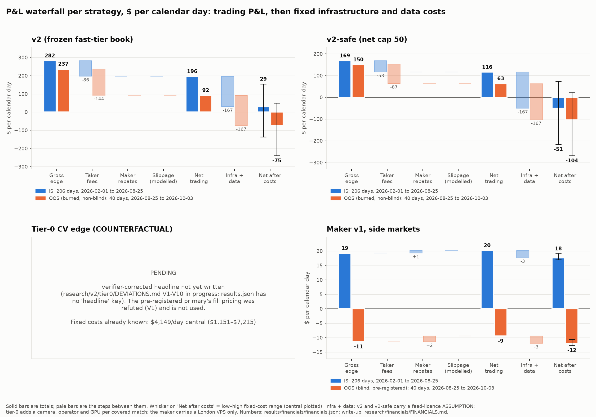

# COURTSIDE financials: what each strategy makes, what it costs, and how big it can get

Generated by `scripts/financials.py` (2026-10-03T20:03:44Z, 44.2 s). Every number is read from a result file or computed from a trade file in this repo; external costs are cited ESTIMATES or labelled ASSUMPTIONS (section 1). Anything still running shows as **pending** and is filled in on the next run. Raw numbers: `results/financials/financials.json`; figure: `results/financials/fig_waterfall.png`.

Conventions: daily P&L is calendar-day and zero-filled, and each trade's P&L is booked on its **entry** date (research/v2/sizing/engine.py daily_series), not on the settlement date (entry-to-resolution hours are in each unit-economics table); Sharpe and Sortino are ×√365; capital is 3 × peak dollars locked (repo convention); annualised returns are simple (×365/days, no compounding); kurtosis is Pearson (normal = 3). IS = matches starting before 2026-08-25 14:15 UTC (trades from 2026-02); OOS = matches starting after it, **burned (non-blind)**. U2 = 11,307 markets never used in development (the blind test). Cost of capital uses the 3-month T-bill at 4.00% (https://fred.stlouisfed.org/series/DTB3, 3-month US Treasury bill, secondary market, discount basis, 2026-10-01 (FRED DTB3)).

## Headline

| strategy | period | trades | net ¢/share [95% CI] | net trading $/day | fixed costs $/day, central [low to high] | net after costs $/day, central [high-cost to low-cost] | capital | return on capital, ann. | Sharpe | max DD % cap |
|---|---|---|---|---|---|---|---|---|---|---|
| v2 (frozen fast-tier book) | IS | 55,662 | +1.38 [+1.17, +1.59] | $196 | $167 [$42 to $332] | **$29** [−$136 to $154] | $28,302 | 253% | 14.5 | −2.0% |
| v2 (frozen fast-tier book) | IS, current 1 s / 5% regime only | 15,120 | +1.02 [+0.59, +1.45] | $179 | $167 [$42 to $332] | **$12** [−$153 to $137] | $27,997 | 234% | 11.2 | −2.0% |
| v2 (frozen fast-tier book) | OOS (burned, non-blind) | 10,412 | +0.60 [+0.09, +1.13] | $92 | $167 [$42 to $332] | **−$75** [−$240 to $50] | $22,754 | 148% | 6.7 | −2.1% |
| v2 (frozen fast-tier book) | U2 unseen markets, OOS period (blind) | 4,616 | +1.22 [−0.19, +2.65] | $53 | $167 [$42 to $332] | **−$114** [−$279 to $11] | $7,432 | 260% | 5.3 | −10.8% |
| v2 (frozen fast-tier book) | Forward (blind) | **pending** | | | | | | | | |
| v2-safe (net cap 50) | IS | 50,950 | +1.33 [+1.16, +1.52] | $116 | $167 [$42 to $332] | **−$51** [−$216 to $74] | $17,681 | 239% | 15.7 | −1.6% |
| v2-safe (net cap 50) | IS, current 1 s / 5% regime only | 13,920 | +1.02 [+0.65, +1.39] | $109 | $167 [$42 to $332] | **−$58** [−$223 to $67] | $17,681 | 225% | 12.1 | −1.6% |
| v2-safe (net cap 50) | OOS (burned, non-blind) | 9,487 | +0.69 [+0.24, +1.15] | $63 | $167 [$42 to $332] | **−$104** [−$269 to $21] | $13,584 | 170% | 9.3 | −1.9% |
| v2-safe (net cap 50) | U2 unseen markets, OOS period (blind) | 4,196 | +1.21 [−0.02, +2.43] | $34 | $167 [$42 to $332] | **−$133** [−$298 to −$9] | $4,524 | 270% | 5.5 | −8.9% |
| Tier-0 CV edge (COUNTERFACTUAL) | IS, 1 s-delay matches only (trades from 2026-05-15, 103 d) | ≈6,447 (seed mean) | +1.10 [+0.82, +1.38] | $89 | $4,149 [$1,153 to $7,215] | **−$4,060** [−$7,127 to −$1,064] | $29,000 | 115% | 11.4 | −1.8% |
| Tier-0 CV edge (COUNTERFACTUAL) | OOS (burned, non-blind) | ≈1,969 (seed mean) | +0.58 [−0.08, +1.21] | $46 | $4,149 [$1,153 to $7,215] | **−$4,103** [−$7,169 to −$1,106] | $21,411 | 66% | 7.3 | −3.2% |
| Maker v1, side markets | IS | 8,905 | +2.59 [−0.09, +5.20] | $20 | $3 [$1 to $3] | **$18** [$17 to $19] | $2,779 | 265% | 2.5 | −59.2% |
| Maker v1, side markets | IS, current 1 s / 5% regime only | 4,159 | +3.35 [−0.41, +6.88] | $71 | $3 [$1 to $3] | **$69** [$68 to $70] | $2,779 | 933% | 4.8 | −57.9% |
| Maker v1, side markets | OOS (blind) | 2,207 | −0.75 [−4.97, +3.33] | −$9 | $3 [$1 to $3] | **−$12** [−$13 to −$11] | $2,022 | −171% | −1.4 | −57.2% |
| Maker v1, side markets | Live paper session | **pending** | | | | | | | | |
| Table tennis (out-of-sport test) | Results | 0 | n/a n/a | n/a | n/a | n/a | n/a | n/a | n/a | n/a |

How to read it:
- v2 nets $196/day IS and $92/day in the burned OOS before fixed costs. Taker fees take 0.61¢ of a 1.99¢ gross edge per share IS and 0.94¢ of 1.54¢ OOS.
- With a feed licence (ASSUMPTION, central $5,000/month) plus a London VPS, v2's fixed costs are $167/day (range $42–$332). That leaves $29/day IS and −$75/day OOS at central costs.
- Forecast-relevant IS row (PM_REVIEW P08): only 2026-07-11 to 2026-08-25 (46 days) ran under today's 1 s delay and 5% fee. There v2 nets +1.02¢ [+0.59, +1.45] and $179.3/day against $166.9/day of central fixed costs: $12.4/day. The full IS row blends fee and delay regimes that no longer exist.
- Fees are the binding variable (PM_REVIEW P03). On the burned OOS taker fees are 61.0% of gross (30.5% IS). With the book held fixed, the break-even taker fee rate is 8.2% before fixed costs and 2.4% after central fixed costs; today's rate is 5%.
- The maker is the only remote-executable book. It nets $20.2/day IS ($71.1/day in the current 1 s / 5% regime) against $2.55/day of VPS. Its pre-registered blind OOS verdict is FAILURE: per fill +1.87¢ [−0.14, +3.86]; in dollars it made −$9.5/day (−$379 over 40 days). The per-fill mean is positive while the share-weighted mean is −0.75¢, so the larger fills did worse.
- Tier-0 (counterfactual, verifier-corrected headline in results/tier0/results.json) at the scenario's net cap: IS, 1 s-delay matches only (trades from 2026-05-15, 103 d) $88.8/day trading vs $1,153 / $4,149 / $7,215 per day fixed (low / central / high), so it would need 13.0× its trading P&L just to cover the low-cost case; OOS (burned, non-blind) $46.4/day trading vs $1,153 / $4,149 / $7,215 per day fixed (low / central / high), so it would need 24.8× its trading P&L just to cover the low-cost case. Uneconomic at 10 covered matches a day in every cost case (PM_REVIEW P10).
- v2-safe's honest IS Sharpe is the stitched walk-forward 14.02, not the frozen variant's 15.70 shown in the headline (research/rigor/RESULTS.md verifier correction 4).
- v2 (frozen fast-tier book): covers central fixed costs in IS: yes, from 1x (central cost $167/day); in the burned OOS: no: not even with every qualifying print (central cost $167/day) (engine re-run at 0.5x–5x size and with every qualifying print; section 2d).
- v2-safe (net cap 50): covers central fixed costs in IS: yes, from 2x (central cost $167/day); in the burned OOS: no: not even with every qualifying print (central cost $167/day) (engine re-run at 0.5x–5x size and with every qualifying print; section 3d).
- Pending: v2 (frozen fast-tier book) Forward (blind); Maker v1, side markets Live paper session.



## 1. Fixed infrastructure and data costs (external; cited)

| item | label | low | central | high | unit | basis | sources |
|---|---|---|---|---|---|---|---|
| Official live ATP/WTA point-data feed licence | ASSUMPTION (no public price exists) | 1,250.00 | 5,000.00 | 10,000.00 | $/month | No public price exists for an official low-latency ATP/WTA point feed (Sportradar / Tennis Data Innovations for ATP and Challenger, Stats Perform RunningBall for WTA): access is by sales quote. The range is anchored to reported figures: Sportradar API 'from $1,250/month' (LSports guide, low); 'starter contracts typically $5,000 to $10,000/month' and '$10,000+/month' for enterprise (SharpAPI, a competitor's unverified claim; central and high). Stats Perform says its WTA feed is faster than the umpire feed on 80% of points; it lists no price. | <https://www.lsports.eu/blog/sports-data-cost/> <https://sharpapi.io/compare/sportradar-alternative> <https://www.statsperform.com/products/official-wta-data-streaming/> |
| London gateway VPS (AWS eu-west-2, on-demand Linux) | ESTIMATE (public list price) | 34.46 | 77.42 | 98.11 | $/month | t3.medium $0.0472/h (low), c7i.large $0.10605/h (central), c6in.large $0.1344/h (network-optimised, high), x 730 h/month; AWS public price list for EU (London), published 2026-09-25. Hetzner has no London location (Germany, Finland, US, Singapore); its CX23 (2 vCPU, 4 GB) lists at EUR 5.49 / $6.49 a month, a non-co-located reference only. | <https://b0.p.awsstatic.com/pricing/2.0/meteredUnitMaps/ec2/USD/current/ec2-ondemand-without-sec-sel/EU%20(London)/Linux/index.json> <https://www.hetzner.com/cloud/> <https://costgoat.com/pricing/hetzner> |
| Polymarket CLOB / data API | ESTIMATE (public documentation) | 0.00 | 0.00 | 0.00 | $/month | No subscription, key or paid tier is documented; limits are IP-based Cloudflare throttling. Trading fees are not infrastructure: they are in the waterfall (taker fee C x feeRate x p(1-p), sports feeRate 0.05, 15% maker rebate). | <https://docs.polymarket.com/quickstart/introduction/rate-limits> <https://docs.polymarket.com/polymarket-learn/trading/fees> |
| HiPerGator (training, backtests) | ESTIMATE ($0 marginal: university allocation) | 0.00 | 0.00 | 0.00 | $/month | $0 marginal cost to the team (UF allocation). List-price equivalent if bought: $620 per GPU (NGU) per year and $44 per CPU core (NCU) per year (UF Research Computing service rates), about $52 per GPU-month. | <https://it.ufl.edu/rc/get-started/price-list> |
| Courtside camera operator (tier-0 only) | ESTIMATE | 36.10 | 36.10 | 36.10 | $/hour | BLS Occupational Outlook Handbook: $36.10/h is the 2025 median hourly pay of the combined 'film and video editors and camera operators' group; camera operators (television, video and film) alone earn a median $74,990/yr (May 2025), about $36.05/h at 2,080 h. Wage only: no employer on-costs, travel or agency margin. | <https://www.bls.gov/ooh/media-and-communication/film-and-video-editors-and-camera-operators.htm> |
| Cloud GPU for CV inference, per covered event hour (tier-0 only) | ESTIMATE (public list price) | 0.61 | 0.61 | 1.02 | $/hour | AWS EU (London) on demand: g4dn.xlarge (1x T4) $0.615/h; g6.xlarge (1x L4) $1.0216/h (high). On-venue inference on our own hardware would replace this; HiPerGator is not a live venue. | <https://b0.p.awsstatic.com/pricing/2.0/meteredUnitMaps/ec2/USD/current/ec2-ondemand-without-sec-sel/EU%20(London)/Linux/index.json> |
| Operator + GPU hours per covered match (tier-0 only) | ASSUMPTION | 3.00 | 4.00 | 5.00 | hours/event | A best-of-3 match plus set-up. Central = the repo's 4 h ex-ante capital lock per position (src/v2.py LOCK_S). | — |
| Camera position / venue access fee per event (tier-0 only) | ASSUMPTION (no public price exists) | 0.00 | 250.00 | 500.00 | $/event | A legal tier-0 needs the organiser's permission for a camera (courtsiding breaches ticket terms, docs/NOTE.md section 5). No public price exists for that right. Range is ours; low = $0. | — |
| 120 fps camera kit, amortised over 24 months (tier-0 only) | ESTIMATE (low: public list prices) / ASSUMPTION (central, high) | 648.00 | 1,000.00 | 2,000.00 | $/kit | Hardware per covered court (camera, lens, mount, edge box). Low = public launch list prices of a consumer 120 fps camera (GoPro HERO13 Black, $399) plus an edge inference box (NVIDIA Jetson Orin Nano Super Developer Kit, $249), no mount or cabling. Central and high are ours (no quote for a rugged or machine-vision kit was obtained). An on-venue edge box would replace the cloud GPU hours above, so the stack counts inference twice; that is conservative and small next to the operator. | <https://investor.gopro.com/press-releases/press-release-details/2024/GoPro-Announces-Two-New-Cameras-The-399-HERO13-Black-and-the-199-HERO/default.aspx> <https://developer.nvidia.com/blog/nvidia-jetson-orin-nano-developer-kit-gets-a-super-boost/> |
| Cost of capital | ESTIMATE | | 4.00% | | per year | 3-month US Treasury bill, secondary market, discount basis, 2026-10-01 (FRED DTB3) | <https://fred.stlouisfed.org/series/DTB3> |

All sources retrieved 2026-10-03. Monthly figures convert to daily at 365/12 days per month.

| strategy | carries | fixed cost $/month, low / central / high | $/day, low / central / high |
|---|---|---|---|
| v2 (frozen fast-tier book) | v2 trades at the fast tier's own fills, so running it means being in the fast tier. That needs a signal about 2.5 s before the official stamp (docs/NOTE.md section 6); an official feed licence is a necessary cost, not a sufficient one. The cost stack is a lower bound. | $1,284 / $5,077 / $10,098 | $42 / $167 / $332 |
| v2-safe (net cap 50) | Same infrastructure as v2. | $1,284 / $5,077 / $10,098 | $42 / $167 / $332 |
| Tier-0 CV edge (COUNTERFACTUAL) | Feed licence + London gateway + one camera, operator and GPU per covered match (coverage from the scenario). | $35,057 / $126,206 / $219,471 | $1,153 / $4,149 / $7,215 |
| Maker v1, side markets | Public moneyline websocket + quoting in side markets: no licensed data, no camera. | $34 / $77 / $98 | $1 / $3 / $3 |

## 2. v2 (frozen fast-tier book)

The frozen v2 rule: copy qualifying fast-tier prints 0–3 s after a detected jump, risk-parity size, wallet filter, 0.05–0.95 zone, |net| ≤ 100 shares per match, hold to resolution. It fills at the fast tier's own print price, so it is the prize for fast-tier speed, not a remotely executable strategy (docs/NOTE.md sections 3 and 6).

- **Forward (blind): pending.** `results/v2/forward.json`: blind forward window; scripts/forward_test.py runs once ~11:30 UTC Oct 4

### 2a. P&L waterfall

| step | IS: ¢/share | $ period | $/day | IS, current 1 s / 5% regime only: ¢/share | $ period | $/day | OOS (burned, non-blind): ¢/share | $ period | $/day | U2 unseen markets, IS period (blind): ¢/share | $ period | $/day | U2 unseen markets, OOS period (blind): ¢/share | $ period | $/day |
|---|---|---|---|---|---|---|---|---|---|---|---|---|---|---|---|
| Gross edge | +1.988 | $58,174 | $282.4 | +1.965 | $15,905 | $345.8 | +1.536 | $9,461 | $236.5 | +2.881 | $10,581 | $52.6 | +2.228 | $3,855 | $96.4 |
| − taker fees | −0.607 | −$17,748 | −$86.2 | −0.946 | −$7,655 | −$166.4 | −0.937 | −$5,773 | −$144.3 | −0.856 | −$3,144 | −$15.6 | −1.005 | −$1,738 | −$43.4 |
| + maker rebates | +0.000 | $0 | $0.0 | +0.000 | $0 | $0.0 | +0.000 | $0 | $0.0 | +0.000 | $0 | $0.0 | +0.000 | $0 | $0.0 |
| − spread / slippage (as modelled) | +0.000 | $0 | $0.0 | +0.000 | $0 | $0.0 | +0.000 | $0 | $0.0 | +0.000 | $0 | $0.0 | +0.000 | $0 | $0.0 |
| **= net trading P&L** | +1.381 | $40,426 | $196.2 | +1.019 | $8,249 | $179.3 | +0.599 | $3,688 | $92.2 | +2.025 | $7,437 | $37.0 | +1.224 | $2,117 | $52.9 |
| − infra + data (central) |  | −$34,387 | −$166.9 |  | −$7,679 | −$166.9 |  | −$6,677 | −$166.9 |  | −$33,553 | −$166.9 |  | −$6,677 | −$166.9 |
| − infra + data (low) |  | −$8,699 | −$42.2 |  | −$1,943 | −$42.2 |  | −$1,689 | −$42.2 |  | −$8,488 | −$42.2 |  | −$1,689 | −$42.2 |
| − infra + data (high) |  | −$68,391 | −$332.0 |  | −$15,272 | −$332.0 |  | −$13,280 | −$332.0 |  | −$66,731 | −$332.0 |  | −$13,280 | −$332.0 |
| **= net after costs (central costs)** |  | $6,038 | **$29.3** |  | $571 | **$12.4** |  | −$2,990 | **−$74.7** |  | −$26,116 | **−$129.9** |  | −$4,560 | **−$114.0** |
| **= net after costs (low costs)** |  | $31,727 | **$154.0** |  | $6,307 | **$137.1** |  | $1,998 | **$50.0** |  | −$1,051 | **−$5.2** |  | $428 | **$10.7** |
| **= net after costs (high costs)** |  | −$27,965 | **−$135.8** |  | −$7,022 | **−$152.7** |  | −$9,592 | **−$239.8** |  | −$59,294 | **−$295.0** |  | −$11,163 | **−$279.1** |
| *stress: net trading with +½ tick (0.5¢/share) slippage* | +0.881 | $25,794 | $125.2 | +0.519 | $4,202 | $91.4 | +0.099 | $608 | $15.2 | +1.525 | $5,601 | $27.9 | +0.724 | $1,252 | $31.3 |

Slippage as modelled is zero: v2 fills at the fast tier's own print price (they already crossed the spread). Repo stresses: +½ tick in the table above; doubled fees in `results/v2/cost_stress.json` (OOS does not survive doubled fees).

**Break-even.** P&L/day needed = fixed cost/day. Notional/day needed = fixed cost/day ÷ net P&L per $ traded.

| period | fixed cost $/day (central) | net trading $/day | notional $/day now | notional $/day to break even (central) | multiple of now | covered within the tested size range? |
|---|---|---|---|---|---|---|
| IS | $167 | $196 | $7,182 | $6,110 | 0.9× | yes, from 1x (central cost $167/day) |
| IS, current 1 s / 5% regime only | $167 | $179 | $8,991 | $8,369 | 0.9× | n/a |
| OOS (burned, non-blind) | $167 | $92 | $8,062 | $14,599 | 1.8× | no: not even with every qualifying print (central cost $167/day) |
| U2 unseen markets, IS period (blind) | $167 | $37 | $936 | $4,221 | 4.5× | n/a |
| U2 unseen markets, OOS period (blind) | $167 | $53 | $2,223 | $7,011 | 3.2× | n/a |

**Break-even taker fee** (PM_REVIEW P03). Book held fixed, fee linear in the rate: every trade's fee is scaled by k until net P&L is zero, before and after fixed costs. Shown as k × the schedule each trade actually paid, and as a rate where every trade paid the same rate. Today's rate is 5%.

| period | taker fees as % of gross | rate charged | break-even before fixed costs | after low fixed costs | after central fixed costs | after high fixed costs |
|---|---|---|---|---|---|---|
| IS | 30.5% | mixed (0–5%) | 3.28× | 2.79× | 1.34× | −0.58× |
| IS, current 1 s / 5% regime only | 48.1% | 5% | 2.08× (10.4%) | 1.82× (9.1%) | 1.07× (5.4%) | 0.08× (0.4%) |
| OOS (burned, non-blind) | 61.0% | 5% | 1.64× (8.2%) | 1.35× (6.7%) | 0.48× (2.4%) | −0.66× (−3.3%) |
| U2 unseen markets, IS period (blind) | 29.7% | mixed (0–5%) | 3.37× | 0.67× | −7.31× | −17.86× |
| U2 unseen markets, OOS period (blind) | 45.1% | 5% | 2.22× (11.1%) | 1.25× (6.2%) | −1.62× (−8.1%) | −5.42× (−27.1%) |

A negative multiple means the book loses money after fixed costs even with zero taker fees.

### 2b. Unit economics

| | IS | IS, current 1 s / 5% regime only | OOS (burned, non-blind) | U2 unseen markets, IS period (blind) | U2 unseen markets, OOS period (blind) |
|---|---|---|---|---|---|
| trades / matches / calendar days | 55,662 / 7,639 / 206 | 15,120 / 2,136 / 46 | 10,412 / 2,003 / 40 | 10,764 / 3,244 / 201 | 4,616 / 1,549 / 40 |
| net per trade (mean / median) | $0.73 / $0.83 | $0.55 / $1.07 | $0.35 / $1.09 | $0.69 / $0.93 | $0.46 / $0.94 |
| net per match (mean); share of matches won | $5.29; 57.7% | $3.86; 57.6% | $1.84; 55.6% | $2.29; 56.1% | $1.37; 54.4% |
| net per calendar day (mean / median); profitable days | $196.2 / $164.6; 79.6% | $179.3 / $133.3; 73.9% | $92.2 / $32.9; 60.0% | $37.0 / $0.0; 33.3% | $52.9 / $23.2; 60.0% |
| trade win rate [95% CI, match-clustered] | 53.6% [53.2, 53.9] | 54.7% [54.1, 55.4] | 55.6% [54.8, 56.4] | 56.1% [55.2, 57.0] | 55.1% [53.3, 56.9] |
| average win / average loss ($ per trade); ratio | $19.85 / −$21.35; 0.93 | $19.18 / −$21.99; 0.87 | $20.42 / −$24.75; 0.82 | $12.26 / −$14.11; 0.87 | $14.35 / −$16.58; 0.87 |
| profit factor | 1.073 | 1.055 | 1.032 | 1.112 | 1.062 |
| expectancy: $/trade; ¢/share; ¢ per $ traded | $0.726; +1.381; +2.732 | $0.546; +1.019; +1.995 | $0.354; +0.599; +1.143 | $0.691; +2.025; +3.954 | $0.459; +1.224; +2.381 |
| turnover (notional ÷ capital, per year) | 93× | 117× | 129× | 29× | 109× |
| hours from entry to resolution: median / p90 | 1.25 / 4.30 | 0.84 / 2.01 | 0.83 / 1.99 | 1.64 / 4.49 | 1.69 / 3.73 |
| hours locked in the capital model: median / p90 | 4.00 / 4.00 | 4.00 / 4.00 | 4.00 / 4.00 | 4.00 / 4.00 | 4.00 / 4.00 |
| cost of capital at 4.00%: on reserved capital (period); on dollars actually locked | $639; $17.34 | $141; $1.76 | $100; $1.43 | $258; $1.94 | $33; $1.18 |

Capital-model lock: ex-ante 4 h per position from entry (src/v2.py LOCK_S), capital = 3 × peak of the dollars locked

### 2c. Capital and returns

| | IS | IS, current 1 s / 5% regime only | OOS (burned, non-blind) | U2 unseen markets, IS period (blind) | U2 unseen markets, OOS period (blind) |
|---|---|---|---|---|---|
| capital (3 × peak locked) / peak locked | $28,302 / $9,434 | $27,997 / $9,332 | $22,754 / $7,585 | $11,692 / $3,897 | $7,432 / $2,477 |
| net P&L [95% CI, match-clustered] | $40,426 [34,262, 46,589] | $8,249 [4,836, 11,712] | $3,688 [540, 6,890] | $7,437 [4,104, 10,678] | $2,117 [−320, 4,599] |
| return on capital, period [95% CI, day bootstrap] | 142.8% [116.8, 169.3] | 29.5% [15.0, 43.7] | 16.2% [2.0, 30.4] | 63.6% [32.3, 96.2] | 28.5% [−1.9, 61.1] |
| return on capital, annualised (simple) [95% CI] | 253% [207, 300] | 234% [119, 347] | 148% [18, 278] | 116% [59, 175] | 260% [−17, 558] |
| Sharpe / Sortino / Calmar | 14.48 / 46.41 / 125.8 | 11.23 / 27.78 / 118.8 | 6.67 / 14.02 / 71.7 | 5.19 / 12.40 / 20.3 | 5.30 / 11.30 / 24.0 |
| max drawdown $ / % of capital | −$569 / −2.01% | −$551 / −1.97% | −$469 / −2.06% | −$664 / −5.68% | −$805 / −10.83% |
| max DD: peak → trough → recovered | 2026-06-15 → 2026-06-17 → 2026-06-22 | 2026-07-17 → 2026-07-18 → 2026-07-21 | 2026-09-06 → 2026-09-07 → 2026-09-08 | 2026-06-25 → 2026-07-05 → 2026-07-09 | 2026-09-18 → 2026-10-03 → not yet |
| days to recover: from trough / from peak | 5 / 7 | 3 / 4 | 1 / 2 | 4 / 14 | not recovered (0 days since trough) |
| worst day / week / month, $ | −$551 / −$383 / $2,543 | −$551 / −$383 / $4,069 | −$469 / −$29 / −$434 | −$352 / −$360 / −$15 | −$333 / −$742 / −$354 |
| worst day / week / month, % of capital | −1.95% / −1.35% / 8.98% | −1.97% / −1.37% / 14.53% | −2.06% / −0.13% / −1.91% | −3.01% / −3.08% / −0.13% | −4.48% / −9.99% / −4.77% |
| months positive | 7 / 7 | 2 / 2 | 2 / 3 | 4 / 7 | 2 / 3 |
| daily skew / kurtosis (Pearson) | 0.53 / 4.30 | 0.10 / 3.04 | 0.33 / 3.26 | 1.61 / 8.84 | 0.92 / 5.19 |
| return, annualised / max DD, on one capital fixed ex ante: IS capital $28,302 | 253% / −2.01% | 231% / −1.95% | 119% / −1.66% | 48% / −2.35% | 68% / −2.84% |
| return, annualised / max DD, on one capital fixed ex ante: realised-lock capital $34,818 | 206% / −1.64% | 188% / −1.58% | 97% / −1.35% | 39% / −1.91% | 55% / −2.31% |

Weeks are calendar weeks (Mon–Sun) and months calendar months; the first and last can be partial.
The rows 'on one capital fixed ex ante' use the same dollar capital for every period (PM_REVIEW P13): IS capital = this book's IS capital (3 x IS peak locked); realised-lock capital = 3 x IS peak locked with realised lock times (results/risk/risk_stats.json). The rows above them use each period's own 3 × peak locked, which a trader cannot know in advance.

### 2d. Capacity

**Now:** $7,182 notional/day IS, $8,062 OOS. **Outer ceiling (measured):** the qualifying fast tier's own 0–3 s prints total $82,325/day IS and $105,490/day OOS (walk-forward shadow rows, `src/fasttier.py`; every wallet, before v2's wallet filter and zone). **Ceiling for this rule:** the 'all prints' row below, where the engine takes every print that passes v2's wallet filter and zone, in full.

Depth / impact model: the repo's engine (`research/v2/sizing/engine.py`) caps every trade at the fast-tier print it copies (the liquidity known to exist at that price) and has no price-impact model beyond that cap; a 1x book that is larger than the print is impossible by construction. The rows scale every size cap of the frozen rule (risk budget R, per-match net cap, $ per order, $ per match) by the factor, with the same walk-forward fitting. The OOS rows are new evaluations on the burned (non-blind) OOS.

| size | IS: $/day | ¢/share | notional $/day | Sharpe | capital | max DD % | OOS: $/day | ¢/share | notional $/day | Sharpe | capital | max DD % |
|---|---|---|---|---|---|---|---|---|---|---|---|---|
| 0.5x | $109.6 | +1.31 | $4,230 | 15.5 | $17,465 | −1.6% | $62.1 | +0.68 | $4,755 | 9.2 | $13,355 | −1.8% |
| 1x | $196.2 | +1.38 | $7,182 | 14.5 | $28,302 | −2.0% | $92.2 | +0.60 | $8,062 | 6.7 | $22,754 | −2.1% |
| 2x | $316.2 | +1.41 | $11,366 | 12.8 | $45,392 | −4.1% | $82.5 | +0.34 | $12,935 | 3.2 | $33,875 | −4.9% |
| 5x | $529.3 | +1.39 | $19,336 | 10.4 | $80,253 | −5.4% | −$24.5 | −0.06 | $21,525 | −0.5 | $53,816 | −11.4% |
| all prints | $491.2 | +0.37 | $67,442 | 0.8 | $534,207 | −31.8% | −$1,281.5 | −0.96 | $67,053 | −2.1 | $303,724 | −25.7% |

**Out-of-sample capacity on this evidence.** On the burned OOS, $/day peaks at 1x ($92.2/day, capital $22,754); the largest size still positive is 2x ($82.5/day, Sharpe 3.2, capital $33,875), and every larger size loses money. So out-of-sample capacity is about $22,754–$33,875 of capital. This replaces the sizing lens's '~$100k at Sharpe ~6' (research/v2/sizing/RESULTS.md §6), which used onset-window labels (the D9 hindsight bug), was in-sample only, and whose $102k row is the copy-everything Baseline, not v2.

Caveats: IS is in-sample for the rule's selection; the OOS is burned (looked at before v2-safe was designed). Per-share P&L moves with size because a bigger book takes a different mix of trades (more same-direction stacking within a match once the net cap loosens; at 'all prints', every print at its full size instead of risk-parity sizing). None of it is modelled price impact, which the engine does not have; real impact would make the larger rows worse. U2 has few markets before May 2026 (research/v2/expand/RESULTS.md, coverage facts), so U2-IS per-day figures are spread over a mostly empty 201-day calendar.

## 3. v2-safe (net cap 50)

v2 with the per-match net cap halved to 50 shares (pre-registered risk dial, research/v2/lowloss).

### 3a. P&L waterfall

| step | IS: ¢/share | $ period | $/day | IS, current 1 s / 5% regime only: ¢/share | $ period | $/day | OOS (burned, non-blind): ¢/share | $ period | $/day | U2 unseen markets, IS period (blind): ¢/share | $ period | $/day | U2 unseen markets, OOS period (blind): ¢/share | $ period | $/day |
|---|---|---|---|---|---|---|---|---|---|---|---|---|---|---|---|
| Gross edge | +1.939 | $34,715 | $168.5 | +1.978 | $9,674 | $210.3 | +1.629 | $6,017 | $150.4 | +2.963 | $7,146 | $35.6 | +2.211 | $2,459 | $61.5 |
| − taker fees | −0.606 | −$10,851 | −$52.7 | −0.955 | −$4,670 | −$101.5 | −0.943 | −$3,483 | −$87.1 | −0.852 | −$2,055 | −$10.2 | −1.005 | −$1,118 | −$27.9 |
| + maker rebates | +0.000 | $0 | $0.0 | +0.000 | $0 | $0.0 | +0.000 | $0 | $0.0 | +0.000 | $0 | $0.0 | +0.000 | $0 | $0.0 |
| − spread / slippage (as modelled) | +0.000 | $0 | $0.0 | +0.000 | $0 | $0.0 | +0.000 | $0 | $0.0 | +0.000 | $0 | $0.0 | +0.000 | $0 | $0.0 |
| **= net trading P&L** | +1.333 | $23,864 | $115.8 | +1.023 | $5,004 | $108.8 | +0.686 | $2,533 | $63.3 | +2.111 | $5,091 | $25.3 | +1.206 | $1,341 | $33.5 |
| − infra + data (central) |  | −$34,387 | −$166.9 |  | −$7,679 | −$166.9 |  | −$6,677 | −$166.9 |  | −$33,553 | −$166.9 |  | −$6,677 | −$166.9 |
| − infra + data (low) |  | −$8,699 | −$42.2 |  | −$1,943 | −$42.2 |  | −$1,689 | −$42.2 |  | −$8,488 | −$42.2 |  | −$1,689 | −$42.2 |
| − infra + data (high) |  | −$68,391 | −$332.0 |  | −$15,272 | −$332.0 |  | −$13,280 | −$332.0 |  | −$66,731 | −$332.0 |  | −$13,280 | −$332.0 |
| **= net after costs (central costs)** |  | −$10,523 | **−$51.1** |  | −$2,675 | **−$58.2** |  | −$4,144 | **−$103.6** |  | −$28,462 | **−$141.6** |  | −$5,336 | **−$133.4** |
| **= net after costs (low costs)** |  | $15,165 | **$73.6** |  | $3,061 | **$66.5** |  | $844 | **$21.1** |  | −$3,397 | **−$16.9** |  | −$348 | **−$8.7** |
| **= net after costs (high costs)** |  | −$44,527 | **−$216.1** |  | −$10,268 | **−$223.2** |  | −$10,746 | **−$268.7** |  | −$61,640 | **−$306.7** |  | −$11,939 | **−$298.5** |
| *stress: net trading with +½ tick (0.5¢/share) slippage* | +0.833 | $14,912 | $72.4 | +0.523 | $2,558 | $55.6 | +0.186 | $687 | $17.2 | +1.611 | $3,885 | $19.3 | +0.706 | $785 | $19.6 |

Slippage as modelled is zero: v2 fills at the fast tier's own print price (they already crossed the spread). Repo stresses: +½ tick in the table above; doubled fees in `results/v2/cost_stress.json` (OOS does not survive doubled fees).

**Break-even.** P&L/day needed = fixed cost/day. Notional/day needed = fixed cost/day ÷ net P&L per $ traded.

| period | fixed cost $/day (central) | net trading $/day | notional $/day now | notional $/day to break even (central) | multiple of now | covered within the tested size range? |
|---|---|---|---|---|---|---|
| IS | $167 | $116 | $4,383 | $6,316 | 1.4× | yes, from 2x (central cost $167/day) |
| IS, current 1 s / 5% regime only | $167 | $109 | $5,413 | $8,307 | 1.5× | n/a |
| OOS (burned, non-blind) | $167 | $63 | $4,804 | $12,661 | 2.6× | no: not even with every qualifying print (central cost $167/day) |
| U2 unseen markets, IS period (blind) | $167 | $25 | $614 | $4,046 | 6.6× | n/a |
| U2 unseen markets, OOS period (blind) | $167 | $34 | $1,429 | $7,115 | 5.0× | n/a |

**Break-even taker fee** (PM_REVIEW P03). Book held fixed, fee linear in the rate: every trade's fee is scaled by k until net P&L is zero, before and after fixed costs. Shown as k × the schedule each trade actually paid, and as a rate where every trade paid the same rate. Today's rate is 5%.

| period | taker fees as % of gross | rate charged | break-even before fixed costs | after low fixed costs | after central fixed costs | after high fixed costs |
|---|---|---|---|---|---|---|
| IS | 31.3% | mixed (0–5%) | 3.20× | 2.40× | 0.03× | −3.10× |
| IS, current 1 s / 5% regime only | 48.3% | 5% | 2.07× (10.4%) | 1.66× (8.3%) | 0.43× (2.1%) | −1.20× (−6.0%) |
| OOS (burned, non-blind) | 57.9% | 5% | 1.73× (8.6%) | 1.24× (6.2%) | −0.19× (−0.9%) | −2.09× (−10.4%) |
| U2 unseen markets, IS period (blind) | 28.8% | mixed (0–5%) | 3.48× | −0.65× | −12.85× | −28.99× |
| U2 unseen markets, OOS period (blind) | 45.5% | 5% | 2.20× (11.0%) | 0.69× (3.4%) | −3.77× (−18.9%) | −9.68× (−48.4%) |

A negative multiple means the book loses money after fixed costs even with zero taker fees.

### 3b. Unit economics

| | IS | IS, current 1 s / 5% regime only | OOS (burned, non-blind) | U2 unseen markets, IS period (blind) | U2 unseen markets, OOS period (blind) |
|---|---|---|---|---|---|
| trades / matches / calendar days | 50,950 / 7,639 / 206 | 13,920 / 2,136 / 46 | 9,487 / 2,003 / 40 | 10,115 / 3,244 / 201 | 4,196 / 1,549 / 40 |
| net per trade (mean / median) | $0.47 / $0.77 | $0.36 / $1.04 | $0.27 / $1.01 | $0.50 / $0.92 | $0.32 / $0.88 |
| net per match (mean); share of matches won | $3.12; 58.2% | $2.34; 58.3% | $1.26; 56.2% | $1.57; 56.5% | $0.87; 54.6% |
| net per calendar day (mean / median); profitable days | $115.8 / $106.2; 81.6% | $108.8 / $101.6; 76.1% | $63.3 / $52.5; 67.5% | $25.3 / $0.0; 34.3% | $33.5 / $20.7; 60.0% |
| trade win rate [95% CI, match-clustered] | 53.4% [53.1, 53.8] | 54.4% [53.8, 55.1] | 55.4% [54.6, 56.1] | 56.1% [55.2, 56.9] | 55.1% [53.5, 56.7] |
| average win / average loss ($ per trade); ratio | $13.35 / −$14.29; 0.93 | $12.77 / −$14.46; 0.88 | $13.65 / −$16.33; 0.84 | $8.63 / −$9.87; 0.87 | $10.16 / −$11.75; 0.87 |
| profit factor | 1.070 | 1.055 | 1.037 | 1.116 | 1.061 |
| expectancy: $/trade; ¢/share; ¢ per $ traded | $0.468; +1.333; +2.643 | $0.359; +1.023; +2.010 | $0.267; +0.686; +1.318 | $0.503; +2.111; +4.126 | $0.320; +1.206; +2.346 |
| turnover (notional ÷ capital, per year) | 90× | 112× | 129× | 34× | 115× |
| hours from entry to resolution: median / p90 | 1.26 / 4.32 | 0.85 / 2.02 | 0.85 / 2.02 | 1.65 / 4.51 | 1.69 / 3.73 |
| hours locked in the capital model: median / p90 | 4.00 / 4.00 | 4.00 / 4.00 | 4.00 / 4.00 | 4.00 / 4.00 | 4.00 / 4.00 |
| cost of capital at 4.00%: on reserved capital (period); on dollars actually locked | $399; $11.20 | $89; $1.07 | $60; $0.85 | $145; $1.29 | $20; $0.73 |

Capital-model lock: ex-ante 4 h per position from entry (src/v2.py LOCK_S), capital = 3 × peak of the dollars locked

### 3c. Capital and returns

| | IS | IS, current 1 s / 5% regime only | OOS (burned, non-blind) | U2 unseen markets, IS period (blind) | U2 unseen markets, OOS period (blind) |
|---|---|---|---|---|---|
| capital (3 × peak locked) / peak locked | $17,681 / $5,894 | $17,681 / $5,894 | $13,584 / $4,528 | $6,578 / $2,193 | $4,524 / $1,508 |
| net P&L [95% CI, match-clustered] | $23,864 [20,638, 27,014] | $5,004 [3,196, 6,873] | $2,533 [904, 4,221] | $5,091 [3,328, 6,900] | $1,341 [−27, 2,672] |
| return on capital, period [95% CI, day bootstrap] | 135.0% [112.5, 157.8] | 28.3% [15.5, 40.9] | 18.6% [7.0, 30.3] | 77.4% [44.1, 111.1] | 29.6% [0.2, 63.5] |
| return on capital, annualised (simple) [95% CI] | 239% [199, 280] | 225% [123, 325] | 170% [64, 277] | 141% [80, 202] | 270% [2, 579] |
| Sharpe / Sortino / Calmar | 15.70 / 58.20 / 148.8 | 12.14 / 32.38 / 139.7 | 9.27 / 21.96 / 91.5 | 6.05 / 16.66 / 24.0 | 5.52 / 13.03 / 30.4 |
| max drawdown $ / % of capital | −$284 / −1.61% | −$284 / −1.61% | −$253 / −1.86% | −$384 / −5.84% | −$403 / −8.91% |
| max DD: peak → trough → recovered | 2026-07-17 → 2026-07-18 → 2026-07-21 | 2026-07-17 → 2026-07-18 → 2026-07-21 | 2026-09-03 → 2026-09-07 → 2026-09-08 | 2026-06-25 → 2026-07-04 → 2026-07-09 | 2026-09-27 → 2026-10-01 → not yet |
| days to recover: from trough / from peak | 3 / 4 | 3 / 4 | 1 / 5 | 5 / 14 | not recovered (2 days since trough) |
| worst day / week / month, $ | −$284 / −$176 / $1,499 | −$284 / −$176 / $2,474 | −$224 / $158 / −$187 | −$209 / −$214 / −$16 | −$225 / −$387 / −$209 |
| worst day / week / month, % of capital | −1.61% / −1.00% / 8.48% | −1.61% / −1.00% / 13.99% | −1.65% / 1.16% / −1.38% | −3.18% / −3.25% / −0.24% | −4.97% / −8.55% / −4.61% |
| months positive | 7 / 7 | 2 / 2 | 2 / 3 | 4 / 7 | 2 / 3 |
| daily skew / kurtosis (Pearson) | 0.61 / 3.94 | 0.11 / 2.80 | 0.17 / 2.66 | 1.72 / 8.13 | 1.73 / 9.91 |
| return, annualised / max DD, on one capital fixed ex ante: IS capital $17,681 | 239% / −1.61% | 225% / −1.61% | 131% / −1.43% | 52% / −2.17% | 69% / −2.28% |

Weeks are calendar weeks (Mon–Sun) and months calendar months; the first and last can be partial.
The rows 'on one capital fixed ex ante' use the same dollar capital for every period (PM_REVIEW P13): IS capital = this book's IS capital (3 x IS peak locked). The rows above them use each period's own 3 × peak locked, which a trader cannot know in advance.

### 3d. Capacity

**Now:** $4,383 notional/day IS, $4,804 OOS. **Outer ceiling (measured):** the qualifying fast tier's own 0–3 s prints total $82,325/day IS and $105,490/day OOS (walk-forward shadow rows, `src/fasttier.py`; every wallet, before v2's wallet filter and zone). **Ceiling for this rule:** the 'all prints' row below, where the engine takes every print that passes v2's wallet filter and zone, in full.

Depth / impact model: the repo's engine (`research/v2/sizing/engine.py`) caps every trade at the fast-tier print it copies (the liquidity known to exist at that price) and has no price-impact model beyond that cap; a 1x book that is larger than the print is impossible by construction. The rows scale every size cap of the frozen rule (risk budget R, per-match net cap, $ per order, $ per match) by the factor, with the same walk-forward fitting. The OOS rows are new evaluations on the burned (non-blind) OOS.

| size | IS: $/day | ¢/share | notional $/day | Sharpe | capital | max DD % | OOS: $/day | ¢/share | notional $/day | Sharpe | capital | max DD % |
|---|---|---|---|---|---|---|---|---|---|---|---|---|
| 0.5x | $65.4 | +1.27 | $2,590 | 16.0 | $11,003 | −1.6% | $36.6 | +0.69 | $2,758 | 10.5 | $7,471 | −1.7% |
| 1x | $115.8 | +1.33 | $4,383 | 15.7 | $17,681 | −1.6% | $63.3 | +0.69 | $4,804 | 9.3 | $13,584 | −1.9% |
| 2x | $196.3 | +1.38 | $7,185 | 14.5 | $28,302 | −2.0% | $92.2 | +0.60 | $8,062 | 6.7 | $22,754 | −2.1% |
| 5x | $362.7 | +1.41 | $13,042 | 12.2 | $52,065 | −4.8% | $67.8 | +0.24 | $14,839 | 2.3 | $37,293 | −6.8% |
| all prints | $491.2 | +0.37 | $67,442 | 0.8 | $534,207 | −31.8% | −$1,281.5 | −0.96 | $67,053 | −2.1 | $303,724 | −25.7% |

**Out-of-sample capacity on this evidence.** On the burned OOS, $/day peaks at 2x ($92.2/day, capital $22,754); the largest size still positive is 5x ($67.8/day, Sharpe 2.3, capital $37,293), and every larger size loses money. So out-of-sample capacity is about $22,754–$37,293 of capital.

Caveats: IS is in-sample for the rule's selection; the OOS is burned (looked at before v2-safe was designed). Per-share P&L moves with size because a bigger book takes a different mix of trades (more same-direction stacking within a match once the net cap loosens; at 'all prints', every print at its full size instead of risk-parity sizing). None of it is modelled price impact, which the engine does not have; real impact would make the larger rows worse. U2 has few markets before May 2026 (research/v2/expand/RESULTS.md, coverage facts), so U2-IS per-day figures are spread over a mostly empty 201-day calendar. The IS Sharpe 15.70 is the frozen variant's full-period figure and is in-sample for its own selection. The honest IS figure is the stitched walk-forward series: Sharpe 14.02, +1.33¢/share, $25,530 (research/rigor/RESULTS.md verifier correction 4; research/v2/lowloss/out/results.json stitched_is).

## 4. Tier-0 CV edge (COUNTERFACTUAL)

**COUNTERFACTUAL WITH ASSUMED DATA: licensed live feed + courtside camera, not purchased; parameters from our measurements.** A trader with a courtside 120 fps camera, our CV model, a licensed live point feed and a London gateway, backtested on real Polymarket tapes (research/v2/tier0). Only the verifier-corrected headline is used; the pre-registered primary's fill pricing was refuted (DEVIATIONS V1) and is never shown as an estimate.

**Fixed costs at the scenario's 10 covered matches a day** (low / central / high): per covered match $110 / $397 / $686 (operator and GPU hours plus venue access); camera kits $270 / $417 / $833 a month; plus the feed licence and VPS. Total **$1,153 / $4,149 / $7,215 per day**, which is the trading P&L per day the counterfactual must clear to break even. With venue access at $0 and everything else at its low value it is still $1,153/day.

### 4a. P&L waterfall

| step | IS, 1 s-delay matches only (trades from 2026-05-15, 103 d): ¢/share | $ period | $/day | OOS (burned, non-blind): ¢/share | $ period | $/day |
|---|---|---|---|---|---|---|
| Gross edge | +1.895 | $15,786 | $153.3 | +1.600 | $5,162 | $129.1 |
| − taker fees | −0.797 | −$6,640 | −$64.5 | −1.024 | −$3,305 | −$82.6 |
| + maker rebates | +0.000 | $0 | $0.0 | +0.000 | $0 | $0.0 |
| − spread / slippage (as modelled) | +0.000 | $0 | $0.0 | +0.000 | $0 | $0.0 |
| **= net trading P&L** | +1.098 | $9,146 | $88.8 | +0.576 | $1,857 | $46.4 |
| − infra + data (central) |  | −$427,370 | −$4,149.2 |  | −$165,969 | −$4,149.2 |
| − infra + data (low) |  | −$118,713 | −$1,152.6 |  | −$46,102 | −$1,152.6 |
| − infra + data (high) |  | −$743,193 | −$7,215.5 |  | −$288,619 | −$7,215.5 |
| **= net after costs (central costs)** |  | −$418,225 | **−$4,060.4** |  | −$164,112 | **−$4,102.8** |
| **= net after costs (low costs)** |  | −$109,567 | **−$1,063.8** |  | −$44,245 | **−$1,106.1** |
| **= net after costs (high costs)** |  | −$734,048 | **−$7,126.7** |  | −$286,762 | **−$7,169.0** |

*Fees split from the pooled 20-seed decomposition (correct vs wrong fills); the share weight of correct fills is solved from the net per share. Slippage is inside the book-priced fill (we pay the measured cost of walking the stale book, DEVIATIONS V1/V2).*


**Break-even.** P&L/day needed = fixed cost/day. Notional/day needed = fixed cost/day ÷ net P&L per $ traded.

| period | fixed cost $/day (central) | net trading $/day | notional $/day now | notional $/day to break even (central) | multiple of now | covered within the tested size range? |
|---|---|---|---|---|---|---|
| IS, 1 s-delay matches only (trades from 2026-05-15, 103 d) | $4,149 | $89 | $3,915 | $182,951 | 46.7× | no at the scenario's net cap |
| OOS (burned, non-blind) | $4,149 | $46 | $3,231 | $288,797 | 89.4× | no at the scenario's net cap |

**IS, 1 s-delay matches only (trades from 2026-05-15, 103 d)** (`results/tier0/results.json`; summary file, no trade-level data): 6446.8 trades, +1.10¢/share [+0.82, +1.38], $9,146 ($88.8/day), capital $29,000, Sharpe 11.4, max DD −$473 (−1.76%). Win rate, profit factor, holding time and week/month tails need the trade file. 

**OOS (burned, non-blind)** (`results/tier0/results.json`; summary file, no trade-level data): 1968.95 trades, +0.58¢/share [−0.08, +1.21], $1,857 ($46.4/day), capital $21,411, Sharpe 7.3, max DD −$444 (−3.19%). Win rate, profit factor, holding time and week/month tails need the trade file. 

### 4d. Capacity

IS: reachable stale depth before caps $86,123/day; traded now $3,915/day. IS, corrected grid medians by net cap: net cap 100.0: $75/day, Sharpe 15.5; net cap 1000.0: $202/day, Sharpe 4.8. OOS: reachable stale depth before caps $72,737/day; traded now $3,231/day. OOS, corrected grid medians by net cap: net cap 100.0: $57/day, Sharpe 12.0; net cap 1000.0: $54/day, Sharpe 1.3.

Depth model: fills are priced from the measured live book (the cost of the first n stale shares at the same time before the reprice, src/tier0.py live_edge_curve), depth scaled by match volume, never up. Dollar scale is set by the net cap, not by the edge.

Caveats: Counterfactual: the feed and the camera were not bought; every number depends on the assumptions in research/v2/tier0/RESULTS.md section 6 and DEVIATIONS.md. Tier-0's IS covers only the 1 s-delay matches (trades from 2026-05-15), about half of v2's 206-day IS, so its IS dollars and per-day figures are not directly comparable with v2's IS row. A second-round tier-0 workflow (research/v2/tier0_v3, an IS-only optimisation grid plus verification) was still running when this was generated. Nothing from it is used here; the numbers above are the verified revision in results/tier0/results.json and may be superseded.

## 5. Maker v1, side markets

Leaning maker on the same match's side markets (set winner, handicaps, totals): quote only on the side that gains from the moneyline's move, filled by takers trading against it; 0 fee + 15% rebate; 20% of each contrary print, ≤ $250 per fill, ≤ $2,000 per match; hold to resolution. Remote-executable with public data. The idea is IS-generated (research/v2/crossmarket/RESULTS.md 5b).

- **Live paper session: pending.** `results/live/summary.json`: session 20261003T193534Z (session, mode LIVE: live public market data, paper fills, no orders sent) status 'QUOTING (paper)'; primary book B1: 0 fills, 0 resolved. The session books $10,000 of paper capital per book, not the 3 × peak-locked convention ($2,022–$2,779 for the maker's IS and OOS books). It checks plumbing only: maker v1 already failed its blind OOS, and any rule change would be maker v2 with its own pre-registration

**Blind OOS verdict (research/v2/maker/PREREG.md, primary = per-fill mean, match-clustered CI): +1.87¢ [−0.14, +3.86] over 2207 fills / 524 matches: FAILURE.** Cost label: cost-fragile. Pre-registered stresses, per fill (¢) and $: i_queue10 +1.87 [−0.14, +3.86], −$107; ii_trade_through −3.99 [−13.28, +5.70], $99; iii_no_rebate +1.71 [−0.29, +3.70], −$457; iv_all −4.15 [−13.45, +5.54], $110; viii_maker_base_fee −0.21 [−2.20, +1.79], −$1,419. Break-even maker fee rate (derived in the repo): 0.090. Source: `results/maker/oos.json`; the fill book `research/v2/maker/oos/book_v1.csv` is what the tables below use.

### 5a. P&L waterfall

| step | IS: ¢/share | $ period | $/day | IS, current 1 s / 5% regime only: ¢/share | $ period | $/day | OOS (blind): ¢/share | $ period | $/day |
|---|---|---|---|---|---|---|---|---|---|
| Gross edge | +2.468 | $3,960 | $19.2 | +3.198 | $3,117 | $67.8 | −0.906 | −$457 | −$11.4 |
| − taker fees | +0.000 | $0 | $0.0 | +0.000 | $0 | $0.0 | +0.000 | $0 | $0.0 |
| + maker rebates | +0.126 | $202 | $1.0 | +0.156 | $152 | $3.3 | +0.155 | $78 | $2.0 |
| − spread / slippage (as modelled) | +0.000 | $0 | $0.0 | +0.000 | $0 | $0.0 | +0.000 | $0 | $0.0 |
| **= net trading P&L** | +2.594 | $4,162 | $20.2 | +3.354 | $3,269 | $71.1 | −0.752 | −$379 | −$9.5 |
| − infra + data (central) |  | −$524 | −$2.5 |  | −$117 | −$2.5 |  | −$102 | −$2.5 |
| − infra + data (low) |  | −$233 | −$1.1 |  | −$52 | −$1.1 |  | −$45 | −$1.1 |
| − infra + data (high) |  | −$664 | −$3.2 |  | −$148 | −$3.2 |  | −$129 | −$3.2 |
| **= net after costs (central costs)** |  | $3,637 | **$17.7** |  | $3,152 | **$68.5** |  | −$481 | **−$12.0** |
| **= net after costs (low costs)** |  | $3,928 | **$19.1** |  | $3,217 | **$69.9** |  | −$424 | **−$10.6** |
| **= net after costs (high costs)** |  | $3,497 | **$17.0** |  | $3,121 | **$67.8** |  | −$508 | **−$12.7** |
| *stress: net trading with +½ tick (0.5¢/share) slippage* | +2.094 | $3,359 | $16.3 | +2.854 | $2,782 | $60.5 | −1.252 | −$631 | −$15.8 |

Slippage as modelled is zero: we join the printed level and are filled at the print price. The realism verifier's combined conservative stress (VWAP fix + 1¢ step-ahead + no rebate) is in section 5d.

**Break-even.** P&L/day needed = fixed cost/day. Notional/day needed = fixed cost/day ÷ net P&L per $ traded.

| period | fixed cost $/day (central) | net trading $/day | notional $/day now | notional $/day to break even (central) | multiple of now | covered within the tested size range? |
|---|---|---|---|---|---|---|
| IS | $3 | $20 | $425 | $54 | 0.1× | yes at 1x (central cost $2.55/day) |
| IS, current 1 s / 5% regime only | $3 | $71 | $1,181 | $42 | 0.0× | yes at 1x (central cost $2.55/day) |
| OOS (blind) | $3 | −$9 | $720 | never (net edge ≤ 0) | n/a | no: net trading P&L is below the fixed cost |

### 5b. Unit economics

| | IS | IS, current 1 s / 5% regime only | OOS (blind) |
|---|---|---|---|
| trades / matches / calendar days | 8,905 / 2,556 / 206 | 4,159 / 1,017 / 46 | 2,207 / 524 / 40 |
| net per trade (mean / median) | $0.47 / $0.24 | $0.79 / $0.28 | −$0.17 / $0.27 |
| net per match (mean); share of matches won | $1.63; 56.6% | $3.21; 58.5% | −$0.72; 58.0% |
| net per calendar day (mean / median); profitable days | $20.2 / $3.7; 54.4% | $71.1 / $84.2; 65.2% | −$9.5 / −$10.9; 42.5% |
| trade win rate [95% CI, match-clustered] | 57.6% [56.4, 58.8] | 59.7% [58.2, 61.3] | 59.5% [57.3, 61.7] |
| average win / average loss ($ per trade); ratio | $6.89 / −$8.26; 0.83 | $8.82 / −$11.11; 0.79 | $7.46 / −$11.38; 0.66 |
| profit factor | 1.133 | 1.175 | 0.963 |
| expectancy: $/trade; ¢/share; ¢ per $ traded | $0.467; +2.594; +4.757 | $0.786; +3.354; +6.017 | −$0.172; −0.752; −1.316 |
| turnover (notional ÷ capital, per year) | 56× | 155× | 130× |
| hours from entry to resolution: median / p90 | 1.34 / 3.62 | 1.20 / 2.25 | n/a / n/a |
| hours locked in the capital model: median / p90 | 1.34 / 3.62 | 1.20 / 2.25 | n/a / n/a |
| cost of capital at 4.00%: on reserved capital (period); on dollars actually locked | $63; $0.79 | $14; $0.33 | $9; n/a |

Capital-model lock: until the side market's resolution (analyze.py capital_for: entry → match end), capital = 3 × peak locked

### 5c. Capital and returns

| | IS | IS, current 1 s / 5% regime only | OOS (blind) |
|---|---|---|---|
| capital (3 × peak locked) / peak locked | $2,779 / $926 | $2,779 / $926 | $2,022 / $674 |
| net P&L [95% CI, match-clustered] | $4,162 [−152, 8,317] | $3,269 [−418, 6,722] | −$379 [−2,555, 1,652] |
| return on capital, period [95% CI, day bootstrap] | 149.7% [−3.9, 306.4] | 117.6% [−15.7, 249.2] | −18.7% [−94.6, 59.7] |
| return on capital, annualised (simple) [95% CI] | 265% [−7, 543] | 933% [−125, 1,978] | −171% [−863, 545] |
| Sharpe / Sortino / Calmar | 2.49 / 4.07 / 4.5 | 4.83 / 8.25 / 16.1 | −1.42 / −2.10 / −3.0 |
| max drawdown $ / % of capital | −$1,644 / −59.17% | −$1,608 / −57.87% | −$1,156 / −57.19% |
| max DD: peak → trough → recovered | 2026-07-05 → 2026-07-14 → 2026-07-22 | 2026-07-10 → 2026-07-14 → 2026-07-22 | 2026-09-11 → 2026-09-29 → not yet |
| days to recover: from trough / from peak | 8 / 17 | 8 / 12 | not recovered (4 days since trough) |
| worst day / week / month, $ | −$669 / −$732 / −$561 | −$669 / −$431 / $276 | −$207 / −$760 / −$367 |
| worst day / week / month, % of capital | −24.07% / −26.34% / −20.20% | −24.07% / −15.49% / 9.91% | −10.24% / −37.58% / −18.15% |
| months positive | 5 / 7 | 2 / 2 | 1 / 3 |
| daily skew / kurtosis (Pearson) | 0.37 / 8.84 | −0.15 / 3.48 | 0.68 / 3.34 |

Weeks are calendar weeks (Mon–Sun) and months calendar months; the first and last can be partial.

### 5d. Capacity

**Now:** $425 notional/day over Feb–Aug ($1,181/day in the 1 s / 5% regime). **Ceiling (measured):** 100% of the contrary side-market flow, about $136,657 notional per 30 days in the current regime (verifier's step-ahead model), against $29,887 at a 20% share in the same model ($35,535 in the base fill model). Side markets are 1.4–1.9% of moneyline in-play volume (crossmarket RESULTS.md section 1).

| size | P&L | notional | model |
|---|---|---|---|
| 0.5x | $2,081 ($10.1/day) | $212/day | exact: every cap halves with the queue share, so each fill halves and the per-match cap keeps the same fills |
| 1x | $4,162 ($20.2/day) | $425/day | base book (20% of each contrary print) |
| 2x | not run | | not run by the repo; between the linear 2x and the 5x model below |
| 1x, step-ahead model | $1,198 Feb–Aug; $130 per 30 d at 1 s/5% | $29,887 per 30 d | one tick ahead of the print, 20% share |
| 5x, step-ahead model | $12,989 Feb–Aug; $6,045 per 30 d at 1 s/5% | $136,657 per 30 d | one tick ahead, 100% of each contrary print |
| 1x, combined conservative | $1,029 Feb–Aug (+2.00¢/fill); $48 per 30 d at 1 s/5% | $29,887 per 30 d | VWAP fix + 1¢ step-ahead + no rebate (verifier) |

The maker's depth model is the verifier's: fills are a share of the contrary taker prints that traded through our level, with a one-tick price penalty for stepping ahead of the queue; there is no historical book, so queue position is modelled, not observed (crossmarket RESULTS.md section 7).

Caveats: The leaning-maker idea was formed on all IS months (post-hoc hypothesis); only the blind OOS can confirm it. Hold-to-resolution variance on a tiny capital base makes the dollar series noisy (2 of 7 months negative in $). Per fill (the lens's own headline) the IS edge is +2.73¢ [+1.70, +3.70]; share-weighted (used here, as for every strategy) it is +2.59¢ [−0.09, +5.20]: the large fills earn less. Both CIs here come from the engine's bootstrap (research/v2/sizing/engine.py metrics: 1,000 match draws, seed 0); crossmarket RESULTS.md 5b's per-fill CI [+1.73, +3.70] comes from that lens's own bootstrap. Same point estimate, different resampling draws. Max drawdown here is measured against the capital base (equity starting at 0); crossmarket RESULTS.md's −44% is measured against capital plus accumulated P&L, so the two differ. Same for the blind OOS: results/maker/oos.json reports −46.7% for the same −$1,156 drawdown, i.e. a denominator of $2,474 (capital $2,022 plus the equity peak); the table above divides by capital alone. Name the base when quoting either.

## 6. Table tennis (out-of-sport test)

Out-of-sport test of the CV + book mechanism on every Polymarket table-tennis match. Liquidity context from docs/NOTE.md section 6: 89¢ median spread, $23 at the touch, about $2 of volume per match.

**Results** (`results/tt/results.json`): Run 2026-10-03T19:23 UTC: 3,588 markets, 27 evaluable matches. TT1 FAIL; TT2 FAIL (no fast tier detected), underpowered, structurally untestable on this sample; TT3 FAIL (no trades), underpowered, structurally untestable on this sample (IS and OOS). Fast-tier shadow is empty: no wallet qualified, so v2 has no opportunity set (TT-D5). No trades, so no P&L to put against costs; the books are untradable anyway (PM_REVIEW P33). TT2 and TT3 are structurally untestable on this sample (results/tt/corrections.json): a wallet could qualify only in 2026-09, and OOS has 3 evaluable matches against the 30-match bar. They are not evidence about whether v2 carries over to another sport.

## Reference checks

Each trade-level book was rebuilt and compared with the number already in the repo before use.

| check | ours | repo | match |
|---|---|---|---|
| v2 IS 1 s/5% slice net P&L $ vs results/financials/pm_checks.json | 8249.43 | 8249.43 | yes |
| v2 IS 1 s/5% slice capital $ vs results/financials/pm_checks.json | 27996.6658 | 27996.6658 | yes |
| v2 IS net P&L $ vs results/v2/causal.json | 40425.7192 | 40425.7192 | yes |
| v2 IS Sharpe vs results/v2/causal.json | 14.4832 | 14.4832 | yes |
| v2 IS capital $ vs results/v2/causal.json | 28302.3677 | 28302.3677 | yes |
| v2 OOS net P&L $ vs results/v2/causal.json | 3687.5359 | 3687.5359 | yes |
| v2 OOS Sharpe vs results/v2/causal.json | 6.6676 | 6.6676 | yes |
| v2 OOS capital $ vs results/v2/causal.json | 22754.0463 | 22754.0463 | yes |
| v2 U2_IS_blind net P&L $ vs results/expand/results.json | 7436.9868 | 7436.9868 | yes |
| v2 U2_IS_blind Sharpe vs results/expand/results.json | 5.191 | 5.191 | yes |
| v2 U2_OOS_blind net P&L $ vs results/expand/results.json | 2117.1675 | 2117.1675 | yes |
| v2 U2_OOS_blind Sharpe vs results/expand/results.json | 5.301 | 5.301 | yes |
| v2-safe IS net P&L $ vs results/lowloss/results.json | 23863.922 | 23863.922 | yes |
| v2-safe IS capital $ vs results/lowloss/results.json | 17680.6044 | 17680.6044 | yes |
| v2-safe OOS net P&L $ vs results/lowloss/results.json | 2533.4798 | 2533.4798 | yes |
| v2-safe OOS capital $ vs results/lowloss/results.json | 13584.426 | 13584.426 | yes |
| v2-safe U2_OOS_blind net P&L $ vs results/lowloss/results.json | 1340.9821 | 1340.9821 | yes |
| v2-safe U2_OOS_blind capital $ vs results/lowloss/results.json | 4523.8855 | 4523.8855 | yes |
| v2-safe U2_IS_blind net P&L $ vs results/lowloss/results.json | 5090.6381 | 5090.6381 | yes |
| v2-safe U2_IS_blind capital $ vs results/lowloss/results.json | 6578.4926 | 6578.4926 | yes |
| maker IS net P&L $ vs crossmarket verify_realism.json | 4161.5183 | 4161.5183 | yes |
| maker IS per-fill mean ¢ vs verify_realism.json | 2.7252 | 2.7252 | yes |
| maker IS capital $ vs verify_realism.json (3 × peak locked) | 2779.311 | 2779.311 | yes |
| maker OOS net P&L $ vs results/maker/oos.json | -379.0315 | -379.0316 | yes |
| maker OOS per-fill mean ¢ vs results/maker/oos.json | 1.8655 | 1.8654 | yes |
| maker OOS Sharpe vs results/maker/oos.json | -1.4227 | -1.4227 | yes |

## Reproduce

```bash
.venv/bin/python scripts/financials.py   # 20-60 s, 1 process; re-run any time, pending items fill in
```

Inputs: `data/v2_lowloss/{features,whist}_{u1,u1u2}.parquet` (built by `scripts/lowloss_test.py`), `data/v2_trades_is_oos.parquet`, `data/v2_lowloss/trades_{a,b}_v2_safe.parquet`, `data/expand_v2_trades.parquet`, `data/expand_universe.parquet`, `data/v2_crossmarket/{wf_lean_maker,side_markets,side_prints}.parquet`, `results/v2/{causal,cost_stress}.json`, `results/lowloss/results.json`, `results/expand/results.json`, `results/tier0/results.json`, `research/v2/crossmarket/verify_realism.json`, and when they exist `results/v2/forward.json`, `results/maker/oos.json`, `results/live/summary.json`, `results/tt/results.json`.
