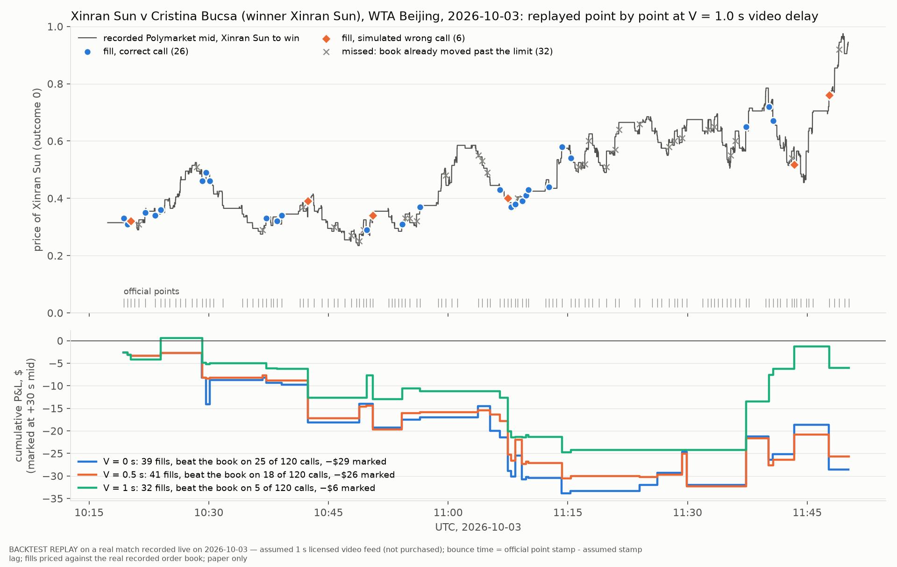
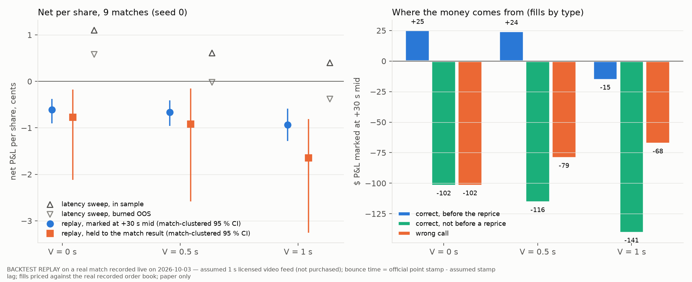
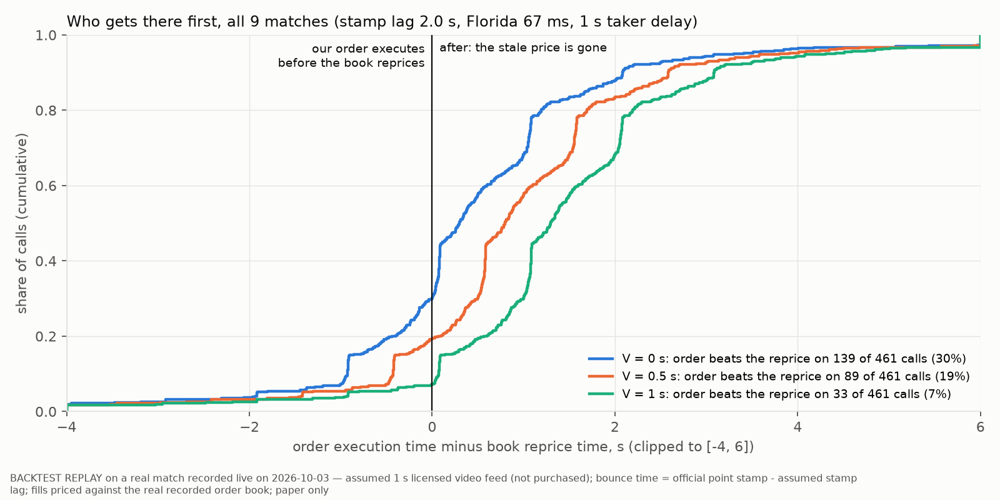
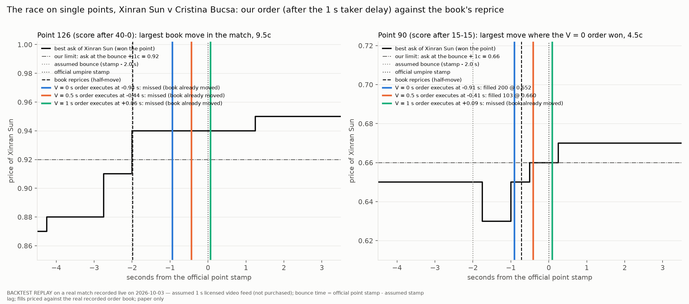

# Match replay: the 1 s video trader on real matches recorded live on 2026-10-03

> **BACKTEST REPLAY on a real match recorded live on 2026-10-03 — assumed 1 s licensed video feed (not purchased); bounce time = official point stamp - assumed stamp lag; fills priced against the real recorded order book; paper only.**
>
> We did not receive, buy or watch any video of these matches. The feed, its 1 s delay, the camera call and its lead are assumed. Real: the official WTA point stamps and winners, the Polymarket order books and trades recorded live today, the venue's 1 s taker delay, the fee and the match results. No order was sent. Protocol, committed before any P&L: `PROTOCOL.md`. **One day, 9 matches, a small sample: this is an illustration and a consistency check against the latency sweep (`research/v2/feed_latency/LATENCY_SWEEP.md`), not new evidence.**

## Bottom line

* **At the headline 1 s feed delay the replayed trader loses money:** 149 fills over the 9 matches, **-0.94c per share** marked at the +30 s mid (match-clustered 95 % CI [-1.28, -0.58]), −$224 marked and −$402 held to the result. Its order executes before the book reprices on only 33 of 461 calls (7%).
* **It still loses at V = 0.5 s and at V = 0** (a camera at the venue): -0.66c and -0.61c per share marked, −$170 and −$179. Faster helps in the right direction: the share of calls that beat the book goes 30% → 19% → 7% from V = 0 to 1 s, and correct-call fills before the reprice go 56 → 39 → 8.
* **Why:** the only fills that make money are correct calls that execute before the reprice (gross edge 1.1-1.2c per share against the +30 s mid at V ≤ 0.5 s, about half the live fast tier's 2.24c; see §2). They are outnumbered by correct calls that land just after a ≤ 1c reprice (the 1c limit lets them through at a roughly fair price, so they pay the fee) and by the simulated wrong calls, which always fill because the loser's price is falling. Because every point is called, the 100-share net cap blocks 214 of 475 calls at 1 s, including 4 of the 5 that beat the book in the selected match.
* **Selected match** (Xinran Sun v Cristina Bucsa, 125 matched points; chosen by the pre-committed rule): at V = 1.0 s the order beats the book on **5 of 120** calls and fills on **0** of them; at V = 0.5 s 18 (6 filled); at V = 0, 25 (9 filled).
* **Consistency with the latency sweep:** same mechanism and same direction (the edge needs the order to beat the reprice, and it shrinks with V), but a lower level than the sweep's in-sample curve (+1.10 / +0.61 / +0.40c), and the gap at V = 0 is larger than sampling noise. The audit explains it (§6): the sweep times the book's reprice on the recorder's receive clock, 66 ms late, and a third of reprices sit at a whole server second, which alone lifts the share of calls before the reprice from 30% to 45% at V = 0 on these same points; and on the sweep's own trade set (moves ≥ 3c, limit at the stale ask) the replay is -0.07c / -0.09c / -0.68c per share, about the sweep's burned-OOS reading, not its in-sample curve. Every one of the 36 sensitivity cells is negative marked; the best is stamp lag 3.0 s at V = 0 (§5).



`results/replay/fig_selected_match.png`: the recorded mid of the selected match, every official point, and the replayed V = 1.0 s trader's fills (blue: correct call; orange: simulated wrong call; grey x: missed because the book had already moved past the limit). Bottom: cumulative marked P&L at V = 0, 0.5 and 1.0 s.

## 1. Headline: 9 matches, stamp lag 2.0 s, model lead, Florida 67 ms, seed 0

| | V = 0 s (venue-camera bound) | V = 0.5 s | **V = 1.0 s (headline)** |
|---|---|---|---|
| replayable official points | 493 | 493 | 493 |
| calls (quoted, inside 5-95c) | 475 | 475 | 475 |
| of which simulated wrong calls | 34 | 34 | 34 |
| calls whose order executes before the book reprices | 139 of 461 (30%) | 89 of 461 (19%) | 33 of 461 (7%) |
| blocked by the 100-share net cap | 224 | 210 | 214 |
| orders sent | 251 | 265 | 261 |
| missed: book already moved past the limit | 79 | 98 | 112 |
| fills (correct / wrong call) | 172 (148 / 24) | 167 (144 / 23) | 149 (128 / 21) |
| fill rate (fills / orders) | 69% | 63% | 57% |
| correct-call fills executed before the reprice | 56 | 39 | 8 |
| shares / $ deployed | 29,561 / $14,742 | 26,217 / $13,019 | 24,398 / $12,287 |
| **net per share, marked at +30 s mid [95 % CI]** | **-0.61c** [-0.90, -0.38] | **-0.66c** [-0.96, -0.41] | **-0.94c** [-1.28, -0.58] |
| **net per share, held to the match result [95 % CI]** | **-0.77c** [-2.12, -0.18] | **-0.92c** [-2.58, -0.15] | **-1.65c** [-3.26, -0.81] |
| **$ P&L, marked / held** | **−$179 / −$229** | **−$170 / −$241** | **−$224 / −$402** |
| win rate of fills, marked / held | 29% / 51% | 29% / 51% | 23% / 49% |
| median (execution - reprice), s | +0.30 | +0.80 | +1.30 |


Per-share net = Σ P&L / Σ shares over fills. CI: 10,000 bootstrap resamples of the matches with at least one fill (8 / 8 / 8 matches at V = 0 / 0.5 / 1.0 s). Win rate counts fills with P&L > 0. Held-to-result P&L is mostly the match result on a ≤ 100-share net position, so it is far noisier than the marked P&L; read the marked figure for the edge.

**20 seeds** (lead draws and wrong calls re-drawn; same books and points): mean ± SD over seeds.

| | V = 0 s | V = 0.5 s | V = 1.0 s |
|---|---|---|---|
| fills | 181.9 ± 7.8 | 176.7 ± 8.5 | 152.8 ± 8.0 |
| wrong-call fills | 13.5 ± 4.6 | 13.3 ± 4.4 | 12.6 ± 4.7 |
| calls beating the book | 142.4 ± 1.8 | 88.5 ± 0.8 | 35.4 ± 1.5 |
| net c/share, marked | -0.53 ± 0.11 | -0.70 ± 0.11 | -0.97 ± 0.09 |
| net c/share, held | -0.82 ± 0.20 | -0.91 ± 0.22 | -1.52 ± 0.27 |
| $ marked | -161 ± 36 | -190 ± 32 | -237 ± 30 |
| $ held | -253 ± 71 | -253 ± 69 | -380 ± 83 |

Seed 0 (the replay shown everywhere) drew 34 wrong calls out of 475 (7%, against 5 % expected), so it sits on the unlucky side of the seed spread; the sign does not change in any of the 20 seeds at any V (marked $ range: V = 0: -226 to -110, V = 0.5: -243 to -132, V = 1: -302 to -196).

## 2. Where the P&L comes from (accounting split of the same fills)

Gross = +30 s mid - fill price; net = gross - fee. Classes: whether the call was correct, and whether the order executed before the book's half-move reprice (`t_book`); "not before a reprice" includes the few fills on points with no matched reprice. This split uses `t_book`, which a trader would not know at the time; it explains the result and is not a trading rule.

| V | fill class | fills | shares | gross c/share | fee c/share | net c/share (marked) | $ marked | $ held |
|---|---|---|---|---|---|---|---|---|
| 0 s | correct, before the reprice | 56 | 9,683 | +1.13 | 0.86 | +0.26 | +$25 | +$337 |
| 0 s | correct, not before a reprice | 92 | 15,683 | +0.23 | 0.90 | -0.65 | −$102 | +$175 |
| 0 s | wrong call | 24 | 4,195 | -1.42 | 1.01 | -2.43 | −$102 | −$741 |
| 0.5 s | correct, before the reprice | 39 | 6,254 | +1.23 | 0.84 | +0.39 | +$24 | +$133 |
| 0.5 s | correct, not before a reprice | 105 | 16,133 | +0.13 | 0.88 | -0.72 | −$116 | +$336 |
| 0.5 s | wrong call | 23 | 3,830 | -1.09 | 0.98 | -2.07 | −$79 | −$710 |
| 1 s | correct, before the reprice | 8 | 1,298 | -0.26 | 0.92 | -1.18 | −$15 | +$57 |
| 1 s | correct, not before a reprice | 120 | 19,404 | +0.10 | 0.85 | -0.72 | −$141 | +$294 |
| 1 s | wrong call | 21 | 3,695 | -0.83 | 1.00 | -1.83 | −$68 | −$752 |

The correct fills that beat the book earn a gross 1.1-1.2c per share at V ≤ 0.5 s, about half of the live fast tier's 2.24c (`research/v2/tier0/RESULTS.md` §1), and keep a few tenths of a cent after the fee. At V = 1 s the few that remain earn nothing. There are too few of them: most correct calls either arrive after the reprice or are blocked by the net cap.



`results/replay/fig_pnl_by_v.png`: left, net per share with match-clustered 95 % CI at V = 0, 0.5, 1.0 s (marked and held), next to the latency sweep's headline-reading curve (in sample and burned OOS; a different trade set). Right, marked $ by fill class.



`results/replay/fig_race.png`: for every call with a matched reprice, our execution time minus the book's reprice time. Left of zero, the stale price is still there when our order executes.

## 3. The selected match, point by point: Xinran Sun v Cristina Bucsa

Selection rule (`PROTOCOL.md` §3): most points with a matched book reprice, ties by earliest start. `wta-su-bucsa-2026-10-02`: 128 official points, 125 matched, first stamp 2026-10-03T10:19:20.000Z, last 2026-10-03T11:50:12.000Z; winner Xinran Sun. Every point is in `results/replay/points.csv` (`selected_match = True`) with its bounce, call, execution and reprice times, the reference and execution prices, the status and the P&L.

| | V = 0 s | V = 0.5 s | V = 1.0 s |
|---|---|---|---|
| calls | 122 | 122 | 122 |
| calls with a matched reprice | 120 | 120 | 120 |
| **calls whose order beats the reprice** | 25 | 18 | 5 |
| blocked by net cap | 58 | 54 | 58 |
| missed (book already moved) | 25 | 27 | 32 |
| fills | 39 | 41 | 32 |
| of which correct calls | 31 | 33 | 26 |
| of which wrong calls | 8 | 8 | 6 |
| **fills that beat the reprice** | 9 | 6 | 0 |
| shares | 6,025 | 4,998 | 3,953 |
| $ marked / held | −$29 / −$11 | −$26 / +$4 | −$6 / −$2 |
| median execution - reprice, s | +0.67 | +1.17 | +1.67 |

**The 5 calls that beat the book at V = 1.0 s:**

| point | score after | point winner | called | execution - reprice (s) | ask at bounce → at execution | status |
|---|---|---|---|---|---|---|
| 4 | 30-30 | Cristina Bucsa | Cristina Bucsa | -17.92 | 0.69 → - | blocked (net cap) |
| 14 | 30-0 | Xinran Sun | Xinran Sun | -0.80 | 0.51 → - | blocked (net cap) |
| 99 | 0-15 | Cristina Bucsa | Cristina Bucsa | -0.96 | 0.33 → - | blocked (net cap) |
| 100 | 15-15 | Xinran Sun | Xinran Sun | -1.31 | 0.63 → 0.67 | missed (book already moved) |
| 101 | 15-30 | Cristina Bucsa | Cristina Bucsa | -8.15 | 0.34 → - | blocked (net cap) |

The large leads (8-18 s) are points where the book's matched reprice comes long after the stamp; the latency write-up flags those as probable mismatches (`research/v2/feed_latency/LATENCY_SWEEP.md` §3). Without those, the 1 s trader beats the book on 3 points of the whole match.



`results/replay/fig_point_race.png`: two points of the selected match with the assumed bounce, the official stamp, the book's reprice and the execution instant at V = 0, 0.5 and 1.0 s, and the result of each order. Left, point 126: the match's largest matched book move among quoted points (9.5c; a rule on the market move). Right, point 90: the largest matched move among points where the V = 0 order filled before the reprice (4.5c; chosen on the replay's own outcome, to show what a won race looks like, so it is not representative).

## 4. Per match (headline V = 1.0 s, and V = 0 for reference)

| match | points | replayable | calls | beat the book | fills (wrong) | c/share marked | $ marked | $ held | V = 0: fills, $ marked |
|---|---|---|---|---|---|---|---|---|---|
| Xinran Sun v Cristina Bucsa (selected) | 128 | 126 | 122 | 5 of 120 | 32 (6) | -0.16 | −$6 | −$2 | 39, −$29 |
| Iva Jovic v Harriet Dart | 191 | 113 | 112 | 2 of 108 | 32 (1) | -0.74 | −$42 | −$61 | 38, −$10 |
| Marie Bouzkova v Kimberly Birrell | 74 | 73 | 72 | 6 of 71 | 25 (6) | -1.55 | −$63 | −$17 | 29, −$49 |
| Sonay Kartal v Xinyu Wang | 60 | 59 | 59 | 7 of 58 | 14 (1) | -1.25 | −$32 | −$66 | 16, −$28 |
| Qinwen Zheng v Anna Kalinskaya | 170 | 51 | 48 | 5 of 46 | 14 (0) | -1.21 | −$29 | −$75 | 18, −$13 |
| Erika Andreeva v Lois Boisson | 42 | 42 | 42 | 8 of 41 | 23 (6) | -0.99 | −$40 | −$72 | 24, −$33 |
| Kamilla Rakhimova v Leylah Fernandez | 181 | 17 | 16 | 0 of 15 | 5 (1) | -0.06 | −$0 | −$8 | 4, −$7 |
| Belinda Bencic v Anastasia Zakharova | 144 | 8 | 0 | 0 of 0 | 0 (0) | - | +$0 | +$0 | 0, +$0 |
| Elena Rybakina v Alina Charaeva | 4 | 4 | 4 | 0 of 2 | 4 (0) | -1.53 | −$11 | −$101 | 4, −$10 |

Recorder coverage starts at 09:46 UTC, so the three early matches (Rakhimova-Fernandez, Bencic-Zakharova, Zheng-Kalinskaya) are mostly unreplayable; Rybakina-Charaeva has only 4 points in the frozen 12:45 UTC snapshot.

## 5. Sensitivity: all 36 cells (seed 0, pooled over the 9 matches)

| V | stamp lag | lead | network | fills | calls beating the book | correct fills before reprice | c/share marked [95 % CI] | $ marked | c/share held | $ held |
|---|---|---|---|---|---|---|---|---|---|---|
| 0 s | 1 s | model | florida | 195 | 33 | 10 | -1.09 [-1.34, -0.88] | −$370 | -1.47 | −$507 |
| 0 s | 1 s | model | london | 209 | 43 | 14 | -1.01 [-1.25, -0.82] | −$369 | -1.42 | −$528 |
| 0 s | 1 s | zero | florida | 195 | 33 | 10 | -1.09 [-1.34, -0.88] | −$370 | -1.47 | −$508 |
| 0 s | 1 s | zero | london | 206 | 39 | 12 | -1.04 [-1.25, -0.87] | −$381 | -1.40 | −$522 |
| 0 s | 2 s | model | florida | 172 | 139 | 56 | -0.61 [-0.90, -0.38] | −$179 | -0.77 | −$229 |
| 0 s | 2 s | model | london | 180 | 164 | 64 | -0.53 [-0.85, -0.26] | −$162 | -0.76 | −$237 |
| 0 s | 2 s | zero | florida | 172 | 138 | 55 | -0.63 [-0.90, -0.40] | −$185 | -0.76 | −$225 |
| 0 s | 2 s | zero | london | 179 | 160 | 60 | -0.55 [-0.88, -0.25] | −$171 | -0.77 | −$241 |
| 0 s | 3 s | model | florida | 227 | 316 | 162 | -0.05 [-0.37, +0.27] | −$19 | -0.01 | −$3 |
| 0 s | 3 s | model | london | 231 | 338 | 165 | -0.08 [-0.38, +0.22] | −$31 | -0.06 | −$21 |
| 0 s | 3 s | zero | florida | 224 | 311 | 159 | -0.07 [-0.38, +0.27] | −$24 | -0.08 | −$29 |
| 0 s | 3 s | zero | london | 227 | 328 | 161 | -0.09 [-0.39, +0.23] | −$34 | -0.11 | −$39 |
| 0.5 s | 1 s | model | florida | 203 | 25 | 6 | -1.05 [-1.28, -0.85] | −$376 | -1.54 | −$562 |
| 0.5 s | 1 s | model | london | 203 | 26 | 6 | -1.05 [-1.28, -0.84] | −$375 | -1.53 | −$561 |
| 0.5 s | 1 s | zero | florida | 205 | 25 | 6 | -1.07 [-1.28, -0.89] | −$389 | -1.48 | −$547 |
| 0.5 s | 1 s | zero | london | 205 | 25 | 6 | -1.07 [-1.28, -0.89] | −$387 | -1.48 | −$545 |
| 0.5 s | 2 s | model | florida | 167 | 89 | 39 | -0.66 [-0.96, -0.41] | −$170 | -0.92 | −$241 |
| 0.5 s | 2 s | model | london | 164 | 92 | 39 | -0.67 [-0.95, -0.44] | −$173 | -0.91 | −$238 |
| 0.5 s | 2 s | zero | florida | 172 | 88 | 39 | -0.61 [-0.93, -0.31] | −$163 | -0.89 | −$241 |
| 0.5 s | 2 s | zero | london | 170 | 92 | 39 | -0.62 [-0.93, -0.32] | −$165 | -0.87 | −$236 |
| 0.5 s | 3 s | model | florida | 208 | 264 | 122 | -0.30 [-0.64, +0.03] | −$97 | -0.33 | −$107 |
| 0.5 s | 3 s | model | london | 211 | 273 | 132 | -0.24 [-0.59, +0.14] | −$78 | -0.29 | −$98 |
| 0.5 s | 3 s | zero | florida | 208 | 262 | 122 | -0.30 [-0.64, +0.03] | −$97 | -0.33 | −$107 |
| 0.5 s | 3 s | zero | london | 211 | 270 | 132 | -0.25 [-0.61, +0.14] | −$81 | -0.30 | −$101 |
| 1 s | 1 s | model | florida | 195 | 16 | 5 | -1.11 [-1.34, -0.90] | −$388 | -1.53 | −$545 |
| 1 s | 1 s | model | london | 196 | 18 | 6 | -1.09 [-1.34, -0.84] | −$381 | -1.53 | −$544 |
| 1 s | 1 s | zero | florida | 196 | 16 | 5 | -1.13 [-1.34, -0.95] | −$401 | -1.46 | −$527 |
| 1 s | 1 s | zero | london | 198 | 18 | 6 | -1.12 [-1.34, -0.92] | −$398 | -1.47 | −$530 |
| **1 s** | 2 s | model | florida | 149 | 33 | 8 | **-0.94** [-1.28, -0.58] | −$224 | -1.65 | −$402 |
| 1 s | 2 s | model | london | 152 | 43 | 14 | -0.95 [-1.32, -0.61] | −$234 | -1.58 | −$397 |
| 1 s | 2 s | zero | florida | 154 | 33 | 8 | -0.87 [-1.25, -0.43] | −$217 | -1.59 | −$403 |
| 1 s | 2 s | zero | london | 153 | 39 | 12 | -0.88 [-1.28, -0.45] | −$222 | -1.57 | −$401 |
| 1 s | 3 s | model | florida | 156 | 140 | 59 | -0.66 [-0.96, -0.35] | −$169 | -0.62 | −$160 |
| 1 s | 3 s | model | london | 161 | 165 | 67 | -0.58 [-0.94, -0.26] | −$160 | -0.63 | −$175 |
| 1 s | 3 s | zero | florida | 156 | 139 | 59 | -0.67 [-0.96, -0.38] | −$172 | -0.63 | −$163 |
| 1 s | 3 s | zero | london | 157 | 161 | 64 | -0.62 [-0.96, -0.30] | −$168 | -0.65 | −$178 |

The stamp lag matters most, as in the sweep: at 1.0 s the book has usually repriced before the assumed bounce, so almost no call beats it; at 3.0 s about two thirds of calls beat it at V = 0 and the result is near zero. The camera lead (0-100 ms) and London co-location (65 ms faster) change little.

## 6. Consistency check against the latency sweep

| | V = 0 | V = 0.5 s | V = 1.0 s |
|---|---|---|---|
| sweep, in sample, net c/share (headline reading) | +1.10 | +0.61 | +0.40 |
| sweep, burned OOS, net c/share | +0.58 | -0.02 | -0.38 |
| replay, net c/share marked [CI] | -0.61 [-0.90, -0.38] | -0.66 [-0.96, -0.41] | -0.94 [-1.28, -0.58] |
| sweep, in sample: calls before the reprice | 44 % | 19 % | 14 % |
| replay: calls that beat the reprice | 30% | 19% | 7% |
| sweep, in sample: fill rate (filled correct calls / calls; all before the reprice) | 25 % | 11 % | 8 % |
| replay: correct-call fills before the reprice / calls | 12% | 8% | 2% |
| replay: all correct-call fills / calls (incl. ≤ 1c after the reprice) | 31% | 30% | 27% |

**Consistent:** in both, money is made only by correct calls that execute before the reprice; the share of such calls falls with V; the stamp lag dominates. **Not consistent in level, and not within sampling noise:** at V = 0 the replay's CI lies below the sweep's in-sample CI (+0.82 to +1.38c). The audit (`scripts/match_replay_check.py`, `results/replay/audit.json`) splits the gap into three parts.

1. **Clock convention of the reprice (explains the share of calls before the reprice).** The sweep's R is `book_vs_T_s` from `m1_points.csv`, i.e. the reprice on the recorder's *receive* clock; the venue repriced 66 ms earlier. The sweep also uses a 10-140 ms venue network (Europe 10 ms) where the replay uses 67 ms (Florida). That would not matter if reprices were spread evenly, but 35% of the matched reprices fall within 40 ms after a whole server second (6 % if uniform), right where a V = 0 order lands (stamp − 2 s + 1.087 s). On the same 461 points the share of calls before the reprice is 30% / 19% / 7% (V = 0 / 0.5 / 1 s) with the replay's convention and 45% / 21% / 15% with the sweep's (10 ms; 40 ms gives 44% / 20% / 15%), which reproduces the sweep's 44 / 19 / 14 %. The 66 ms is a credit the real book does not give: executing at the sweep's earlier instants against the recorded book gives -0.54c / -0.65c / -0.94c per share marked, about the replay's own. This is an optimistic bias in the sweep (`src/tier0.py` uses R as is), flagged to its owners; it is outside this replay's files.

2. **Trade set (explains most of the level).** Same replay, same books, as labelled variants: limit at the stale ask instead of +1c: -0.49c / -0.54c / -0.80c; only points whose matched book move is ≥ 3c (the sweep's live pool): -0.28c / -0.31c / -0.73c; both, i.e. the sweep's trade set: -0.07c / -0.09c / -0.68c on 59 / 49 / 32 fills (−$5 / −$5 / −$27 marked). Against the headline (-0.61c / -0.66c / -0.94c), calling every point instead of the ≥ 3c moves costs 0.33 / 0.35 / 0.20c per share and the +1c limit 0.12 / 0.12 / 0.13c. The move filter uses the realised move (hindsight), as the sweep's historical jump table does.

3. **What is left is the sweep's pricing model.** On its own trade set the replay is near zero at V ≤ 0.5 s and negative at 1 s, below the sweep's in-sample curve (+1.10 / +0.61 / +0.40c) and close to its burned-OOS reading (+0.58 [−0.08, +1.21] / −0.02 / −0.38c). The sweep prices fills from a measured edge curve and a 50 % share of the stale depth; the replay walks the recorded book. The variants are a few dozen fills on 7 matches, so they locate the gap but do not measure it precisely.


## 7. What this does not show

* **No video.** No feed was bought, received or watched. V, the CV call, its lead and its 95 % precision are assumptions from the tier-0 model.
* **The bounce time is not observed.** It is the official stamp minus an assumed 1-3 s lag. Every number moves with that assumption (§5).
* **One day, 9 WTA matches, mostly WTA 1000 Beijing**, about 500 replayable points. The CIs are over 9 matches and are wide; a different day can differ.
* **Our orders do not move the book.** The real fast tier is already in the recording; we take what it left. We do not model being seen by makers.
* **Costs not deducted:** a feed licence, colocation, data.
* **The venue's matching clock is assumed continuous.** The recorded prints say otherwise: 90% of the 6,710 recorded prints of these 9 markets carry a server time in the first 100 ms of a second (76% in the first 50 ms; 10 % and 5 % if uniform), while book updates are spread evenly. Delayed marketable orders appear to be matched in whole-second batches, which the venue does not document. If our order matched at the first whole second at or after arrival + 1 s, the replay would be worse: -0.74c to -0.97c per share at V = 0 and -0.98c to -1.02c at 1 s (our order first or last in the batch), and V = 0 and 0.5 s would mostly land in the same batch. The headline keeps the protocol's continuous 1 s delay; a live test order is the only way to settle this.
* **Same data as the sweep's inputs.** The reprice times and books that parameterise the sweep come from this day, so agreement is a consistency check, not an independent test.

## 8. How to describe this in the paper

Accurate: *"We replay the trader on 9 WTA matches recorded live on 2026-10-03. For every official point we take the umpire's timestamp, assume the ball landed 2 s earlier, and assume a licensed video feed delivers it 1 s later (0 and 0.5 s as bounds). The simulated order is priced against the real Polymarket order book recorded at the instant it would have executed, after the venue's 1 s taker delay. We did not buy or receive match video."* Not accurate, and not to be written: that we received Polymarket or match footage over WebRTC (or any other way), that the replay used live video, or that the trader made money. A faster licensed feed is the stated limitation: the replay shows what a faster feed would have to beat (the reprice), not that one exists at a price that pays.

## Deviations from the protocol

**D1 (after the audit; data validity, not a trading rule).** The protocol's replayability rule (a recorded message for the market within 60 s before execution) let orders execute while the recorder was disconnected. The recorder's own receive stream has 33 gaps longer than 1 s (115 s in all: a 2.0-2.6 s resubscribe every 10 minutes and a 47 s outage at 11:12:51-11:13:39 UTC); the next-longest gap is 0.22 s at the 99.99th percentile. Inside a gap the book is not observed. In the protocol-literal run, 2 fills per V executed inside the 47 s outage on a book 7-19 s old (Sun v Bucsa point 76, Jovic v Dart point 174), 4 reference prices were read inside gaps, and 3-4 fills were marked at a +30 s mid inside a gap. Now a point whose reference or execution instant falls inside a gap is `no book recorded` (`no_book_reason` in `points.csv`), and a +30 s mark inside a gap is not taken (the fill is held, not marked). 7 of 500 replayable points drop out. The effect is small and does not change any sign:

| | literal fills | literal c/share marked | literal $ marked | literal $ held | fills | c/share marked | $ marked | $ held |
|---|---|---|---|---|---|---|---|---|
| V = 0 s | 174 | -0.61c | −$181 | −$213 | 172 | -0.61c | −$179 | −$229 |
| V = 0.5 s | 169 | -0.65c | −$174 | −$226 | 167 | -0.66c | −$170 | −$241 |
| V = 1 s | 151 | -0.92c | −$229 | −$387 | 149 | -0.94c | −$224 | −$402 |

Nothing else in the trading rule, the cells, the seeds or the statistics changed.

Additions after P&L was seen, all descriptive: the accounting split of §2 (uses `t_book`, which is hindsight), the figures (the example points in `fig_point_race.png` are chosen by stated display rules, one of them on the replay's outcome), the per-match V = 0 column in §4, and the audit diagnostics of §6 and §9 (variants, not choices: none of them replaces the headline).

## 9. Independent audit

`scripts/match_replay_check.py` does not import the replay. It re-reads the raw recording with its own parser, rebuilds both tokens' books with its own code from the text of `PROTOCOL.md` §4, re-runs the three headline cells, and writes `results/replay/audit.json` and `audit_handcheck.csv`.

* **Rebuilt book vs the server's own top of book:** after 3,111,836 of 3,117,394 price_change messages (99.82%) the rebuilt best bid and ask equal the `best_bid` / `best_ask` the server put in the message; the rest sit at reconnect snapshots and same-millisecond bursts.

* **Row by row:** status, reference ask, ask at execution, shares, VWAP, fee, held and marked P&L are identical to `points.csv` on all 994 points at V = 0, 0.5 and 1 s; pooled fills and $ match `replay.json` exactly (largest difference 0). Timing arithmetic is identical: reference instant ≤ call − 67 ms and ≤ the landing frame (no look-ahead), execution = call + 67 ms + 1.000 s.

* **Fills:** none above its limit, none below the best ask at execution; the ask at execution equals the server's own best ask (last `best_bid_ask` / `price_change` field at or before the instant) on every fill and on 99.2%+ of orders. Oldest book at an execution instant: 1.07 s (after D1). One fill per V executes on a rebuilt book whose token-0 bid equals its ask (Sun v Bucsa point 67, a stale 0.40 bid); the server's best ask confirms the 0.40 fill price.

* **Wrong calls:** 34 of the calls are simulated wrong calls (seed 0), traded like any other: 24 / 23 / 21 fills at V = 0 / 0.5 / 1 s.

* **Hand check of 10 points** (rule: rng(20261003) draw within strata: V=1 3 correct fills, 2 wrong fills, 3 misses, 1 net-cap block; V=0 1 correct fill before the reprice): 10 of 10 agree on the reference ask, the ask at execution and the fill, by the rebuilt book and by the server's own best ask. `audit_handcheck.csv` lists each with the raw ask messages around the execution instant.

* **Protocol before P&L:** `PROTOCOL.md` was committed at 17:14:49 EDT (0e083ed) and is unchanged since; the first parse of the recording is 17:18:59 and the first outputs 17:27:45. The selection rule applied to `m1_points.csv` gives Sun v Bucsa (125 of 128 matched; next Jovic v Dart, 110). `PROTOCOL.md` cites the sweep at `research/v2/tier0/LATENCY_SWEEP.md`; the file moved to `research/v2/feed_latency/` in 84c3898 (the protocol is left as committed).

* **Labels:** every output carries the BACKTEST REPLAY label: a `label` column (`points.csv`, `seed_robustness.csv`, `audit_handcheck.csv`), a `label` key (`replay.json`, `audit.json`), a `#` header line (the other CSVs), a footer on every figure, and the ribbon, title card and footer of the video.

* **Not fixed here (outside this replay's files):** the sweep's receive-clock reprice time (§6, item 1) and the whole-second batch question (§7) belong to `src/tier0.py` and `research/v2/feed_latency/LATENCY_SWEEP.md`; numbers quoted elsewhere from the protocol-literal run (−0.92c, −$229, −$387, 6 of 121) are superseded by the D1 table above.


## Reproduce

```bash
.venv/bin/python scripts/match_replay.py          # ~2-3 min: parses the recording, replays 93 cells, writes everything
.venv/bin/python scripts/match_replay_check.py    # ~1 min: independent audit -> results/replay/audit.json, audit_handcheck.csv
.venv/bin/python scripts/match_replay.py --figures-only   # redraw figures + this file (reads audit.json)
.venv/bin/python scripts/match_replay_extras.py && .venv/bin/python scripts/match_replay_figs.py && .venv/bin/python scripts/match_replay_video.py
```

Recording lines scanned: 5,637,459. Receive latency (local receive - server timestamp) median 66 ms (p10-p90 63-109 ms); token 1's best ask equals 1 - token 0's best bid at 99.98% of captured instants (the two books mirror each other).

Outputs in `results/replay/`: `replay.json` (label, model, matches, every cell overall and per match, seed summary, selected-match story), `points.csv` (every official point of the 9 matches at V = 0, 0.5, 1.0 s, headline settings, seed 0), `seed_robustness.csv`, `selected_match_book.csv` (top of book every 250 ms), `fig_selected_match.png`, `fig_point_race.png`, `fig_race.png`, `fig_pnl_by_v.png`.
