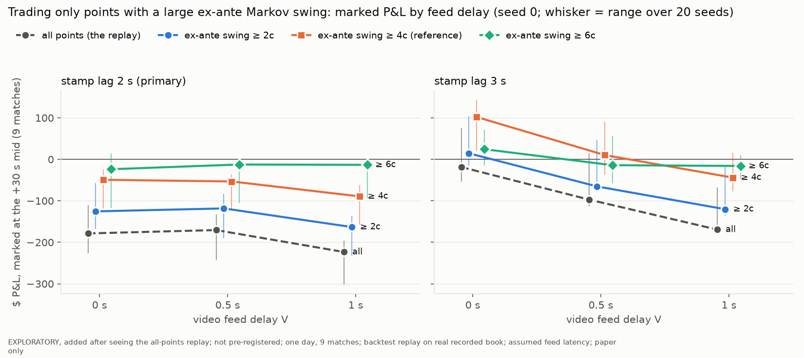

# Match replay, selective variant: trade only points with a large ex-ante swing

> **EXPLORATORY, added after seeing the all-points replay; not pre-registered; one day, 9 matches; backtest replay on real recorded book; assumed feed latency; paper only.**
>
> Same caveats as the replay (`RESULTS.md`): no video was received, bought or watched; the feed, its delay V, the
> CV call and its lead are assumed; the bounce is the official stamp minus an assumed lag. Real: the official WTA
> point stamps and winners, the Polymarket books recorded live on 2026-10-03, the venue delay, the fee, the results.
> No order was sent. Use of the forward recording is logged in `results/oos_peeks.log`.

## Conclusion

**Plain answer: picking points by their ex-ante Markov swing does not rescue the 1 s video trader. At the primary
stamp lag (2.0 s) it still loses at every T and every V; it loses less mostly because it trades less.**

* **Primary stamp lag 2.0 s: 9 of 9 selective cells lose money marked** (seed 0), and no
  selective cell is positive in more than 1 of 20 seeds. At the headline V = 1 s: all points
  149 fills, -0.94c per share, −$224 marked;
  T = 2c 114 fills, -0.92c, −$163;
  **T = 4c (reference) 63 fills, -0.95c [-1.64, -0.40],
  −$89**; T = 6c 33 fills, -0.26c [-1.35, +0.53],
  −$13 (20-seed mean -0.70c). The
  smaller dollar losses come from fewer fills; per share, the filter helps at V = 0 (all points -0.61c,
  T = 4c -0.37c, T = 6c -0.36c) and not at 1 s for T ≤ 4c.
* **Stamp lag 3.0 s (the optimistic sensitivity): T = 4c makes money at V = 0** (130 fills,
  +0.55c [+0.09, +1.14], +$102 marked; positive in
  20 of 20 seeds), is about zero at V = 0.5 s (+0.06c, 17 of 20
  seeds positive) and loses at V = 1 s (-0.42c [-0.92, +0.39], 4 of 20).
  This is the only selective cell whose marked CI excludes zero from above, out of 18 selective cells (3 T × 3 V × 2
  lags), and it sits at the stamp lag that gives the trader the most time; at the same lag every T loses at V = 1 s.
* **The ex-ante swing does find the points the book moves on.** Over the 493 replayable points
  its Spearman correlation with the size of the realised book move is
  +0.78; T = 4c keeps 162 of the
  170 points whose book moved ≥ 4c, plus as many smaller ones (half of the
  324 eligible points moved ≥ 4c). So a set close to the sweep's "≥ 4c jumps" can be chosen without
  hindsight, at about twice the size. On this day the selection is not what sinks the 1 s trader; the feed delay is.
  The filter amplifies an
  edge only where the order already beats the reprice often (V = 0 with a 3 s lag: about two thirds of calls); at V = 1 s
  and lag 2 s only 5% of T = 4c calls beat the book.
* **Traded vs not traded (diagnostic, hindsight):** at T = 4c, V = 1 s, lag 2 s the filled points' realised move has
  median +3.0c vs +3.0c for
  every other replayable point (≥ 4c: 35% vs
  34%); at T = 6c +4.5c vs
  +3.0c. At T = 4c the points that fill at 1 s move no more than the
  rest; at T = 6c they move more, and still lose per share.
* **Held-to-result P&L** is positive in several selective cells (e.g. T = 4c, lag 2 s, V = 0.5 s:
  +$131 held against −$53 marked). It is mostly the
  match result on a ≤ 100-share net position, so it is noise for this question; read the marked figure.
* **What this is:** EXPLORATORY, added after seeing the all-points replay; not pre-registered; one day, 9 matches; backtest replay on real recorded book; assumed feed latency; paper only. 18 selective cells on one day; the reading above is descriptive, and no T is chosen.
  A separate data issue for the replay's owners (not fixed here): m1's `winner` column disagrees with the official
  score on 27 of 994 points (§5); it moves 1-3 fills per cell and a few
  dollars marked, so it changes no sign.



`results/replay/selective/fig_selective.png`: marked $ P&L over the 9 matches at V = 0, 0.5, 1 s for each T and
for all points (seed 0; whisker = min to max over the 20 seeds). Left: stamp lag 2.0 s (primary); right: 3.0 s.

## 1. Results, stamp lag 2.0 s (primary), seed 0

| T | V | eligible points (replayable) | calls | fills (wrong) | calls beating the book | c/share marked [95% CI] | c/share held [95% CI] | $ marked | $ held | realised move c, traded / not (median) |
|---|---|---|---|---|---|---|---|---|---|---|
| all points | 0 s | 994 (493) | 475 | 172 (24) | 139 of 461 (30%) | -0.61 [-0.90, -0.38] | -0.77 [-2.12, -0.18] | −$179 | −$229 | +2.0 / +3.0 |
| all points | 0.5 s | 994 (493) | 475 | 167 (23) | 89 of 461 (19%) | -0.66 [-0.96, -0.41] | -0.92 [-2.58, -0.15] | −$170 | −$241 | +2.0 / +3.0 |
| all points | 1 s | 994 (493) | 475 | 149 (21) | 33 of 461 (7%) | -0.94 [-1.28, -0.58] | -1.65 [-3.26, -0.81] | −$224 | −$402 | +2.0 / +3.0 |
| ≥ 2c | 0 s | 451 (444) | 431 | 140 (21) | 121 of 421 (29%) | -0.55 [-0.91, -0.22] | -0.10 [-0.56, +0.31] | −$125 | −$23 | +2.5 / +3.0 |
| ≥ 2c | 0.5 s | 451 (444) | 431 | 134 (20) | 78 of 421 (19%) | -0.61 [-1.02, -0.23] | -0.18 [-1.05, +0.38] | −$118 | −$37 | +2.5 / +3.0 |
| ≥ 2c | 1 s | 451 (444) | 431 | 114 (18) | 28 of 421 (7%) | -0.92 [-1.35, -0.49] | -1.04 [-2.09, -0.24] | −$163 | −$190 | +2.0 / +3.0 |
| ≥ 4c (ref) | 0 s | 329 (324) | 314 | 88 (11) | 75 of 309 (24%) | -0.37 [-0.75, +0.11] | +0.46 [-0.13, +1.43] | −$49 | +$62 | +3.0 / +2.5 |
| ≥ 4c (ref) | 0.5 s | 329 (324) | 314 | 81 (10) | 49 of 309 (16%) | -0.50 [-0.93, -0.10] | +1.22 [+0.54, +2.14] | −$53 | +$131 | +3.0 / +3.0 |
| ≥ 4c (ref) | 1 s | 329 (324) | 314 | 63 (9) | 14 of 309 (5%) | -0.95 [-1.64, -0.40] | -0.68 [-2.03, +0.45] | −$89 | −$64 | +3.0 / +3.0 |
| ≥ 6c | 0 s | 192 (188) | 179 | 48 (5) | 32 of 174 (18%) | -0.36 [-0.99, -0.09] | +0.57 [-2.29, +4.40] | −$24 | +$38 | +4.2 / +2.5 |
| ≥ 6c | 0.5 s | 192 (188) | 179 | 47 (5) | 23 of 174 (13%) | -0.22 [-0.91, +0.20] | +0.88 [-3.43, +5.35] | −$12 | +$49 | +4.0 / +2.7 |
| ≥ 6c | 1 s | 192 (188) | 179 | 33 (4) | 8 of 174 (5%) | -0.26 [-1.35, +0.53] | +0.05 [-4.18, +4.30] | −$13 | +$2 | +4.5 / +3.0 |

Eligible points: all points of the 9 matches with swing ≥ T (in brackets, those the replay can price). Calls:
eligible, replayable, quoted inside 5-95c. Calls beating the book: execution before the book's matched reprice
(`t_book`), of the calls that have one. CI: match-clustered bootstrap, 10,000 resamples of the matches with a fill
(`match_replay.cluster_ci`). Realised move: `m1_points.D`, the outcome-0 mid's move in the point winner's direction
across the point, of the filled points vs every other replayable point (the not-traded side includes the points the
filter removed). Diagnostic only: it is hindsight.

## 2. Stamp lag 3.0 s, seed 0

| T | V | eligible points (replayable) | calls | fills (wrong) | calls beating the book | c/share marked [95% CI] | c/share held [95% CI] | $ marked | $ held | realised move c, traded / not (median) |
|---|---|---|---|---|---|---|---|---|---|---|
| all points | 0 s | 994 (494) | 471 | 227 (21) | 316 of 457 (69%) | -0.05 [-0.37, +0.27] | -0.01 [-1.13, +0.67] | −$19 | −$3 | +2.5 / +3.0 |
| all points | 0.5 s | 994 (492) | 467 | 208 (26) | 264 of 453 (58%) | -0.30 [-0.64, +0.03] | -0.33 [-1.51, +0.40] | −$97 | −$107 | +2.5 / +3.0 |
| all points | 1 s | 994 (491) | 466 | 156 (25) | 140 of 452 (31%) | -0.66 [-0.96, -0.35] | -0.62 [-2.14, +0.28] | −$169 | −$160 | +2.0 / +3.0 |
| ≥ 2c | 0 s | 451 (446) | 429 | 197 (19) | 284 of 419 (68%) | +0.05 [-0.30, +0.47] | +0.57 [+0.03, +1.30] | +$14 | +$170 | +3.0 / +3.0 |
| ≥ 2c | 0.5 s | 451 (444) | 425 | 178 (24) | 233 of 415 (56%) | -0.25 [-0.65, +0.23] | +0.25 [-0.33, +1.07] | −$65 | +$66 | +3.0 / +3.0 |
| ≥ 2c | 1 s | 451 (443) | 424 | 125 (23) | 122 of 414 (29%) | -0.62 [-1.03, -0.18] | +0.16 [-0.64, +1.22] | −$120 | +$32 | +2.5 / +3.0 |
| ≥ 4c (ref) | 0 s | 329 (324) | 310 | 130 (8) | 200 of 305 (66%) | +0.55 [+0.09, +1.14] | +1.59 [+1.09, +2.90] | +$102 | +$292 | +3.5 / +2.5 |
| ≥ 4c (ref) | 0.5 s | 329 (323) | 307 | 119 (13) | 159 of 302 (53%) | +0.06 [-0.54, +0.79] | +1.17 [+0.58, +2.71] | +$10 | +$190 | +3.5 / +2.5 |
| ≥ 4c (ref) | 1 s | 329 (323) | 307 | 72 (11) | 76 of 302 (25%) | -0.42 [-0.92, +0.39] | +0.95 [-0.71, +3.36] | −$44 | +$99 | +3.0 / +3.0 |
| ≥ 6c | 0 s | 192 (189) | 178 | 69 (5) | 106 of 173 (61%) | +0.32 [-0.46, +1.51] | +3.19 [+2.18, +5.78] | +$24 | +$254 | +4.0 / +2.5 |
| ≥ 6c | 0.5 s | 192 (188) | 174 | 56 (9) | 78 of 169 (46%) | -0.21 [-1.31, +1.17] | +3.06 [+1.29, +6.45] | −$14 | +$204 | +4.0 / +2.5 |
| ≥ 6c | 1 s | 192 (188) | 174 | 29 (6) | 33 of 169 (20%) | -0.45 [-0.94, +0.07] | +5.06 [+0.85, +16.04] | −$16 | +$178 | +4.0 / +3.0 |

## 3. 20 seeds (mean ± SD over seeds 0-19)

Stamp lag 2.0 s:

| T | V | fills | calls beating the book | c/share marked | $ marked | $ held | seeds with $ marked > 0 |
|---|---|---|---|---|---|---|---|
| all points | 0 s | 181.9 ± 7.8 | 142.4 ± 1.8 | -0.53 ± 0.11 | -161 ± 36 | -253 ± 71 | 0 of 20 |
| all points | 0.5 s | 176.7 ± 8.5 | 88.5 ± 0.8 | -0.70 ± 0.11 | -190 ± 32 | -253 ± 69 | 0 of 20 |
| all points | 1 s | 152.8 ± 8.0 | 35.4 ± 1.5 | -0.97 ± 0.09 | -237 ± 30 | -380 ± 83 | 0 of 20 |
| ≥ 2c | 0 s | 154.7 ± 7.2 | 124.1 ± 1.8 | -0.46 ± 0.13 | -114 ± 34 | -75 ± 70 | 0 of 20 |
| ≥ 2c | 0.5 s | 148.9 ± 8.2 | 77.5 ± 0.8 | -0.63 ± 0.12 | -138 ± 30 | -70 ± 69 | 0 of 20 |
| ≥ 2c | 1 s | 124.7 ± 7.2 | 30.1 ± 1.3 | -0.92 ± 0.11 | -178 ± 28 | -192 ± 79 | 0 of 20 |
| ≥ 4c | 0 s | 97.1 ± 5.7 | 78.5 ± 1.8 | -0.43 ± 0.20 | -63 ± 29 | +30 ± 65 | 0 of 20 |
| ≥ 4c | 0.5 s | 88.7 ± 5.2 | 48.4 ± 0.6 | -0.66 ± 0.20 | -77 ± 25 | +68 ± 53 | 0 of 20 |
| ≥ 4c | 1 s | 65.8 ± 5.0 | 15.6 ± 0.9 | -1.07 ± 0.21 | -105 ± 27 | -61 ± 76 | 0 of 20 |
| ≥ 6c | 0 s | 49.9 ± 3.2 | 33.9 ± 1.3 | -0.49 ± 0.33 | -35 ± 27 | +54 ± 59 | 1 of 20 |
| ≥ 6c | 0.5 s | 47.5 ± 3.7 | 23.0 ± 0.0 | -0.63 ± 0.33 | -38 ± 23 | +44 ± 49 | 0 of 20 |
| ≥ 6c | 1 s | 33.0 ± 3.2 | 8.6 ± 0.5 | -0.70 ± 0.35 | -36 ± 22 | +12 ± 49 | 0 of 20 |

Stamp lag 3.0 s:

| T | V | fills | calls beating the book | c/share marked | $ marked | $ held | seeds with $ marked > 0 |
|---|---|---|---|---|---|---|---|
| all points | 0 s | 225.3 ± 8.1 | 314.4 ± 1.5 | +0.02 ± 0.10 | +5 ± 37 | -43 ± 68 | 9 of 20 |
| all points | 0.5 s | 210.9 ± 7.1 | 263.1 ± 1.0 | -0.14 ± 0.12 | -49 ± 40 | -132 ± 64 | 3 of 20 |
| all points | 1 s | 163.5 ± 6.9 | 143.4 ± 1.8 | -0.47 ± 0.13 | -126 ± 34 | -278 ± 75 | 0 of 20 |
| ≥ 2c | 0 s | 197.7 ± 7.4 | 283.2 ± 1.5 | +0.12 ± 0.11 | +35 ± 34 | +120 ± 69 | 17 of 20 |
| ≥ 2c | 0.5 s | 183.4 ± 6.0 | 232.2 ± 1.0 | -0.06 ± 0.13 | -17 ± 37 | +29 ± 62 | 7 of 20 |
| ≥ 2c | 1 s | 136.3 ± 6.1 | 125.2 ± 1.8 | -0.37 ± 0.15 | -80 ± 33 | -100 ± 75 | 0 of 20 |
| ≥ 4c | 0 s | 133.9 ± 6.2 | 198.9 ± 1.6 | +0.45 ± 0.17 | +86 ± 31 | +222 ± 57 | 20 of 20 |
| ≥ 4c | 0.5 s | 124.8 ± 4.8 | 160.2 ± 1.0 | +0.19 ± 0.19 | +31 ± 32 | +153 ± 49 | 17 of 20 |
| ≥ 4c | 1 s | 79.5 ± 4.9 | 79.6 ± 1.8 | -0.27 ± 0.25 | -32 ± 29 | +9 ± 73 | 4 of 20 |
| ≥ 6c | 0 s | 68.0 ± 5.0 | 104.2 ± 1.4 | +0.47 ± 0.29 | +37 ± 22 | +223 ± 50 | 19 of 20 |
| ≥ 6c | 0.5 s | 59.0 ± 4.1 | 78.8 ± 0.8 | +0.20 ± 0.34 | +13 ± 24 | +192 ± 46 | 16 of 20 |
| ≥ 6c | 1 s | 35.1 ± 3.0 | 35.0 ± 1.3 | -0.35 ± 0.35 | -16 ± 16 | +106 ± 54 | 4 of 20 |

## 4. Does the ex-ante swing pick the points the book moves on? (diagnostic)

Replayable points (stamp lag 2.0 s, V = 1 s): 493, of which 489 have an ex-ante
swing. Swing quantiles (p10 / p25 / median / p75 / p90): 2.1 / 3.4 / 5.0 /
7.5 / 10.2c. Spearman correlation of the ex-ante swing with the size of the realised book move
|D|: +0.78 (n 489).

| T | eligible / not (replayable) | realised move, eligible: median c (share ≥ 4c) | realised move, not eligible: median c (share ≥ 4c) | realised ≥ 4c points that pass the filter |
|---|---|---|---|---|
| ≥ 2c | 444 / 49 | +3.0 (38%, n 444) | +1.0 (4%, n 49) | 168 of 170 |
| ≥ 4c | 324 / 169 | +3.7 (50%, n 324) | +2.0 (5%, n 169) | 162 of 170 |
| ≥ 6c | 188 / 305 | +4.5 (73%, n 188) | +2.0 (10%, n 305) | 138 of 170 |

## 5. Checks

* **All-points cells reproduce the committed replay** (`results/replay/replay.json`, same fills and $ to the cent at
  both lags and every V): yes. The filter is the only change.
* **Score reconstruction:** the score before each point, rebuilt point by point with `src/markov.py`'s scoring
  rules, disagrees with `m1_points.csv`'s set, game and previous point-score columns on
  0 of 994 points (deviation S1).
* **No look-ahead in the filter:** the pre-point instant is ≥ 10 s before the
  earliest assumed bounce of the point (smallest gap between consecutive stamps minus 3 s lag minus 2 s); the score and
  the server belief use only earlier points; the replay's own reference price is read later, at the bounce, as before.
* **Where the swing's price came from** (all 994 points): no price yet: 498, pre-point mid: 490, carried from an earlier point: 6.
* **m1's `winner` column vs the official score:** on 27
  of 994 points the `winner` column of `m1_points.csv` (the replay's call direction) disagrees with the change in
  the official score: back-to-deuce points, where it names the player who had the advantage, and 9 tiebreak points
  of two early matches. The score is right where it can be checked: on the
  8
  of them with a recorded book the mid's move in m1's winner direction was
  -2.0, +0.0, -1.3, -5.0, -4.0, -4.5, -3.0, -6.0c
  (against m1's winner, or flat).
  This variant keeps the replay's direction unchanged (it uses the score only for the swing); fills on those points:
  2 at the headline cell
  (+$5 marked), 1-3 in every cell. The
  fix belongs to `research/v2/latency/load.py` (`_derive_pw`) and the replay; it is outside these files.
* **Score knowledge is assumed.** The official point-by-point feed reached our poller 1-2 minutes late on this day
  (`m1_points.pbp_delay_s`); a live trader would need the score from the video itself or a faster feed. The
  server is not observed (belief only).

## 6. Deviation from the declaration

**S1 (bug fix, before any P&L of this variant was read).** The declaration rebuilt the score "from the official
winners of the match's earlier points", i.e. m1's `winner` column. The first run's own consistency check showed
that score disagreeing with m1's official set / game / point-score columns on 447 of 963 points: one wrong
back-to-deuce winner shifts the rebuilt score for the rest of the match, and 31 points fell after a spurious match
end. The score is now rebuilt from the official score columns (the point winner is the side whose score moved;
`score_winner()`), and the check passes on all 994 points. The first run's outputs were overwritten; only its console
log and its per-point score file were read, no P&L. T, the swing, the pre-point instant, the cells and the replay are as declared.

## 7. Declaration (committed before the first run)

Declared in this file and in `scripts/match_replay_selective.py` (constants block) and committed before the
first run. The design was written after the all-points replay's P&L had been seen, so it is exploratory.

* **Filter.** Trade an official point only if its **ex-ante Markov swing** is ≥ T, **T ∈ {2c, 4c, 6c}**;
  **4c is the reference** (the latency sweep's ≥ 4c jump detector, `src/tier0.py` `JUMP_MIN`). Points below T
  are removed before the replay: no call, no order, no use of the net cap.
* **Swing.** |P(A wins the match | A wins the point) − P(A wins the match | B wins the point)| from
  `src/markov.py`, women's best of 3 with 7-point tiebreaks (`Format()`, as `engine/run.py`), computed through
  `engine/fair/value.py` `MatchFair`: the score before the point is rebuilt from the official winners of the
  match's earlier points; the server is not in the data, so the belief starts at 0.5 and is Bayes-updated
  after every point (`MatchFair.apply_point`); the serve/return point-win probabilities are refit
  (`MatchFair.recalibrate`, tour WTA) so that fair value at that score equals the outcome-0 mid at the
  **pre-point instant = the previous point's official stamp + 2 s** (first point of a match: its stamp − 30 s).
  A mid is usable if a book snapshot was seen, its spread is ≤ 10c (the engine's `max_spread`), the market had
  a message in the last 60 s and the instant is not inside a recorder outage; otherwise the match's last
  calibration is kept, and a point with no calibration yet is not eligible.
* **Everything else unchanged** from `scripts/match_replay.py` (imported, not copied): stamp lag **2.0 s
  primary, 3.0 s** also; **V ∈ {0, 0.5, 1.0} s**; model CV lead; Florida 67 ms; **20 seeds** (0-19; seed 0 is
  the shown replay and carries the CIs); net cap 100 shares per match; limit = stale (reference) ask + 1c;
  wrong calls 5 % (precision 0.95); 1 s taker delay; fee; +30 s mark; hold to result; outage rule D1.
* **Reported** per T × V × lag: points eligible, calls, fills, share of calls beating the book, net per share
  marked and held with the match-clustered 95 % CI, $ P&L marked and held, 20-seed mean ± SD, and as a
  diagnostic the realised book move (`m1_points.D`) of traded vs not-traded points. The all-points cells are
  reported alongside and must reproduce `results/replay/replay.json`.

## Reproduce

```bash
.venv/bin/python scripts/match_replay_selective.py --cache /path/outside/the/repo.pkl   # ~5-8 min
.venv/bin/python scripts/match_replay_selective.py --doc-only                          # figure + this file
```

Outputs in `results/replay/selective/`: `selective.json` (label, declaration, every T × lag × V cell at seed 0 with
CIs and per match, 20-seed summaries, swing diagnostics, reproduction check), `points_swing.csv` (each point's
pre-point state, server belief, pre-point mid, calibrated serve probabilities, ex-ante swing and eligibility),
`fig_selective.png`.
