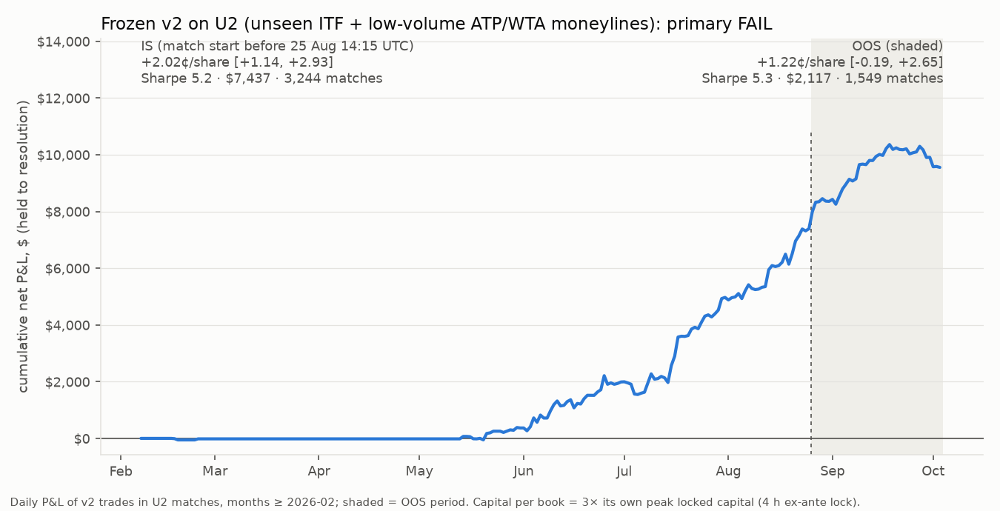

# U2 out-of-universe test of frozen v2: results

Pre-registration: `research/v2/expand/PREREG.md` (commit 337bf7c). Ran once, at
2026-10-03 17:31:29 UTC, with `python scripts/expand_test.py` (implementation:
`research/v2/expand/expand_test.py`). The run took 104 s. Stdout is in `results/expand/run.log`,
numbers are in `results/expand/results.json`, the figure is `results/expand/u2_equity.png` and the
trades are in `data/expand_v2_trades.parquet`. The run is logged in `results/oos_peeks.log` and
`research/v2/expand/RUN_LOG`. Nothing in the pre-registration was changed, so there is no
DEVIATIONS.md.

## Verdict: FAIL

| period | U2 net P&L per share, held to resolution | 95% CI (match-clustered, 1,000 draws) | matches with v2 trades | label |
|---|---|---|---|---|
| IS (start < 2026-08-25 14:15 UTC, trades ≥ 2026-02) | **+2.02¢** | [+1.14, +2.93] | 3,244 | PASS |
| OOS (start ≥ cutoff) | **+1.22¢** | [−0.19, +2.65] | 1,549 | **FAILURE** |

The primary passes only if the CI lower bound is above zero in both periods. The OOS lower bound
is −0.19¢, so the claim that frozen v2 generalises out of universe fails for the OOS period. Neither
period is underpowered (both have far more than 30 matches). The OOS point estimate is positive and
above U1's own OOS figure. The failure is a power problem: about 40 days of OOS, held to
resolution, give a CI about 2.8¢ wide. Under the pre-registration, though, the result is reported
as a failure.

## Secondary (reported, not tested)

Daily Sharpe is computed on zero-filled calendar days ×√365. Capital is 3× the book's own peak
locked capital, with the 4 h ex-ante lock. Every book is restricted to months ≥ 2026-02.

| book | trades | matches | ¢/share [CI] | $ P&L [CI] | Sharpe | max DD $ (% cap) | worst day $ (% cap) | months + / total | capital $ |
|---|---|---|---|---|---|---|---|---|---|
| U2-IS | 10,764 | 3,244 | +2.02 [+1.14, +2.93] | 7,437 [4,104, 10,678] | 5.19 | −664 (−5.7%) | −352 (−3.0%) | 4 / 5 | 11,692 |
| U2-OOS | 4,616 | 1,549 | +1.22 [−0.19, +2.65] | 2,117 [−320, 4,599] | 5.30 | −805 (−10.8%) | −333 (−4.5%) | 2 / 3 | 7,432 |
| Combined-IS | 67,079 | 10,890 | +1.42 [+1.21, +1.65] | 47,157 [39,950, 54,738] | 15.15 | −559 (−1.7%) | −508 (−1.6%) | 7 / 7 | 32,751 |
| Combined-OOS | 15,650 | 3,595 | +0.67 [+0.18, +1.21] | 5,506 [1,471, 9,808] | 7.35 | −721 (−2.7%) | −573 (−2.2%) | 2 / 3 | 26,391 |
| *U1-IS (context)* | 56,315 | 7,646 | +1.35 [+1.11, +1.56] | 39,720 | 14.56 | −538 (−1.8%) | −538 (−1.8%) | 7 / 7 | 29,381 |
| *U1-OOS (context)* | 11,034 | 2,046 | +0.53 [+0.05, +1.04] | 3,389 | 6.12 | −654 (−2.8%) | −513 (−2.2%) | 2 / 3 | 23,117 |

**Entry slippage**, as ¢/share [CI] with Sharpe in brackets:

| book | +0 | +½ tick (−0.5¢) | +1 tick (−1¢) |
|---|---|---|---|
| U2-IS | +2.02 [+1.14, +2.93] (5.2) | +1.53 [+0.64, +2.43] (4.1) | +1.03 [+0.14, +1.93] (2.9) |
| U2-OOS | +1.22 [−0.19, +2.65] (5.3) | +0.72 [−0.69, +2.15] (3.2) | +0.22 [−1.19, +1.65] (1.0) |
| Combined-IS | +1.42 [+1.21, +1.65] (15.1) | +0.92 [+0.71, +1.15] (10.5) | +0.42 [+0.21, +0.65] (4.9) |
| Combined-OOS | +0.67 [+0.18, +1.21] (7.3) | +0.17 [−0.32, +0.71] (1.9) | −0.33 [−0.82, +0.21] (−3.5) |

**U2 v2 book, 30 s net markout**, share-weighted, as ¢/share with a match-clustered CI from
2,000 draws (`forward_test.cluster_ci`):
- U2-IS: +1.24 [+1.01, +1.49] (10,756 trades).
- U2-OOS: **+0.59 [+0.13, +1.03]** (4,606 trades).
- For comparison, Combined-IS is +0.99 [+0.93, +1.05] and Combined-OOS is +0.71 [+0.58, +0.85].

**U2 fast tier minus others**, net 30 s markout on causal 0–3 s prints, print-weighted, with a
match-clustered CI from 2,000 draws:
- U2-IS: **+3.09¢ [+2.89, +3.28]**. Fast prints average +1.67¢ (14,232 prints); others average
  −1.42¢ (48,933 prints).
- U2-OOS: **+2.16¢ [+1.79, +2.53]**. Fast prints average +0.80¢ (7,344 prints); others average
  −1.36¢ (14,655 prints).

## What this says
- The mechanism carries over. Wallets qualified walk-forward on U1 ∪ U2 earn after fees on
  unseen ITF markets right after a detected jump, and everyone else loses. This holds in both
  periods with tight CIs. v2's 30 s markout on U2 is positive in both periods.
- Held to resolution, U2 is too noisy to clear zero in 40 days of OOS. The per-share CI is wide
  because outcome variance is large compared with a 1–2¢ edge. The U2-only book is small (peak
  locked capital is about $2.5–3.9k) and runs over few months, so its standalone Sharpe is about 5.
- Adding U2 to the book raises Combined Sharpe above U1-only in both periods. IS goes from 14.5 to
  15.1 and OOS from 6.7 (the frozen U1-only burned OOS) to 7.3, mostly through diversification.
  The correlation between U1 and U2 daily P&L is −0.01 from mid-May to the cutoff and 0.20 in OOS. The Combined-OOS edge does not survive ½ tick of
  slippage, and neither did U1-OOS.
- Adding U2 history to the qualification and the wallet filter slightly changes U1's own trades.
  U1-OOS falls from +0.60¢ (Sharpe 6.67) when run U1-only to +0.53¢ (Sharpe 6.12) in this joint
  run. U1-IS goes from +1.38¢ to +1.35¢, with Sharpe moving from 14.48 to 14.56.

## Coverage facts that matter for reading the numbers
- Of 11,307 U2 markets, 7,793 have at least 20 in-play prints. 99.7% of U2 trades are ITF.
- U2 has few markets before 2026-05: 307, of which 91 have prints. Most are in Oct 2025 and
  Jan 2026, both training-only months. The ITF bulk begins in May 2026. In practice U2-IS covers May
  to Aug 2026 (Feb has 10 trades, and Mar and Apr have none), and U2-OOS covers 2026-08-25 to
  2026-10-03.
- Every U2-OOS trade is in the 1 s delay / 5% fee regime.
- Qualified fast-tier wallets by month, using U1 ∪ U2: 10 in Feb, 17 in Apr, 25 in May, 55 in
  Jun, 76 in Jul, 97 in Aug, 119 in Sep and 132 in Oct.

## Exploratory, NOT pre-registered (do not tune on this)
These figures are ¢/share in U2, with match counts in brackets:
- **By series:**
  - ITF: IS +2.02 (3,225), OOS +1.22 (1,544).
  - ATP: IS +4.66 (19), OOS +3.32 (5).
- **By volume band:**
  - $1–2k: IS +4.15 (288), OOS +9.88 (160).
  - $2–5k: IS +3.95 (753), OOS +0.35 (424).
  - $5–10k: IS +3.43 (733), OOS +1.16 (359).
  - $10–100k: IS +1.35 (1,433), OOS +0.95 (595).
  - Above $100k: IS −3.46 (37), OOS −3.63 (11).

Per the pre-registration's rules, any filter built on these (an ITF-only book, a volume cap) is a
new hypothesis. It needs its own pre-registration and a fresh forward window, with U2 counted as
in-sample.

## Implementation notes (none changes the test)
- **Script location.** The pre-registration says the test is run "by a script in this folder", so
  the code is `research/v2/expand/expand_test.py`. `scripts/expand_test.py` is the one-command entry
  point that runs it.
- **Print columns.** Prints are loaded with only the 14 columns the causal pipeline reads. The 5
  skipped columns are `since`, `with_jump`, `mo60`, `mo120` and the onset `bucket`. Before any U2
  data was loaded, this load was checked on U1 alone against `results/v2/causal.json`. It
  reproduced it exactly: IS +1.3815¢ with Sharpe 14.483, burned OOS +0.5987¢ with Sharpe 6.668, and
  all 69,264 trades with identical shares.
- **Causal bucket.** `add_causal_bucket` runs once before `v2.run`. `v2.run` would make the same
  call itself, and it skips that call when `bucket_c` is already present. The same column feeds the
  fast-tier statistic.
- **Markout months.** The 30 s markout uses trades in months ≥ 2026-02, the same evaluation months
  as `E.metrics`.
- **Fast-tier qualification.** For each month, wallets are qualified with
  `fasttier.qualify(0–3 s prints of earlier months, "bucket_c")`. This is identical to qualifying on
  all earlier prints, because `qualify` keeps only 0–3 s prints.
- **Code dry run.** Before the real run, the post-processing code was dry-run on U1 data standing
  in for U2. After the run, the figure was redrawn from the saved trades to fix label placement
  only.
