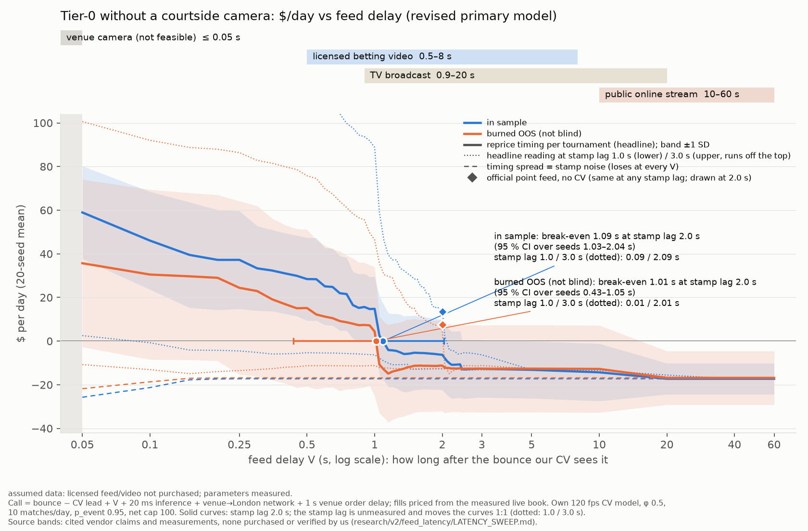

# Tier-0 without a courtside camera: P&L vs feed latency

> **Assumed data: licensed feed/video not purchased; parameters measured.** We have no camera at any court. We
> did not buy a licensed point feed or licensed video, and no live ATP/WTA data was used. This file re-runs the
> revised primary tier-0 counterfactual (`research/v2/tier0/RESULTS.md`, `src/tier0.py` `CORRECTED`) with information a trader
> could actually license or watch. Historical prices, results, fees and venue delays are real (public
> Polymarket tapes). Reprice timing and book depth come from our one live day (2026-10-03, 482 official WTA
> points, `research/v2/latency`). Burned OOS is not blind; every run is logged in `results/oos_peeks.log`.
> No parameter was chosen from these results. (This file lived in `research/v2/tier0/` in the first commit; it
> was moved here because that directory belongs to another workflow. Audit changes: see §9.)

## Bottom line

The revised primary (IS +1.10c, $89/day; burned OOS +0.58c, $46/day) assumed our own 120 fps camera at the
court. We cannot put one there. With video + our CV instead, the edge survives only while our CV call is made
at least about **0.9 s before the official umpire stamp** (the order then still pays the venue's 1 s delay).
How many seconds after the bounce that is depends on the stamp lag (t_stamp − t_bounce), which we have **not
measured**. At the revised primary's 2.0 s the edge is gone after about 1 s of feed delay.

* **Break-even video delay** (headline timing reading, R drawn per tournament). At stamp lag 2.0 s it is
  **1.09 s in sample** (95 % CI over seeds 1.03–2.04 s) and **1.01 s burned OOS** (0.43–1.05 s). The curve
  shifts one for one with the stamp lag. At lag 1.0 s it is 0.09 s IS and 0.01 s OOS. At lag 3.0 s it is
  2.09 s IS and 2.01 s OOS. At the calibrated 3.14 s (an inference) it is 2.23 s and 2.14 s. Under the
  stamp-noise reading there is no break-even, because it loses even with the venue camera. Under the
  calibrated stamp reading (an inference) it is 0.34 s IS and 0.30 s OOS.
* **Licensed betting video** is 0.5–8 s by vendor claims. None of those claims is stated for tennis, and Stats
  Perform's WTA stream page gives no figure. At the best claim (0.5 s glass-to-glass), the headline reading
  gives IS $28/day (+0.61c [0.08, 1.14]) and OOS $15/day (−0.02c [−1.22, 1.09]) at stamp lag 2.0 s. At lag
  1.0 s it gives −$5 / −$11, and at lag 3.0 s +$121 / +$76. Both stamp readings lose at 0.5 s. At 2 s it
  gives −$6 / −$11 at lag 2.0 s and +$15 / +$4 at lag 3.0 s. From 3 s on, every reading and lag loses: −$6 to
  −$17/day.
* **TV broadcast** is 0.9–20 s across the cited figures: 0.9–2.2 s for UK satellite in one consumer table,
  about 5 s for cable/satellite, 19 s over the air at the Super Bowl. At the 0.9 s end the headline reading
  gives IS $16/day and OOS $7/day at lag 2.0 s (−$6 / −$11 at lag 1.0 s; +$94 / +$56 at lag 3.0 s). From
  2.2 s it gives −$11 / −$13 at lag 2.0 s, and from 5 s every reading loses $13–17/day. **Public streams**
  (10–60 s) lose $13–17/day in every reading and at every lag. With that much delay, our CV only ever calls
  points the book has already priced, and the orders that still fill are almost all wrong calls. A sane
  trader would not trade at these delays: $0/day, not a profit.
* **The licensed official point feed, with no CV,** makes IS $13–14/day and OOS $8–11/day. The stamp lag
  cancels, so the figure is the same for 1, 2 and 3 s. It fills 2.5–3 % of calls IS, only on points where the
  book reprices more than ~1 s after the official stamp. Under the headline reading, 2 of 20 IS seeds and 6 of
  20 OOS seeds trade nothing. Drop the 3 live points with R = 8–18 s (probably mismatched) and it is
  $2–15/day. That is not a business once a data licence is paid for.
* A licensed **fast scout feed** that beat the umpire stamp by 1 s would make IS $35–41/day and OOS $17–27/day
  (extension, precision 1 assumed). Stats Perform says its WTA RunningBall feed is more than 1 s faster than the
  umpire feed on 32 % of points, so on most points it would be less than 1 s faster.

Whatever earns money here comes from being inside the venue's 1 s order delay before the book reprices. Our
camera was the only modelled source fast enough at the revised primary's stamp lag. Two cited figures sit below
the 2.0 s-lag break-even: the 0.5 s vendor claim (not shown for tennis) and the 0.9 s low end of a consumer TV
table. Both pay only under the headline reading. Whether licensed video pays at all turns on the unmeasured
stamp lag. At 1 s no source we could license pays; at 3 s video up to ~2 s pays. Measuring t_stamp − t_bounce
on real points is the deciding measurement, and this sweep cannot replace it.



`results/tier0/fig_pnl_vs_feed_latency.png`: $/day against feed delay V (log scale), IS and burned OOS. Solid:
headline timing reading at stamp lag 2.0 s, band ±1 SD over 20 seeds. Dotted: the same at stamp lag 1.0 s
(lower) and 3.0 s (upper, runs off the top). Dashed: stamp-noise reading. Diamonds: official point feed with no
CV. Its $/day is the same at any stamp lag, so it is drawn once, at 2.0 s, the stamp lag of the solid curves.
Dot and whisker: break-even with its 95 % CI over seeds. Shaded ruler: the source bands of §5.

## 1. What was run

`scripts/tier0_latency_sweep.py` imports `src/tier0.py` and `scripts/tier0_backtest.py` unchanged and only
overrides inputs at call time. The first run was SLURM job 44608194 (32 CPUs, 10,960 simulations, 51 s). The
audit re-run is job 44610737 (32 CPUs, 18,880 simulations, 194 s). It adds the stamp-lag cells and reproduces
all 10,960 earlier runs exactly.

* **Video + our CV.** Call time = bounce − CV lead + **V** + 20 ms inference. The order then pays the
  unchanged venue→London network (10–140 ms by region), the 2 ms gateway and the venue's 1 s order delay. This
  is implemented as `t_inf → t_inf + V`, which is the only place `simulate()` reads the CV system's timing.
  **V = 0 reproduces the published revised primary exactly** (IS $88.79/day, +1.0978c; OOS $46.43/day,
  +0.5755c; `latency_sweep.json → check_V0_equals_published_headline`). V grid: 0.05 (venue camera, upper
  bound), 0.25, 0.5, 0.75, 1, 1.5, 2, 3, 5, 10 s. We added 20, 40 and 60 s to cover TV and streams, and a
  0–3 s grid at 0.05 s to locate the break-even.
* **Official point feed, no CV.** Every point is known at the official stamp, t_stamp = bounce + stamp lag
  (1, 2, 3 s). It is error-free (precision 1) and has no early calls. Network, gateway and the 1 s delay are as
  above.
  * Tournament reading: the book reprices at t_stamp + R, with R drawn per tournament.
  * Stamp reading: t_reprice − t_bounce is constant and R's spread is stamp noise. The stamp the feed delivers
    is therefore t_reprice − R_point, and R is drawn per point.

  In both readings τ = R − transit, so the stamp lag cancels.
* **Fast scout feed** (extension). Same as the official feed, but the call arrives D s before the umpire stamp
  (D = 0.25–1.5 s, stamp lag 2.0). Precision 1 is generous, because scouts make errors.
* **Stamp-lag sensitivity (video).** Under the headline reading t_reprice − t_bounce = R + stamp lag, so the
  video curve is the stamp-lag-2.0 curve shifted by (lag − 2.0) s. The sweep re-runs it at lag 1.0, 3.0 and the
  calibrated 3.14 s (an inference) on the full 0–3 s grid.
* **Readings of the reprice timing** (as in `research/v2/tier0/RESULTS.md` §2):
  * *tournament*: R drawn per tournament, the headline reading;
  * *stamp*: R's spread is umpire-stamp noise, so t_reprice − t_bounce = 0.68 s;
  * *stamp_calibrated* (supplement): t_reprice − t_bounce = 1.35 s, the fast-tier-print inference.
* **Everything else is the revised primary:** own 120 fps CV model, φ 0.5, 10 matches/day, p_event 0.95, net cap
  100, $1k/order, 1 s-delay matches, fills priced from the live book on both sides, limit-order fills,
  measured stale-price correction. There are 20 seeds per cell, the backtest's own seeds, so V = 0 matches the
  published draws one for one.
* **Per cell:** net c/share with the match-clustered bootstrap 95 % CI (seed mean), $/day (mean ± SD over
  seeds), daily Sharpe (√365), fill rate (filled correct calls / calls), and the share of calls that reach the
  book before the reprice. A seed with no trade adds $0 to $/day and 0 to the fill rate. Its c/share and Sharpe
  are undefined, so those columns average the seeds that traded, marked "(k/20 seeds trade)" and †.

## 2. Video + our CV, by feed delay V (stamp lag 2.0 s; other lags in §3)

| V (s) | IS net c/share [CI] | IS $/day ± SD | IS Sharpe | IS fill | IS calls before reprice | OOS net c/share [CI] | OOS $/day ± SD | OOS Sharpe | OOS fill | OOS calls before reprice |
|---|---|---|---|---|---|---|---|---|---|---|
| 0 (own camera: revised primary) | +1.10 [+0.82, +1.38] | $89 ± 21 | 11.4 | 25.1 % | 43.9 % | +0.58 [-0.08, +1.21] | $46 ± 39 | 7.3 | 20.3 % | 35.4 % |
| 0.05 | +0.92 [+0.56, +1.26] | $59 ± 21 | 7.8 | 18.4 % | 32.2 % | +0.38 [-0.40, +1.11] | $36 ± 38 | 5.5 | 18.0 % | 31.4 % |
| 0.25 | +0.69 [+0.23, +1.14] | $37 ± 22 | 5.1 | 13.3 % | 23.6 % | +0.16 [-0.80, +1.09] | $24 ± 40 | 3.7 | 14.7 % | 25.6 % |
| 0.5 | +0.61 [+0.08, +1.14] | $28 ± 19 | 4.0 | 10.9 % | 19.3 % | -0.02 [-1.22, +1.09] | $15 ± 36 | 2.1 | 11.7 % | 20.3 % |
| 0.75 | +0.53 [-0.10, +1.12] | $22 ± 17 | 3.1 | 9.4 % | 16.4 % | -0.15 [-1.57, +1.13] | $9 ± 31 | 1.1 | 10.0 % | 17.1 % |
| 1 | +0.40 [-0.32, +1.08] | $15 ± 15 | 2.2 | 7.9 % | 13.8 % | -0.38 [-2.08, +1.20] | $4 ± 30 | 0.3 | 8.0 % | 13.7 % |
| 1.5 | -0.75 [-2.16, +0.60] | −$5 ± 17 | -1.3 | 2.5 % | 4.4 % | -1.48 [-4.42, +1.30] | −$11 ± 22 | -2.3 | 1.6 % | 2.9 % |
| 2 | -0.82 [-2.29, +0.58] | −$6 ± 16 | -1.4 | 2.4 % | 4.2 % | -1.45 [-4.45, +1.39] | −$11 ± 21 | -2.3 | 1.6 % | 2.8 % |
| 3 | -1.35 [-3.15, +0.37] | −$13 ± 13 | -2.6 | 0.9 % | 1.6 % | -1.69 [-4.85, +1.32] | −$13 ± 20 | -2.6 | 1.1 % | 2.1 % |
| 5 | -1.42 [-3.25, +0.34] | −$13 ± 13 | -2.7 | 0.7 % | 1.3 % | -1.70 [-4.89, +1.35] | −$13 ± 20 | -2.6 | 1.1 % | 2.0 % |
| 10 | -1.59 [-3.47, +0.25] | −$14 ± 13 | -2.9 | 0.5 % | 1.0 % | -1.72 [-4.93, +1.34] | −$13 ± 20 | -2.6 | 1.1 % | 2.0 % |
| 20 (ext.) | -1.85 [-3.88, +0.13] | −$17 ± 7 | -3.3 | 0.0 % | 0.0 % | -1.92 [-5.38, +1.38] | −$17 ± 12 | -3.2 | 0.0 % | 0.0 % |
| 40 (ext.) | -1.85 [-3.88, +0.13] | −$17 ± 7 | -3.3 | 0.0 % | 0.0 % | -1.92 [-5.38, +1.38] | −$17 ± 12 | -3.2 | 0.0 % | 0.0 % |
| 60 (ext.) | -1.85 [-3.88, +0.13] | −$17 ± 7 | -3.3 | 0.0 % | 0.0 % | -1.92 [-5.38, +1.38] | −$17 ± 12 | -3.2 | 0.0 % | 0.0 % |

The per-share CI lower bound (seed mean) crosses 0 at **V = 0.65 s IS**. Burned OOS has a CI that includes 0
even at V = 0. Past ~2.5 s almost no correct call fills: 1.0–1.6 % of calls IS still beat the reprice, all in
tournaments that drew a slow book. P&L then settles on the wrong-call floor: −$13/day at 3–10 s and −$17/day
from 20 s.

**Stamp-noise reading** (t_reprice − t_bounce = 0.68 s: the book always reprices before even the venue
camera's order arrives):

| V (s) | IS net c/share [CI] | IS $/day ± SD | IS Sharpe | IS fill | IS calls before reprice | OOS net c/share [CI] | OOS $/day ± SD | OOS Sharpe | OOS fill | OOS calls before reprice |
|---|---|---|---|---|---|---|---|---|---|---|
| 0 (own camera) | -3.25 [-5.28, -1.26] | −$30 ± 7 | -5.9 | 0.0 % | 0.0 % | -2.97 [-6.42, +0.34] | −$26 ± 12 | -5.0 | 0.0 % | 0.0 % |
| 0.05 | -2.77 [-4.79, -0.78] | −$26 ± 7 | -5.0 | 0.0 % | 0.0 % | -2.49 [-5.94, +0.81] | −$22 ± 12 | -4.2 | 0.0 % | 0.0 % |
| 0.25 | -1.85 [-3.88, +0.13] | −$17 ± 7 | -3.3 | 0.0 % | 0.0 % | -1.92 [-5.38, +1.38] | −$17 ± 12 | -3.2 | 0.0 % | 0.0 % |
| 0.5 | -1.85 [-3.88, +0.13] | −$17 ± 7 | -3.3 | 0.0 % | 0.0 % | -1.92 [-5.38, +1.38] | −$17 ± 12 | -3.2 | 0.0 % | 0.0 % |
| 0.75 | -1.85 [-3.88, +0.13] | −$17 ± 7 | -3.3 | 0.0 % | 0.0 % | -1.92 [-5.38, +1.38] | −$17 ± 12 | -3.2 | 0.0 % | 0.0 % |
| 1 | -1.85 [-3.88, +0.13] | −$17 ± 7 | -3.3 | 0.0 % | 0.0 % | -1.92 [-5.38, +1.38] | −$17 ± 12 | -3.2 | 0.0 % | 0.0 % |
| 1.5 | -1.85 [-3.88, +0.13] | −$17 ± 7 | -3.3 | 0.0 % | 0.0 % | -1.92 [-5.38, +1.38] | −$17 ± 12 | -3.2 | 0.0 % | 0.0 % |
| 2 | -1.85 [-3.88, +0.13] | −$17 ± 7 | -3.3 | 0.0 % | 0.0 % | -1.92 [-5.38, +1.38] | −$17 ± 12 | -3.2 | 0.0 % | 0.0 % |
| 3 | -1.85 [-3.88, +0.13] | −$17 ± 7 | -3.3 | 0.0 % | 0.0 % | -1.92 [-5.38, +1.38] | −$17 ± 12 | -3.2 | 0.0 % | 0.0 % |
| 5 | -1.85 [-3.88, +0.13] | −$17 ± 7 | -3.3 | 0.0 % | 0.0 % | -1.92 [-5.38, +1.38] | −$17 ± 12 | -3.2 | 0.0 % | 0.0 % |
| 10 | -1.85 [-3.88, +0.13] | −$17 ± 7 | -3.3 | 0.0 % | 0.0 % | -1.92 [-5.38, +1.38] | −$17 ± 12 | -3.2 | 0.0 % | 0.0 % |
| 20 (ext.) | -1.85 [-3.88, +0.13] | −$17 ± 7 | -3.3 | 0.0 % | 0.0 % | -1.92 [-5.38, +1.38] | −$17 ± 12 | -3.2 | 0.0 % | 0.0 % |
| 40 (ext.) | -1.85 [-3.88, +0.13] | −$17 ± 7 | -3.3 | 0.0 % | 0.0 % | -1.92 [-5.38, +1.38] | −$17 ± 12 | -3.2 | 0.0 % | 0.0 % |
| 60 (ext.) | -1.85 [-3.88, +0.13] | −$17 ± 7 | -3.3 | 0.0 % | 0.0 % | -1.92 [-5.38, +1.38] | −$17 ± 12 | -3.2 | 0.0 % | 0.0 % |

**Calibrated stamp reading** (supplement; t_reprice − t_bounce = 1.35 s, an inference from fast-tier prints):

| V (s) | IS net c/share [CI] | IS $/day ± SD | IS Sharpe | IS fill | IS calls before reprice | OOS net c/share [CI] | OOS $/day ± SD | OOS Sharpe | OOS fill | OOS calls before reprice |
|---|---|---|---|---|---|---|---|---|---|---|
| 0 (own camera) | +1.19 [+1.04, +1.34] | $199 ± 10 | 25.1 | 58.3 % | 100.0 % | +0.83 [+0.60, +1.07] | $133 ± 15 | 21.2 | 59.0 % | 100.0 % |
| 0.05 | +1.21 [+1.05, +1.36] | $193 ± 11 | 24.7 | 58.9 % | 100.0 % | +0.84 [+0.60, +1.09] | $129 ± 17 | 20.8 | 59.0 % | 100.0 % |
| 0.25 | +1.22 [+1.06, +1.38] | $188 ± 11 | 24.2 | 57.9 % | 99.0 % | +0.69 [+0.37, +1.02] | $78 ± 19 | 11.8 | 43.2 % | 73.0 % |
| 0.5 | -4.88 [-6.90, -2.89] | −$45 ± 7 | -8.7 | 0.0 % | 0.0 % | -4.58 [-8.04, -1.26] | −$40 ± 13 | -7.6 | 0.0 % | 0.0 % |
| 0.75 | -2.47 [-4.49, -0.48] | −$23 ± 7 | -4.5 | 0.0 % | 0.0 % | -2.26 [-5.71, +1.05] | −$20 ± 12 | -3.8 | 0.0 % | 0.0 % |
| 1 | -1.85 [-3.88, +0.13] | −$17 ± 7 | -3.3 | 0.0 % | 0.0 % | -1.92 [-5.38, +1.38] | −$17 ± 12 | -3.2 | 0.0 % | 0.0 % |
| 1.5 | -1.85 [-3.88, +0.13] | −$17 ± 7 | -3.3 | 0.0 % | 0.0 % | -1.92 [-5.38, +1.38] | −$17 ± 12 | -3.2 | 0.0 % | 0.0 % |
| 2 | -1.85 [-3.88, +0.13] | −$17 ± 7 | -3.3 | 0.0 % | 0.0 % | -1.92 [-5.38, +1.38] | −$17 ± 12 | -3.2 | 0.0 % | 0.0 % |
| 3 | -1.85 [-3.88, +0.13] | −$17 ± 7 | -3.3 | 0.0 % | 0.0 % | -1.92 [-5.38, +1.38] | −$17 ± 12 | -3.2 | 0.0 % | 0.0 % |
| 5 | -1.85 [-3.88, +0.13] | −$17 ± 7 | -3.3 | 0.0 % | 0.0 % | -1.92 [-5.38, +1.38] | −$17 ± 12 | -3.2 | 0.0 % | 0.0 % |
| 10 | -1.85 [-3.88, +0.13] | −$17 ± 7 | -3.3 | 0.0 % | 0.0 % | -1.92 [-5.38, +1.38] | −$17 ± 12 | -3.2 | 0.0 % | 0.0 % |
| 20 (ext.) | -1.85 [-3.88, +0.13] | −$17 ± 7 | -3.3 | 0.0 % | 0.0 % | -1.92 [-5.38, +1.38] | −$17 ± 12 | -3.2 | 0.0 % | 0.0 % |
| 40 (ext.) | -1.85 [-3.88, +0.13] | −$17 ± 7 | -3.3 | 0.0 % | 0.0 % | -1.92 [-5.38, +1.38] | −$17 ± 12 | -3.2 | 0.0 % | 0.0 % |
| 60 (ext.) | -1.85 [-3.88, +0.13] | −$17 ± 7 | -3.3 | 0.0 % | 0.0 % | -1.92 [-5.38, +1.38] | −$17 ± 12 | -3.2 | 0.0 % | 0.0 % |

Under this reading the edge does not decay smoothly. It is all-or-nothing at τ = 0. From 0.25 s to 0.5 s of
video delay the result swings from +$188/day to −$45/day, because past the reprice only wrong calls fill, at
a book that has not yet fully moved.

## 3. Break-even video delay

This is the V at which the 20-seed mean $/day crosses 0 (first crossing, linear interpolation on the 0.05 s
grid). "95 % CI over seeds" is 2.5–97.5 % of that crossing over 2,000 resamples of the 20 seeds. It is Monte
Carlo uncertainty of the modelled trader, not data uncertainty. The per-seed range is 2.5–97.5 % of the 20
single-seed crossings.

| reading | period | break-even V | 95 % CI over seeds | per-seed median (range 95 %) |
|---|---|---|---|---|
| R per tournament (headline), stamp lag 2.0 s | IS | **1.09 s** | 1.03–2.04 s | 1.05 s (0.38–10.7 s) |
| R per tournament (headline), stamp lag 2.0 s | burned OOS | **1.01 s** | 0.43–1.05 s | 0.33 s (0.01–39.9 s) |
| R per tournament, stamp lag 1.0 s | IS | 0.09 s | 0.03–1.04 s | 0.05 s (0–10.2 s) |
| R per tournament, stamp lag 1.0 s | burned OOS | 0.01 s | 0–0.05 s | 0.01 s (0–60 s) |
| R per tournament, stamp lag 3.0 s | IS | 2.09 s | 2.03–3.27 s | 2.05 s (1.38–20.4 s) |
| R per tournament, stamp lag 3.0 s | burned OOS | 2.01 s | 1.44–2.05 s | 1.33 s (0.87–39.9 s) |
| R per tournament, calibrated stamp lag 3.14 s (inference) | IS | 2.23 s | 2.18–3.39 s | 2.19 s (1.53–20.4 s) |
| R per tournament, calibrated stamp lag 3.14 s (inference) | burned OOS | 2.14 s | 1.59–2.19 s | 1.49 s (1.01–39.8 s) |
| R spread = stamp noise | IS / OOS | **none**: loses at V = 0 (all 20 seeds) | | |
| calibrated stamp reading (inference) | IS | 0.34 s | 0.337–0.340 s | 0.34 s (0.335–0.344 s) |
| calibrated stamp reading (inference) | burned OOS | 0.30 s | 0.291–0.300 s | 0.30 s (0.28–0.32 s) |

The stamp-lag rows are the lag-2.0 rows plus (lag − 2.0) s, to the grid's 0.05 s resolution. That is exact
in the model: the stamp lag enters only t_reprice, so video(V, lag L) = video(V − (L − 2), lag 2). The lag-free
statement is that the CV call must be made about 0.9 s before the stamp. The IS CI reaches 2 s because the
mean curve sits only $4–6/day below zero between 1.1 and 2.4 s, so a resample can push the crossing out. The single-seed ranges are wide for two reasons. Under the tournament
reading one draw sets the timing of a whole tournament. And 3 live points have R = 8.3 / 17.5 / 18.1 s: a
large tournament that draws one keeps filling even at V = 10–40 s (§7).

## 4. Official point feed (no CV) and a fast scout feed

| stamp lag (s) | IS net c/share [CI] | IS $/day ± SD | IS Sharpe | IS fill | IS calls before reprice | OOS net c/share [CI] | OOS $/day ± SD | OOS Sharpe | OOS fill | OOS calls before reprice |
|---|---|---|---|---|---|---|---|---|---|---|
| 1 | +5.01 [+4.02, +6.67] (18/20 seeds trade) | $13 ± 17 | 4.8† | 2.5 % | 4.2 % | +1.61 [+0.37, +3.53] (14/20 seeds trade) | $8 ± 23 | 4.3† | 1.7 % | 2.8 % |
| 2 | +5.01 [+4.02, +6.67] (18/20 seeds trade) | $13 ± 17 | 4.8† | 2.5 % | 4.2 % | +1.61 [+0.37, +3.53] (14/20 seeds trade) | $8 ± 23 | 4.3† | 1.7 % | 2.8 % |
| 3 | +5.01 [+4.02, +6.67] (18/20 seeds trade) | $13 ± 17 | 4.8† | 2.5 % | 4.2 % | +1.61 [+0.37, +3.53] (14/20 seeds trade) | $8 ± 23 | 4.3† | 1.7 % | 2.8 % |

| stamp lag (s) | IS net c/share [CI] | IS $/day ± SD | IS Sharpe | IS fill | IS calls before reprice | OOS net c/share [CI] | OOS $/day ± SD | OOS Sharpe | OOS fill | OOS calls before reprice |
|---|---|---|---|---|---|---|---|---|---|---|
| 1 | +3.20 [-0.14, +6.57] | $14 ± 8 | 3.5 | 3.0 % | 3.8 % | +2.96 [-3.10, +9.01] | $11 ± 14 | 2.8 | 2.8 % | 3.5 % |
| 2 | +3.20 [-0.14, +6.57] | $14 ± 8 | 3.5 | 3.0 % | 3.8 % | +2.96 [-3.10, +9.01] | $11 ± 14 | 2.8 | 2.8 % | 3.5 % |
| 3 | +3.20 [-0.14, +6.57] | $14 ± 8 | 3.5 | 3.0 % | 3.8 % | +2.96 [-3.10, +9.01] | $11 ± 14 | 2.8 | 2.8 % | 3.5 % |

The rows are identical across stamp lags. That is not a bug: the trader and the book both key off the stamp.
Per-share P&L is high and fills are rare (2.5–3 % of calls). The only calls that fill are on points where the
book reprices more than ~1 s after the official stamp. With p = 1 there are no wrong calls to pay for. †: under
the headline reading some seeds draw no slow-book tournament and trade nothing, so c/share, its CI and Sharpe
average only the seeds that traded ($/day and fill count the others as 0). The first commit averaged "calls
before reprice" over those seeds only, which gave 4.7 % IS / 4.0 % OOS. Over all 20 seeds it is 4.2 % / 2.8 %.

**Robustness: live pool without the 3 points with R > 3 s** (262 points; stamp lag 2.0):

| stamp lag (s), pool without R > 3 s | IS net c/share [CI] | IS $/day ± SD | IS Sharpe | IS fill | IS calls before reprice | OOS net c/share [CI] | OOS $/day ± SD | OOS Sharpe | OOS fill | OOS calls before reprice |
|---|---|---|---|---|---|---|---|---|---|---|
| 2 | +1.85 [+0.76, +3.38] (18/20 seeds trade) | $8 ± 9 | 4.1† | 1.7 % | 2.8 % | -1.03 [-2.28, +1.35] (10/20 seeds trade) | $2 ± 4 | 2.2† | 0.4 % | 0.7 % |

| stamp lag (s), pool without R > 3 s | IS net c/share [CI] | IS $/day ± SD | IS Sharpe | IS fill | IS calls before reprice | OOS net c/share [CI] | OOS $/day ± SD | OOS Sharpe | OOS fill | OOS calls before reprice |
|---|---|---|---|---|---|---|---|---|---|---|
| 2 | +4.43 [+0.54, +8.28] | $15 ± 6 | 4.2 | 2.4 % | 2.6 % | +3.01 [-3.81, +9.88] | $9 ± 9 | 2.3 | 2.2 % | 2.4 % |

**Extension: a fast scout feed D s ahead of the umpire stamp** (stamp lag 2.0, precision 1):

| feed lead D over the stamp (s), lag 2.0 | IS net c/share [CI] | IS $/day ± SD | IS Sharpe | IS fill | IS calls before reprice | OOS net c/share [CI] | OOS $/day ± SD | OOS Sharpe | OOS fill | OOS calls before reprice |
|---|---|---|---|---|---|---|---|---|---|---|
| 0.25 | +4.85 [+3.81, +6.51] (19/20 seeds trade) | $14 ± 17 | 4.7† | 2.5 % | 4.2 % | +1.48 [+0.32, +3.13] (15/20 seeds trade) | $8 ± 23 | 4.2† | 1.7 % | 2.9 % |
| 0.5 | +2.30 [+1.20, +6.38] | $15 ± 18 | 4.8 | 2.6 % | 4.4 % | +1.51 [+0.38, +3.15] (15/20 seeds trade) | $8 ± 24 | 4.3† | 1.7 % | 2.9 % |
| 0.75 | +1.98 [+1.20, +5.29] | $18 ± 18 | 5.3 | 3.1 % | 5.3 % | +1.40 [+0.24, +3.03] (18/20 seeds trade) | $9 ± 24 | 4.4† | 2.0 % | 3.4 % |
| 1 | +1.77 [+1.36, +2.21] | $41 ± 18 | 8.7 | 8.4 % | 13.8 % | +1.12 [+0.11, +2.50] | $27 ± 33 | 7.1 | 8.4 % | 13.6 % |
| 1.25 | +1.72 [+1.35, +2.11] | $49 ± 22 | 9.6 | 9.9 % | 16.4 % | +1.24 [+0.40, +2.10] | $35 ± 35 | 8.9 | 10.6 % | 17.1 % |
| 1.5 | +1.75 [+1.43, +2.11] | $61 ± 24 | 10.9 | 11.7 % | 19.6 % | +1.24 [+0.52, +1.98] | $45 ± 40 | 10.2 | 12.4 % | 20.3 % |

| feed lead D over the stamp (s), lag 2.0 | IS net c/share [CI] | IS $/day ± SD | IS Sharpe | IS fill | IS calls before reprice | OOS net c/share [CI] | OOS $/day ± SD | OOS Sharpe | OOS fill | OOS calls before reprice |
|---|---|---|---|---|---|---|---|---|---|---|
| 0.25 | +3.18 [-0.20, +6.56] | $14 ± 8 | 3.5 | 3.1 % | 3.8 % | +3.08 [-2.58, +8.75] | $13 ± 14 | 3.1 | 3.1 % | 3.8 % |
| 0.5 | +3.06 [-0.22, +6.22] | $14 ± 8 | 3.5 | 3.3 % | 4.0 % | +2.96 [-2.54, +8.61] | $13 ± 14 | 3.0 | 3.1 % | 3.9 % |
| 0.75 | +3.44 [+0.52, +6.33] | $19 ± 9 | 4.2 | 3.6 % | 4.5 % | +3.07 [-1.72, +7.93] | $16 ± 13 | 3.6 | 3.6 % | 4.6 % |
| 1 | +1.91 [+0.77, +3.04] | $35 ± 11 | 6.3 | 9.3 % | 12.7 % | +1.18 [-0.97, +3.38] | $17 ± 14 | 3.0 | 7.8 % | 10.6 % |
| 1.25 | +1.72 [+0.75, +2.70] | $38 ± 11 | 6.7 | 9.7 % | 14.2 % | +0.84 [-0.83, +2.52] | $17 ± 14 | 2.8 | 9.6 % | 14.0 % |
| 1.5 | +1.64 [+0.90, +2.38] | $50 ± 11 | 8.3 | 12.0 % | 17.9 % | +0.76 [-0.50, +2.03] | $22 ± 14 | 3.3 | 11.8 % | 17.7 % |

## 5. Realistic sources: latency band and expected P&L

$/day is the 20-seed mean, read off the curves in §2 and §4 (log-interpolated between grid points). "Headline"
means R drawn per tournament at stamp lag 2.0 s; "lag 1 / lag 3" is the same reading at stamp lag 1.0 / 3.0 s
(§3). Every source is assumed, not purchased, and no vendor figure was verified by us.

| source | latency (band used) | basis for the band | IS $/day | OOS $/day |
|---|---|---|---|---|
| (venue camera: our own 120 fps camera at the court, **not feasible**) | ≤ 0.05 s | the revised primary; we cannot install a camera, and unlicensed courtside data collection breaches tournament terms | headline $59–89 (lag 1: $3–15; lag 3: $162–189) · stamp −$26 to −$30 · calibrated $193–199 | headline $36–46 (lag 1: −$11 to $4; lag 3: $101–117) · stamp −$22 to −$26 · calibrated $129–133 |
| (a) licensed official point feed (umpire tablet), no CV | stamp lag 1–3 s (unmeasured; model grid) | the umpire enters the point after the line call and audio cue, which delays the data reaching operators [1]; the WTA fast feed beats it on 80 % of points, by > 1 s on 32 % [2] | headline $13 · stamp $14 (pool without R > 3 s: $8 / $15) | headline $8 · stamp $11 (pool without R > 3 s: $2 / $9) |
| (b) licensed low-latency betting video + our CV | 0.5–8 s | 0.5 s glass-to-glass claimed for Stats Perform Realtime Streaming [3] (examples: horse racing, NFL; the WTA stream page gives no figure); 4–8 s venue camera → device for Genius BetVision [4] (not stated for tennis); Sportradar trading streams "up to eight seconds faster than any TV signal" [5]; IMG Arena: no public figure found; Genius data is "always 3-4 seconds ahead of video" [6] | headline +$28 at 0.5 s, +$15 at 1 s, −$6 at 2 s, −$13 to −$14 at 5–8 s · lag 1: −$5 at 0.5 s, −$6 at 1 s, −$13 to −$14 from 2 s · lag 3: +$121 at 0.5 s, +$89 at 1 s, +$15 at 2 s, −$13 at 5–8 s · stamp −$17 · calibrated −$45 at 0.5 s, −$17 from 1 s | headline +$15 at 0.5 s, +$4 at 1 s, −$11 at 2 s, −$13 at 5–8 s · lag 1: −$11 at 0.5–1 s, −$13 from 2 s · lag 3: +$76 at 0.5 s, +$46 at 1 s, +$4 at 2 s, −$13 at 5–8 s · stamp −$17 · calibrated −$40 at 0.5 s, −$17 from 1 s |
| (c) TV broadcast + our CV | 0.9–20 s | Uswitch "delay compared to live action": satellite 0.9–2.2 s, digital terrestrial > 1 s, cable about 5 s [8] (UK consumer table, method not published); cable/satellite about 5 s behind the live event [7]; US Super Bowl LX, spotters in the stadium: over-the-air 19 s, cable 38 s [9]; the task's 3–10 s widened to both cited ends | headline +$16 at 0.9 s, −$11 at 2.2 s, −$13 to −$17 at 5–19 s · lag 1: −$6 at 0.9 s · lag 3: +$94 at 0.9 s, −$4 at 2.2 s · stamp and calibrated −$17 · every reading −$13 to −$17 from 5 s | headline +$7 at 0.9 s, −$13 at 2.2 s, −$13 to −$17 at 5–19 s · lag 1: −$11 at 0.9 s · lag 3: +$56 at 0.9 s, −$14 at 2.2 s · stamp and calibrated −$17 · every reading −$13 to −$17 from 5 s |
| (d) public online stream + our CV | 10–60 s | streaming 10–45 s behind live [8]; HLS defaults ~30 s [7]; Super Bowl LX streams 48–60 s [9]; **ours:** the book leads the ESPN score by a median 44.5 s (`results/summary.json` h4, n = 75), and every public score source is 28–44 s behind the book (`research/v2/latency/RESULTS.md`) | −$13 to −$17 (all readings and lags) | −$13 to −$17 (all readings and lags) |

The negative figures in (b)–(d) come from a trader that keeps sending an order on every call after the book
has moved. Past the break-even the right policy is not to trade: $0/day. At stamp lag 2.0 s, nothing in
(b)–(d) beats that except the 0.5–1 s end of licensed betting video and the 0.9 s end of TV, both under the
headline reading only. The first rests on a vendor's marketing figure not stated for tennis, the second on one
UK consumer table that the other TV figures (5 s, 19 s) contradict. The price of a video licence for a trading
firm is unknown and not deducted. At stamp lag 3.0 s, betting video up to ~2 s and TV at 0.9 s would pay; at
1.0 s none of (b)–(d) would.

## 6. Sensitivity: betting video is 25–50 fps, not 120 fps

`own120_pess` drops the early out calls (lead 0 only, precision 0.855 at lead 0, 50 ms inference). Headline
reading, stamp lag 2.0 s:

| V (s) | IS net c/share [CI] | IS $/day ± SD | IS Sharpe | IS fill | IS calls before reprice | OOS net c/share [CI] | OOS $/day ± SD | OOS Sharpe | OOS fill | OOS calls before reprice |
|---|---|---|---|---|---|---|---|---|---|---|
| 0 (own camera) | +0.97 [+0.67, +1.27] | $73 ± 23 | 9.5 | 22.2 % | 39.2 % | +0.31 [-0.42, +1.02] | $32 ± 37 | 5.0 | 18.3 % | 32.1 % |
| 0.05 | +0.71 [+0.31, +1.11] | $42 ± 22 | 5.6 | 15.3 % | 27.3 % | +0.11 [-0.75, +0.93] | $24 ± 38 | 3.6 | 16.2 % | 28.4 % |
| 0.25 | +0.58 [+0.10, +1.05] | $31 ± 21 | 4.2 | 12.5 % | 22.3 % | -0.02 [-1.00, +0.89] | $18 ± 39 | 2.6 | 14.2 % | 25.0 % |
| 0.5 | +0.55 [+0.01, +1.07] | $26 ± 20 | 3.6 | 10.8 % | 19.1 % | -0.16 [-1.31, +0.91] | $10 ± 34 | 1.3 | 11.5 % | 20.3 % |
| 0.75 | +0.37 [-0.29, +1.00] | $15 ± 17 | 2.2 | 8.6 % | 15.0 % | -0.29 [-1.65, +0.96] | $4 ± 29 | 0.3 | 9.7 % | 16.8 % |
| 1 | +0.15 [-0.68, +0.92] | $8 ± 17 | 1.1 | 6.6 % | 11.6 % | -1.18 [-3.26, +0.70] | −$13 ± 27 | -2.6 | 4.3 % | 7.4 % |
| 1.5 | -0.76 [-2.14, +0.54] | −$6 ± 17 | -1.4 | 2.3 % | 4.2 % | -1.50 [-4.20, +1.10] | −$13 ± 22 | -2.8 | 1.6 % | 2.9 % |
| 2 | -0.81 [-2.23, +0.54] | −$7 ± 16 | -1.6 | 2.3 % | 4.1 % | -1.60 [-4.39, +1.08] | −$14 ± 22 | -2.8 | 1.5 % | 2.7 % |
| 3 | -1.26 [-2.95, +0.35] | −$13 ± 13 | -2.6 | 0.9 % | 1.6 % | -1.72 [-4.61, +1.13] | −$15 ± 21 | -3.0 | 1.1 % | 2.1 % |
| 5 | -1.32 [-3.03, +0.35] | −$13 ± 13 | -2.7 | 0.7 % | 1.3 % | -1.73 [-4.65, +1.15] | −$15 ± 21 | -3.0 | 1.1 % | 2.0 % |
| 10 | -1.44 [-3.21, +0.26] | −$14 ± 13 | -2.8 | 0.5 % | 1.0 % | -1.75 [-4.68, +1.15] | −$15 ± 21 | -3.0 | 1.0 % | 2.0 % |
| 20 (ext.) | -1.68 [-3.56, +0.16] | −$17 ± 8 | -3.3 | 0.0 % | 0.0 % | -1.94 [-5.09, +1.20] | −$19 ± 13 | -3.6 | 0.0 % | 0.0 % |
| 40 (ext.) | -1.68 [-3.56, +0.16] | −$17 ± 8 | -3.3 | 0.0 % | 0.0 % | -1.94 [-5.09, +1.20] | −$19 ± 13 | -3.6 | 0.0 % | 0.0 % |
| 60 (ext.) | -1.68 [-3.56, +0.16] | −$17 ± 8 | -3.3 | 0.0 % | 0.0 % | -1.94 [-5.09, +1.20] | −$19 ± 13 | -3.6 | 0.0 % | 0.0 % |

The break-even moves to between 1.0 and 1.5 s IS and between 0.75 and 1.0 s OOS. At 0.5 s the model makes IS
$26/day and OOS $10/day. CV on broadcast angles (not line-calling cameras) has no measured out-call precision
here, so p_event 0.95 may be optimistic for video.

**Robustness: video, live pool without R > 3 s** (headline reading):

| V (s) | IS net c/share [CI] | IS $/day ± SD | IS Sharpe | IS fill | IS calls before reprice | OOS net c/share [CI] | OOS $/day ± SD | OOS Sharpe | OOS fill | OOS calls before reprice |
|---|---|---|---|---|---|---|---|---|---|---|
| 0 | +1.04 [+0.75, +1.33] | $82 ± 23 | 10.5 | 24.3 % | 42.4 % | +0.54 [-0.14, +1.22] | $41 ± 39 | 6.7 | 19.6 % | 33.7 % |
| 0.05 | +0.86 [+0.49, +1.23] | $53 ± 19 | 7.1 | 17.7 % | 30.9 % | +0.31 [-0.55, +1.13] | $27 ± 40 | 4.2 | 15.8 % | 27.2 % |
| 0.25 | +0.64 [+0.15, +1.10] | $32 ± 20 | 4.4 | 12.5 % | 22.0 % | +0.13 [-0.92, +1.15] | $17 ± 36 | 2.4 | 11.9 % | 20.6 % |
| 0.5 | +0.45 [-0.16, +1.03] | $20 ± 19 | 2.9 | 9.4 % | 16.6 % | -0.04 [-1.37, +1.20] | $12 ± 31 | 1.7 | 9.9 % | 17.1 % |
| 0.75 | +0.25 [-0.51, +0.97] | $12 ± 18 | 1.6 | 7.4 % | 12.8 % | -0.19 [-1.70, +1.23] | $4 ± 24 | 0.5 | 8.2 % | 13.8 % |
| 1 | +0.14 [-0.73, +0.94] | $8 ± 18 | 1.1 | 6.4 % | 11.1 % | -0.48 [-2.45, +1.34] | −$1 ± 24 | -0.4 | 6.1 % | 10.3 % |
| 1.5 | -1.01 [-2.59, +0.48] | −$10 ± 14 | -2.0 | 1.6 % | 2.9 % | -1.70 [-4.77, +1.20] | −$16 ± 13 | -3.0 | 0.7 % | 1.2 % |
| 2 | -1.07 [-2.67, +0.49] | −$11 ± 12 | -2.1 | 1.6 % | 2.7 % | -1.74 [-4.92, +1.30] | −$16 ± 12 | -3.2 | 0.4 % | 0.7 % |
| 3 | -1.69 [-3.63, +0.26] | −$16 ± 8 | -3.2 | 0.2 % | 0.3 % | -1.95 [-5.32, +1.31] | −$17 ± 11 | -3.3 | 0.1 % | 0.2 % |
| 5 | -1.78 [-3.81, +0.24] | −$17 ± 8 | -3.3 | 0.0 % | 0.0 % | -2.07 [-5.50, +1.26] | −$18 ± 12 | -3.5 | 0.0 % | 0.0 % |
| 10 | -1.78 [-3.81, +0.24] | −$17 ± 8 | -3.3 | 0.0 % | 0.0 % | -2.07 [-5.50, +1.26] | −$18 ± 12 | -3.5 | 0.0 % | 0.0 % |
| 20 | -1.78 [-3.81, +0.24] | −$17 ± 8 | -3.3 | 0.0 % | 0.0 % | -2.07 [-5.50, +1.26] | −$18 ± 12 | -3.5 | 0.0 % | 0.0 % |
| 40 | -1.78 [-3.81, +0.24] | −$17 ± 8 | -3.3 | 0.0 % | 0.0 % | -2.07 [-5.50, +1.26] | −$18 ± 12 | -3.5 | 0.0 % | 0.0 % |
| 60 | -1.78 [-3.81, +0.24] | −$17 ± 8 | -3.3 | 0.0 % | 0.0 % | -2.07 [-5.50, +1.26] | −$18 ± 12 | -3.5 | 0.0 % | 0.0 % |

## 7. Why 50 ms costs a third of the in-sample P&L

The fall from $89/day at V = 0 to $59/day at V = 0.05 s is not noise. **33 % of book reprices land 50–100 ms
after a whole UTC second** (157 of 482 live points; 5 % would be expected if reprice times were uniform within
the second). So the measured R = t_reprice − t_stamp piles up at ≈ −0.93 s. A lead-0 call from a European
venue fills iff R ≥ −0.968 s + V (tournament reading, stamp lag 2.0). **12 % of the 265 pool points sit in the
first 50 ms above that line.** The clustering is consistent with the venue releasing delayed orders on a 1 s
clock, but we have not verified that. If that is how it works, real arrival is quantised to the clock, and the
continuous-delay model is only approximate below ~1 s. At stamp lag 2.0 s, the break-even near 1 s and the
conclusion that every source slower than ~1.5 s loses do not depend on this (both move with the stamp lag,
§3). The exact shape between 0 and 1 s does
(`latency_sweep.json → timing_diagnostics`).

## 8. What this does not show

* **No source here is purchased or measured by us,** except the public-stream end (our ESPN measurement).
  Latency bands for licensed video are vendor claims, none stated for tennis.
* **The stamp lag t_stamp − t_bounce is unmeasured, and it sets where the video curve sits.** Each second of
  stamp lag moves the break-even by one second (§3). The official feed's P&L does not depend on it.
* **One live day** (9 WTA matches) supplies every reprice time and every book. ATP, Challenger and other
  venues may differ.
* **V adds to the modelled venue→London network** (10–140 ms). A published glass-to-glass figure already
  includes that leg, so reading a vendor figure straight onto V is conservative by at most 0.14 s.
* **The official feed is assumed error-free and arriving at the stamp.** Real distribution adds delay, and
  real scout feeds make errors.
* **Costs are not deducted:** data or video licences, colocation, and any exchange or venue fee changes.
* **The trade set** is still the historical ≥ 4c detector set, selected on realised moves (`research/v2/tier0/RESULTS.md`
  assumption 2).
* **Daily Sharpe ignores model risk** (`research/v2/tier0/RESULTS.md` §7). Read it as a ranking.

## 9. Audit (2026-10-03): what changed from the first commit

An adversarial check of the sweep recomputed three cells independently and opened every cited source. The
recompute used a different knob for the delay (stamp lag − V instead of t_inf + V) for video V = 0.5 s IS and
V = 1.0 s burned OOS, and its own numpy re-implementation of timing, fills, net cap and live-book pricing for
the official feed at lag 2.0 s IS. It matched to 5 decimals: $28.43 / $4.35 / $13.38 per day. It also checked
the calls one by one: τ moves by exactly −V for every call, correct and wrong, and nothing else about a call
changes. No correct call fills after the reprice. The official feed has no early calls, every call is correct,
and its τ does not depend on the stamp lag. `src/tier0.py` is unchanged (same checksum here and on HiPerGator).
Changes:

1. **Stamp-lag sensitivity added.** The first version gave the 1.09 s / 1.01 s break-even without saying it
   holds only at the unmeasured stamp lag of 2.0 s. It is 0.09 s / 0.01 s at 1.0 s and 2.09 s / 2.01 s at
   3.0 s. The bottom line, §3, §5 and the figure (dotted curves) now carry it.
2. **TV band 3–20 s → 0.9–20 s.** The cited Uswitch table puts UK satellite at 0.9–2.2 s and terrestrial at
   > 1 s behind live action. The first version cited it and still started the band at 3 s, and the script
   called the table "relative to the fastest feed". "TV loses in every reading" was not true at the cited
   low end (+$16 / +$7 per day, headline reading, lag 2.0 s).
3. **Zero-trade seeds.** When a seed fills nothing, `T.metrics` returns a short dict. The sweep then stored
   NaN for the call-timing shares and averaged over the other seeds. This touched 49 of 10,960 runs, all in
   the official, fast-feed and trimmed-pool cells. "Calls before reprice" for the official feed was 4.7 % /
   4.0 % and is 4.2 % / 2.8 %. c/share and Sharpe in those cells are now marked as means over the seeds that
   traded. $/day and fill rate were right.
4. **Official-feed figure markers.** The diamonds were drawn at x = 1, 2, 3 s on the V axis, but the video
   curves hold the stamp lag at 2.0 s, so only x = 2.0 is a like-for-like comparison. Now drawn once, at 2.0 s.
5. **Source wording.** The 0.5 s Stats Perform claim is not shown to apply to tennis (its WTA stream page has
   no figure). BetVision is not stated for tennis. The Genius "3-4 s ahead of video" source gives no reason,
   so "on purpose" was dropped. The ~5 s cable/satellite and ~30 s HLS figures on the GL Systemhaus page are a
   quote from Wowza. The book's median 1.32 s lead on the stamp is for the 265 points with a ≥ 3c move
   (1.16 s on all 482).
6. **OOS log.** Neither HiPerGator run was in the repo's `results/oos_peeks.log`: the entries were written to
   the cluster copy (20:17:16 job 44606812, 20:36:47 job 44608194, UTC). The first commit also appended two
   lines that duplicated existing entries. The cluster entries, the audit's own burned-OOS recompute (logged
   after it ran) and the re-run (job 44610737) are now appended.
7. **File location.** This file moved out of `research/v2/tier0/`, which the audit brief reserves for another
   workflow. The numbers in §2 and §6 are unchanged: the re-run reproduces all 10,960 earlier runs to the 6
   decimals stored.

## Sources

1. Sportradar "Game, Set, Tech" talk on AI in tennis, write-up (Regen Sports, 1 May 2026): the umpire enters
   the point after the electronic line call and audio cue, which delays data reaching operators. TDI
   (Tennis Data Innovations, ATP) sends a signal before the umpire presses the button. No latency figure is
   given.
   https://regensports.substack.com/p/i-attended-sportradars-game-set-tech
2. Stats Perform, Official WTA Data & Streaming: RunningBall vs the umpire feed, "80% of points faster", "32%
   of points more than 1 second faster". https://www.statsperform.com/products/official-wta-data-streaming/
3. Stats Perform, sportsbooks page: "0.5 seconds glass-to-glass latency" for Realtime Streaming (vendor claim);
   the Realtime Streaming page says "sub-second" and its examples are horse racing and the NFL. Stats Perform's
   WTA betting-stream page gives **no** latency figure, so the 0.5 s is not shown to apply to tennis.
   https://www.statsperform.com/industries/sportsbooks/ ;
   https://www.statsperform.com/products/realtime-streaming/ ;
   https://www.statsperform.com/betting-fantasy/exclusive-official-wta-data-for-sportsbooks/
4. NEXT.io interview with Genius Sports' CPO (17 Jan 2025): BetVision "reduces this delay to just four to eight
   seconds", measured "from the venue camera to a user's mobile device", vs broadcasts lagging "45 seconds or
   more". Not stated for tennis.
   https://next.io/news/betting/matt-fleckenstein-raising-bar-in-play-betting/
5. Sportradar live streams: "up to eight seconds faster than any TV signal".
   https://sportradar.com/betting-gaming/products/live-streams/
6. Ably case study, Genius Sports: live data "always 3-4 seconds ahead of video" (no reason given).
   https://ably.com/case-studies/genius-sports
7. GL Systemhaus (29 Jun 2018), "Who cheers first?", quoting Wowza: cable and satellite about 5 s behind the
   live event; Apple HLS defaults to ~30 s. (GL's own figure: its streams cut from 60 s to 5 s behind a DVB-S2
   satellite signal.) https://www.gl-systemhaus.de/en/blog/who-cheers-first-about-latencies-in-sports-livestreaming
8. ISPreview (10 Jun 2021), Uswitch table "Delay compared to live action": satellite 0.9–2.2 s, digital
   terrestrial > 1 s, cable about 5 s, streaming 10–45 s (UK consumer comparison, method not published).
   https://www.ispreview.co.uk/index.php/2021/06/broadcast-lag-in-live-online-tv-sport-streaming-frustrates-fans.html
9. The Desk (9 Feb 2026), Stats Perform / Phenix Super Bowl LX latency study, real-time spotters in the stadium:
   over-the-air ~19 s, cable 38 s, Peacock 48 s, Hulu/YouTube TV 53 s, DIRECTV ~60 s.
   https://thedesk.net/2026/02/stats-perform-phenix-latency-super-bowl-lx/

## Reproduce

```bash
sbatch hpg/tier0_latency_sweep.sbatch                          # HiPerGator: full sweep, ~3 min on 32 CPUs
.venv/bin/python scripts/tier0_latency_sweep.py --workers 4     # same, locally (~40 min)
.venv/bin/python scripts/tier0_latency_sweep.py --figures       # re-aggregate + redraw from latency_sweep_seeds.csv
.venv/bin/python scripts/tier0_latency_sweep.py --smoke         # 6 single runs, IS only, prints only
```

Outputs in `results/tier0/`:

* `latency_sweep.json`: label, model, grids, V = 0 check, break-evens, every table, source read-offs and
  timing diagnostics;
* `latency_sweep.csv`: one row per cell × period, 20-seed means, SDs and seed percentiles;
* `latency_sweep_seeds.csv`: every single run;
* `fig_pnl_vs_feed_latency.png`.
