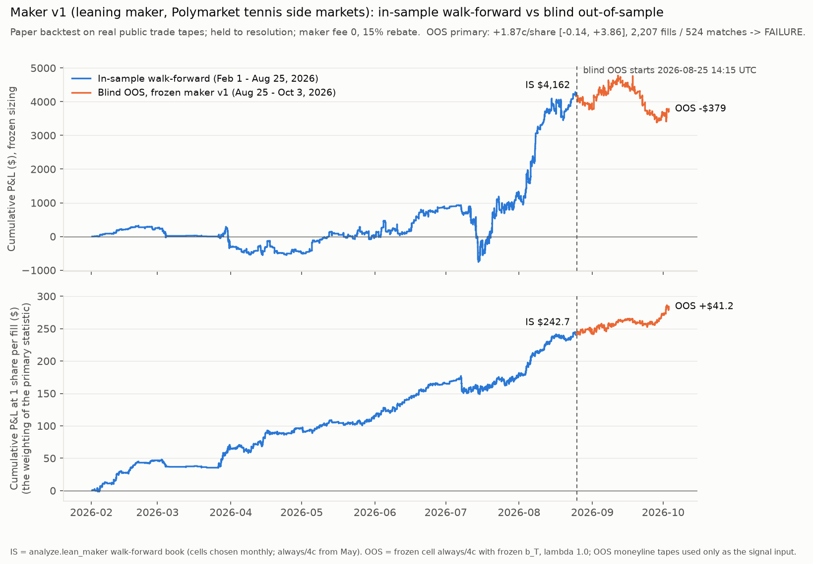

# maker v1: blind out-of-sample test (A), results

**Run.** 2026-10-03 18:49 UTC, one run.
- Code at run time: commit `5a75da6`, which also holds the pre-run decisions in `DEVIATIONS.md`.
- Protocol: `PREREG.md` (A), committed in `c29734b` before any of this code existed.
- Every result is reported below whatever it shows.

**Data and execution.**
- Paper only. No order was signed or sent, and no key was used.
- All market data is real and public: Polymarket gamma-api (catalogue) and data-api (taker trade tapes).



## Verdict

| | |
|---|---|
| **Primary** (PREREG §2.5): net per share, fill-weighted, held to resolution | **+1.87c/share, 95% CI [−0.14, +3.86]** |
| Sample | 2,207 fills in 524 matches. Not underpowered (≥ 500 fills, ≥ 100 matches). |
| **Result** | **FAILURE**, and borderline: z about 1.9, two-sided p about 0.06. The CI's lower bound is below 0, so the OOS claim fails. |
| Consistency with IS | The point estimate lies inside the IS 1s/5% CI [+0.53, +3.48] (IS point +2.02c). |
| Dollars | **−$379** on $28.8k notional. Share-weighted net −0.75c [−4.92, +3.56]. |
| Cost label (PREREG §2.7) | **Cost-fragile**: stress (iv) −4.15c, CI [−13.45, +5.54], n = 98 fills. The label says little, since the CI spans about ±9c. It was close to certain before the run: in-sample, (iv) was already about 0 (+0.10c on 513 fills, all regimes; −1.76c on 156 fills at IS 1s/5%). |

In plain terms:
- Per share, the leaning maker earned about what it earned in-sample in the same fee regime: +1.87c against +2.02c.
- The OOS sample is too noisy to tell that apart from zero, and the pre-registered rule calls this a failure. The
  call is borderline: the data fit the IS edge and a zero edge about equally well (see "Post-run audit" below).
- In dollars, the frozen sizing lost money, because the larger fills lost.
- The rule's edge depends on the IS fill model, filling at the print price. When a fill must trade through a level
  quoted earlier, the edge disappears both in-sample and OOS.

**Maker v1 is not an OOS-validated strategy.** No constant is changed because of this result (PREREG §5). A changed
rule would be maker v2. It would need its own pre-registration and unseen data, and this OOS would count as in-sample
for it.

## What was tested

**The frozen rule (PREREG §1).**
- Cell: `analyze.lean_maker`, window always-on, min_impl 4c.
- Sensitivities: the frozen b_T table (the walk-forward 2026-08 row), with in-match shrinkage λ = 1.0. Its sha256 is
  asserted by the script.
- Information cut: print time − order delay.
- Fills:
  - filled only by takers who trade against the implied move, at the print price;
  - 20% of each such print, at most $250 per fill and $2,000 per match;
  - held to resolution;
  - maker fee 0, plus a rebate of 15% of the taker fee.
- The eight frozen files match their pre-registered sha256: five crossmarket scripts, `beta_walkforward.csv`,
  `src/tiers.py` and `src/backtest.py`.

**Sample (PREREG §2.1)**, built by `oos_build.py`:
- Matches: all 2,617 OOS matches in the cached catalogue (1,776 ATP, 841 WTA), starting 2026-08-25 14:15 to
  2026-10-03 07:10 UTC. Gamma returned all 2,617 events.
- Catalogue: 35,092 side markets, of which 23,307 are of the six frozen types.
- Excluded:
  - 20,191 with lifetime volume < $250;
  - 0 unresolved;
  - 0 totals markets whose outcome 0 was not "Over".
- **Selected: 3,116 markets**, all 1 s delay / 5% fee:

  | type | markets |
  |---|---|
  | set_handicap | 799 |
  | match_totals | 734 |
  | first_set_winner | 664 |
  | set_winner | 506 |
  | set_totals | 313 |
  | first_set_totals | 100 |

- Player markets: 3 of 1,969 have no name alignment (`align0` = 0). They are treated as +1, as in IS.
- Tapes: 3,116 of 3,116 fetched (≤ 4 concurrent, with back-off), none empty, none failed.
- In-play prints: 33,585 side prints in 2,092 markets of 869 matches. 26,353 intervals.

**Signal input.** The OOS moneyline tapes (`data/raw/trades/<cond>.parquet`) had already been used by other
strategies; this OOS is *burned for the moneyline*. Here they are used **only as the signal input**, the moneyline mid
proxy. The OOS side-market tapes had never been fetched before this test.

**Signal and fill counts.**
- 27,916 side prints have every signal input, a reference ≤ 600 s old, and a resolved market.
- 2,388 of them are lean-side contrary prints with |impl| ≥ 4c.
- 2,207 remain after the 2–98c price band. The $2,000 match cap never binds.

**Checks before the run** (IS data only; details in DEVIATIONS.md):
- **Build code.** It reproduces 400 random IS events exactly: 22,866 prints and 18,137 intervals, every column.
- **PREREG §2.3 parity.** On the IS table the OOS code path gives n = 10,171 fills and $5,326.05, with relative
  error 0. It also reproduces the IS 1s/5% diagnostics exactly.
- **b_T.** It equals the re-computed walk-forward 2026-08 row. One entry differs by 1 ulp in printing (N1).

**Pre-run decision (DEVIATIONS.md D1).**
- Every OOS side market has Gamma `makerBaseFee = 1000`. That triggers the pre-registered conditional 8th stress.
- The fee was fixed before the run as 0.10 × px(1 − px) per share. This is the harshest reading of a field that
  VENUE_RULES.md reads as legacy; the docs say makers pay 0 when `takerOnly` is true, as it is here.

## Headline (book 1, PREREG §2.6)

| statistic | OOS (Aug 25–Oct 3, 40 days) | IS 1s/5% reference (Jul 11–Aug 25, 46 days) |
|---|---|---|
| fills / matches | 2,207 / 524 | 4,159 / 1,017 |
| net c/share (fill-weighted) [CI] | **+1.87 [−0.14, +3.86]** | +2.02 [+0.53, +3.48] |
| share-weighted net c/share [CI] | −0.75 [−4.92, +3.56] | +3.35 |
| $ P&L / notional | −$379 / $28,804 | +$3,269 / $54,325 |
| mean / median fill | $13.05 / $3.04 | $13 / $2.94 |
| hit rate | 59.5% | — |
| rebate (mean, c/share) | 0.16 | 0.16 |
| capital (3 × peak locked) | $2,022 | — |
| daily Sharpe × √365 | −1.42 | — |
| max drawdown | −46.7% of capital (−$1,156) | — |
| worst day | −$207 (−10.2% of capital) | — |
| worst month | −$367 (Aug 25–31, partial) | — |

Months (calendar):

| month | fills | matches | net c/share | $ P&L | notional |
|---|---|---|---|---|---|
| Aug 25–31 (partial) | 395 | 116 | +0.09 | −$367 | $4,766 |
| Sep | 1,620 | 362 | +1.77 | −$185 | $21,895 |
| Oct 1–3 (partial) | 192 | 46 | +6.32 | +$173 | $2,142 |

Positive months: 3 of 3 per share, 1 of 3 in dollars.

By regime: the whole OOS is 1s/5%, so the regime cut equals book 1.

By side-market type (match-clustered CIs):

| type | fills | matches | net c/share [CI] | share-weighted | $ P&L | notional |
|---|---|---|---|---|---|---|
| first_set_winner | 898 | 316 | +1.70 [−1.42, +4.74] | +0.53 | +$136 | $14,615 |
| set_winner | 859 | 287 | +0.82 [−2.21, +3.98] | −4.02 | −$665 | $9,816 |
| set_handicap | 225 | 115 | +4.48 [−0.89, +9.89] | +1.91 | +$83 | $2,449 |
| match_totals | 136 | 96 | +2.58 [−6.14, +11.29] | −6.35 | −$153 | $1,344 |
| set_totals | 88 | 47 | +6.22 [−3.25, +15.53] | +20.85 | +$251 | $549 |
| first_set_totals | 1 | 1 | −17.89 | −17.89 | −$31 | $32 |

## Cost stresses (PREREG §2.7, §2.9)

Each stress makes one change to the book.

| book | OOS fills | OOS net c/share [CI] | OOS $ P&L | **IS 1s/5%** (the OOS regime) | IS Feb–Aug, all regimes (cell chosen in hindsight; code test) |
|---|---|---|---|---|---|
| maker v1 (primary) | 2,207 | +1.87 [−0.14, +3.86] | −$379 | +2.02 [+0.53, +3.48], n = 4,159 | +3.06 [+2.11, +4.01], n = 10,171 |
| (i) queue share 10% | 2,207 | +1.87 [−0.14, +3.86] | −$107 | +2.02 [+0.53, +3.48] | +3.06 [+2.11, +4.01] |
| (ii) trade-through | 98 | −3.99 [−13.28, +5.70] | +$99 | −1.61 [−8.36, +6.21], n = 156 | +0.20 [−4.62, +4.89], n = 513 |
| (iii) rebate removed | 2,207 | +1.71 [−0.29, +3.70] | −$457 | +1.86 [+0.37, +3.33] | +2.95 [+2.00, +3.91] |
| (iv) all of (i)–(iii) | 98 | **−4.15 [−13.45, +5.54]** | +$110 | −1.76 [−8.51, +6.05], n = 156 | +0.10 [−4.71, +4.79], n = 513 |
| (viii) conditional: maker fee 0.10·px(1−px) | 2,207 | −0.21 [−2.20, +1.79] | −$1,419 | −0.07 [−1.56, +1.40] | +0.95 [−0.01, +1.90] |

The OOS sample is entirely 1s/5%, so the **IS 1s/5%** column is the comparable one. The all-regimes column, which
was the only IS column before the audit, runs about 1c high against it. The IS 1s/5% values come from IS data only
(`is_1s5_stress.py` → `is_reference_1s5.json`). They use the same code path as `is_reference.json`, restricted to
the regime, and reproduce the IS 1s/5% book-1 figure and diagnostics exactly.

Notes:
- **(i)** The per-share number is unchanged. The $2,000 match cap never binds, so the same fills are kept and only
  their dollar size halves. The CI is identical.
- **(ii) and (iv)** Only 98 of 2,207 fills (4%) pass the trade-through condition, against 513 of 10,171 (5%) in IS.
  The leaning maker's IS edge comes from fills at the print's own price. When a fill must trade through a level seen
  before the information cut, no edge is left in either sample. On 98 fills the CI is about ±9c.
- **Stress headlines.**
  - (ii): Sharpe 1.20, max DD −13.8%.
  - (iii): Sharpe −1.72, max DD −48.7% (−$1,184).
  - (iv): Sharpe 1.91, max DD −9.3%.
  - (viii): Sharpe −5.42, max DD −80.4%.

  These are on tiny capital bases ($722–$2,022). All of them are in `results.json`.
- **Derived, not a variant.** The break-even maker fee rate on book 1 is 0.090: the edge per share would be zero if
  makers paid 0.090 × px(1 − px). The documented maker fee on these markets is 0.

## Diagnostics (PREREG §2.8; per print, no sizing, as in IS)

| book | OOS n (matches) | OOS c/share [CI] | IS 1s/5% c/share [CI] |
|---|---|---|---|
| unconditional maker (every print, both sides) | 25,938 (782) | +0.10 [−1.04, +1.27] | −0.12 [−1.26, +0.95] |
| anti-lean placebo (filled by implied-direction takers, \|impl\| ≥ 4c) | 2,839 (555) | **+0.71 [−1.30, +2.64]** | −1.29 [−2.75, +0.12] |
| lean (book 1, for comparison) | 2,207 (524) | +1.87 [−0.14, +3.86] | +2.02 [+0.53, +3.48] |

**What the placebo shows.**
- In IS, the anti-lean placebo lost 1.29c while the lean book earned 2.02c, a gap of 3.3c.
- OOS the placebo is positive (+0.71c). The gap shrinks to 1.2c.
- OOS, the lean book and the anti-lean placebo cannot be told apart (gap +1.15c [−1.42, +4.00]; paired,
  match-clustered bootstrap, P(gap ≤ 0) = 0.19). The IS gap of 3.31c sits at the 94th percentile of the OOS
  bootstrap. (Audit figures, labelled post-hoc.)

## Variants and peeks
- **Evaluated on OOS: 8.** These are the 7 pre-registered ones (book 1, stresses i–iv, two diagnostics) plus the
  conditional 8th maker-fee stress, which the metadata triggered.
- **Lens count.** 68 IS variants + 8 OOS.
- **Separate code test on IS.** `is_reference.json` ran the same evaluation on IS Feb–Aug (walk-forward b) after the
  freeze. It is reported above as IS reference only.
- **`results/oos_peeks.log` entries:**
  - `2026-10-03T18:49:10Z maker v1 blind OOS evaluated (first run) ...`, written before any P&L was computed;
  - `2026-10-03T18:49:54Z maker v1 OOS reproduction ...`, which recomputed every committed number from the cached
    data and matched exactly.

## Post-run audit (2026-10-03, about 20:55 UTC, after the run)
An independent recompute (`audit/indep_maker_oos.py`, logged in `results/oos_peeks.log` at 20:11 UTC) matched every
fill. Its findings changed the wording above, not a number and not the verdict (`DEVIATIONS.md` R1):
- **Borderline verdict.** The cluster-robust SE is 1.00c, so z = 1.87 and the t-CI is [−0.09, +3.82].
  - Across 200 bootstrap seeds, the CI's lower bound averages −0.07c (sd 0.06), and 8.5% of seeds put it above 0.
  - Clustering by day gives [+0.10, +3.86]. Clustering by side market gives [−0.04, +3.68].
  - The pre-registered choices (seed 0, match clusters) were fixed in PREREG `c29734b` and they govern, so the
    FAILURE stands. Nothing was seed-shopped.
  - The data fit the IS edge and a zero edge about equally well.
- **Placebo.** The earlier sentence "the signal still points the right way OOS" was not supported. It is replaced
  by the paired lean-minus-placebo gap above.
- **Cost label.** The CI and n are now printed next to the label, together with the IS values that already had
  (iv) at about 0.
- **IS comparator.** The stress table now has the IS 1s/5% column.
- **Timing caveat.** Added under Caveats.

## How to reproduce
From the repo root, using the project venv:

```
.venv/bin/python scripts/maker_oos.py build      # catalogue + tapes (public endpoints, <= 4 concurrent) + tables; counts only
.venv/bin/python scripts/maker_oos.py check      # build-code parity on 400 IS events + PREREG 2.3 parity on IS
.venv/bin/python scripts/maker_oos.py reproduce  # recompute the committed OOS numbers from the cache and compare (logs a peek)
.venv/bin/python scripts/maker_oos.py figure     # results/maker/equity_is_oos.png
```

`oos_test.py run` refuses to run a second time. A re-run needs a `DEVIATIONS.md` entry and `--rerun "<reason>"`, and
the first-run numbers are kept.

Data is cached under `data/v2_maker/oos/` (also reachable as `data/v2_crossmarket_oos/`) and is not committed. A fresh
`build` re-downloads the same public tapes. The tapes are final for resolved markets. Gamma volume can still drift
slightly, which could move markets across the $250 floor.

## Files
- `research/v2/maker/oos_build.py`: catalogue, tapes and per-print tables, plus `--check-is`.
- `research/v2/maker/oos_test.py`: the `parity`, `istest`, `run` and `reproduce` steps.
- `scripts/maker_oos.py`: one-command entry point and the figure.
- `research/v2/maker/oos/results.json`: every number above. It is copied to `results/maker/oos.json`.
- `research/v2/maker/oos/book_*.csv`: fill-level books for book 1 and each stress.
- `research/v2/maker/oos/by_type.csv`, `by_regime.csv`, `monthly.csv`, `parity.json`.
- `research/v2/maker/is_reference.json`: the IS code test (Feb–Aug, all regimes).
- `research/v2/maker/is_1s5_stress.py` → `is_reference_1s5.json`: the same IS code test restricted to 1s/5%, for
  the comparable stress column (IS only).
- `research/v2/maker/DEVIATIONS.md`: pre-run decisions.
- `results/maker/equity_is_oos.png`: cumulative P&L, IS walk-forward (Feb 1–Aug 25) vs blind OOS (Aug 25–Oct 3).
  - Top panel: dollars at the frozen sizing.
  - Bottom panel: 1 share per fill, which is the primary statistic's weighting.

## Caveats
- **The fill model is the IS model.** A fill is 20% of a contrary print, at that print's price. It has not been
  checked against real queues. That check is parts (B) and (C) of the pre-registration, which are not part of this
  run.
  - VENUE_RULES.md found in-play side books thin: two-sided 15% of minutes, median spread 13c.
  - Stress (ii) suggests the edge depends on this optimistic model.
- **The OOS moneyline is burned.** It is used here only as the signal input.
- **Data-api returns at most 10,500 fills per market.** This is the same cap as in IS.
- **Resolution comes from Gamma `outcomePrices`.** All 3,116 selected markets showed (1,0), (0,1) or (0.5,0.5).
- **Matches starting 07:10–14:00 UTC on 2026-10-03 are not in the cached catalogue.** They were not added, per
  PREREG §2.1.
- **Power.** The sample is 2,207 fills, against the pre-registered expectation of about 3,500. The standard error is
  about 1.0c, against 0.8c expected. Even with a true edge of +2c, a pass was close to a coin flip at this n. This
  is consistent with the result. It does not change it: the claim failed.
- **Information-cut timing.** The cut uses prints strictly before ts − d. data-api timestamps are block times in
  whole seconds, about 2.3 s after the match (DEVIATIONS_LIVE.md L1). Jitter in that lag can let a moneyline print
  that matched after the side print fall inside the cut.
  - Labelled post-hoc sensitivity with a stricter cut (audit): +1 s gives +1.67c (−$989), +2 s gives +1.61c
    (−$1,220), +5 s gives +1.02c (−$734).
  - The edge fades gradually, with no cliff, so there is no sign of a leak.
  - Any timing optimism is at most about 0.2–0.26c. It would only lower the point estimate, so it cannot turn the
    FAILURE into a pass.
