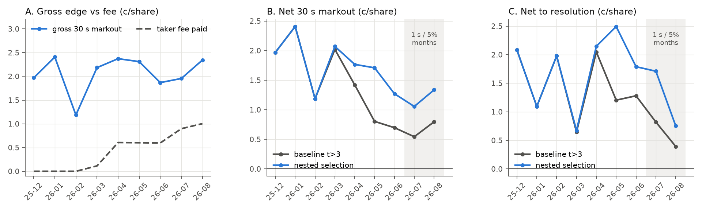

# Lens "selection": which fast-tier trades to take

In-sample only: matches starting before 2026-08-25 14:15 UTC. Nothing here reads `data/locked/`, OOS prints, or any
market data for OOS matches. Every rule is walk-forward: wallets and filters for month m are fitted on months < m and
scored on m. The **nested** series is the honest one. Each month it picks the variant whose own walk-forward record on
the earlier evaluated months was best, and it uses only the fee rate known when month m starts. Single-variant rows
are diagnostics: picking the best of them would be an in-sample fit.

## Reproduce (from the repo root, ~1 min, 1 core)

```bash
.venv/bin/python research/v2/selection/run.py            # all stages -> results.json, out/*.csv|json|png
.venv/bin/python research/v2/selection/run.py --report   # re-assemble results.json + figures from out/
# individual stages
.venv/bin/python research/v2/selection/build_features.py # decision-time features -> data/v2_selection/feat_0_3s.parquet
.venv/bin/python research/v2/selection/qualify_grid.py   # stage 1: 288 qualification variants + nested choice
.venv/bin/python research/v2/selection/features_wf.py    # stage 2: trade-level filters + nested choice
.venv/bin/python research/v2/selection/decay.py          # edge decay, crowding, calibration, recency, all-bucket check
```

A clean re-run after deleting `data/v2_selection/` and `out/` reproduced every number below exactly. The engine
reproduces the existing H6 shadow book exactly: 131,414 trades, +1.157c/share [0.79, 1.54], $316,272, Sharpe 5.52 with
`run_all.shadow_stats` dates. The tables below use a fixed Dec-1..Aug-25 calendar, which gives Sharpe 5.34 for the same
trades.

Sizing is unchanged from H6 so the comparison is like for like: min(print, $1k) per trade, at most $3k per match, held
to resolution, net of each match's own taker fee. `net30` = 30 s markout minus fee (low-noise edge). `net_res` =
resolution P&L minus fee (the realisable P&L). Per-share figures are unweighted means over trades, as in
`src/backtest.py`. CIs are 95% match-cluster bootstraps.

## Headline

| IS walk-forward, Dec 2025 - Aug 2026 | trades | net30 c/sh | net_res c/sh | $ P&L | Sharpe | months $>0 |
|---|---|---|---|---|---|---|
| Baseline H6 (all history, gross t>3, >=10 matches) | 131,414 | 0.91 [0.87, 0.95] | 1.16 [0.79, 1.54] | 316,272 | 5.34 | 8/9 |
| **Nested stage 1 (honest)** | 90,143 | **1.45** [1.41, 1.49] | **1.76** [1.36, 2.16] | 328,272 | 5.62 | 7/9 (losers: -$771, -$169) |
| Nested stage 1 + stage 2 (honest) | 90,048 | 1.45 [1.41, 1.50] | 1.77 [1.38, 2.18] | 334,964 | 5.77 | 7/9 |

| **1 s / 5% matches only** (Jul 1 - Aug 25, 2026) | trades | net30 c/sh | net_res c/sh | $ P&L | Sharpe | max DD |
|---|---|---|---|---|---|---|
| Baseline | 36,757 | 0.62 [0.56, 0.68] | 0.54 [-0.17, 1.26] | 117,306 | 6.60 | -17.2% |
| **Nested stage 1** | 25,929 | **1.17** [1.09, 1.24] | **1.34** [0.54, 2.12] | 125,038 | 7.15 | -14.7% |
| Nested stage 1 + stage 2 | 25,829 | 1.18 [1.10, 1.25] | 1.38 [0.60, 2.14] | 131,279 | 7.62 | -14.6% |
| Paired difference, nested - baseline | | **+0.55 [0.50, 0.59]** | **+0.79 [0.34, 1.28]** | | | |

Monthly net30 is positive in every evaluated month in which a variant traded, for all 288 grid variants (lowest month 0.47c) and for the nested series. In the 1 s / 5%
regime, all 288 variants have positive net30 and net_res. The median variant gets 1.08c net30 and 1.29c net_res. The
baseline ranks 33rd of 288 from the bottom (11th percentile): `out/fig_grid_1s5.png`.



## What drives it: t-stats pick significance, not size

The gross t>3 rule asks whether a wallet's edge is non-zero. Once the fee went from 0 to 3% and then 5% (about 1c/share
at p = 0.5), the question that matters is whether the edge is bigger than the fee. From May 2026 the t-rule admitted a
cohort of high-frequency wallets with about 0.9c gross edge. Their t-stats are large because they trade a lot, but
after the fee they lose:

| Walk-forward cohort (first month selected) | Jul net30 | Aug net30 | Jul / Aug gross30 |
|---|---|---|---|
| Baseline rule, May-Jun cohort (24 / 20 wallets) | **-0.05c** | **+0.07c** | 0.88 / 1.07c |
| Baseline rule, Mar-Apr cohort (3 wallets) | 2.03c | 1.74c | 2.93 / 2.74c |
| EB-net rule, May-Jun cohort (26 / 14 wallets) | 1.00c | 1.10c | 1.92 / 2.08c |
| EB-net rule, Jul-Aug cohort (23 / 43 wallets) | 1.21c | 1.56c | 2.12 / 2.57c |

Wallet-level check (`decay.json: rank_ic`): wallets with gross t>3 that the EB-net rule rejects earned -0.11c (Jul,
n=5) and -0.13c (Aug, n=14) net30. Wallets the EB-net rule selects earned 1.96c and 2.22c. Grid marginals (medians
over the other two dimensions) say the same thing:

| score family | net30 all | net30 1s/5% | net_res 1s/5% | $ 1s/5% | mean wallets |
|---|---|---|---|---|---|
| gross t>2 / t>3 | 0.87 / 0.91 | 0.59 / 0.62 | 0.49 / 0.55 | 112k / 117k | 30 / 23 |
| gross t>4 / t>5 | 1.40 / 1.53 | 0.94 / 1.10 | 0.98 / 1.30 | 105k / 105k | 17 / 13 |
| top-10 / 25 / 50 by t | 1.52 / 1.40 / 1.03 | 1.12 / 1.07 / 1.07 | 1.64 / 1.48 / 1.29 | 95k / 111k / 107k | 7 / 14 / 21 |
| t of net-of-current-fee edge >2 / >3 | 1.42 / 1.51 | 1.12 / 1.19 | 1.35 / 1.44 | 118k / 110k | 22 / 16 |
| **EB-shrunk net edge >0 / >0.25c / >0.5c** | 1.22 / 1.34 / 1.41 | 1.00 / 1.09 / **1.18** | 1.05 / 1.22 / **1.45** | 123k / **131k** / 126k | 35 / 29 / 25 |

A stricter t threshold raises per-share edge but loses dollars, because it drops good wallets with short histories.
The EB-net rule keeps per-share edge and dollars at the same time. Lookback length matters little (medians:
1.07c net30 in 1 s / 5% with all history vs 1.13c with a 1-month window). Minimum matches 5 vs 10 makes no
difference; 20 is slightly worse.

## Stage 1: qualification grid and nested choice

**Variants (288):** lookback {all, last 1/2/3/6 months, exponential decay with half-life 1/2/3 months} x score
{gross t>2, 3, 4, 5; top-K by t (among t>2), K = 10, 25, 50; t of edge net of the current fee >2, 3; EB-shrunk net
edge >0, 0.25c, 0.5c} x minimum matches {5, 10, 20} (minimum prints = 3x). The EB step is a DerSimonian-Laird
random-effects prior across all eligible wallets, applied to the weighted mean 30 s markout. Its SE is the print sd
divided by sqrt(effective matches). The expected fee is the rate known at the start of m times the wallet's mean
p(1-p). Per-variant monthly rows: `out/stage1_grid_months.csv`. Summaries: `out/stage1_grid_summary.csv`.

**Nested choice.** Before the first evaluated month I declared these settings:
- Primary objective: the expected dollar P&L at the 30 s markout over all earlier evaluated months, re-priced at the
  fee rate known when month m starts.
- At least 3 earlier evaluated months are required. Dec-Feb therefore use the baseline rule.
- Stand aside if no variant has positive expected P&L. This never triggered.

Choices: Mar-Apr `2m|top10|mm5`, May `ew2|eb0.5c|mm5`, Jun `ew3|eb0.5c|mm5`, Jul `3m|tnet2|mm5`,
Aug `ew2|eb0.5c|mm5`.

| month | baseline trades | base net30 | base net_res | base $ | nested trades | nested wallets | **nested net30** | **nested net_res** | nested $ | fee c |
|---|---|---|---|---|---|---|---|---|---|---|
| 2025-12 | 71 | 1.97 | 2.08 | -771 | 71 | 2 | 1.97 | 2.08 | -771 | 0.00 |
| 2026-01 | 4,442 | 2.41 | 1.09 | 5,110 | 4,442 | 3 | 2.41 | 1.09 | 5,110 | 0.00 |
| 2026-02 | 8,611 | 1.19 | 1.98 | 32,632 | 8,611 | 9 | 1.19 | 1.98 | 32,632 | 0.00 |
| 2026-03 | 3,277 | 2.02 | 0.65 | 1,166 | 3,110 | 9 | 2.07 | 0.67 | -169 | 0.11 |
| 2026-04 | 14,056 | 1.42 | 2.05 | 27,994 | 10,007 | 8 | 1.77 | 2.15 | 26,014 | 0.61 |
| 2026-05 | 34,772 | 0.80 | 1.20 | 69,282 | 17,520 | 23 | 1.71 | 2.49 | 76,274 | 0.60 |
| 2026-06 | 22,528 | 0.70 | 1.28 | 51,087 | 15,348 | 44 | 1.27 | 1.79 | 53,715 | 0.60 |
| 2026-07 | 26,529 | 0.54 | 0.82 | 74,107 | 19,237 | 56 | 1.06 | 1.71 | 80,134 | 0.90 |
| 2026-08 | 17,128 | 0.80 | 0.39 | 55,664 | 11,797 | 62 | 1.34 | 0.75 | 55,332 | 1.00 |

By venue regime, nested (baseline in brackets), net_res c/share:
- 3 s / 0%: 1.52 (1.51)
- 3 s / 3%: 2.43 (1.64)
- 1 s / 3%: 1.82 (1.19)
- 1 s / 5%: 1.34 (0.54)

Net30 by regime, nested: 1.69, 1.68, 1.42, 1.17.

The nested result does not depend on which meta-objective is used. All four give net30 1.45-1.52c overall and
1.15-1.19c in 1 s / 5%:

| meta-objective | net30 | net_res | $ | Sharpe | net30 1s5 | net_res 1s5 | $ 1s5 |
|---|---|---|---|---|---|---|---|
| **pnl30_now_all (primary)** | 1.45 | 1.76 | 328k | 5.62 | 1.17 | 1.34 | 125k |
| pnl30_now_last3 | 1.49 | 1.79 | 306k | 5.40 | 1.19 | 1.29 | 108k |
| pnlres_now_all | 1.45 | 1.76 | 289k | 5.05 | 1.15 | 1.37 | 117k |
| net30ps_now_all | 1.52 | 1.89 | 305k | 5.60 | 1.16 | 1.42 | 104k |

**Frozen rule for the next (unseen) month.** Using all IS evaluated months at a 5% fee, the primary nested procedure
picks `ew2|eb0.5c|mm5`. The last-3-months objective picks `ew1|eb0.25c|mm5`, which is the same family. The frozen
rule's own IS walk-forward series is chosen with hindsight, so it is not an honest estimate. For reference: net30
1.42c, net_res 1.59c, $323.5k, Sharpe 5.49; in 1 s / 5%, 1.22c / 1.42c, $117.7k, Sharpe 7.2.

## Stage 2: features known at decision time

Each feature is binned using bin edges fixed in advance:
- seconds since onset: 0 vs 1-2 s
- print size: <$50, $50-250, $250-1k, >=$1k
- price paid: five bands
- **pre-trade** spread. The stored `spread` includes the print itself, so I rebuilt it from strictly earlier prints.
- pay-up: price vs pre-trade mid
- match volume **so far**. Total match volume would be look-ahead.
- ATP vs WTA
- minutes since start
- number of jumps already detected in the match

Filters are fitted on the earlier evaluated months' walk-forward trades only, at the fee known at m.

**Variants (47):** for each of two wallet bases (nested stage 1, baseline):
- no filter
- 9 single-feature filters that keep bins whose prior net30 at the current fee is >0
- the same 9 with a 0.5c safety margin
- a ridge model on all features (lambda 100, mo30 winsorised at +-25c) with trade threshold 0, 0.25c or 0.5c

That is 22 x 2 = 44. Three more come from a unified model on all wallets' 0-3 s prints, using the wallet's past EB
edge, eligibility and match count plus the trade features (threshold 0, 0.25c, 0.5c). The 0.5c-margin filters and
`ridge:0.5c` were added after a first run showed that break-even filters never cut anything. They are counted.

| variant | trades | net30 | net_res | $ | Sharpe | net30 1s5 | net_res 1s5 | $ 1s5 | Sharpe 1s5 |
|---|---|---|---|---|---|---|---|---|---|
| nested, no filter | 90,143 | 1.45 | 1.76 | 328k | 5.62 | 1.17 | 1.34 | 125k | 7.15 |
| nested, every bin filter (break-even and 0.5c margin) | identical: no bin was ever cut | | | | | | | | |
| nested, ridge 0 / 0.25c / 0.5c | 89,971 / 89,313 / 87,347 | 1.45 / 1.46 / 1.47 | 1.77 / 1.81 / 1.84 | 337k / 346k / 336k | 5.75 / 6.10 / 6.19 | 1.18 / 1.18 / 1.20 | 1.38 / 1.51 / 1.62 | 131k / 130k / 126k | 7.62 / 7.86 / 8.28 |
| baseline, best margin filters (since / price / tstart) | | 0.93 / 0.92 / 0.92 | 1.23 / 1.31 / 1.27 | | | 0.69 / 0.58 / 0.63 | 0.77 / 1.00 / 0.86 | | |
| unified 0 / 0.25c / 0.5c | 140k / 122k / 107k | 0.90 / 1.06 / 1.21 | 1.00 / 1.19 / 1.32 | 298k / 318k / 307k | 4.97 / 5.40 / 5.65 | 0.94 / 1.11 / 1.23 | 1.04 / 1.35 / 1.44 | 108k / 112k / 82k | 6.25 / 6.71 / 5.86 |

The nested stage-2 choice (same primary objective, 3 months of filter history required) picks no filter for Dec-May
and `ridge:0` for Jun-Aug. It freezes `ridge:0` for the next month.

Reading: once wallets are selected on edge net of the fee, **every** feature bin of their trades clears the current
fee by more than 0.5c in walk-forward, so filters have nothing to remove. The ridge filter moves net_res by 0.04-0.28c,
but net30 moves by only 0.01-0.04c. Most of that net_res gain is therefore resolution noise. I do not recommend stage-2
filters, for parsimony.

The unified model's last fit puts 0.95c of predicted edge on each 1c of EB wallet edge, close to 1:1. So the shrunk
wallet score is roughly calibrated, and wallet identity carries most of the signal. Trade-feature coefficients (c/share):
- size >=$1k: -0.59
- pay-up >3c: -0.88
- price >=0.8: -0.45
- WTA: -0.14
- 1-2 s after onset: -0.12

Descriptive, walk-forward trades in 1 s / 5% matches (net30 / net_res, c/share; full table in
`out/stage2_feature_bins.csv`):
- since 0 s: 1.26 / 1.60; since 1-2 s: 0.80 / 0.30
- pay-up <=0: 1.95 / 1.90; pay-up >3c: 0.57 / 0.36
- ATP: 1.27 / 1.50; WTA: 0.95 / 1.01
- first 30 min of a match: 0.81 / 0.48

All of these are positive at 30 s.

## Edge decay and crowding (`out/decay.json`)

- **Gross edge did not decay.** Gross 30 s markout of the nested-selected wallets by month, Mar-Aug: 2.18, 2.38,
  2.32, 1.89, 2.00, 2.40c. The fee went 0.11 -> 0.61 -> 1.00c. The decline in net edge is the fee, not competition.
  Everyone else in the 0-3 s window went from about -0.5c to -1.1/-1.2c over the same months.
- **The "4 -> 131" growth in qualifiers is mostly dilution under the t-rule** (cohort table above). The baseline's
  qualifiers went 4 -> 101 within IS. The nested selection's went 4 -> 81 (the frozen EB-net rule alone selects 81 in Aug). Its May-Jun and Jul-Aug cohorts
  keep a 1.9-2.6c gross edge.
- **No sign of within-jump competition.** For nested-selected trades, edge rises with the number of selected wallets
  active in the same jump. In Jul-Aug, net30 is 0.98 / 1.26 / 1.48 / 1.77 / 3.55c for 1 / 2 / 3-4 / 5-8 / 9+ wallets:
  bigger points attract more fast wallets. This is not known at decision time, so it is not used as a filter.
- **Ranking skill is persistent and stronger in the 1 s / 5% months.** This is the Spearman correlation between a
  wallet's prior score and its next-month net30, for wallets with >=20 prints in the month. Using the EB net score it
  was 0.32-0.68 in Feb-Jun, and 0.79 (Jul) and 0.74 (Aug). Regressing next-month gross edge on the EB score gives a
  slope of 0.94 / 1.19 / 0.98 in Jun / Jul / Aug (one May outlier, 3.9), so the shrinkage is about right.
- **Recency helps a little, only in the new regime.** In 1 s / 5% matches, a 1-month window beats all-history in 78% of
  the 36 matched (score, threshold, min-matches) pairs, by +0.11c net30 and +0.24c net_res. A 2-month window wins 86%
  (+0.06c) and EW half-life 1 wins 81% (+0.04c). Over all months the effect is about 0. Longer windows (6m, ew3) do not
  help. Recency-weighted selection holds in Jul-Aug, but the gain is small next to the gain from scoring the edge net
  of the fee.

## Robustness: is the edge an artefact of the 0-3 s bucket?

The jump onset is the first print of a 10 s window identified with hindsight, so "0-3 s after onset" is not strictly
known at decision time. This is inherited from H6. To check whether it matters, I took the frozen rule's selected
wallets and looked at their prints in **every** bucket in the same walk-forward months (`data/is_prints.parquet`, IS
only). Net30 c/share, Dec-Jun | Jul-Aug:

| bucket | no jump | 0-3 s | 3-6 s | 6-10 s | 10-20 s | 20-40 s | 40-120 s | >120 s |
|---|---|---|---|---|---|---|---|---|
| net30 | 0.51 / 0.30 | 1.53 / 1.27 | 0.96 / 0.79 | 1.06 / 0.70 | 0.85 / 0.65 | 1.05 / 0.75 | 0.92 / 0.71 | 0.61 / 0.46 |

They are positive in every bucket, including prints with no jump at all, and highest at 0-3 s. These are generally
informed or fast wallets. The bucket definition is not what creates their edge.

## Noise: where the dollar variance comes from

In 1 s / 5% matches, nested-selected prints of >=$1k are:
- 2.0% of trades
- 26% of dollars deployed
- **42% of dollar P&L**

Their net30 (1.13c) is the same as everyone's, but their net_res was 5.97c: IS resolution luck. Removing them cuts the
daily P&L standard deviation by 30% ($6.5k -> $4.5k). This is the same mechanism as the OOS -$36k on +0.57c/share.
Selection cannot fix it; it is a sizing problem (flat or capped clips), which I am handing to the sizing lens. Per-share
net30 is the low-noise statistic to judge selection by.

## Recommended selection rule

Re-qualify at the start of each month m using only data before m.

1. For each wallet, take its prints in the 0-3 s post-onset bucket and weight each month of history by
   0.5^((age_months - 1) / 2).
2. The wallet is eligible with >=15 weighted prints and >=5 weighted matches.
3. Estimate:
   - mean 30 s markout `mu`
   - its standard error `se` = sd / sqrt(effective matches)
   - expected fee = the fee rate in force at the start of m x the wallet's mean p(1-p)
4. Shrink `mu` toward the cross-wallet mean with a DerSimonian-Laird random-effects prior.
5. **Select wallets whose shrunk edge minus expected fee is >0.5c** (`ew2|eb0.5c|mm5`).
6. Take their 0-3 s trades with no extra trade filters, sized as H6 (<=$1k per trade, <=$3k per match), held to
   resolution.

Keep re-running the nested meta-choice monthly. It moves only within the EB/net-of-fee family once there is history.

Honest IS estimate in the current regime (nested series, 1 s / 5% matches): +1.17c/share net30 [1.09, 1.24] and
+1.34c/share net_res [0.54, 2.12]. That is +0.55c and +0.79c over the H6 rule on the same matches.

## Caveats

1. **This is a shadow book.** It is the P&L of being as fast and informed as these wallets, at their prices. Copying
   them later loses (H6 follow test). Selection sharpens which trades a tier-0 trader should target and how big the
   prize is; it does not make the edge copyable.
2. **Little current-regime data.** The 1 s / 5% regime has about 8 weeks of IS data (Jul 1 - Aug 25) and 2,170 matches.
   Jul's decision-time fee was 3% under my convention (5% matches started mid-July). Sharpe values on 55 days carry
   wide error.
3. **net_res is noisy.** Its CI is [0.54, 2.12]. The net30 improvement is precise (paired +0.55c [0.50, 0.59]). Net30
   assumes post-30 s prices are a martingale, which H2's calibration supports.
4. **Not run on OOS.** This lens may not touch OOS. `ew2|eb0.5c|mm5` should be frozen now and evaluated once on OOS
   (walk-forward qualification continuing into Sep/Oct) by the orchestrator.
5. **Researcher degrees of freedom.** 341 variants were evaluated. The nested series accounts for choosing among them;
   the single-variant tables do not. All 288 qualification variants beat the baseline in 1 s / 5%, so the conclusion
   does not hinge on a lucky pick.
6. **Proxies inherited from H6.**
   - The mid is a proxy built from the latest bid- and ask-side prints.
   - Onsets are defined with up to 10 s of hindsight (see the robustness section).
   - Wallets are proxy wallets: one trader may use several.
   - Shadow fills assume we get their prices and size. In practice we would compete with them for the same liquidity.
7. **Capacity.** Nested-series turnover is about $1.0-1.4M per month at <=$1k clips (Jul $1.37M; Aug $0.94M in 25 days),
   with peak locked capital about $23k in 1 s / 5% ($30k over the whole IS). Capital is 3x peak locked, so the
   drawdown percentages are relative to about $90k.

## Files

- `build_features.py`, `common.py` (engine), `qualify_grid.py`, `features_wf.py`, `decay.py`, `run.py`
- `results.json`: every series (all / 1 s / 5% / months / regimes), paired differences, nested choices, frozen rules,
  variant counts, grid marginals, stage-2 table, decay diagnostics
- `out/stage1_grid_summary.csv`, `out/stage1_grid_months.csv`, `out/stage1.json`
- `out/stage2_variants.csv`, `out/stage2_months.csv`, `out/stage2_feature_bins.csv`, `out/stage2.json`
- `out/decay.json`
- `out/fig_monthly.png`, `out/fig_grid_1s5.png`
- Caches (gitignored): `data/v2_selection/feat_0_3s.parquet`, `data/v2_selection/stage*_nested_*_trades.parquet`
