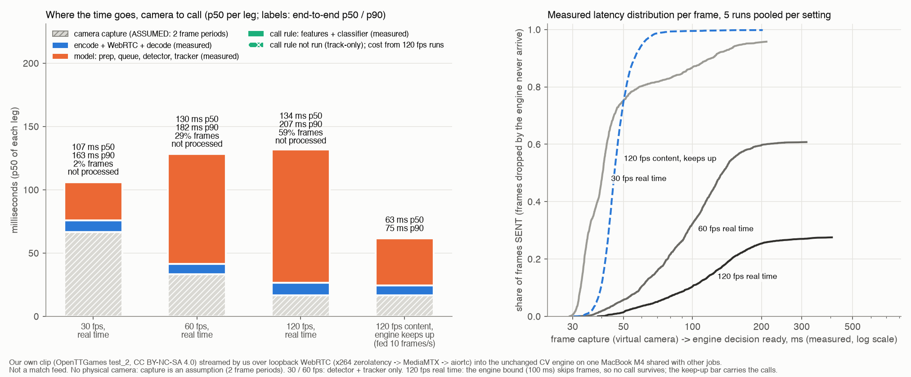

# Our camera -> WebRTC -> CV -> call pipeline: measured latency (5 runs per setting)

> **Paper only. Our pipeline on our own stream, not a match feed.** The source is our held-out OpenTTGames clip
> `data/vision/test_2_copyts.mp4` (test_2 frames 2000-2999, 1920x1080, 120 fps, CC BY-NC-SA 4.0), streamed by us.
> No laptop camera, no microphone and no third-party stream were used. Everything ran over loopback on one
> MacBook M4 that other jobs were also using (1-min load average 4-13 at run starts). There was no network and no
> relay. The "camera" is a paced sender (a virtual camera), so physical camera capture is an **assumption** taken
> from the literature and is labelled wherever it appears. Pipeline and first runs: [`README.md`](README.md).

Numbers: `results/webrtc/latency.json` (built by `scripts/webrtc_latency.py`). Per-frame and per-call rows:
`results/webrtc/run_20261003T221601Z.jsonl` (35 runs; per-run table in `summary_20261003T221601Z.json`).
Figure: `results/webrtc/fig_webrtc_latency.png`. Video: `results/webrtc/webrtc_demo.mp4`.

## Presentation sentence

> **"our camera->WebRTC->CV->call pipeline runs in 63 ms p50 / 75 ms p90 on our own stream; this is our pipeline, not a match feed"**

Footnote that has to go with it: 46 ms p50 / 58 ms p90 (p99 67 ms) is **measured**, from the moment the virtual
camera produced the frame to the CallEvent, over 55 calls in 5 runs. The engine was fed 10 frames/s of wall time
so it never fell behind. The other 16.7 ms is **assumed**: two frame periods of a 120 fps physical camera, one for
sampling and one for readout and USB3/GigE transfer. With only measured numbers, say "46 ms p50 / 58 ms p90 from
frame capture to call". Do not call the 63 ms measured (SUB_SECOND_ROUTES.md §4.4 item 5).

## Short answer: which source gets us under 1 s?

- **Our own camera streamed with WebRTC.** This is the only source we can run and measure ourselves. Over loopback
  the video leg (encode, WebRTC, decode) is 4-8 ms p50, and camera to call is about 63 ms (above). On one LAN, a
  real camera would add sensor and USB time (assumed here, about 100 ms for a consumer 30 fps webcam per S4) and
  a few ms of network. Through a public relay, other people measured about 0.4 s (S2), and MediaMTX field reports
  give 180 ms LAN-only and 520 ms cross-region (S3). All of these are under 1 s. The catch: it only works for
  footage from **our own camera**, which means our own table, not a Polymarket match.
- **A real Polymarket match under 1 s** needs a camera at the venue with the organiser's written consent (route
  A8, hypothetical), or a licensed sportsbook feed (A9: Sportradar, Stats Perform, BETER). Those are sold to
  operators only. The 0.5 s vendor claim is not stated for tennis.
- **Public streams are not under 1 s.** YouTube Ultra-low is 2-5 s, and Twitch is about 2-4 s. Setka Cup's own
  WebRTC output was measured in this repo at about 12 s behind its on-screen clock (SUB_SECOND_ROUTES.md C1).

Sources and the full ranking: `research/home_stream/SUB_SECOND_ROUTES.md` (S2, S3, S4 and the route
numbers refer to its tables). This file supplies the "[X] ms" that
§4.3 and §4.4 there were waiting for, with the caveats above.

## What was run

`REPS=5 SAVE_FRAMES=1 BACKEND_30=onnx-coreml-gpu16 scripts/webrtc_demo.sh dec30 dec60 native120 slowmo10`
(2026-10-03, 22:16-22:34 UTC). Each repetition ran the 7 runs below in this order, so load drift is spread across
settings. Every run streamed the whole clip. Encoder: libx264 ultrafast, zerolatency, no B-frames, GOP 0.5 s,
12 Mb/s (4 Mb/s for slow motion). Path: WHIP into MediaMTX v1.21.1 on 127.0.0.1, then WHEP out to aiortc 1.15.0
with the marker-bit patch (`engine/webrtc/aiortc_patch.py`), PyAV decode, then the unchanged
`engine.vision.stream.run_stream`.

| setting | sender | engine | backend | why |
|---|---|---|---|---|
| 30 fps, real time | every 4th source frame at 30 fps | detector + tracker (track-only) | CoreML GPU | the call model is built for 120 fps. GPU alone kept up in a probe; the GPU+ANE pool added 6 ms (backend probe below) |
| 60 fps, real time | every 2nd frame at 60 fps | track-only, bounded lag 100 ms | GPU + ANE pool | the pool skipped fewer frames than the GPU alone (72 vs 160 of 500 in the probe) |
| 120 fps, real time | every frame at 120 fps | frozen call model, bounded lag 100 ms | GPU + ANE pool | the clip's native rate |
| 120 fps content, engine keeps up | every frame at 10 frames/s of wall time | frozen call model | CoreML GPU | the 120 fps frames arrive slower than the engine needs to process them, so no frame waits: this is the pipeline's latency when compute is not the bottleneck, and the calls are the validated ones |

Transport-only runs (decode and frame-code read, no engine) measure the video leg on its own.

## Results

Latencies in ms. "Video leg" = capture (virtual camera) to decoded frame in our process, the glass-to-glass proxy.
"Decode -> model" = decoded frame to engine decision ready for that frame (prep, queue, detector, tracker, plus
the call rule when it runs). "Frame-send -> result" = capture to CallEvent emit in the call runs, and capture to
decision ready elsewhere (detection in track-only runs). Percentiles pool the frames of all 5 runs.

**Video leg (encode + WebRTC + decode), 5 runs per setting**

| setting | transport only: p50 / p90 / p99 | with the engine in the same process | I-frames / P-frames p50 (transport only) | frames lost in transport |
|---|---|---|---|---|
| 30 fps, real time | 7.6 / 13.0 / 25.9 | 9.3 / 22.0 / 67.5 | 12.3 / 7.4 | 0 / 1250 |
| 60 fps, real time | 4.9 / 8.9 / 28.7 | 8.1 / 23.6 / 69.9 | 9.4 / 4.8 | 0 / 2500 |
| 120 fps, real time | 4.0 / 10.0 / 51.0 | 10.0 / 50.0 / 186.9 | 9.5 / 4.0 | 0 / 5000 |
| 120 fps content, engine keeps up | (not run) | 7.9 / 13.7 / 26.6 | | 0 / 5000 |

**CV engine and end to end, 5 runs per setting**

| setting | decode -> model p50 / p90 | frame-send -> result p50 / p90 / p99 | result | frames not processed (dropped) | calls per run | camera -> result incl. **assumed** capture, p50 / p90 |
|---|---|---|---|---|---|---|
| 30 fps, real time | 30.1 / 71.8 | **40.2 / 96.7 / 164.8** (n = 1197) | detection (track-only) | 24 / 1250 (2 %) | 0 (track-only) | 107 / 163 (capture 66.7) |
| 60 fps, real time | 86.7 / 136.2 | 96.4 / 148.2 / 218.2 (n = 1519) | detection (track-only) | 726 / 2500 (29 %) | 0 (track-only) | 130 / 182 (capture 33.3) |
| 120 fps, real time | 105.2 / 156.2 | 116.8 / 190.3 / 330.6 (n = 1377) | decision (no call survived) | 2943 / 5000 (59 %) | 0, 0, 0, 0, 0 | 134 / 207 (capture 16.7) |
| 120 fps content, engine keeps up | 37.8 / 42.9 | **46.0 / 58.1 / 67.3** (n = 55 calls) | **CallEvent emit** | 0 / 5000 | 11 in every run | **63 / 75** (capture 16.7) |

In the keep-up setting, capture to decision ready over all 4990 decision frames (the latency any call would have)
was 45.6 / 55.7 / 71.0 ms. Per-run p50s were 43.5-50.2 ms.

**Where the engine time goes (p50 / p90)**

| setting | prep: code read, crop, 512x288 resize | queue wait | detector (time the engine waited on it) | model, call rule excluded | call rule (features + classifier) on flight frames |
|---|---|---|---|---|---|
| 30 fps, real time | 2.5 / 5.0 | 2.6 / 36.2 | 23.6 / 28.5 | 30.1 / 71.8 | not run (track-only) |
| 60 fps, real time | 3.4 / 10.8 | 39.6 / 83.4 | 11.9 / 48.0 | 86.7 / 136.2 | not run (track-only) |
| 120 fps, real time | 6.0 / 99.2 | 55.9 / 100.4 | 0.0 / 45.6 | 105.2 / 156.0 | 0.2 / 2.5 |
| 120 fps content, engine keeps up | 1.8 / 3.5 | 2.0 / 3.6 | 32.5 / 36.2 | 37.0 / 41.4 | 1.3 / 2.5 |

With the GPU+ANE pool the detector runs on worker threads, so "time waited" can be 0 while the queue wait grows.



Left: p50 of each leg, stacked. The camera-capture segment is hatched because it is **assumed**: two frame periods
(66.7 / 33.3 / 16.7 ms at 30 / 60 / 120 fps). The labels give the end-to-end p50 / p90 (assumed capture plus the
measured distribution) and the share of frames the engine never processed. The call rule is about 1.3 ms and is
barely visible. Right: per-frame distribution of measured capture to decision ready, as a share of frames **sent**,
so dropped frames keep a curve below 1.

**Backend probe** (single runs just before the campaign, `run_20261003T221413Z.jsonl` GPU and
`run_20261003T221450Z.jsonl` GPU+ANE): at 30 fps, capture to decision was 39.4 / 44.9 ms (GPU) against
45.3 / 51.8 ms (pool), with no drops either way. At 60 fps it was 82.7 / 123.6 ms with 160 / 500 dropped (GPU)
against 80.5 / 125.5 ms with 72 / 500 dropped (pool). These are in `latency.json` under `backend_probes`.

## What the numbers say

1. **The video leg is not the problem.** Over loopback, x264 zerolatency to MediaMTX to aiortc took 4.0-7.6 ms p50
   when the receiver had nothing else to do. Not one frame was lost in transport in any of the 35 runs. Keyframes cost about 5 ms more
   than P-frames. The p99 tail (26-51 ms) comes from host load: run-level p50 rose from 3-4 ms to 9 ms when the
   load average went from 5 to 11.
2. **The laptop CV engine is the bottleneck.** At 30 fps the GPU detector (about 24 ms per window) keeps up:
   2 % of frames were dropped, all in the two runs at load 7.5-8.6, and capture to detection was 40 ms p50. At 60 and
   120 fps it does not keep up. The bounded engine skipped 29 % and 59 % of frames to keep its lag near 100 ms,
   and the receive loop, which shares a Python process with the engine, slowed the video leg to 8-10 ms p50 with
   a long tail. Every skip breaks the detector's 3-frame windows, so **no 120 fps real-time run made a call**.
3. **When compute keeps up, camera to call is about 46 ms measured (63 ms with an assumed 120 fps camera).**
   38 ms of that is the engine, mostly one 32 ms CoreML detector call. The video leg is about 8 ms. The call rule
   is about 1 ms.
4. **For 120 fps in real time, the engine needs a GPU host.** The HiPerGator L4 engine sustained 113 fps from a
   120 fps file with no skipped frames: 5.5 ms p50 / 7.8 ms p90 from frame arrival to call-ready
   (`results/engine/vision_bench_gpu.json`, `torch-cuda-cl-fuse-compile|B1|realtime`; the reader capped the rate).
   **Projection, not a measurement:** 16.7 ms capture (assumed) + 4.0 ms video leg (120 fps, measured here) +
   5.5 ms engine (L4, measured from a file) is about 26 ms p50. These were measured in different setups. Nobody has
   run them end to end.

## Calls are unchanged by the transport

Calls of the five keep-up runs compared with the file-source run of the same clip and model
(`results/engine/demo_run.json`) and with the offline evaluation on the same frames
(`results/tracking/test_flights.csv`). For the offline evaluation, a flight counts as MISS when the online rule's
first call fired there (`first_call_lead_ms`), and as BOUNCE when P(miss) at T_ref - 50 ms is below tau_snapshot
0.8854.

| flight (f_net) | label | offline evaluation (test_flights.csv) | file-source online run (demo_run.json) | WebRTC, engine keeps up, runs 1-5 | WebRTC, 120 fps real time, runs 1-5 |
|---|---|---|---|---|---|
| 2296 | BOUNCE | BOUNCE 2304 | BOUNCE 2312 | BOUNCE 2312 (all 5) | none (all 5) |
| 2358 | BOUNCE | BOUNCE 2363 | BOUNCE 2366 | BOUNCE 2366 (all 5) | none (all 5) |
| 2402 | MISS (audit: unannotated bounce) | BOUNCE 2420 | BOUNCE 2417 | BOUNCE 2417 (all 5) | none (all 5) |
| 2457 | BOUNCE | BOUNCE 2464 | BOUNCE 2466 | BOUNCE 2466 (all 5) | none (all 5) |
| 2502 | BOUNCE | BOUNCE 2507 | none | none (all 5) | none (all 5) |
| 2559 | BOUNCE | BOUNCE 2565 | BOUNCE 2567 | BOUNCE 2567 (all 5) | none (all 5) |
| 2660 | BOUNCE | BOUNCE 2665 | BOUNCE 2668 | BOUNCE 2668 (all 5) | none (all 5) |
| 2706 | BOUNCE | BOUNCE 2714 | BOUNCE 2722 | BOUNCE 2722 (all 5) | none (all 5) |
| 2760 | MISS | MISS 2759 | MISS 2766 | MISS 2760, 2761, 2766, 2766, 2760 | none (all 5) |
| 2819 | MISS | MISS 2809 | MISS 2819 | MISS 2819 (all 5) | none (all 5) |
| no labelled flight | | | BOUNCE 2258, BOUNCE 2618 | BOUNCE 2258, BOUNCE 2618 (all 5) | none |

Frame numbers are source frames (120 fps, so 1 frame = 8.3 ms). The streaming engine segments flights itself and
uses its own BOUNCE rule, so its frames differ by a few from the offline snapshot frames in both the file and the
WebRTC runs.

- **Every keep-up run made the same 11 calls as the file-source run**: same call, same flight, and the same frame
  for 10 of 11. Two runs were identical in all 11. In the other three, the MISS on flight 2760 came 5-6 frames
  (42-50 ms) **earlier** over WebRTC, at frame 2760 or 2761, against 2766 from the file. The x264 re-encode moves
  the ball track by a pixel or two: 97.9-98.7 % of track points agree with the frozen offline tracks within 2 px,
  and detection is within 5 px of the labels on 97.4-98.1 % of labelled frames (file source: 97.7 %). The re-encode
  also differs slightly from run to run, probably because the lead-in before the clip has a different length each
  time (97-117 frames), which changes the encoder's rate-control state. This flight's P(miss) sits close to the
  threshold, so those small differences move its first call. The offline evaluation's first call on that flight is
  at 2759.
- **Against the offline evaluation**, 9 of 10 labelled flights get the same call in every keep-up run, and both
  offline MISS calls are reproduced. The tenth, flight 2502, gets no call from the streaming engine either way: it
  is missing in the file-source run too. That is the online engine's flight segmentation, not the transport.
- **At 120 fps in real time the laptop made no calls at all.** The transport delivered every frame. The calls were
  lost because the engine dropped frames to stay current.

## How this plugs into the latency sweep (0.5 s and 1 s rows)

`research/v2/feed_latency/LATENCY_SWEEP.md` (`results/tier0/latency_sweep.json`) models a call at
bounce - CV lead + V + 20 ms of inference. V is the delay of the video before our CV. Our measurement fills both
terms:

- **V for our own camera** = capture (16.7 ms, assumed) + video leg (7.7 ms p50 over the 55 calls, measured) = 0.024 s.
- **Our CV** takes 39.2 ms p50 from decoded frame to CallEvent, 19.2 ms more than the modelled 20 ms. That is the
  same as adding 0.019 s to V.

Headline timing reading (R drawn per tournament, stamp lag 2.0 s), interpolated on the sweep's 0.05 s grid:

| source | V of the source (s) | V incl. our CV's extra 19 ms (s) | IS $/day at V | IS $/day incl. our CV | burned OOS $/day at V | burned OOS $/day incl. our CV |
|---|---|---|---|---|---|---|
| our own 120 fps camera + our WebRTC on one LAN (no relay) | 0.024 | 0.044 | +74.2 | +62.8 | +41.2 | +37.1 |
| our own camera through a public relay (about 0.4 s, S2) | 0.400 | 0.419 | +31.0 | +30.6 | +16.9 | +16.2 |
| **0.5 s row**: licensed low-latency video, best vendor claim | 0.500 | 0.519 | +28.4 | +28.4 | +15.2 | +14.0 |
| **1 s row**: licensed video / satellite TV low end | 1.000 | 1.019 | +14.8 | +10.1 | +4.3 | -1.4 |

- **0.5 s row.** Our pipeline is not the limit there. Our CV adds 19 ms beyond the model's 20 ms, and the row
  barely moves (IS $28.4/day; OOS $15.2 to $14.0/day). The 0.5 s itself must come from the source.
- **1 s row.** The curve is steep there, so the same 19 ms costs IS $4.7/day, and burned OOS goes from +$4.3 to
  -$1.4/day. Including our measured CV, the break-even source delay is **1.07 s IS and 0.99 s OOS**, against 1.09 /
  1.01 s for the 20 ms model.
- **The own-camera row** is where our measured pipeline would sit (V about 0.04 s, IS about $63/day). That needs a
  camera at the venue, which we do not have. It is a reference point, not a route. It also needs an engine that
  keeps up at 120 fps (point 4 above).

## Limits

- **Loopback only.** No network or relay hop was available: no second machine, and a service on HiPerGator is not
  allowed. A real LAN adds the network on top. Remote figures here are other people's (S2, S3).
- **No physical camera.** "Capture" is the paced sender's due time. Sensor exposure, readout and USB transfer are
  the assumed 2 frame periods. The literature basis: camera sampling delay is uniform over one frame period
  (Bachhuber & Steinbach, ICIP 2016, arXiv:1510.01134; their glass-to-glass min/mean/max was 24.8 / 50.4 /
  78.7 ms at 25 Hz and 8.1 / 15.5 / 23 ms at 300 Hz, display included), and a consumer 30 fps webcam plus USB is
  about 100 ms (S4, a vendor measuring its own product). With a webcam the 30 fps figure would be about 140 ms
  p50, not 107. No display is in the loop either.
- **Slow motion for the calls.** The keep-up setting feeds 120 fps frames at 10 frames/s. The per-frame latency is
  real, but a laptop cannot sustain that work at 120 frames/s.
- **Shared laptop.** Other jobs ran throughout, with run-start load 4.0-12.7. Higher-load runs have higher p90/p99
  (`load_avg_start` per run is in `latency.json`).
- **30 and 60 fps are detection only.** The detector windows, tracker gates and call model were built for 120 fps.

## Demo video

`results/webrtc/webrtc_demo.mp4` (1280x720, 25 s, H.264) is rendered by `scripts/webrtc_render_demo.py` from the
logs of run `slowmo10_engine_r1` only. It shows the exact 512x288 frames the receiver handed to the CV engine
(saved by `--save-frames`, upscaled 1.75x for display). Over them it draws the engine's own ball track up to frame
f - 2, which is what the detector had finalised at frame f's decision. The readout per frame shows capture to
decoded, decoded to decision, and capture to decision, all from the logged timestamps, plus a banner with
capture-to-emit for each of the 11 CallEvents. Playback is 40 fps (one third of real time). Nothing is
interpolated or invented.

## Reproduce

```
brew install mediamtx            # v1.21.1; ffmpeg 8.1 (Homebrew, WHIP muxer); aiortc 1.15.0 in .venv
REPS=5 SAVE_FRAMES=1 BACKEND_30=onnx-coreml-gpu16 scripts/webrtc_demo.sh dec30 dec60 native120 slowmo10   # ~18 min
.venv/bin/python scripts/webrtc_latency.py results/webrtc/run_<ts>.jsonl --md /tmp/tables.md
.venv/bin/python scripts/webrtc_render_demo.py results/webrtc/run_<ts>.jsonl --run slowmo10_engine_r1
```

The saved frames (442 MB per run) stay in `$TMPDIR/courtside_webrtc/<ts>/` and are not committed. Versions:
Python 3.14.0, aiortc 1.15.0, aioice 0.10.2, PyAV 17.1.0 (libav 8.1.1), onnxruntime 1.30.0 (CoreML EP),
numpy 2.5.3, MediaMTX v1.21.1, ffmpeg 8.1, frozen call model `models/vision/frozen_call_model.pkl` (tau_online
0.9799, tau_snapshot 0.8854).
