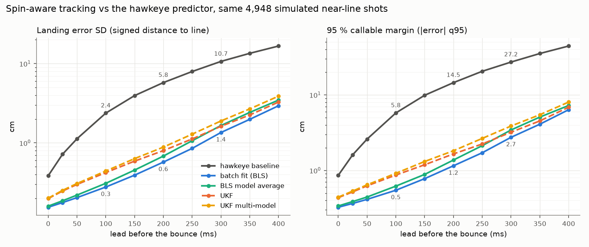
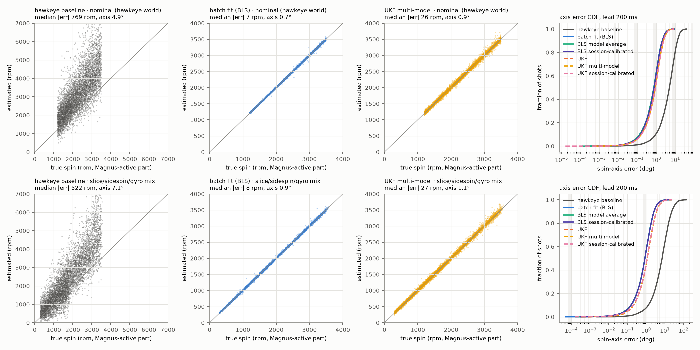
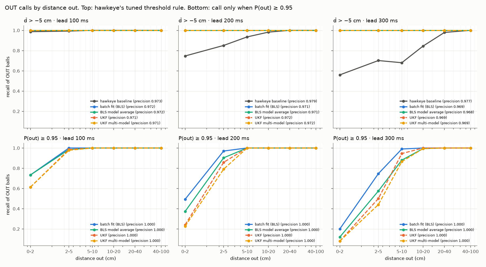

# Spin-aware tennis ball tracking (simulation)

This study takes the hawkeye-class tracker in `src/hawkeye.py` and makes it spin-aware. Each shot gets a
full physics fit: a 3-D spin vector, a per-shot drag coefficient, an optional spin-decay rate, and
a wind and decay rate learned once per session. Each fit returns a landing distribution, and a
ball is called OUT only when P(out) ≥ 0.95. Every number below comes from the **same simulated
population, noise draws and decision frames as `results/hawkeye_tennis_calls.csv`** (4,948
balanced near-line groundstrokes, 340 fps, 3.6 mm noise). The harness reproduces that table to
1e-14. It is a model study, not measured Hawk-Eye data.

## Headline (nominal world = the hawkeye world)

Landing error is the SD of predicted minus true signed distance to the line, in cm. That is the
`pred_err_sd_cm` column of the hawkeye table.

| lead before bounce | 0 ms | 25 | 100 | 200 | 300 | 400 |
|---|---|---|---|---|---|---|
| hawkeye predictor (current) | 0.38\* | 0.72 | 2.37 | 5.76 | 10.66 | 16.67 |
| **batch physics fit `bls` (A)** | **0.15** | **0.18** | **0.28** | **0.57** | **1.35** | **2.94** |
| **recursive filter `ukf` (B)** | 0.20 | 0.25 | 0.42 | 0.80 | 1.62 | 3.28 |
| `bls_bma` (+ spin-decay model, averaged) | 0.16 | 0.19 | 0.31 | 0.68 | 1.66 | 3.47 |
| `ukf_mm` (multi-model filter bank) | 0.20 | 0.25 | 0.44 | 0.88 | 1.89 | 3.89 |
| `bls_cal` / `ukf_cal` (session-calibrated) | 0.15 / 0.20 | 0.18 / 0.25 | 0.28 / 0.42 | 0.57 / 0.79 | 1.35 / 1.61 | 2.94 / 3.27 |

\* In the published table lead 0 is NaN: 8.6 % of the windows end on a frame stamped after the
bounce (see the jitter finding below). Here that frame is skipped.

The hawkeye predictor is also **biased**. It holds the lift coefficient fixed while the real one
rises as the ball slows, so its landing estimate falls short: by −1.1 cm at 100 ms, −3.2 cm at
200 ms and −11.0 cm at 400 ms. Its RMSE is therefore 2.6 / 6.6 / 12.7 / 20.0 cm at
100 / 200 / 300 / 400 ms. `bls` and `ukf` are unbiased to ≤ 0.1 cm at every lead, so their RMSE equals their SD.

**95 % callable margin**, the 95th percentile of |error|: a ball landing farther than this from
the line has its in/out sign right at least 95 % of the time.

| lead | 25 ms | 100 | 200 | 300 | 400 |
|---|---|---|---|---|---|
| hawkeye predictor | 1.6 cm | 5.8 | 14.5 | 27.2 | 44.3 |
| `bls` | **0.36** | **0.55** | **1.15** | **2.74** | **6.36** |
| `ukf` | 0.52 | 0.87 | 1.65 | 3.20 | 6.86 |

So the new tracker has 1.15 cm at 200 ms, where the old one had 1.6 cm at 25 ms. Equivalently,
the hawkeye predictor's 25 ms accuracy is now available about 200 ms before the bounce.

**OUT calls.** Two decision rules were scored:

- *P(out) ≥ 0.95, no tuning on outcomes.* Precision is 1.000 for every new method at every lead
  in the nominal world. Across all 9 worlds × 8 new methods × all leads the minimum is 0.994 (UKF
  with the decay model, 2× noise, 400 ms), and at most 0.45 % of IN balls are ever called out.
  Recall of OUT balls with `bls` is 99.2 % at 100 ms, 98.3 % at 200 ms, 96.1 % at 300 ms and
  91.3 % at 400 ms. Every ball more than 5 cm out is called by 200 ms (`bls`, 100 %). The misses
  are balls 0–2 cm out: at 200 ms, 49 % of them are called with `bls` and 24 % with `ukf`.
- *Hawkeye's rule (`calls_at_precision`), in `calls_v2.csv`.* For every method this rule settles on
  "OUT if d̂ > −5 cm", which is the bottom of its threshold grid. Precision is therefore about
  97 % for every method: the 3 % false OUTs are IN balls within 5 cm of the line. Under this rule
  the new methods call **100 %** of OUT balls through 350 ms, and 0–2 cm-out balls at 100 % to
  350 ms. The hawkeye predictor gets 92 % overall and 54 % in the 0–2 cm bin at 300 ms.

**Covariance honesty.** The share of truths inside the predicted 95 % interval is 0.98 for `bls`
in the nominal world. It is slightly conservative there because the reduced-χ² inflation also
absorbs the timing jitter. In `exact_t` it is 0.948, which is calibrated. The UKF gives 0.99. The
Brier score of P(out) is 0.002 at 200 ms (`bls`).

## Spin readout

Error is in the Magnus-active spin (the component ⊥ v), measured at the decision time, 200 ms
lead.

| world | hawkeye predictor | `bls` | `ukf` | `bls_cal` |
|---|---|---|---|---|
| nominal (pure topspin 1,200–3,500 rpm): median abs rpm error | 769 (biased +920) | **6.8** | 19.5 | 37\*\* |
| nominal: median axis error | 4.9° | **0.75°** | 0.90° | 0.77° |
| spin_mix (topspin / slice / flat, ±40° sidespin tilt, ±30 % gyro): rpm / axis | 522 / 7.1° | **8.2 / 0.86°** | 22.5 / 1.13° | 15.9 / 0.86° |
| decay world: rpm / axis | 712 / 5.3° | 139 / 0.75° | 89 / 0.96° | **31 / 0.78°** |
| 2 m/s crosswind: rpm / axis | 899 / 11.9° | 84 / 13.0° | 89 / 13.0° | **39 / 0.76°** |

- The `bls` spin error grows from 3.7 rpm at lead 0 to 15.6 rpm at 400 ms.
- The relative error is 0.3 % median.
- By spin type in `spin_mix` at 200 ms, `bls` gets 9.5 rpm on topspin, 7.8 on slice and 5.9 on
  flat balls (`spin_by_kind.csv`).
- Gyro spin cannot be read, because it exerts no force. The full-vector error, which includes the
  gyro part, is about 130–150 rpm, set by the prior.
- **Without session calibration a crosswind shows up as sidespin.** The spin axis tilts by about
  13° to explain the lateral push. `bls_cal` learns the wind and reads the axis correctly again.
- **Per-shot Cd** is recovered to 0.05–0.18 % median in the Cd ±15 % world.
- **Spin decay**: λ̂ = 0.20 /s from `bls_decay` at lead 0, and 0.18 /s from the session
  calibration, against a true 0.202. The calibration's 0.18 includes the −0.02 jitter offset.

\*\* `bls_cal` in the nominal world inherits the jitter-induced λ = −0.02 /s from its
calibration. That adds a +40 rpm bias at the decision time but does not change the landing error.





## What was built

`src/spin/physics.py`: the same aerodynamics as `src/hawkeye.py` (drag Cd = 0.55, Cross & Lindsey
lift CL = 1/(2 + 1/S)), rewritten for a full 3-D spin vector w:
a_lift = KL·R·(w × v)/(1 + 2S), S = R·|w⊥|/|v|. When w ⊥ v (every hawkeye shot) this is exactly
hawkeye's truth. The component of w along v (gyro or rifle spin) produces no force, and the model
treats it that way. The truth integrator mirrors `hawkeye._integrate` step for step. The mismatch
knobs are per-shot Cd scale, spin decay dw/dt = −λw, wind (drag and lift act on v − wind), lift
scale and spin-dependent drag.

`src/spin/tennis_filter.py`:

| method | what it is |
|---|---|
| `baseline` | `hawkeye.predict_landing`, unchanged: a quadratic fit over the last 150 ms, the spin backed out of the acceleration, then a forward integration that holds CL fixed. Its implied spin is CL → S → rpm. The only change is that a frame the recorder stamped after the bounce (NaN) is skipped, which affects lead 0 only. |
| `bls` **(A)** | Batch nonlinear least squares over the full physics from contact (frame 0) to the decision frame. Unknowns: p0, v0, the spin vector w (3) and the Cd scale. Levenberg–Marquardt runs on forward-difference sensitivities, with the normal equations accumulated frame by frame so no Jacobian is stored. It stops on the Newton decrement. Priors: w ~ N(0, 400 rad/s) per axis, which pins the unobservable gyro component, and Cd scale ~ N(1, 0.1). The posterior covariance is the inverse Gauss–Newton Hessian × max(1, reduced χ²). The decision-time state and its covariance come from the same sensitivities. Fits are warm-started from the previous (shorter) arc. |
| `bls_decay` | `bls` + spin decay rate λ ~ N(0, 0.3 /s). |
| `bls_bma` | Bayesian model average of `bls` and `bls_decay`. Weights come from Laplace evidences computed on a common noise scale (σ̂ from the `bls` residuals). Landing is a moment-matched mixture; P(out) is the weighted mixture. |
| `ukf` **(B)** | Cubature (unscented, κ = 0) Kalman filter, one predict/update per 340 fps frame, on [p, v, w, Cd]. Each predict propagates 2n cubature points through one RK4 frame step. The measurement is linear (z = p), so the update is exact. It is initialised from a batch fit of the first 40 frames (118 ms); a cold start from a spin prior lost about 40 % of the accuracy at long leads. Process noise (white acceleration q_a, spin random walk q_w, Cd random walk) was tuned on a separate seed (11) and a separate, milder mismatch world (`dev`). The tuning objective was mean log RMSE (`ukf_tuning.csv`): q_a = 1e-5 m²/s³, q_w = 300 rad²/s³. |
| `ukf_decay`, `ukf_mm` | The same filter with λ added to the state. `ukf_mm` is a multiple-model bank of `ukf` and `ukf_decay`, weighted by the accumulated innovation likelihood, which is tempered by the bank's normalised innovation squared. |
| `bls_cal`, `ukf_cal` | Session calibration. Spin decay and wind are properties of the balls and the air, shared by every shot. A single flight cannot separate a 2 m/s crosswind from a little sidespin, but across shots the sidespin averages out and the wind does not. `calibrate_environment` runs Gauss–Newton on the joint problem: every shot is refit with the shared parameters fixed, each shot's normal equations are reduced onto [λ, wind_x, wind_y] by Schur complement, then summed and stepped. Shots are split 2-fold: each shot is predicted with the environment estimated from the *other* half's complete flights, which stands in for earlier rallies. Each shot is then fit as in `bls`/`ukf` with the environment held fixed. |

**Landing and calls (all new methods).** The decision-time state and its covariance go through a
cubature transform: each sigma point is RK4-integrated (2 ms steps) to z = R. The result is a
landing mean and a 2×2 covariance, and the UKF also adds its process noise over the remaining
flight. P(out) is Monte Carlo over that Gaussian, using `hawkeye.signed_out_distance` with common
random numbers. A ball is called **OUT when P(out) ≥ 0.95**, with no tuning on outcomes. The
hawkeye threshold rule (`calls_at_precision`) is also applied to every method, so `calls_v2.csv`
lines up with `results/hawkeye_tennis_calls.csv`.

## Validation of the harness

`scripts/spin_tennis_check.py` confirms three things:

- `physics.integrate_truth` matches `hawkeye._integrate` to 1e-14 m.
- `build_population('nominal', n=60000, seed=7)` plus `hawkeye.predict_landing` and `calls_at_precision` reproduce every number in `results/hawkeye_tennis_calls.csv`, with a maximum difference of 1e-14.
- `baseline_predict` returns exactly `hawkeye.predict_landing`.

The evaluation therefore runs on the published population: 4,948 balanced near-line shots, the
same noise draws and the same decision frames.

**Finding: hawkeye's recorder adds timing jitter.** Samples are taken at the first 0.5 ms
integrator step at or after each 1/340 s tick, so frame j is really observed 0–0.47 ms late, in a
17-frame sawtooth (SD 0.14 ms). At 30 m/s that is about 4 mm of along-track error, the same
size as the 3.6 mm sensor noise. None of the trackers know about it. It is why the reduced χ² sits near 1.4 in the
nominal world, and why 8.6 % of hawkeye's lead-0 windows end in a NaN frame (the stamp lands after
the bounce). The session calibration picks it up as a spurious λ = −0.02 /s and a 0.13 m/s
along-court "wind" (both > 10σ). The `exact_t` world samples the truth on the exact frame clock.
There, the calibration returns λ = −0.001 ± 0.001 and wind = (0.02 ± 0.02, 0.002 ± 0.005) m/s,
which is zero.

## Robustness to model mismatch

Each world uses the same generator, seed, filters and in/out balancing. The perturbed physics
changes which shots land near a line, so n is 4,892–5,440. Landing RMSE (cm, bias included) at
200 ms lead; 100 and 300 ms are in `metrics_v2.csv` and `fig_robustness.png`.

| world | hawkeye | `bls` | `bls_decay` | `bls_bma` | **`bls_cal`** | `ukf` | `ukf_mm` | `ukf_cal` |
|---|---|---|---|---|---|---|---|---|
| nominal | 6.57 | **0.57** | 1.03 | 0.68 | **0.57** | 0.80 | 0.88 | 0.79 |
| exact frame clock | 6.71 | 0.58 | 1.07 | 0.74 | 0.58 | 0.83 | 0.92 | 0.83 |
| (i) Cd ±15 % per shot | 6.68 | 0.58 | 1.05 | 0.70 | 0.58 | 0.81 | 0.90 | 0.81 |
| (ii) spin decay 2 %/100 ms | 6.95 | 2.73 | 1.07 | 1.37 | **0.56** | 1.56 | 1.33 | 0.82 |
| (iii) 2 m/s crosswind | 6.53 | 0.84 | 1.03 | 0.82 | **0.58** | 0.86 | 0.93 | 0.80 |
| (iv) noise ×2 | 11.05 | 1.14 | 2.06 | 1.47 | 1.14 | 1.67 | 1.84 | 1.66 |
| (i)+(ii)+(iii)+(iv) | 11.28 | 2.70 | 2.06 | 2.08 | **1.13** | 2.07 | 2.12 | 1.66 |
| slice / sidespin / gyro mix | 6.46 | 0.60 | 0.99 | 0.70 | 0.60 | 0.92 | 0.98 | 0.92 |
| lift −10 % + spin-dependent drag | 6.65 | **0.63** | 1.25 | 0.85 | 0.64 | 0.89 | 0.99 | 0.90 |

At 300 ms, `bls_cal` is better than the hawkeye predictor by 7.5–10× in every world:

| world | hawkeye | `bls_cal` |
|---|---|---|
| nominal | 12.7 | 1.35 |
| (ii) decay | 13.2 | 1.30 |
| (iii) wind | 12.6 | 1.36 |
| (iv) noise ×2 | 20.3 | 2.71 |
| all four combined | 20.2 | 2.63 |

What each mismatch does:

- **Per-shot drag (i) costs nothing.** Cd is a state, recovered to 0.1 %. The hawkeye predictor
  cannot absorb it, because it throws away the along-track part of the residual acceleration.
- **Spin decay (ii) is the dangerous one for a constant-spin model.** `bls` fits the average spin
  over the arc, then over-predicts lift for the remaining flight: bias −2.1 cm at 200 ms, and only
  42 % of truths inside its 95 % interval. Three remedies:
  - Estimating λ per shot (`bls_decay`) removes the bias but nearly doubles the variance in every
    world.
  - The model average (`bls_bma`) weights decay at 0.70 in the decay world and 0.31 in the
    nominal one, landing in between.
  - Learning λ once per session from other shots (`bls_cal`) gets the bias out at no variance cost.
- **Crosswind (iii)** is mostly absorbed by a spurious sidespin tilt: +50 % error and a 13° axis
  error. Session calibration estimates the wind at 2.00 ± 0.02 m/s and fixes both.
- **Noise ×2 (iv)** scales every method by about 2×, as expected. The UKF's 95 % intervals then
  cover only 84 %, because it assumes the nominal R. The batch fit rescales by the reduced χ² and
  stays at 96 %.
- **Aerodynamic-curve mismatch** (10 % less lift, drag rising with spin) is absorbed almost
  completely: 0.63 vs 0.57 cm. The free spin magnitude and Cd soak up most of it. The session
  calibration turns it into an effective λ = 0.38 /s and a 2.5 m/s "headwind", and gains nothing,
  as expected for a model-form error.
- **Calls under mismatch.** P(out) ≥ 0.95 keeps precision ≥ 0.999 at 200 ms in every world, and
  ≥ 0.994 at any lead. Recall at
  200 ms for `bls_cal` stays at 97.0–98.6 % in all 9 worlds. For `bls` it drops to 95.0 % with
  decay and 94.4 % with all four combined.
- **Batch vs recursive.** With the same physics the batch fit beats the UKF by about 30 % at
  100–200 ms. The UKF pays for the process noise it carries to stay robust. It does track decay
  better than a constant-spin batch fit (1.56 vs 2.73 cm), but session calibration does better
  still. The UKF runs at about 0.03 ms per shot-frame (vectorised, one 340 fps step, busy laptop),
  so it is the real-time candidate. The batch refit costs about 17 ms per shot per decision for both models, including the
  landing transform.

## Caveats

- **Inverse crime.** In the nominal world, the filters use the very lift and drag curves that
  generated the data. Their nominal accuracy is therefore a ceiling. The `aero` world (10 % less
  lift and spin-dependent drag the filters do not model) and the four stress tests show how much
  of it survives.
- **What is left out.** This is simulation only. It has no camera calibration error, no
  occlusions, no ball deformation or bounce modelling, no frame drops and no real timing jitter
  beyond hawkeye's recorder artefact. Groundstrokes only, as in hawkeye.py. The new trackers'
  numbers are millimetre-level in the matched world. A real system will be limited by these
  omitted effects long before the estimator is the bottleneck.
- **Unobservable spin.** Gyro (rifle) spin along the flight direction has no aerodynamic effect
  in this model, so no tracker can read it. The spin readout reports the Magnus-active part
  (w⊥ v).
- **What the session calibration assumes.** It assumes the environment is shared across shots:
  one wind and one decay law per session. Gusts or shot-dependent decay would need the
  `bls_decay`/BMA route instead.
- **UKF tuning.** The UKF's process noise was tuned on seed 11 with a `dev` mismatch world
  (Cd ±10 %, 1 %/100 ms decay, 1 m/s wind on both axes). The tuning did not use the evaluation
  population or the evaluation's mismatch magnitudes.

## Commands

```bash
PY=.venv/bin/python
$PY scripts/spin_tennis_check.py                  # harness == published hawkeye table (≈2 min)
$PY scripts/spin_tennis_tune.py                   # UKF process noise on seed 11 -> ukf_tuning.{csv,json}
$PY scripts/spin_tennis_eval.py --cond nominal decay aero          # ≈25 min per world on a busy laptop
$PY scripts/spin_tennis_eval.py --cond exact_t wind spin_mix
$PY scripts/spin_tennis_eval.py --cond cd15 noise2x all
$PY scripts/spin_tennis_report.py                 # calls_v2.csv, metrics_v2.csv, spin_by_kind.csv, key_numbers.json, figures
```

Files: `calls_v2.csv` (hawkeye table columns + method, cond), `metrics_v2.csv` (every metric per
world × method × lead), `spin_by_kind.csv`, `key_numbers.json`, `fig_error_vs_lead.png`,
`fig_robustness.png`, `fig_spin_readout.png`, `fig_pout_calls.png`, raw per-shot predictions in
`raw/<world>_s7.parquet`, run logs in `logs/`.
